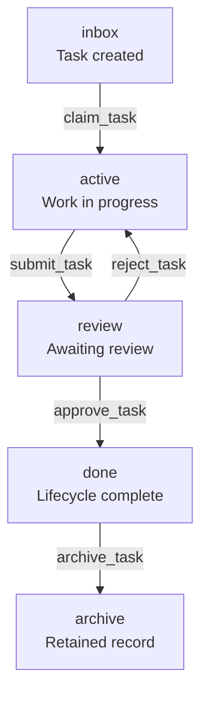

<p align="center">
  
</p>

<h1 align="center">FCoP — File-based Coordination Protocol</h1>

<p align="center">
  <strong>Keep agent work beyond the conversation.</strong><br/>
  Tasks, deliveries, issues and reviews — persisted outside model context, ready to inspect and hand over.
</p>

<p align="center">
  <a href="https://pypi.org/project/fcop/3.2.5/"></a>
  <a href="https://pypi.org/project/fcop-mcp/3.2.5/"></a>
  <a href="LICENSE"></a>
  <a href="docs/fcop-4.0-progress.md"></a>
</p>

<p align="center">
  <a href="#try-it"><strong>Run a local demo</strong></a> ·
  <a href="#mcp">Connect via MCP</a> ·
  <a href="#research">Papers &amp; citation</a> ·
  <a href="spec/fcop-v3-spec.md">Protocol specification</a> ·
  <a href="README.zh.md">简体中文</a>
</p>

**FCoP is an open protocol for making formal agent work persist outside model context.** Assignments, delivery reports, issues and review decisions become durable records with attribution, references and lifecycle history. When a session ends or another agent takes over, people and tools can inspect those records without reconstructing the conversation.

Files are the current reference carrier. This repository provides the protocol, the `fcop` Python library and the optional `fcop-mcp` server. TASK records an assignment, REPORT records a delivery, ISSUE preserves a problem, and REVIEW records a review decision. Submitting a report alone does not establish acceptance.

**Public release: [3.2.5](https://github.com/joinwell52-AI/FCoP/releases/tag/v3.2.5). [4.0 is under development](#v4), including an unpublished RC candidate.** The examples below use the published 3.2.5 packages.

<a id="v4"></a>

## 4.0: a small Core for durable work

The 4.0 upgrade separates a small, language-independent Core from implementation tools, team policies and agent Runtimes. Its specification and conformance work define the observable behavior that compatible implementations must preserve:

| What needs to hold | 4.0 contract |
|---|---|
| The evidence belongs to this execution | Each attempt has its own REPORT; reaching `done` requires acceptance and authorization tied to current evidence. |
| Approval covers this operation | A durable REVIEW records the authorization. An explicitly adopted Profile checks the issuer's authority. |
| The whole task family is ready to close | Root archival checks completed Branches, their current reports and a matching convergence record. Changed evidence invalidates old convergence. |
| A retry or crash leaves explainable state | Creating a task uses a durable operation key and digest. Recovery classifies persisted facts, rejects conflicting writes and preserves ambiguous evidence. |

Independent tasks and Branches can progress in parallel, each through its own ordered lifecycle. Closing a task family requires explicit convergence over its current evidence. This model keeps related state commits consistent while allowing agents to work concurrently.

Core defines eight shared contracts; conformance checks their implementation. Python SDK and MCP operations belong to the Toolkit, Profiles supply organizational policy, and the host Runtime executes work.

**4.0 is not a published installation target.** Read the [upgrade overview, Core map and review sources](docs/fcop-4.0-progress.md). Existing 3.x workspaces keep their version's behavior until explicit migration.

## See a handoff

In the current v3 protocol, **files carry the work, paths address its state, and events record transitions**.



This illustrates the review route; the [specification](spec/fcop-v3-spec.md) defines the full transition table. With the default Python setup, these directories live under `fcop/_lifecycle/`.

- **Pick up a task with context.** Read its sender, recipient, instructions and references from a Markdown file with YAML frontmatter.
- **Inspect progress on disk.** The task's path gives its current lifecycle stage; its `transitions` record explains how it got there.
- **Review the evidence.** TASK, REPORT, ISSUE and REVIEW records keep assignments, delivery reports, problems and decisions distinct.

The protocol and Python library require no database, message broker or model API key. Your host supplies agent execution, scheduling and filesystem access control. A file in `done/` records a lifecycle outcome; accepting the delivered work still requires reviewing its evidence.

<a id="try-it"></a>

## Run a local demo

Use **Python 3.10+** in a virtual environment:

```sh
python -m pip install "fcop==3.2.5"
```

Save this as `demo.py`, then run `python demo.py`. It creates a fresh temporary directory, writes a task, claims it and reads back its transition history. The directory is kept so you can inspect the files.

```python
from datetime import datetime, timezone
from pathlib import Path
from tempfile import mkdtemp

from fcop import Project
from fcop.lifecycle import Stage, TransitionEvent, commit, read_events

root = Path(mkdtemp(prefix="fcop-demo-"))
project = Project(root)
project.init(team="dev-team", lang="en", deploy_role_templates=False)
task = project.write_task(
    sender="PM", recipient="DEV", priority="P2",
    subject="Inspect this handoff",
    body="Read the task and inspect its recorded transitions.",
)
print("Workspace:", root)
print("Before:", task.path.relative_to(root).as_posix())

claimed = commit(
    task.path, Stage.ACTIVE,
    TransitionEvent(
        at=datetime.now(timezone.utc),
        from_stage=Stage.INBOX, to_stage=Stage.ACTIVE,
        by="DEV", tool="claim_task",
    ),
    project_root=project.workspace_dir,
)
print("After:", claimed.destination_path.relative_to(root).as_posix())
events = read_events(claimed.destination_path.read_text(encoding="utf-8"))
print("Recorded transitions:", len(events))
```

Expected shape of the output (the temporary path and date vary):

```text
Workspace: .../fcop-demo-...
Before: fcop/_lifecycle/inbox/TASK-YYYYMMDD-001-PM-to-DEV.md
After: fcop/_lifecycle/active/TASK-YYYYMMDD-001-PM-to-DEV.md
Recorded transitions: 2
```

This is a protocol I/O demonstration. For a real agent project, choose solo, a preset team or a custom team and deploy the corresponding rules: [getting started](docs/getting-started.en.md).

<a id="mcp"></a>

## Connect your agent through MCP

The separate [`fcop-mcp`](https://pypi.org/project/fcop-mcp/) package exposes FCoP operations over **stdio MCP**. To try it in Cursor or Claude Desktop, install [uv](https://docs.astral.sh/uv/) and add this entry to your client's MCP configuration, preserving any existing servers:

```json
{
  "mcpServers": {
    "fcop": {
      "command": "uvx",
      "args": ["fcop-mcp==3.2.5"]
    }
  }
}
```

After the server connects, explicitly select the project directory with `set_project_dir`, inspect it with `fcop_report`, and choose the intended initialization mode for a new project. Installing a server does not create an agent team or start work.

[Client setup and cold-start troubleshooting](mcp/README.md) · [Tool reference](docs/mcp-tools.md)

For agent-assisted setup, use the installation prompt in [English](src/fcop/rules/_data/agent-install-prompt.en.md) or [简体中文](src/fcop/rules/_data/agent-install-prompt.zh.md). A connected MCP client can also read the `fcop://prompt/install/en` and `fcop://prompt/install` resources respectively.

Directory listings: [MCP Registry](https://registry.modelcontextprotocol.io/v0/servers?search=io.github.joinwell52-AI%2Ffcop) (`io.github.joinwell52-AI/fcop`) · [Glama](https://glama.ai/mcp/servers/joinwell52-AI/FCoP).

<a id="research"></a>

## Papers and citation

The protocol and archived research are available directly:

- **Read the protocol:** [v3 specification](spec/fcop-v3-spec.md) · [Architecture whitepaper](essays/from-coordination-to-governance.en.md).
- **Cite the public 3.2.5 archive:** [Zenodo DOI 10.5281/zenodo.20457285](https://doi.org/10.5281/zenodo.20457285) · [OSF DOI 10.17605/OSF.IO/92NWM](https://doi.org/10.17605/OSF.IO/92NWM).
- **Cite the April 2026 research snapshot:** [Zenodo DOI 10.5281/zenodo.19886036](https://doi.org/10.5281/zenodo.19886036) · [snapshot release](https://github.com/joinwell52-AI/FCoP/releases/tag/research-snapshot-2026-04-29) · [CITATION.cff](CITATION.cff).

Use the record matching the version you studied. These existing identifiers do not describe an unreleased 4.0 package.

## Find the right resource

| You want to… | Start here |
|---|---|
| Set up a real agent project | [Getting started](docs/getting-started.en.md) |
| Integrate with Python or MCP | [Python source](src/fcop/) · [MCP setup](mcp/README.md) · [Tool reference](docs/mcp-tools.md) |
| Implement or review the protocol | [Current v3 spec](spec/fcop-v3-spec.md) · [Schemas](spec/schemas/) · [Architecture decisions](adr/README.md) |
| Upgrade an older installation | [Package upgrade guide](docs/upgrade-fcop-mcp.md) · [2.x → 3.x migration](docs/MIGRATION-3.0.md) |
| Read experiments and historical tutorials | [Complete field-report index](essays/README.md) |

The field-report index preserves the articles, external publication links and evidence archives. Historical examples describe the version used at the time.

## Three repositories, three entry points

| Repository | Purpose |
|---|---|
| **[FCoP](https://github.com/joinwell52-AI/FCoP)** | **Flagship open-source project:** protocol, Python SDK and MCP server. Start here to use or contribute to the coordination layer. |
| [joinwell52](https://github.com/joinwell52-AI/joinwell52) | **Research and communication:** AI Agents, digital employees, TMPA and engineering studies. |
| [CodeflowMu-Distribution](https://github.com/joinwell52-AI/CodeflowMu-Distribution) | **Product experience:** packaged application and [downloads](https://github.com/joinwell52-AI/CodeflowMu-Distribution/releases). Its release notes define supported capabilities and compatibility. |

FCoP can be used independently of the product. The protocol/library/server in this repository are MIT-licensed; the product distribution has its own licensing terms.

## Help improve FCoP

**Star FCoP to keep the protocol, SDK and MCP entry points in your developer toolkit.**

Tried it in your own project? [Open an issue](https://github.com/joinwell52-AI/FCoP/issues) with your package version, host, minimal reproduction, expected behavior and actual result. A reproducible integration problem or a useful example is especially welcome.

For protocol changes, connect the proposal to a concrete problem and the relevant specification clause. Integration examples, documentation fixes and field reports are also welcome as pull requests.

[MIT License](LICENSE) · [Project website](https://joinwell52-ai.github.io/FCoP/)
