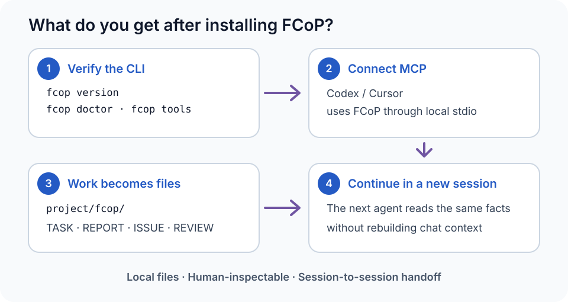

<p align="center"><a href="spec/fcop-4.0-spec.md"></a></p>

# FCoP — File-based Coordination Protocol

**FCoP 4.0 Stable Specification: [English](spec/fcop-4.0-spec.md) · [简体中文](spec/fcop-4.0-spec.zh.md)**

[Project homepage](https://joinwell52-ai.github.io/FCoP/) · [English](README.md) · [简体中文](README.zh.md)

<p>
  <a href="https://pypi.org/project/fcop/4.0.3/"></a>
  <a href="https://pypi.org/project/fcop-mcp/4.0.3/"></a>
  <a href="https://registry.modelcontextprotocol.io/v0/servers/io.github.joinwell52-AI%2Ffcop/versions/4.0.3"></a>
  <a href="https://doi.org/10.5281/zenodo.22746175"></a>
  <a href="LICENSE"></a>
</p>

**Discover FCoP:** [MCPServers introduction](https://mcpservers.org/servers/joinwell52-ai/fcop) — a third-party directory for discovering and learning about FCoP. **Registration details:** [Official MCP Registry](https://registry.modelcontextprotocol.io/v0/servers/io.github.joinwell52-AI%2Ffcop/versions/4.0.3) — the server identifier, version and package metadata.

<p align="center"><strong>Multi-agent collaboration · Files as protocol · No complex infrastructure · Agent governance</strong></p>

**FCoP (File-based Coordination Protocol) organizes work across agents, scripts and human developers.** Files and protocol conventions express assignments, ownership, deliveries and review. The 4.0 specification defines FCoP as a file-native agent behavior-governance protocol.

**Files carry protocol. Paths express state. Events record transitions.** No mandatory coordination database, message broker or always-on control service is required.

**Let multiple agents work as a team.** Give your goal to PM. PM breaks down the work, assigns members, collects their reports and brings the result back to you. Assignments and deliveries stay in files that the next session can inspect and continue.

**[Run the minimal example](#team-demo) · [Choose an installation](#installation) · [Before you install](#before-install)**

<a id="team-workflow"></a>

## How the agent team works


**Multi-agent collaboration means working together, not chatting with each other.** In this team workflow, only the human ADMIN and PM chat. PM decomposes the work and assigns TASK files to DEV, QA and OPS. Each member executes its assignment and submits REPORT files to PM. PM consolidates the results into a summary report for ADMIN. **Agents do not chat with each other; they collaborate through files.**

This is the Team/Profile-defined organizational workflow, not a fixed hierarchy built into FCoP Core. TASK carries assignments, REPORT carries deliveries, ISSUE carries problems and REVIEW records decisions. FCoP governs these collaboration facts and authorization boundaries; the host Runtime runs agents, and the application owns code integration. [Root/Branch technical model](docs/architecture.en.md#parallel-work).

**A file-native approach to coordination.** FCoP is one option for multi-agent collaboration, suited to teams that want local, inspectable work records with little additional coordination infrastructure. It can work alongside existing agent tools and applications.

<a id="why-fcop"></a>

## Why use FCoP?

When coding agents, test agents, automation scripts and human developers work on the same project, execution is only part of the problem. Who claimed the task? Who owns each part? Where should results go? Was the delivery accepted? How does a new session continue?

**FCoP makes these working relationships a readable, inspectable file protocol, without a complex central coordination service, message queue or coordination database.**

### 1. Give concurrent work clear ownership

Agents can take separate assignments, work in parallel and submit deliveries. The protocol constrains task claims, state transitions and evidence submission; the reference implementation handles atomicity, idempotency and recovery for these operations. This helps teams avoid duplicate claims and confused handoffs. Concurrent edits to application code still need workspace isolation, version control and integration review.

### 2. Keep coordination infrastructure small

On a local filesystem that meets the implementation requirements, tasks, reports and reviews live with the project. There is no separate Redis, RabbitMQ or coordination database to deploy. The Python toolkit has normal package dependencies; Codex, Cursor or another host still runs the agents.

### 3. Let people and agents inspect the work

An editor, terminal or file manager can expose the tasks and evidence. Directories express current state; files preserve assignments, results and decisions. People can review this material and intervene through protocol-compliant tools. Formal transitions and corrections follow the protocol, with reports and reviews appended to preserve history.

### 4. Share conventions across languages and tools

Python, Node.js, Go, Rust and Shell can all read and write files. Agents and scripts implementing the same protocol can collaborate around the same tasks and reports. Correct interoperability also requires the field, lifecycle, authorization and atomic-operation contracts. This repository provides a Python reference implementation and MCP integration.

### 5. Preserve handoffs and audit evidence beyond chat

Tasks, reports, issues and review decisions remain available to the next agent. Records suitable for committing can be tracked in Git for comparison and history; protocol events record transitions. Git is not a live task dispatcher and does not guarantee replay of model outputs or external operations.

**Even when an agent is gone, the work remains.** People, tools and the next agent can inspect the same collaboration record and continue from current evidence.

**Born from real agent teams:** [48-hour four-agent field report](essays/when-ai-organizes-its-own-work.en.md) · [two-agent hands-on tutorial](docs/tutorials/tetris-solo-to-duo.en.md) · [中文现场报告](essays/when-ai-organizes-its-own-work.md) · [中文实操教程](docs/tutorials/tetris-solo-to-duo.zh.md)

**[Before you install](#before-install) · [Ask AI to install](#ai-install) · [Manual reference](#manual-setup) · [Architecture series (中文)](docs/fcop-architecture-series/README.md) · [Architecture](#architecture) · [Papers & citation](#research)**

**Stable version: 4.0.3** — [4.0.3 release](https://github.com/joinwell52-AI/FCoP/releases/tag/v4.0.3). This repository contains the open protocol, the `fcop` Python implementation and the optional `fcop-mcp` adapter. Python 3.10+; no model API key is needed for the local example.

<a id="codeflowmu"></a>

## In use: CodeFlowMu

**[CodeFlowMu](https://github.com/joinwell52-AI/CodeflowMu-Distribution) applies FCoP in a multi-agent development system with PM, DEV, QA and OPS.** A person supplies the software goal; PM organizes the work; members execute and deliver. The application provides client integration, execution and progress views around the team's file-based work.

FCoP supplies the coordination protocol; CodeFlowMu supplies the application experience. Use FCoP independently, or explore the [CodeFlowMu public introduction and downloads](https://github.com/joinwell52-AI/CodeflowMu-Distribution). CodeFlowMu is distributed as a proprietary preview; its adopted protocol version and supported scope follow its own release notes. FCoP itself is MIT-licensed open source.

<a id="files-as-protocol"></a>

## How do files carry the protocol?

**Files have agreed types, identities, senders, recipients and contents. Agents use those conventions to identify their work.** Filenames, directories and file headers have distinct responsibilities.

| Surface | What it tells you |
|---|---|
| Filename | Record type and identity; legacy names also contain sender and recipient roles |
| Directory | Whether a task is in inbox, active, review, done or archive |
| File header | Workspace, sender, recipient, task relationships and evidence identity |
| Markdown body | Assignment, delivery, problems and review reasoning |

**An intuitive filename-routing example (Legacy v1–v3):** `TASK-20260915-001-PM-to-DEV.md` is a task from PM to DEV; `REPORT-20260915-001-DEV-to-PM.md` is a report from DEV to PM. An agent with an assigned role can identify incoming files from the naming convention.

**The current 4.0 implementation:** new tasks live at `fcop/_lifecycle/inbox/TASK-<uuid>.md`, with `sender: PM` and `recipient: DEV` in the file header. The agent or caller reads the task fields and selects work for its established role. A filename-only search for `to-DEV` will not work because v4 names do not contain that segment. Reports live at `fcop/reports/REPORT-<uuid>.md`, with `subject_ref` and `attempt_id` linking the task and its execution attempt.

These placeholders explain layout; they are not complete runnable envelopes. Consult the [4.0 specification](spec/fcop-4.0-spec.md), [current creation implementation](src/fcop/v4/creation.py) and [legacy filename grammar](src/fcop/core/filename.py) for the exact contracts.

<a id="team-demo"></a>

## Minimal example: PM assigns, members deliver, PM summarizes

Run the [complete Python example](examples/team_workflow.py) to simulate PM, DEV and QA working on a text transformation and its check. Each role uses a separate `Project` client and reads tasks and reports from disk. The script runs sequentially, uses no model and needs no API key.

From the repository root:

```bash
python -m pip install "fcop==4.0.3"
python examples/team_workflow.py --output ./demo-runs
```

The four steps from a verified run:

```text
1/4 ADMIN -> PM: goal recorded; PM -> DEV: TASK assigned.
2/4 DEV -> PM: REPORT submitted; task is pending review.
3/4 PM -> QA: TASK assigned; QA -> PM: assessment and REPORT recorded.
4/4 PM -> ADMIN: summary REPORT recorded; formal acceptance remains pending.
```

Each run creates a fresh `demo-runs/fcop-team-<random-suffix>/` directory and prints the actual workspace and PM summary paths. Files remain after the script exits:

| Path relative to the run workspace | Contents |
|---|---|
| `fcop/_lifecycle/review/TASK-*.md` | 3 assignments: ADMIN→PM, PM→DEV, PM→QA |
| `fcop/reports/REPORT-*.md` | 3 reports: DEV→PM, QA→PM, PM→ADMIN |
| `fcop/reviews/REVIEW-*.md` | 1 QA assessment of the actual text result |

QA compares the actual output with the expected text and records evidence. PM reads both member reports before summarizing. **The demonstration ends at delivery pending acceptance: all three tasks are in `review`. No task is deleted, and assessment is not treated as acceptance authority.** Formal acceptance, rejection, reopening and archiving require an adopted Profile and a trusted host evaluator.

<a id="before-install"></a>

## Before you install: four questions

### 1. Why should I install FCoP?

When several agents collaborate, a project evolves over time or a new session takes over, chat context can lose assignments, deliveries and decisions. FCoP preserves them as durable, inspectable project records:

- **Structured work facts**: TASK records assignments, REPORT records deliveries, ISSUE records problems, and REVIEW records review and authorization decisions.
- **Cross-session and cross-agent handoffs**: after changing models, closing a window or handing over to someone else, the next worker can read existing tasks and evidence, confirm progress and responsibilities, and continue.
- **Delivery and acceptance stay separate**: workers submit REPORTs; qualified reviewers decide acceptance from evidence. Records distinguish delivered, pending review and accepted work. Quality still requires substantive review.

### 2. Do I import FCoP into my application code?

**Usually, no.**

- **Ordinary business projects**: no `import fcop` is needed in business APIs, components or other application logic. CLI handles initialization, inspection, validation and diagnosis; agents use task and delivery tools through MCP.
- **Integration and platform developers**: use `from fcop import Project` when your program needs protocol operations. The client or your Runtime owns model execution and agent scheduling.

### 3. Should I install it in Codex, Cursor or another agent client? What does that add?

**Yes, this is the main integration route for ordinary developers.** Configure `fcop-mcp` in a client supporting local stdio MCP:

- **Standard tools and resources**: agents can access 49 tools, 12 resources and 4 templates.
- **Explicit work operations**: inspect project state, create or claim TASKs, submit REPORTs, raise ISSUEs, record REVIEWs or advance branch work.
- **Protocol checks**: tools validate the operations they support; the client runs the agents and adopted team rules define responsibilities. Connecting MCP does not guarantee correct model tool selection or grant acceptance authority.

### 4. What changes immediately after installation?

- **After package installation**: run `fcop version` and `fcop doctor`; with the adapter installed, inspect the tool catalog using `fcop tools`.
- **After connecting MCP**: see `fcop` and its tools and resources in the client. Initial configuration may require reconnection or a client restart.
- **After project initialization**: `<project>/fcop/` becomes the collaboration workspace; tasks and reports can be opened in an editor.
- **After the first task**: inspect real TASKs, REPORTs and their states. The minimal example also produces QA assessment evidence and a PM summary.

Roles such as PM, DEV, QA and OPS in `dev-team` come from a Team/Profile, not fixed FCoP Core roles. Package installation does not launch agents; formal acceptance requires an adopted Profile and a trusted host evaluator.

<a id="installation"></a>

## Choose how to install

| Use | Install | Purpose |
|---|---|---|
| Standalone CLI | `fcop` | Initialize, inspect, validate and diagnose a project |
| Python integration | `fcop` | Call the `Project` API from your own program |
| MCP in an agent client | `fcop` + `fcop-mcp` | Give agents in Codex, Cursor and other clients collaboration tools |
| Source development | This repository and its `mcp/` subproject | Modify, debug or contribute to the reference implementation |

### CLI and Python: one package

```bash
python -m pip install "fcop==4.0.3"
fcop version
fcop doctor
fcop init --root ./my-project
fcop status --root ./my-project
```

Python developers can then use `from fcop import Project`; see the complete example in the [manual reference](#manual-setup). Ordinary users do not need to import FCoP into application code.

### MCP: give agents access to FCoP

```bash
python -m pip install "fcop==4.0.3" "fcop-mcp==4.0.3"
fcop tools
```

Configure a server in a client supporting local stdio MCP. This is a generic JSON example; see the [AI installation guide](docs/ai-install.md) for Codex-specific configuration.

```json
{
  "mcpServers": {
    "fcop": {
      "command": "/absolute/path/to/python",
      "args": ["-m", "fcop_mcp"],
      "env": {
        "FCOP_PROJECT_DIR": "/absolute/path/to/my-project"
      }
    }
  }
}
```

Replace `command` with the absolute path to the Python interpreter containing both packages, and set your project directory. Windows paths can use forward slashes. Reconnect the client to see 49 FCoP tools and 12 resources. Project initialization and team-rule adoption are separate steps; connecting MCP does not create a PM-led team or launch other agents.

### Install from source

```bash
git clone https://github.com/joinwell52-AI/FCoP.git
cd FCoP
python -m pip install -e .
python -m pip install -e ./mcp
fcop version
```

The official installation route uses the Python packages above. This guide does not prescribe an unverified npm package or Node SDK. Node.js and other languages can integrate through an MCP client or implement the protocol themselves.

### Implement the protocol yourself

You can build conforming tools from the [formal specification](spec/fcop-4.0-spec.md) without using the Python reference implementation. Creating a few directories is not sufficient: field, transition, evidence, authorization, idempotency and recovery contracts must also be met. With the official toolkit, use `fcop init` to create the workspace.

<a id="ai-install"></a>

## Ask your AI to install FCoP

Paste this into **Cursor Agent, Codex, or another coding agent with terminal and file access**. The agent handles setup and checks the result.

```text
Install FCoP for the coding client and project I am using. Follow:
https://github.com/joinwell52-AI/FCoP/blob/main/docs/ai-install.md
Run the environment checks, installation, configuration and verification yourself. Preserve my existing configuration and project state. Report what actually works; ask me only for a missing client/project choice or a required approval/reload.
```

The [AI installation guide](docs/ai-install.md) covers dependencies, client configuration and a real task check. If the client needs approval or a reload, the agent will identify that step. Manual Python/MCP instructions remain below for reference.

**Want to see a handoff first?** Ask AI to run the session handoff example: [English](docs/mcp-handoff.md) · [简体中文](docs/mcp-handoff.zh.md). Create a task and report, close the session, then read them from a fresh MCP session. No API key required; the result stays available for inspection.

## macOS (Intel and Apple silicon): install CLI and MCP

FCoP supports macOS on both Intel and Apple silicon. The published wheels are platform-independent; Rosetta is not required. Use Python 3.10–3.13. The CLI works directly in Terminal, while MCP additionally requires a client that supports local stdio servers, such as Codex or Cursor.

Create a dedicated environment and install the matching Core/MCP pair:

```bash
python3 --version
python3 -m venv ~/.local/share/fcop/venv
~/.local/share/fcop/venv/bin/python -m pip install --upgrade \
  "fcop>=4.0.3,<4.1.0" \
  "fcop-mcp>=4.0.3,<4.1.0"
```

Verify the CLI and installed MCP catalog:

```bash
~/.local/share/fcop/venv/bin/fcop version
~/.local/share/fcop/venv/bin/fcop doctor
~/.local/share/fcop/venv/bin/fcop tools --json
```

The installed CLI provides all nine commands listed below: `init`, `status`, `inspect`, `validate`, `tools`, `doctor`, `version`, `spec`, and `migrate`. CLI setup and inspection do not require an MCP-capable AI client.

For MCP, configure the client with absolute macOS paths; do not use `~` inside client configuration:

```json
{
  "mcpServers": {
    "fcop": {
      "command": "/Users/YOUR_NAME/.local/share/fcop/venv/bin/python",
      "args": ["-m", "fcop_mcp"],
      "env": {
        "FCOP_PROJECT_DIR": "/Users/YOUR_NAME/path/to/your-project"
      }
    }
  }
}
```

Replace `YOUR_NAME` and the project path, then restart or reconnect the MCP client. `FCOP_PROJECT_DIR` points to the project that will use FCoP, not to this source repository.

## See the minimum result

<a href="docs/mcp-handoff.md"></a>

The visible outcome is not merely an installed package: formal work becomes inspectable files that another session can read. The linked handoff example verifies that result end to end.

## Why put work outside the model?

“I have finished” is a statement in a conversation. A teammate still needs to know **which assignment was attempted, what was delivered, who reviewed it and what remains unresolved**. Keeping those facts only in a chat makes a handoff depend on reconstructing that chat.

FCoP gives formal work a shared representation: Markdown files with structured metadata, stable identities, explicit relationships and recorded state transitions. An agent can write them, a human can open them, and a script can validate them. The filesystem reference implementation needs no database or message broker.

| Record | What it preserves | Why it matters |
|---|---|---|
| **TASK** | Assignment, participants and lifecycle | The next worker can locate the work and its current state. |
| **REPORT** | Delivery claim and evidence for an attempt | “Submitted” remains distinguishable from “accepted.” |
| **ISSUE** | A problem and its context | A blocker survives the session that discovered it. |
| **REVIEW** | Review, acceptance or authorization facts | Decisions can be checked against the work and evidence they concern. |

Persistence makes a claim inspectable; it does not make the claim true. FCoP checks protocol relationships and gates. Reviewers evaluate the substance of the delivered work, and the host Runtime supplies execution, scheduling and permissions.

## CLI — Local Setup, Inspect & Diagnose

**CLI = Setup + Observe + Diagnose; MCP = Work.**

| Command | Purpose |
| --- | --- |
| `fcop init` | Initialize an FCoP workspace |
| `fcop status` | View workspace status |
| `fcop inspect` | Inspect TASK / REPORT / ISSUE / REVIEW |
| `fcop validate` | Validate protocol structure |
| `fcop tools` | Inspect the installed MCP Tool Catalog |
| `fcop doctor` | Diagnose installation, environment and compatibility |
| `fcop version` | Show installed versions |
| `fcop spec` | Show specification / rule identity |
| `fcop migrate` | Explicitly migrate a legacy workspace; inspect the plan before apply |

### Install & Verify

In an activated Python 3.10+ environment:

```bash
python -m pip install fcop

fcop version
fcop doctor
fcop init --root ./my-project
fcop status --root ./my-project
fcop validate --root ./my-project
```

For the optional MCP Tool Catalog:

```bash
python -m pip install fcop-mcp

fcop tools
fcop tools merge_branches --json
```

Once installed, the CLI can initialize, inspect, validate and diagnose locally and offline.
`doctor` does not access the network or modify Host configuration. Package installation itself may need a package index; offline installation requires locally available packages.
The CLI does not perform `create_task`, approval, Branch, merge or authorization work operations; use MCP or the Python API for those.
Installing `fcop` does not create Host instruction files. Normal v4 workspace state belongs in `<project>/fcop/`, never in project-root `AGENTS.md`, `CLAUDE.md` or Cursor rules.
Existing atomic initialization staging and failed-initialization evidence are preserved; customer files are never cleaned up automatically.
`migrate` is a separate explicit legacy operation, not an automatic package-upgrade step.
`tools` requires the optional MCP package and never starts a server or installs it automatically.

[CLI reference](docs/cli.md) · [中文 CLI 参考](docs/cli.zh.md).

<a id="manual-setup"></a>

<details>
<summary>Manual installation, Python/MCP examples and CLI reference (optional)</summary>

4.0.1 introduced `create_branch`, `inspect_family` and `merge_branches`;
4.0.3 preserves all 49 tools and their signatures. Core owns atomic convergence,
durable idempotency and recovery. Unfinished families return `family_digest: null`,
`merge_ready: false` and structured reasons. The caller supplies the semantic conclusion.
See the [Branch merge contract and example](docs/branch-merge.md) / [中文合同](docs/branch-merge.zh.md).

<a id="try-it"></a>

## Try it: create once, read from another client

In an activated **Python 3.10+ virtual environment**, install the published library:

```sh
python -m pip install "fcop==4.0.3"
```

Save this as `demo.py` and run `python demo.py`. It writes a real TASK, opens the workspace through a fresh `Project` instance, then retries the original request.

```python
from pathlib import Path
from tempfile import TemporaryDirectory

from fcop import Project

with TemporaryDirectory(prefix="fcop-demo-") as directory:
    root = Path(directory) / "workspace"
    project = Project(root)
    workspace = project.create_workspace(protocol_version="4.0")
    request = dict(
        workspace_id=workspace["workspace_id"],
        operation_id="demo-create-1",
        sender="ME", recipient="ME",
        subject="Inspect this handoff",
        body="Read the task and check the evidence before accepting delivery.",
    )
    first = project.create_task(**request)

    next_client = Project(root)
    state = next_client.inspect_state(task_id=first["task_id"])
    retry = next_client.create_task(**request)

    assert Path(state["path"]).is_file()
    assert retry["existing"] and retry["task_id"] == first["task_id"]
    print("State read from disk:", state["stage"])
    print("Same task after retry:", retry["task_id"] == first["task_id"])
```

```text
State read from disk: inbox
Same task after retry: True
```

The example cleans up its temporary directory when it exits. Use your own project directory to retain the files. Retrying `create_task` with the same `operation_id` and normalized payload reuses its durable result; changing the payload is a conflict. This guarantee is specifically for task creation.

**Continue with the [4.0 setup and version guide](docs/fcop-4.0-progress.md)** for a lasting workspace, lifecycle operations and the authorization needed to complete a task.

<a id="mcp"></a>

## Give your agent the same operations through MCP

The optional adapter exposes FCoP to an MCP-capable client over stdio. Install it in the same activated environment:

```sh
python -m pip install "fcop==4.0.3" "fcop-mcp==4.0.3"
```

Add this entry to the client's MCP configuration. Replace both absolute paths; on Windows the command ends in `.venv/Scripts/fcop-mcp.exe`.

```json
{
  "mcpServers": {
    "fcop": {
      "command": "/absolute/path/to/.venv/bin/fcop-mcp",
      "env": {"FCOP_PROJECT_DIR": "/absolute/path/to/new-workspace"}
    }
  }
}
```

Once connected, initialize a **new** workspace with `init_solo(role_code="ME", protocol_version="4.0")`. Use its workspace identity when calling `create_task`, then inspect the TASK with `inspect_task(filename=task_id)`. Installing an MCP server alone does not initialize a workspace or start an agent team.

**49 tools / 12 resources / 4 resource templates.** The adapter routes to the same Python Core. Default initialization has no trusted authorization Profile: creation, claim and submission are available, but acceptance, rejection, reopening and archival need an explicitly adopted Profile and an issuer evaluator registered by the trusted host. A role name typed into a request cannot supply that authority.

[MCP tool reference](docs/mcp-tools.md) · [Stable external Python example](tests/stable/third-party/python-only/app.py) · [Stable external MCP example](tests/stable/third-party/mcp-only/client.py). The full examples include an educational Profile; a real deployment must supply its own trust policy.

</details>

## From a delivery claim to an accepted result

Each TASK follows an ordered lifecycle. In 4.0, entering `active` starts a new attempt, and submission links that attempt's REPORT. Acceptance then binds the review and authorization to the current evidence.

<a href="spec/fcop-4.0-spec.md"></a>

`active → done` is absent from 4.0. Reopening through `reopen_task` creates a new attempt for ordinary tasks as well as Branches. An old REPORT cannot satisfy a new attempt's submission gate. See the [complete lifecycle and C1–C8 contracts](spec/fcop-4.0-spec.md) · [中文规范](spec/fcop-4.0-spec.zh.md).

## Parallel work, with an explicit way to finish

Multiple ordered workflows can advance concurrently. A Branch is an ordinary TASK linked to one Root by `branch_of`; sibling Branches keep their own attempts, reports and reviews. Your Runtime decides who runs them and when.

<a href="docs/architecture.en.md#parallel-work"></a>

Before a Root with Branches can be archived, FCoP checks completed Branches, their current REPORTs, a matching `family_digest`, a convergence REVIEW and separate Root archive authorization. A reopened Branch or changed REPORT invalidates stale convergence. Related writes share a short commit boundary; agents do not hold that lock while doing their work. This closes an evidence set; code integration remains the application's responsibility.

<a id="architecture"></a>

## A small protocol inside a larger agent system

Another implementation should be able to preserve the same work semantics without copying a particular Python library, MCP tool list or product.

| Layer | Responsibility |
|---|---|
| **Core** | C1–C8: identity, envelopes, lifecycle, relations, convergence, authorization, create idempotency and atomic recovery. |
| **Specification** | Define the fields, state transitions, errors and observable behavior. |
| **Conformance** | Check implementations against those contracts using fixtures, vectors and behavioral tests. |
| **Toolkit** | Implement and expose the protocol; this repository supplies Python and the MCP adapter. |
| **Profile** | Supply organizational policy and issuer authority; fixed PM/DEV/QA roles are not universal Core rules. |
| **Runtime** | Run models and tools, manage sessions, schedule work and provide the user interface. |

**Read the design explanation: [English](docs/architecture.en.md) · [简体中文](docs/architecture.zh.md).** It develops the reasoning behind files, separate delivery and acceptance, parallel work, and the boundaries between FCoP, MCP and a Runtime.

**Architecture principles: five full essays in Chinese**, published September 10, 2026 and revised against 4.0:

1. [Work beyond the model context: why files?](docs/fcop-architecture-series/01-work-beyond-context.zh.md)
2. [Extracting the minimal FCoP Core](docs/fcop-architecture-series/02-minimal-core.zh.md)
3. [Separating Core, Specification, Toolkit, Profile and Runtime](docs/fcop-architecture-series/03-architecture-layers.zh.md)
4. [Parallel work through ordered task lifecycles](docs/fcop-architecture-series/04-parallel-work.zh.md)
5. [How FCoP, MCP, A2A and CodeFlowMu fit together](docs/fcop-architecture-series/05-mcp-a2a-runtime.zh.md)

[Series guide (中文)](docs/fcop-architecture-series/README.md) · [All five essays (中文)](docs/fcop-architecture-series/collected.zh.md)

4.0.3 distributes **nine bilingual rule modules** through package-owned and MCP resources, with strict manifests and `sequential`, `parallel` and separate `repository-development` assemblies. **Install → connect MCP → initialize workspace → use FCoP.** FCoP owns `<project>/fcop/`, not project-root Host instruction files. Host projection, adoption, deployment and rollback are retired; `redeploy_rules` is Legacy v1–v3 only and rejects v4 with zero writes. Existing customer files stay unchanged. [Rule resources / 规则资源](docs/rule-resources.md).

<a id="research"></a>

## Papers, evidence and citation

These resources are directly accessible; reading the essay collection is optional.

| Resource | Read or cite |
|---|---|
| **Architecture whitepaper** | [English](essays/from-coordination-to-governance.en.md) · [中文](essays/from-coordination-to-governance.md) — historical research context |
| **3.2.5 archive** | [Zenodo DOI 10.5281/zenodo.20457285](https://doi.org/10.5281/zenodo.20457285) · [OSF DOI 10.17605/OSF.IO/92NWM](https://doi.org/10.17605/OSF.IO/92NWM) |
| **April 2026 research snapshot** | [Zenodo DOI 10.5281/zenodo.19886036](https://doi.org/10.5281/zenodo.19886036) · [Citation metadata](CITATION.cff) |
| **17 field reports and design essays** | [Complete index](essays/README.md) · [中文目录](essays/README.zh.md), including original publication and evidence links |

Choose the archive matching the version you studied. The historical DOIs above are not identifiers for 4.0.0; use the versioned release and specification when discussing current behavior.

## Three repositories, three entry points

| Repository | Start here for |
|---|---|
| **[FCoP](https://github.com/joinwell52-AI/FCoP)** | **Flagship open-source project:** protocol, Python library and MCP server; use, implement or contribute to the coordination layer. |
| **[joinwell52](https://github.com/joinwell52-AI/joinwell52)** | **Research and communication:** AI Agents, digital employees and engineering studies. |
| **[CodeflowMu-Distribution](https://github.com/joinwell52-AI/CodeflowMu-Distribution)** | **Product experience:** packaged application and [downloads](https://github.com/joinwell52-AI/CodeflowMu-Distribution/releases); check its release notes for supported versions. |

FCoP is independently usable under the [MIT license](LICENSE). The product distribution has its own licensing and release schedule.

**Star FCoP to bookmark the protocol and its implementation.** To help it improve, share a reproducible integration issue, an example from your host, or a test of the protocol's public behavior through [Issues](https://github.com/joinwell52-AI/FCoP/issues) or a pull request.

## Versions and existing installations

- **4.0.0:** [Release notes](docs/releases/4.0.0.md) · [Changelog](CHANGELOG.md) · [Architecture decisions](adr/README.md). Publication followed the recorded `FCOP_4_STABLE_RELEASE_READY` gate; users install the stable PyPI pair above.
- **Release candidate: 4.0.0rc1** — retained as a [historical prerelease](https://github.com/joinwell52-AI/FCoP/releases/tag/v4.0.0rc1).
- **3.x workspaces:** retain their original semantics until explicit migration. [Legacy specification EN](spec/fcop-v3-spec.md) · [ZH](spec/fcop-v3-spec.zh.md). `finish_task` and legacy history tools remain discoverable but reject v4 workspaces.
- **Legacy installation prompts:** [EN](src/fcop/rules/_data/agent-install-prompt.en.md) · [ZH](src/fcop/rules/_data/agent-install-prompt.zh.md), also available at `fcop://prompt/install`. These are historical setup material; use the 4.0 guide above for the current version.
