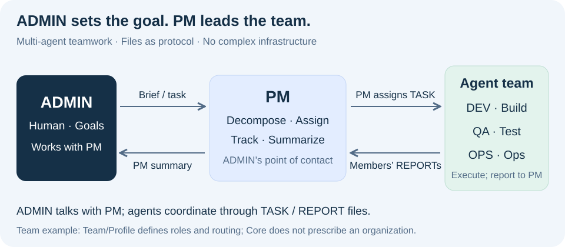
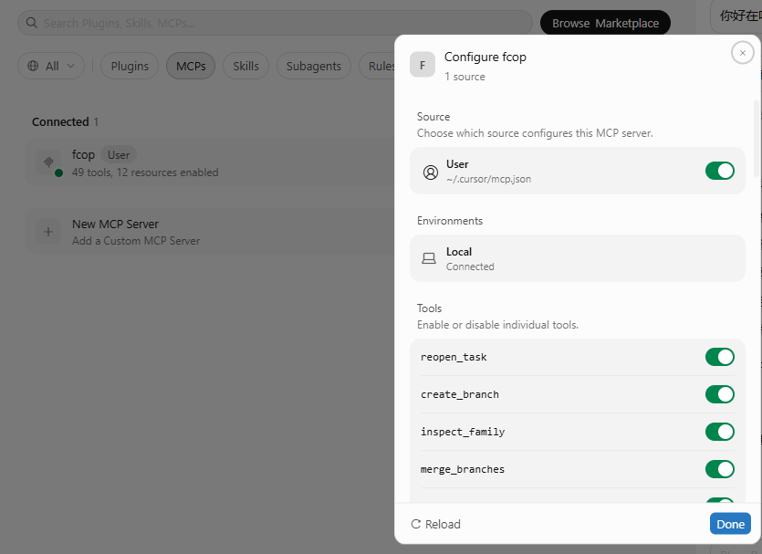

<p align="center"><a href="spec/fcop-4.0-spec.md"></a></p>

# FCoP — File-based Coordination Protocol

**Let multiple agents work as a team. Keep tasks and deliveries in files.**

New session, same project explanation? An agent says “done”, but where is the delivery record? FCoP keeps assignments, results, problems and reviews in your project's Markdown files, so people and the next agent can inspect the work and continue.

**Multi-agent collaboration · Files as protocol · No complex infrastructure · Agent governance**

[协议原文：中文](spec/fcop-4.0-spec.zh.md) · [Specification: English](spec/fcop-4.0-spec.md) · [English](README.md) · [简体中文](README.zh.md) · [Homepage](https://joinwell52-ai.github.io/FCoP/)

[PyPI · fcop](https://pypi.org/project/fcop/4.0.3/) · [MCP · fcop-mcp](https://pypi.org/project/fcop-mcp/4.0.3/) · [MIT](LICENSE) · [Zenodo & citation](#research)

**[Run the minimal example](#team-demo) · [Connect Cursor / Codex](#ai-install) · [Installation FAQ](#before-install)**

<a id="why-fcop"></a>

## What do you get?

| Your question | The record FCoP keeps |
|---|---|
| Who is doing what? | **TASK**: assignment, sender, recipient and current state |
| “Done”—where is the result? | **REPORT**: delivery description and evidence references |
| What is blocked? | **ISSUE**: problems, blockers and context |
| Who checked it? Is it ready to hand over? | **REVIEW**: review findings and decisions |

These files live in your project. Open them in an editor, inspect them with tools, and track suitable records in Git. Coordination records need no separate Redis, message queue or database. Agents keep using familiar clients such as Cursor and Codex.

**Even when an agent is gone, the work remains.**

<a id="team-workflow"></a>

## Understand it in 30 seconds: you set the goal, PM leads



You are **ADMIN**, working with **PM**. PM breaks down the goal and assigns tasks to DEV, QA and OPS. Members execute and deliver reports; PM consolidates the results and reports back to you. **Agents do not chat with each other; they collaborate through files.**

The filename identifies a task or report, its header names sender and recipient, and its directory expresses task state. Agents follow the protocol to find their work, read the task, execute and report. This illustrates a PM-led team workflow; see [file formats and version differences](#files-as-protocol) when needed.

<a id="team-demo"></a>

## Run a minimal example

PM assigns a text conversion to DEV, QA checks the actual result, and PM reads both reports before summarizing for ADMIN. The script uses independent clients to simulate three roles sequentially. No model or API key required. You need Python 3.10+ and Git.

```bash
git clone https://github.com/joinwell52-AI/FCoP.git
cd FCoP
python -m pip install "fcop==4.0.3"
python examples/team_workflow.py --output ./demo-runs
```

Open the workspace path printed by the script. You will find:

| Files retained | Who hands work to whom |
|---|---|
| 3 TASKs | ADMIN → PM; PM → DEV; PM → QA |
| 3 REPORTs | DEV → PM; QA → PM; PM → ADMIN |
| 1 REVIEW | QA's assessment of the actual result |

**Open PM's summary and follow the files to the member deliveries and QA's check.** The example completes delivery and keeps tasks in `review`, awaiting formal acceptance.

[Full example code](examples/team_workflow.py) · [Session handoff: English](docs/mcp-handoff.md) · [中文](docs/mcp-handoff.zh.md)

<a id="before-install"></a>

## Four questions before installation

### 1. Why should I install FCoP?

If you divide work among agents or often resume a project in a new session, FCoP gives tasks, deliveries and reviews a shared file record. The next person or agent can check progress with less manual reconstruction and retelling.

### 2. Do I import FCoP into my application code?

Usually no. Ordinary projects use the CLI and MCP; developers building their own integrations can use `from fcop import Project`.

### 3. Should I install it in Codex, Cursor or another agent client?

Yes. Configure `fcop-mcp` so your agent can create and claim tasks, submit reports, and record issues and reviews. It currently provides **49 tools / 12 resources / 4 resource templates**.

### 4. What changes immediately after installation?

After connection, the client lists FCoP tools. Initialization creates `<project>/fcop/`. Execute a first task to get real TASK and REPORT files you can open. The example above also leaves QA's assessment and PM's summary.

<a id="ai-install"></a>

## Ask your AI to install FCoP

Paste this into **Cursor Agent, Codex, or another coding agent with terminal and file access**. The agent handles setup and checks the result.

```text
Install FCoP for the coding client and project I am using. Follow:
https://github.com/joinwell52-AI/FCoP/blob/main/docs/ai-install.md
Run the environment checks, installation, configuration and verification yourself. Preserve my existing configuration and project state. Report what actually works; ask me only for a missing client/project choice or a required approval/reload.
```

### MCP: give agents access to FCoP

```bash
python -m pip install "fcop==4.0.3" "fcop-mcp==4.0.3"
fcop tools
```

Configure a server in a client supporting local stdio MCP. This is a generic JSON example; see the [AI installation guide](docs/ai-install.md) for Codex-specific configuration.

```json
{
  "mcpServers": {
    "fcop": {
      "command": "/absolute/path/to/python",
      "args": ["-m", "fcop_mcp"],
      "env": {
        "FCOP_PROJECT_DIR": "/absolute/path/to/my-project"
      }
    }
  }
}
```

Replace the absolute paths with your Python interpreter and project path; forward slashes work on Windows. Reconnect and check the tool list, then follow the installation guide to initialize the project, adopt team rules and execute a task.

[Full installation and client configuration](docs/ai-install.md)

Actual Cursor connection: **49 tools, 12 resources**.



<a id="codeflowmu"></a>

## In use: CodeFlowMu

[CodeFlowMu](https://github.com/joinwell52-AI/CodeflowMu-Distribution) uses FCoP in a PM, DEV, QA and OPS development team, providing client integration, execution and progress views. It is distributed as a proprietary preview; FCoP's protocol and tools are MIT open source and independently usable.

FCoP is one approach to multi-agent collaboration, for teams that want tasks and deliveries to stay in local files.

**Want to try it in your next multi-agent project? Star FCoP to keep it handy.**


## CLI — Local Setup, Inspect & Diagnose

**CLI = Setup + Observe + Diagnose; MCP = Work.**

| Command | Purpose |
| --- | --- |
| `fcop init` | Initialize an FCoP workspace |
| `fcop status` | View workspace status |
| `fcop inspect` | Inspect TASK / REPORT / ISSUE / REVIEW |
| `fcop validate` | Validate protocol structure |
| `fcop tools` | Inspect the installed MCP Tool Catalog |
| `fcop doctor` | Diagnose installation, environment and compatibility |
| `fcop version` | Show installed versions |
| `fcop spec` | Show specification / rule identity |
| `fcop migrate` | Explicitly migrate a legacy workspace; inspect the plan before apply |

<details>
<summary>CLI verification and details</summary>

### Install & Verify

In an activated Python 3.10+ environment:

```bash
python -m pip install fcop

fcop version
fcop doctor
fcop init --root ./my-project
fcop status --root ./my-project
fcop validate --root ./my-project
```

For the optional MCP Tool Catalog:

```bash
python -m pip install fcop-mcp

fcop tools
fcop tools merge_branches --json
```

Once installed, the CLI can initialize, inspect, validate and diagnose locally and offline.
`doctor` does not access the network or modify Host configuration. Package installation itself may need a package index; offline installation requires locally available packages.
The CLI does not perform `create_task`, approval, Branch, merge or authorization work operations; use MCP or the Python API for those.
Installing `fcop` does not create Host instruction files. Normal v4 workspace state belongs in `<project>/fcop/`, never in project-root `AGENTS.md`, `CLAUDE.md` or Cursor rules.
Existing atomic initialization staging and failed-initialization evidence are preserved; customer files are never cleaned up automatically.
`migrate` is a separate explicit legacy operation, not an automatic package-upgrade step.
`tools` requires the optional MCP package and never starts a server or installs it automatically.

[CLI reference](docs/cli.md) · [中文 CLI 参考](docs/cli.zh.md).

</details>


## Reference, when you need it

<a id="files-as-protocol"></a>

<details>
<summary>Filenames, recipients and v3 / v4 formats</summary>

## How do files carry the protocol?

**Files have agreed types, identities, senders, recipients and contents. Agents use those conventions to identify their work.** Filenames, directories and file headers have distinct responsibilities.

| Surface | What it tells you |
|---|---|
| Filename | Record type and identity; legacy names also contain sender and recipient roles |
| Directory | Whether a task is in inbox, active, review, done or archive |
| File header | Workspace, sender, recipient, task relationships and evidence identity |
| Markdown body | Assignment, delivery, problems and review reasoning |

**An intuitive filename-routing example (Legacy v1–v3):** `TASK-20260915-001-PM-to-DEV.md` is a task from PM to DEV; `REPORT-20260915-001-DEV-to-PM.md` is a report from DEV to PM. An agent with an assigned role can identify incoming files from the naming convention.

**The current 4.0 implementation:** new tasks live at `fcop/_lifecycle/inbox/TASK-<uuid>.md`, with `sender: PM` and `recipient: DEV` in the file header. The agent or caller reads the task fields and selects work for its established role. A filename-only search for `to-DEV` will not work because v4 names do not contain that segment. Reports live at `fcop/reports/REPORT-<uuid>.md`, with `subject_ref` and `attempt_id` linking the task and its execution attempt.

These placeholders explain layout; they are not complete runnable envelopes. Consult the 4.0 specification ([English](spec/fcop-4.0-spec.md) · [简体中文](spec/fcop-4.0-spec.zh.md)), [current creation implementation](src/fcop/v4/creation.py) and [legacy filename grammar](src/fcop/core/filename.py) for the exact contracts.

</details>

<a id="installation"></a>

<details>
<summary>CLI, Python, source installation and custom implementations</summary>

## Choose how to install

| Use | Install | Purpose |
|---|---|---|
| Standalone CLI | `fcop` | Initialize, inspect, validate and diagnose a project |
| Python integration | `fcop` | Call the `Project` API from your own program |
| MCP in an agent client | `fcop` + `fcop-mcp` | Give agents in Codex, Cursor and other clients collaboration tools |
| Source development | This repository and its `mcp/` subproject | Modify, debug or contribute to the reference implementation |

### CLI and Python: one package

```bash
python -m pip install "fcop==4.0.3"
fcop version
fcop doctor
fcop init --root ./my-project
fcop status --root ./my-project
```

Python developers can then use `from fcop import Project`; see the complete example in the [manual reference](#manual-setup). Ordinary users do not need to import FCoP into application code.

### MCP: give agents access to FCoP

```bash
python -m pip install "fcop==4.0.3" "fcop-mcp==4.0.3"
fcop tools
```

Configure a server in a client supporting local stdio MCP. This is a generic JSON example; see the [AI installation guide](docs/ai-install.md) for Codex-specific configuration.

```json
{
  "mcpServers": {
    "fcop": {
      "command": "/absolute/path/to/python",
      "args": ["-m", "fcop_mcp"],
      "env": {
        "FCOP_PROJECT_DIR": "/absolute/path/to/my-project"
      }
    }
  }
}
```

Replace `command` with the absolute path to the Python interpreter containing both packages, and set your project directory. Windows paths can use forward slashes. Reconnect the client to see 49 FCoP tools and 12 resources. Project initialization and team-rule adoption are separate steps; connecting MCP does not create a PM-led team or launch other agents.

### Install from source

```bash
git clone https://github.com/joinwell52-AI/FCoP.git
cd FCoP
python -m pip install -e .
python -m pip install -e ./mcp
fcop version
```

The official installation route uses the Python packages above. This guide does not prescribe an unverified npm package or Node SDK. Node.js and other languages can integrate through an MCP client or implement the protocol themselves.

### Implement the protocol yourself

You can build conforming tools from the formal specification ([English](spec/fcop-4.0-spec.md) · [简体中文](spec/fcop-4.0-spec.zh.md)) without using the Python reference implementation. Creating a few directories is not sufficient: field, transition, evidence, authorization, idempotency and recovery contracts must also be met. With the official toolkit, use `fcop init` to create the workspace.

</details>

<details>
<summary>macOS installation</summary>

## macOS (Intel and Apple silicon): install CLI and MCP

FCoP supports macOS on both Intel and Apple silicon. The published wheels are platform-independent; Rosetta is not required. Use Python 3.10–3.13. The CLI works directly in Terminal, while MCP additionally requires a client that supports local stdio servers, such as Codex or Cursor.

Create a dedicated environment and install the matching Core/MCP pair:

```bash
python3 --version
python3 -m venv ~/.local/share/fcop/venv
~/.local/share/fcop/venv/bin/python -m pip install --upgrade \
  "fcop>=4.0.3,<4.1.0" \
  "fcop-mcp>=4.0.3,<4.1.0"
```

Verify the CLI and installed MCP catalog:

```bash
~/.local/share/fcop/venv/bin/fcop version
~/.local/share/fcop/venv/bin/fcop doctor
~/.local/share/fcop/venv/bin/fcop tools --json
```

The installed CLI provides all nine commands listed below: `init`, `status`, `inspect`, `validate`, `tools`, `doctor`, `version`, `spec`, and `migrate`. CLI setup and inspection do not require an MCP-capable AI client.

For MCP, configure the client with absolute macOS paths; do not use `~` inside client configuration:

```json
{
  "mcpServers": {
    "fcop": {
      "command": "/Users/YOUR_NAME/.local/share/fcop/venv/bin/python",
      "args": ["-m", "fcop_mcp"],
      "env": {
        "FCOP_PROJECT_DIR": "/Users/YOUR_NAME/path/to/your-project"
      }
    }
  }
}
```

Replace `YOUR_NAME` and the project path, then restart or reconnect the MCP client. `FCOP_PROJECT_DIR` points to the project that will use FCoP, not to this source repository.

</details>

<a id="manual-setup"></a>

<details>
<summary>Manual installation, Python/MCP examples and CLI reference (optional)</summary>

4.0.1 introduced `create_branch`, `inspect_family` and `merge_branches`;
4.0.3 preserves all 49 tools and their signatures. Core owns atomic convergence,
durable idempotency and recovery. Unfinished families return `family_digest: null`,
`merge_ready: false` and structured reasons. The caller supplies the semantic conclusion.
See the [Branch merge contract and example](docs/branch-merge.md) / [中文合同](docs/branch-merge.zh.md).

<a id="try-it"></a>

## Try it: create once, read from another client

In an activated **Python 3.10+ virtual environment**, install the published library:

```sh
python -m pip install "fcop==4.0.3"
```

Save this as `demo.py` and run `python demo.py`. It writes a real TASK, opens the workspace through a fresh `Project` instance, then retries the original request.

```python
from pathlib import Path
from tempfile import TemporaryDirectory

from fcop import Project

with TemporaryDirectory(prefix="fcop-demo-") as directory:
    root = Path(directory) / "workspace"
    project = Project(root)
    workspace = project.create_workspace(protocol_version="4.0")
    request = dict(
        workspace_id=workspace["workspace_id"],
        operation_id="demo-create-1",
        sender="ME", recipient="ME",
        subject="Inspect this handoff",
        body="Read the task and check the evidence before accepting delivery.",
    )
    first = project.create_task(**request)

    next_client = Project(root)
    state = next_client.inspect_state(task_id=first["task_id"])
    retry = next_client.create_task(**request)

    assert Path(state["path"]).is_file()
    assert retry["existing"] and retry["task_id"] == first["task_id"]
    print("State read from disk:", state["stage"])
    print("Same task after retry:", retry["task_id"] == first["task_id"])
```

```text
State read from disk: inbox
Same task after retry: True
```

The example cleans up its temporary directory when it exits. Use your own project directory to retain the files. Retrying `create_task` with the same `operation_id` and normalized payload reuses its durable result; changing the payload is a conflict. This guarantee is specifically for task creation.

**Continue with the [4.0 setup and version guide](docs/fcop-4.0-progress.md)** for a lasting workspace, lifecycle operations and the authorization needed to complete a task.

<a id="mcp"></a>

## Give your agent the same operations through MCP

The optional adapter exposes FCoP to an MCP-capable client over stdio. Install it in the same activated environment:

```sh
python -m pip install "fcop==4.0.3" "fcop-mcp==4.0.3"
```

Add this entry to the client's MCP configuration. Replace both absolute paths; on Windows the command ends in `.venv/Scripts/fcop-mcp.exe`.

```json
{
  "mcpServers": {
    "fcop": {
      "command": "/absolute/path/to/.venv/bin/fcop-mcp",
      "env": {"FCOP_PROJECT_DIR": "/absolute/path/to/new-workspace"}
    }
  }
}
```

Once connected, initialize a **new** workspace with `init_solo(role_code="ME", protocol_version="4.0")`. Use its workspace identity when calling `create_task`, then inspect the TASK with `inspect_task(filename=task_id)`. Installing an MCP server alone does not initialize a workspace or start an agent team.

**49 tools / 12 resources / 4 resource templates.** The adapter routes to the same Python Core. Default initialization has no trusted authorization Profile: creation, claim and submission are available, but acceptance, rejection, reopening and archival need an explicitly adopted Profile and an issuer evaluator registered by the trusted host. A role name typed into a request cannot supply that authority.

[MCP tool reference](docs/mcp-tools.md) · [Stable external Python example](tests/stable/third-party/python-only/app.py) · [Stable external MCP example](tests/stable/third-party/mcp-only/client.py). The full examples include an educational Profile; a real deployment must supply its own trust policy.

</details>

<a id="architecture"></a>

<details>
<summary>Team rules, authorization, lifecycle and architecture</summary>

The 4.0 specification defines FCoP as a file-native agent behavior-governance protocol: files carry protocol, paths express current state, and events record transition history.

Roles such as PM, DEV, QA and OPS in `dev-team` come from a Team/Profile. The host adopts team rules; MCP supplies tools while the host runs and schedules models. Formal acceptance, rejection, reopening and archiving require an adopted Profile and trusted host authorization. Concurrent application-code changes need workspace isolation and integration review.

## From a delivery claim to an accepted result

Each TASK follows an ordered lifecycle. In 4.0, entering `active` starts a new attempt, and submission links that attempt's REPORT. Acceptance then binds the review and authorization to the current evidence.

<a href="spec/fcop-4.0-spec.md"></a>

`active → done` is absent from 4.0. Reopening through `reopen_task` creates a new attempt for ordinary tasks as well as Branches. An old REPORT cannot satisfy a new attempt's submission gate. See the [complete lifecycle and C1–C8 contracts](spec/fcop-4.0-spec.md) · [中文规范](spec/fcop-4.0-spec.zh.md).

## Parallel work, with an explicit way to finish

Multiple ordered workflows can advance concurrently. A Branch is an ordinary TASK linked to one Root by `branch_of`; sibling Branches keep their own attempts, reports and reviews. Your Runtime decides who runs them and when.

<a href="docs/architecture.en.md#parallel-work"></a>

Before a Root with Branches can be archived, FCoP checks completed Branches, their current REPORTs, a matching `family_digest`, a convergence REVIEW and separate Root archive authorization. A reopened Branch or changed REPORT invalidates stale convergence. Related writes share a short commit boundary; agents do not hold that lock while doing their work. This closes an evidence set; code integration remains the application's responsibility.

## A small protocol inside a larger agent system

Another implementation should be able to preserve the same work semantics without copying a particular Python library, MCP tool list or product.

| Layer | Responsibility |
|---|---|
| **Core** | C1–C8: identity, envelopes, lifecycle, relations, convergence, authorization, create idempotency and atomic recovery. |
| **Specification** | Define the fields, state transitions, errors and observable behavior. |
| **Conformance** | Check implementations against those contracts using fixtures, vectors and behavioral tests. |
| **Toolkit** | Implement and expose the protocol; this repository supplies Python and the MCP adapter. |
| **Profile** | Supply organizational policy and issuer authority; fixed PM/DEV/QA roles are not universal Core rules. |
| **Runtime** | Run models and tools, manage sessions, schedule work and provide the user interface. |

**Read the design explanation: [English](docs/architecture.en.md) · [简体中文](docs/architecture.zh.md).** It develops the reasoning behind files, separate delivery and acceptance, parallel work, and the boundaries between FCoP, MCP and a Runtime.

**Architecture principles: five full essays in Chinese**, published September 10, 2026 and revised against 4.0:

1. [Work beyond the model context: why files?](docs/fcop-architecture-series/01-work-beyond-context.zh.md)
2. [Extracting the minimal FCoP Core](docs/fcop-architecture-series/02-minimal-core.zh.md)
3. [Separating Core, Specification, Toolkit, Profile and Runtime](docs/fcop-architecture-series/03-architecture-layers.zh.md)
4. [Parallel work through ordered task lifecycles](docs/fcop-architecture-series/04-parallel-work.zh.md)
5. [How FCoP, MCP, A2A and CodeFlowMu fit together](docs/fcop-architecture-series/05-mcp-a2a-runtime.zh.md)

[Series guide (中文)](docs/fcop-architecture-series/README.md) · [All five essays (中文)](docs/fcop-architecture-series/collected.zh.md)

4.0.3 distributes **nine bilingual rule modules** through package-owned and MCP resources, with strict manifests and `sequential`, `parallel` and separate `repository-development` assemblies. **Install → connect MCP → initialize workspace → use FCoP.** FCoP owns `<project>/fcop/`, not project-root Host instruction files. Host projection, adoption, deployment and rollback are retired; `redeploy_rules` is Legacy v1–v3 only and rejects v4 with zero writes. Existing customer files stay unchanged. [Rule resources / 规则资源](docs/rule-resources.md).

</details>

<a id="research"></a>

<details>
<summary>Releases, MCP listings, papers, Zenodo and version history</summary>

**Stable version: 4.0.3** — [4.0.3 release](https://github.com/joinwell52-AI/FCoP/releases/tag/v4.0.3). This repository contains the open protocol, the `fcop` Python implementation and the optional `fcop-mcp` adapter. Python 3.10+; no model API key is needed for the local example.

</p>

**Discover FCoP:** [MCPServers introduction](https://mcpservers.org/servers/joinwell52-ai/fcop) ([简体中文](https://mcpservers.org/zh-CN/servers/joinwell52-ai/fcop)) — a third-party directory for discovering and learning about FCoP. **Registration details:** [Official MCP Registry](https://registry.modelcontextprotocol.io/v0/servers/io.github.joinwell52-AI%2Ffcop/versions/4.0.3) — the server identifier, version and package metadata.

## Papers, evidence and citation

These resources are directly accessible; reading the essay collection is optional.

| Resource | Read or cite |
|---|---|
| **Architecture whitepaper** | [English](essays/from-coordination-to-governance.en.md) · [中文](essays/from-coordination-to-governance.md) — historical research context |
| **3.2.5 archive** | [Zenodo DOI 10.5281/zenodo.20457285](https://doi.org/10.5281/zenodo.20457285) · [OSF DOI 10.17605/OSF.IO/92NWM](https://doi.org/10.17605/OSF.IO/92NWM) |
| **April 2026 research snapshot** | [Zenodo DOI 10.5281/zenodo.19886036](https://doi.org/10.5281/zenodo.19886036) · [Citation metadata](CITATION.cff) |
| **17 field reports and design essays** | [Complete index](essays/README.md) · [中文目录](essays/README.zh.md), including original publication and evidence links |

Choose the archive matching the version you studied. The historical DOIs above are not identifiers for 4.0.0; use the versioned release and specification when discussing current behavior.

## Three repositories, three entry points

| Repository | Start here for |
|---|---|
| **[FCoP](https://github.com/joinwell52-AI/FCoP)** | **Flagship open-source project:** protocol, Python library and MCP server; use, implement or contribute to the coordination layer. |
| **[joinwell52](https://github.com/joinwell52-AI/joinwell52)** | **Research and communication:** AI Agents, digital employees and engineering studies. |
| **[CodeflowMu-Distribution](https://github.com/joinwell52-AI/CodeflowMu-Distribution)** | **Product experience:** packaged application and [downloads](https://github.com/joinwell52-AI/CodeflowMu-Distribution/releases); check its release notes for supported versions. |

FCoP is independently usable under the [MIT license](LICENSE). The product distribution has its own licensing and release schedule.

**Star FCoP to bookmark the protocol and its implementation.** To help it improve, share a reproducible integration issue, an example from your host, or a test of the protocol's public behavior through [Issues](https://github.com/joinwell52-AI/FCoP/issues) or a pull request.

## Versions and existing installations

- **4.0.0:** [Release notes](docs/releases/4.0.0.md) · [Changelog](CHANGELOG.md) · [Architecture decisions](adr/README.md). Publication followed the recorded `FCOP_4_STABLE_RELEASE_READY` gate; users install the stable PyPI pair above.
- **Release candidate: 4.0.0rc1** — retained as a [historical prerelease](https://github.com/joinwell52-AI/FCoP/releases/tag/v4.0.0rc1).
- **3.x workspaces:** retain their original semantics until explicit migration. [Legacy specification EN](spec/fcop-v3-spec.md) · [ZH](spec/fcop-v3-spec.zh.md). `finish_task` and legacy history tools remain discoverable but reject v4 workspaces.
- **Legacy installation prompts:** [EN](src/fcop/rules/_data/agent-install-prompt.en.md) · [ZH](src/fcop/rules/_data/agent-install-prompt.zh.md), also available at `fcop://prompt/install`. These are historical setup material; use the 4.0 guide above for the current version.

</details>
