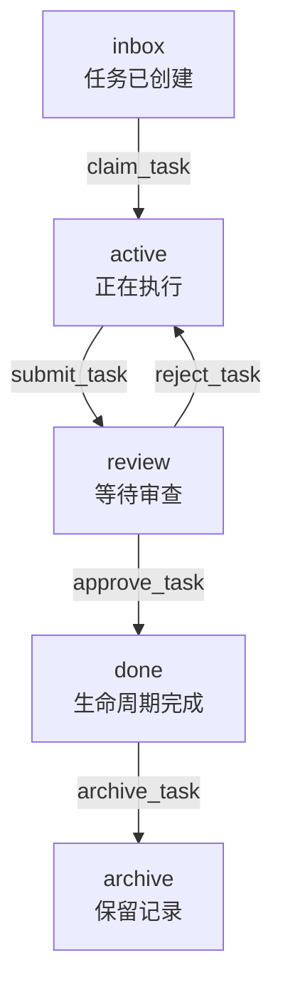

<p align="center">
  
</p>

<h1 align="center">FCoP — 文件驱动的 Agent 协作协议</h1>

<p align="center">
  <strong>让 Agent 的正式工作独立于会话持续存在。</strong><br/>
  任务、交付、问题与审查留在模型上下文之外，供人和 Agent 检查、接手。
</p>

<p align="center">
  <a href="https://pypi.org/project/fcop/3.2.5/"></a>
  <a href="https://pypi.org/project/fcop-mcp/3.2.5/"></a>
  <a href="LICENSE"></a>
</p>

<p align="center">
  <a href="#try-it"><strong>运行本地示例</strong></a> ·
  <a href="#mcp">接入 MCP</a> ·
  <a href="#research">论文与引用</a> ·
  <a href="spec/fcop-v3-spec.zh.md">协议规范</a> ·
  <a href="README.md">English</a>
</p>

**FCoP 是将 Agent 正式工作行为外化的开放协议。** 任务、交付报告、问题与审查决定成为持久记录，带有责任归属、相互引用和生命周期历史。会话结束或另一个 Agent 接手后，人和工具仍能直接检查这些记录，继续了解工作状态。

文件系统是当前参考实现的载体。本仓库提供协议、`fcop` Python 库和可选的 `fcop-mcp` 服务器。TASK 记录任务，REPORT 记录交付，ISSUE 留下问题，REVIEW 记录审查决定。提交报告本身不代表交付已被接受。

**当前公开版本：[3.2.5](https://github.com/joinwell52-AI/FCoP/releases/tag/v3.2.5)。** 下方示例和安装说明使用已经公开的 3.2.5 安装包。

## 先看一次任务交接

在当前 v3 协议中，**文件承载工作，路径表示状态，事件记录迁移。**



上图展示经过审查的路径；完整迁移表见[协议规范](spec/fcop-v3-spec.zh.md)。使用 Python 默认配置时，这些目录位于 `fcop/_lifecycle/`。

- **接手时有上下文。** 带 YAML 元数据的 Markdown 文件保存发件人、收件人、任务要求和引用。
- **进度可以直接查。** 路径给出当前生命周期阶段，文件内的 `transitions` 记录它如何走到这里。
- **交付有证据可审。** TASK、REPORT、ISSUE 和 REVIEW 分别记录任务、交付报告、问题与审查决定。

协议与 Python 库无需数据库、消息队列或模型 API Key。Agent 执行、调度和文件访问权限由宿主负责。文件进入 `done/` 表示生命周期结果；交付物是否被接受，仍需审查其内容与证据。

<a id="try-it"></a>

## 运行一个本地示例

准备 **Python 3.10+**，在虚拟环境中安装：

```sh
python -m pip install "fcop==3.2.5"
```

把下面代码保存为 `demo.py`，运行 `python demo.py`。它会创建一个新的临时目录，写入任务、领取任务，再读回迁移记录。目录会保留，方便你打开文件检查。

```python
from datetime import datetime, timezone
from pathlib import Path
from tempfile import mkdtemp

from fcop import Project
from fcop.lifecycle import Stage, TransitionEvent, commit, read_events

root = Path(mkdtemp(prefix="fcop-demo-"))
project = Project(root)
project.init(team="dev-team", lang="en", deploy_role_templates=False)
task = project.write_task(
    sender="PM", recipient="DEV", priority="P2",
    subject="Inspect this handoff",
    body="Read the task and inspect its recorded transitions.",
)
print("Workspace:", root)
print("Before:", task.path.relative_to(root).as_posix())

claimed = commit(
    task.path, Stage.ACTIVE,
    TransitionEvent(
        at=datetime.now(timezone.utc),
        from_stage=Stage.INBOX, to_stage=Stage.ACTIVE,
        by="DEV", tool="claim_task",
    ),
    project_root=project.workspace_dir,
)
print("After:", claimed.destination_path.relative_to(root).as_posix())
events = read_events(claimed.destination_path.read_text(encoding="utf-8"))
print("Recorded transitions:", len(events))
```

输出形式如下，临时路径与日期会变化：

```text
Workspace: .../fcop-demo-...
Before: fcop/_lifecycle/inbox/TASK-YYYYMMDD-001-PM-to-DEV.md
After: fcop/_lifecycle/active/TASK-YYYYMMDD-001-PM-to-DEV.md
Recorded transitions: 2
```

这是协议读写示例。接入实际 Agent 项目时，再选择单 Agent、预设团队或自定义团队，并部署对应规则：[完整入门指南](docs/getting-started.md)。

<a id="mcp"></a>

## 通过 MCP 接入你的 Agent

独立安装包 [`fcop-mcp`](https://pypi.org/project/fcop-mcp/) 通过 **stdio MCP** 暴露 FCoP 操作。要在 Cursor 或 Claude Desktop 中试用，先安装 [uv](https://docs.astral.sh/uv/)，再将下面条目加入客户端的 MCP 配置，保留已有服务器：

```json
{
  "mcpServers": {
    "fcop": {
      "command": "uvx",
      "args": ["fcop-mcp==3.2.5"]
    }
  }
}
```

连接成功后，用 `set_project_dir` 明确选择项目目录，用 `fcop_report` 检查状态，再为新项目选择需要的初始化模式。安装服务器本身不会创建 Agent 团队或开始执行任务。

[客户端配置与首次连接排查](mcp/README.md) · [工具参考](docs/mcp-tools.md)

让 Agent 协助安装时，可以使用[中文安装提示词](src/fcop/rules/_data/agent-install-prompt.zh.md)或[英文安装提示词](src/fcop/rules/_data/agent-install-prompt.en.md)。已连接的 MCP 客户端也可以读取对应资源：`fcop://prompt/install`（中文）、`fcop://prompt/install/en`（英文）。

目录收录：[MCP Registry](https://registry.modelcontextprotocol.io/v0/servers?search=io.github.joinwell52-AI%2Ffcop)（`io.github.joinwell52-AI/fcop`）· [Glama](https://glama.ai/mcp/servers/joinwell52-AI/FCoP)。

<a id="research"></a>

## 论文与引用

协议与研究档案可以直接查看：

- **阅读协议：** [v3 规范](spec/fcop-v3-spec.zh.md) · [架构白皮书](essays/from-coordination-to-governance.md)。
- **引用公开的 3.2.5 档案：** [Zenodo DOI 10.5281/zenodo.20457285](https://doi.org/10.5281/zenodo.20457285) · [OSF DOI 10.17605/OSF.IO/92NWM](https://doi.org/10.17605/OSF.IO/92NWM)。
- **引用 2026 年 4 月研究快照：** [Zenodo DOI 10.5281/zenodo.19886036](https://doi.org/10.5281/zenodo.19886036) · [快照发布](https://github.com/joinwell52-AI/FCoP/releases/tag/research-snapshot-2026-04-29) · [CITATION.cff](CITATION.cff)。

请选用与你研究的版本对应的记录。现有标识符不代表尚未发布的 4.0 安装包。

## 按需要深入

| 你想做什么 | 从这里开始 |
|---|---|
| 配置实际 Agent 项目 | [入门指南](docs/getting-started.md) |
| 接入 Python 或 MCP | [Python 源码](src/fcop/) · [MCP 配置](mcp/README.md) · [工具参考](docs/mcp-tools.md) |
| 实现或审查协议 | [当前 v3 规范](spec/fcop-v3-spec.zh.md) · [Schemas](spec/schemas/) · [架构决策](adr/README.md) |
| 升级旧安装 | [安装包升级指南](docs/upgrade-fcop-mcp.md) · [2.x → 3.x 迁移](docs/MIGRATION-3.0.zh.md) |
| 阅读实验与历史教程 | [完整现场报告索引](essays/README.zh.md) |

文章、外部发布链接与证据档案均保留在索引中。历史案例描述的是当时使用的版本。

<a id="v4"></a>

> **开发说明：** FCoP 4.0 仍在开发。[设计与候选审查记录](docs/fcop-4.0-progress.md)描述的是尚未完成的工作，不代表功能已经交付或版本已经发布。

## 三个仓库，三个入口

| 仓库 | 定位 |
|---|---|
| **[FCoP](https://github.com/joinwell52-AI/FCoP)** | **主推开源旗舰库：** 协议、Python SDK 与 MCP Server。使用或参与协作协议，从这里开始。 |
| [joinwell52](https://github.com/joinwell52-AI/joinwell52) | **研究传播入口：** AI Agent、数字员工、TMPA 与工程研究。 |
| [CodeflowMu-Distribution](https://github.com/joinwell52-AI/CodeflowMu-Distribution) | **产品体验入口：** 打包应用与[客户端下载](https://github.com/joinwell52-AI/CodeflowMu-Distribution/releases)。能力与兼容版本以其发布说明为准。 |

FCoP 可以独立于产品使用。本仓库的协议、库与服务器采用 MIT 许可；产品分发遵循自己的许可条款。

## 一起改进 FCoP

**如果你想把这套协议、SDK 和 MCP 接入方式留在自己的开发工具箱里，欢迎给 FCoP 点个 Star。**

在自己的项目中试过后，欢迎[提交 Issue](https://github.com/joinwell52-AI/FCoP/issues)，附上安装包版本、宿主、最小复现、预期与实际结果。可复现的接入问题和实际示例尤其有帮助。

修改协议时，请关联具体问题与对应规范条款。接入示例、文档修正和现场报告也欢迎通过 PR 提交。

[MIT 许可证](LICENSE) · [项目网站](https://joinwell52-ai.github.io/FCoP/)
