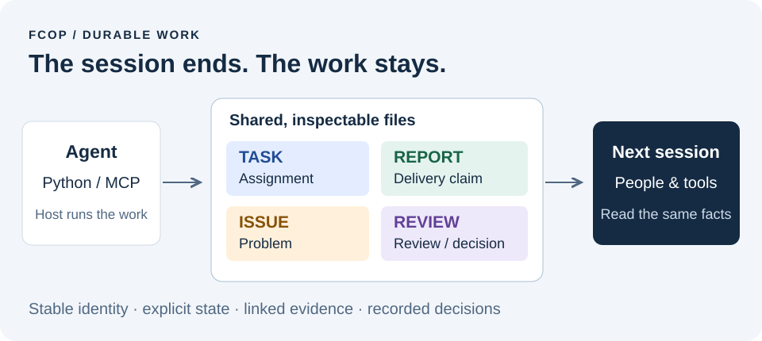
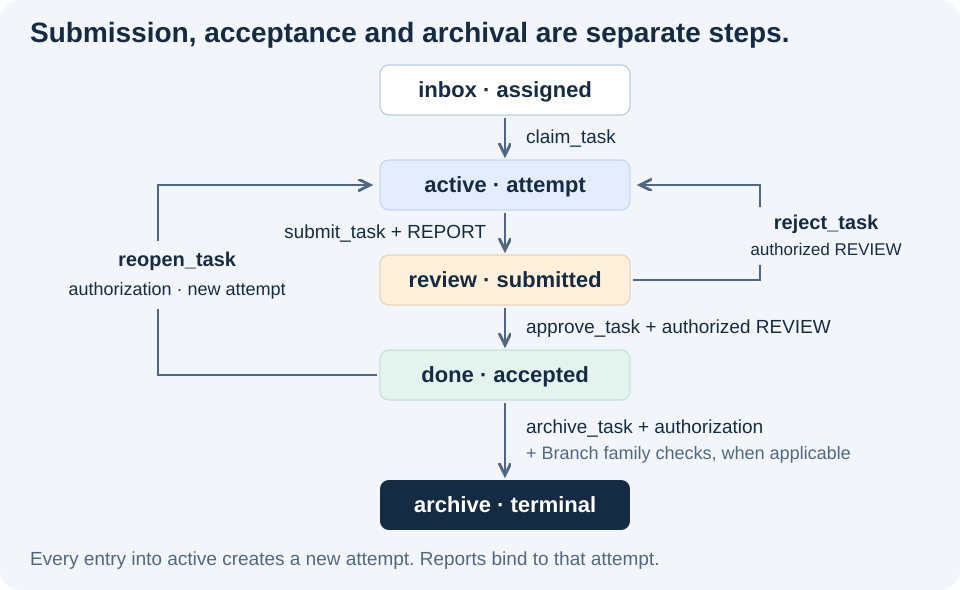
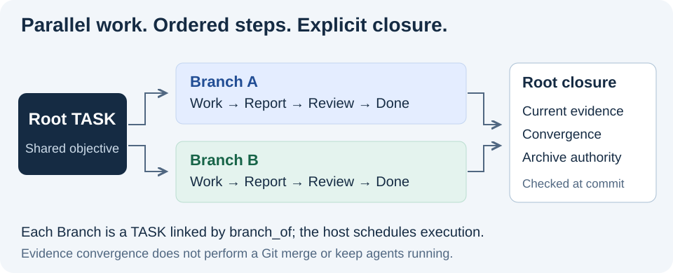

<p align="center"><a href="docs/architecture.zh.md"></a></p>

# FCoP — 基于文件的协作协议

[English](README.md) · [简体中文](README.zh.md)

**让 Agent 的工作，留在对话之外。**

任务、交付、问题与审查决定保存为持久文件，人、工具和接手的 Agent 都能检查。一次会话结束，工作记录仍然在。

<p>
  <a href="https://pypi.org/project/fcop/4.0.0/"></a>
  <a href="https://pypi.org/project/fcop-mcp/4.0.0/"></a>
  <a href="LICENSE"></a>
</p>

**[运行 Python 示例](#try-it) · [接入 MCP](#mcp) · [了解架构](#architecture) · [论文与引用](#research)**

<a href="docs/architecture.zh.md"></a>

**Stable version: 4.0.0** — 已于 [2026 年 9 月 10 日发布](https://github.com/joinwell52-AI/FCoP/releases/tag/v4.0.0)。本仓库提供开放协议、`fcop` Python 实现和可选的 `fcop-mcp` 适配器。需要 Python 3.10+；下面的本地示例无需模型 API Key。

## 为什么要把工作放到模型之外？

“我完成了”是一句对话。接手的人还需要知道：**执行的是哪项任务、交付了什么、谁审查过、还有什么问题没有解决。** 如果这些事实只留在聊天里，每次交接都要重新拼接上下文。

FCoP 为正式工作建立共同表示：带结构化元数据的 Markdown 文件、稳定身份、明确关系和状态迁移记录。Agent 可以写，人可以直接打开，脚本也可以校验。当前文件系统参考实现无需数据库或消息队列。

| 工作记录 | 保存什么 | 带来什么 |
|---|---|---|
| **TASK** | 任务要求、参与者与生命周期 | 接手者能定位任务，知道它走到了哪一步。 |
| **REPORT** | 某次尝试的交付主张与证据 | 区分“已经提交”与“已经验收”。 |
| **ISSUE** | 问题及其上下文 | 发现问题的会话结束后，阻塞仍有记录。 |
| **REVIEW** | 审查、验收或授权事实 | 可以核对决定针对的是哪项工作、哪份证据。 |

持久化让主张可以检查，主张是否真实仍要核验。FCoP 检查协议关系和状态门槛，审查者判断交付内容；宿主 Runtime 负责执行、调度和权限。

<a id="try-it"></a>

## 直接试用：创建一次，换个客户端仍能读取

在已激活的 **Python 3.10+ 虚拟环境**中安装公开版本：

```sh
python -m pip install "fcop==4.0.0"
```

保存为 `demo.py`，运行 `python demo.py`。示例写入一份真实 TASK，再通过新的 `Project` 实例读取工作区，并重试原始创建请求。

```python
from pathlib import Path
from tempfile import TemporaryDirectory

from fcop import Project

with TemporaryDirectory(prefix="fcop-demo-") as directory:
    root = Path(directory) / "workspace"
    project = Project(root)
    workspace = project.create_workspace(protocol_version="4.0")
    request = dict(
        workspace_id=workspace["workspace_id"],
        operation_id="demo-create-1",
        sender="ME", recipient="ME",
        subject="Inspect this handoff",
        body="Read the task and check the evidence before accepting delivery.",
    )
    first = project.create_task(**request)

    next_client = Project(root)
    state = next_client.inspect_state(task_id=first["task_id"])
    retry = next_client.create_task(**request)

    assert Path(state["path"]).is_file()
    assert retry["existing"] and retry["task_id"] == first["task_id"]
    print("State read from disk:", state["stage"])
    print("Same task after retry:", retry["task_id"] == first["task_id"])
```

```text
State read from disk: inbox
Same task after retry: True
```

示例结束时会清理临时目录；使用自己的项目目录即可保留文件。以相同 `operation_id` 和规范化载荷重试 `create_task`，会返回原有持久结果；修改载荷则构成冲突。这项幂等保证具体适用于任务创建。

**继续查看 [4.0 接入与版本指南](docs/fcop-4.0-progress.md)**，了解长期工作区、生命周期操作，以及完成任务所需的授权配置。

<a id="mcp"></a>

## 通过 MCP，把同一套操作交给 Agent

可选适配器通过 stdio 为支持 MCP 的客户端提供 FCoP 操作。在同一已激活环境中安装：

```sh
python -m pip install "fcop==4.0.0" "fcop-mcp==4.0.0"
```

在客户端的 MCP 配置中加入以下条目，替换两个绝对路径；Windows 的命令路径以 `.venv/Scripts/fcop-mcp.exe` 结尾。

```json
{
  "mcpServers": {
    "fcop": {
      "command": "/absolute/path/to/.venv/bin/fcop-mcp",
      "env": {"FCOP_PROJECT_DIR": "/absolute/path/to/new-workspace"}
    }
  }
}
```

连接后，用 `init_solo(role_code="ME", protocol_version="4.0")` 初始化**新工作区**。调用 `create_task` 时传入工作区身份，再用 `inspect_task(filename=task_id)` 检查 TASK。安装 MCP 服务本身不会初始化工作区，也不会启动一个 Agent 团队。

**46 tools / 12 resources / 4 resource templates**（46 个工具、12 个资源、4 个资源模板）。适配器将调用交给同一 Python Core。默认初始化不含可信授权 Profile：可以创建、领取、提交任务；验收、退回、重开和归档需要显式采纳 Profile，并由可信宿主注册签发者评估器。在请求里填写一个角色名，不能赋予自己这些权限。

[MCP 工具参考](docs/mcp-tools.md) · [稳定版独立 Python 示例](tests/stable/third-party/python-only/app.py) · [稳定版独立 MCP 示例](tests/stable/third-party/mcp-only/client.py)。完整示例包含教学用 Profile，实际部署需要配置自己的信任策略。

## 从“提交交付”到“验收通过”

每项 TASK 沿有序生命周期前进。4.0 中，每次进入 `active` 都会生成新的尝试身份，提交时关联该次尝试的 REPORT；验收再把审查与授权绑定到当前证据。

<a href="spec/fcop-4.0-spec.zh.md"></a>

4.0 移除了 `active → done` 的直接跳转。普通任务和 Branch 都可通过 `reopen_task` 重开并生成新尝试；旧 REPORT 不能满足新尝试的提交门槛。完整迁移条件见 [C1–C8 英文规范](spec/fcop-4.0-spec.md) · [中文规范](spec/fcop-4.0-spec.zh.md)。

## 多条有序工作流形成并行，收尾有据可查

多项工作可以同时推进。Branch 是通过 `branch_of` 关联到同一 Root 的普通 TASK；同级 Branch 各自保留尝试、报告和审查。由谁执行、何时调度，交给 Runtime 决定。

<a href="docs/architecture.zh.md#parallel-work"></a>

带 Branch 的 Root 归档前，FCoP 会检查分支完成状态、各自当前 REPORT、匹配的 `family_digest`、汇合 REVIEW，以及独立的 Root 归档授权。分支重开或报告变化会使旧汇合失效。相关写入只在短暂提交时协调，Agent 执行工作期间不持有这把锁。这里汇合的是工作证据，代码集成仍由应用负责。

<a id="architecture"></a>

## 协议核心保持小，系统职责分清楚

另一种实现应该能够保留相同的工作语义，而无需照搬某个 Python 库、MCP 工具清单或产品。

| 层次 | 负责什么 |
|---|---|
| **Core** | C1–C8：身份、信封、生命周期、关系、汇合、授权、创建幂等、原子恢复。 |
| **Specification** | 定义字段、状态迁移、错误与外部可观察行为。 |
| **Conformance** | 用样例、测试向量和行为测试检查实现是否遵守契约。 |
| **Toolkit** | 实现并提供协议操作；本仓库提供 Python 和 MCP 适配器。 |
| **Profile** | 提供组织策略与签发者权限；PM/DEV/QA 等固定角色不是通用 Core 规则。 |
| **Runtime** | 运行模型与工具，管理会话，调度工作并提供界面。 |

**深入了解设计：[English](docs/architecture.en.md) · [简体中文](docs/architecture.zh.md)。** 专页展开说明为什么用文件、为什么分开交付与验收、如何组织并行，以及 FCoP、MCP 和 Runtime 各自承担什么。

4.0 还提供**九个双语规则模块**、版本化清单，以及 `sequential`、`parallel`、`repository-development` 三类组合。采纳、部署计划、回执和回滚都有显式步骤；宿主投影使用 `reference` 或 `bounded_embed`。安装包不会静默重写宿主规则。[规则分发英文契约](docs/fcop-4.0/rule-distribution-contract.md) · [中文契约](docs/fcop-4.0/rule-distribution-contract.zh.md)。

<a id="research"></a>

## 论文、证据与引用

以下入口直接可见；文章合集按需阅读。

| 资料 | 阅读或引用 |
|---|---|
| **架构白皮书** | [English](essays/from-coordination-to-governance.en.md) · [中文](essays/from-coordination-to-governance.md) — 历史研究背景 |
| **3.2.5 归档** | [Zenodo DOI 10.5281/zenodo.20457285](https://doi.org/10.5281/zenodo.20457285) · [OSF DOI 10.17605/OSF.IO/92NWM](https://doi.org/10.17605/OSF.IO/92NWM) |
| **2026 年 4 月研究快照** | [Zenodo DOI 10.5281/zenodo.19886036](https://doi.org/10.5281/zenodo.19886036) · [引用元数据](CITATION.cff) |
| **17 篇现场报告与设计文章** | [英文目录](essays/README.md) · [中文目录](essays/README.zh.md)，保留原始发布和证据链接 |

引用时请选择与研究版本相符的归档。以上历史 DOI 不代表 4.0.0；讨论当前行为请同时指向版本化发布与规范。

## 三个仓库，三个入口

| 仓库 | 定位 |
|---|---|
| **[FCoP](https://github.com/joinwell52-AI/FCoP)** | **主推开源旗舰库：** 协议、Python 库与 MCP 服务；使用、实现和贡献协作层从这里开始。 |
| **[joinwell52](https://github.com/joinwell52-AI/joinwell52)** | **研究传播入口：** AI Agent、数字员工与工程研究。 |
| **[CodeflowMu-Distribution](https://github.com/joinwell52-AI/CodeflowMu-Distribution)** | **产品体验入口：** 打包应用与[下载](https://github.com/joinwell52-AI/CodeflowMu-Distribution/releases)；支持的版本以产品发布说明为准。 |

FCoP 可按 [MIT 许可证](LICENSE)独立使用；产品分发有自己的许可和发布节奏。

**如果你想持续使用或研究这套协议，欢迎 Star FCoP 收藏。** 也欢迎通过 [Issues](https://github.com/joinwell52-AI/FCoP/issues) 或 Pull Request 提供可复现的接入问题、宿主集成示例和协议行为测试。

## 版本与已有安装

- **4.0.0：** [发布说明](docs/releases/4.0.0.md) · [变更日志](CHANGELOG.md) · [架构决策](adr/README.md)。本次发布经过已记录的 `FCOP_4_STABLE_RELEASE_READY` 门槛；使用者安装上方稳定版 PyPI 包即可。
- **Release candidate: 4.0.0rc1** — 作为[历史预发布版本](https://github.com/joinwell52-AI/FCoP/releases/tag/v4.0.0rc1)保留。
- **3.x 工作区：** 显式迁移前保持原有语义。[旧版英文规范](spec/fcop-v3-spec.md) · [中文](spec/fcop-v3-spec.zh.md)。`finish_task` 和历史工具仍可被发现，但会拒绝 v4 工作区。
- **旧版安装提示词：** [EN](src/fcop/rules/_data/agent-install-prompt.en.md) · [ZH](src/fcop/rules/_data/agent-install-prompt.zh.md)，也可通过 `fcop://prompt/install` 读取。这些是历史安装材料，当前版本请使用上面的 4.0 指南。
