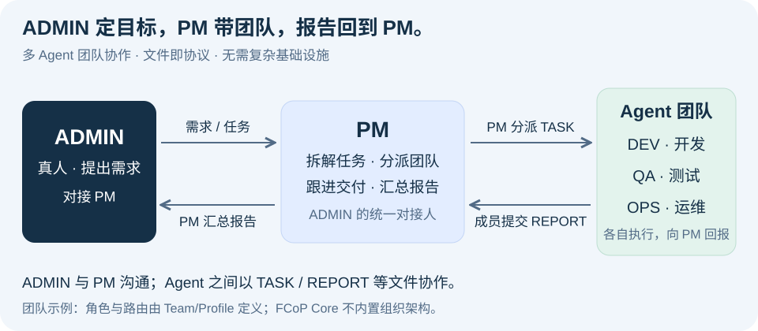
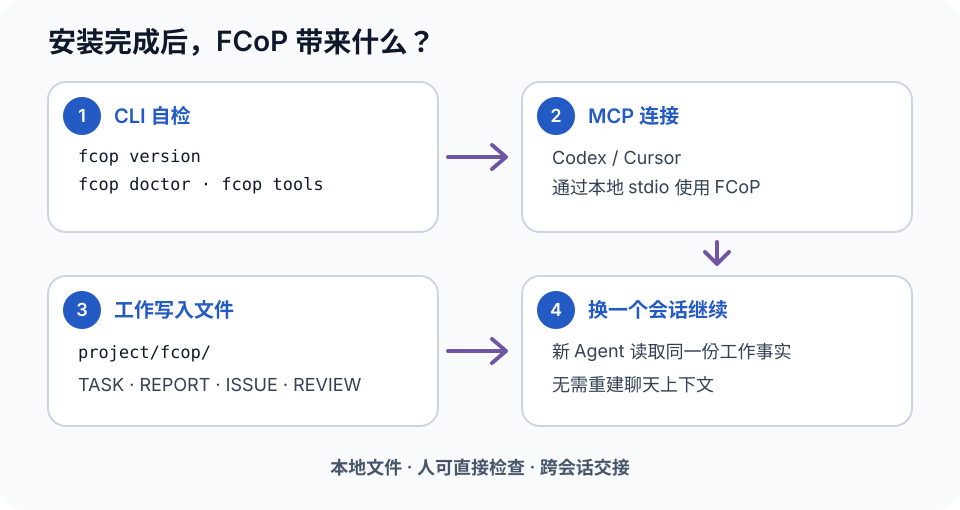
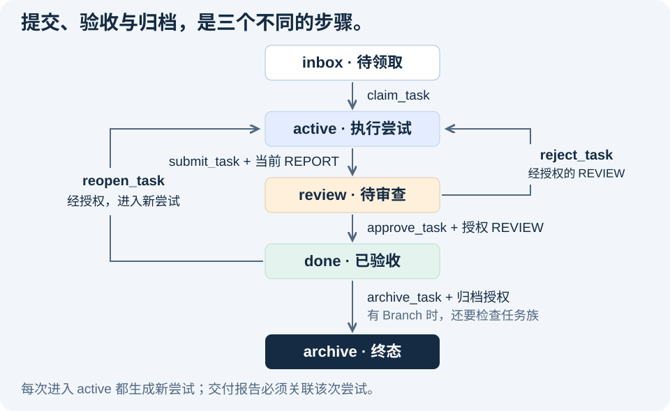

<p align="center"><a href="spec/fcop-4.0-spec.zh.md"></a></p>

# FCoP — File-based Coordination Protocol

**FCoP 4.0 正式稳定规范：[简体中文](spec/fcop-4.0-spec.zh.md) · [English](spec/fcop-4.0-spec.md)**

[项目主页](https://joinwell52-ai.github.io/FCoP/) · [English](README.md) · [简体中文](README.zh.md)

<p>
  <a href="https://pypi.org/project/fcop/4.0.3/"></a>
  <a href="https://pypi.org/project/fcop-mcp/4.0.3/"></a>
  <a href="https://registry.modelcontextprotocol.io/v0/servers/io.github.joinwell52-AI%2Ffcop/versions/4.0.3"></a>
  <a href="https://doi.org/10.5281/zenodo.22746175"></a>
  <a href="LICENSE"></a>
</p>

**发现 FCoP：**[MCPServers 介绍页](https://mcpservers.org/servers/joinwell52-ai/fcop)（[中文版](https://mcpservers.org/zh-CN/servers/joinwell52-ai/fcop)）——第三方目录，帮助用户发现和了解 FCoP。**注册信息：**[官方 MCP Registry](https://registry.modelcontextprotocol.io/v0/servers/io.github.joinwell52-AI%2Ffcop/versions/4.0.3)——查看服务标识、版本与安装包元数据。

<p align="center"><strong>多 Agent 协作 · 文件即协议 · 无需复杂基础设施 · Agent 治理</strong></p>

**FCoP（File-based Coordination Protocol，基于文件的协调协议）用于组织多 Agent、脚本与人类开发者的工作协作。** 任务怎样分派、由谁执行、结果交给谁、怎样审查，都通过文件和协议约定表达。4.0 正式规范将其定义为“文件原生的 Agent 行为治理协议”。

**文件承载协议，路径表达状态，事件记录迁移。** 不要求协作数据库、消息队列或常驻中心控制服务。

**让多个 Agent 像团队一样工作。** 你把目标交给 PM，PM 拆解任务、组织成员执行、收集报告，再把结果汇总给你。任务与交付保存在文件中，换一个会话仍然能查、能接着做。

**[运行最小案例](#team-demo) · [选择安装方式](#installation) · [安装前问答](#before-install)**

<a id="team-workflow"></a>

## 多 Agent 团队怎样协作



**多 Agent 协作是工作协作，不是多 Agent 聊天。** 在这套团队工作流中，只有真人 ADMIN 与 PM 聊天。PM 拆解工作，通过 TASK 文件向 DEV、QA、OPS 分派任务；成员各自执行，通过 REPORT 文件向 PM 回报；最后由 PM 汇总报告，向 ADMIN 汇报。**Agent 之间不聊天，通过文件协作。**

这是由 Team/Profile 定义的组织工作流，不是 FCoP Core 内置的固定层级。TASK 承载任务，REPORT 承载交付，ISSUE 承载问题，REVIEW 记录决定。FCoP 治理这些协作事实与授权边界；宿主 Runtime 负责运行 Agent，应用负责代码集成。Root/Branch 技术模型：[English](docs/architecture.en.md#parallel-work) · [简体中文](docs/architecture.zh.md#parallel-work)。

**一种文件原生的协作方案。** FCoP 为多 Agent 协作提供一种选择，适合希望让任务和证据保留在本地文件、减少额外协调基础设施的团队。它可以与既有 Agent 工具和应用配合使用。

<a id="why-fcop"></a>

## 为什么需要 FCoP？

当编码 Agent、测试 Agent、运维脚本与人类开发者围绕同一个项目工作时，难点不只是“能不能执行”，还包括：谁接了任务、谁负责哪一部分、结果交给谁、是否已经验收，以及换一个会话后怎样接着做。

**FCoP 让这些协作关系成为可读、可检查的文件协议，无需额外部署复杂中央协调服务、消息队列或数据库。**

### 1. 让并发工作有明确归属

多个 Agent 可以各自承担任务、并行执行、提交交付。协议为任务领取、状态迁移和证据提交提供明确约束，参考实现处理这些操作的原子性、幂等与恢复。团队据此减少重复接单和交付混乱；业务代码的并发修改仍需工作空间隔离、版本控制与集成审查。

### 2. 降低协作基础设施成本

在满足实现要求的本地文件系统上，任务、报告和审查记录都保存在项目中，不必另行部署 Redis、RabbitMQ 或协调数据库。Python 工具包有正常的软件依赖，Agent 仍由 Codex、Cursor 等客户端或宿主运行。

### 3. 人和 Agent 都能检查工作现场

用编辑器、终端或文件管理器就能查看任务与证据。目录表达当前状态，文件保存分工、结果和决定；人可以据此审查并通过符合协议的工具进行干预。正式迁移和更正遵守协议，报告与审查记录采用追加方式保留历史。

### 4. 跨语言、跨工具共享同一套约定

Python、Node.js、Go、Rust 或 Shell 都可以读写文件。实现相同协议的 Agent 与脚本，可以围绕同一份任务与报告协作；正确互操作还需要遵守字段、生命周期、授权与原子操作约束。仓库提供 Python 参考实现和 MCP 接入。

### 5. 交接与审计不再依赖找回聊天

任务、报告、问题和审查决定保留在文件中，接手的 Agent 可以继续查阅。适合提交的记录可以纳入 Git，辅助比较和回溯；协议事件记录迁移历史。Git 不承担实时派单，也不保证重现模型输出或外部操作。

**即使 Agent 离开了，工作依然在那里。** 人、工具和接手的 Agent 可以检查同一份协作记录，依据当前证据继续工作。

**来自真实 Agent 团队：** [四 Agent 团队 48 小时现场报告](essays/when-ai-organizes-its-own-work.en.md) · [双 Agent 实操教程](docs/tutorials/tetris-solo-to-duo.en.md) · [中文现场报告](essays/when-ai-organizes-its-own-work.md) · [中文实操教程](docs/tutorials/tetris-solo-to-duo.zh.md)

**[安装前问答](#before-install) · [让 AI 安装](#ai-install) · [手动参考](#manual-setup) · [架构原理五篇](docs/fcop-architecture-series/README.md) · [了解架构](#architecture) · [论文与引用](#research)**

**Stable version: 4.0.3** — [4.0.3 发布页面](https://github.com/joinwell52-AI/FCoP/releases/tag/v4.0.3)。本仓库提供开放协议、`fcop` Python 实现和可选的 `fcop-mcp` 适配器。需要 Python 3.10+；下面的本地示例无需模型 API Key。

<a id="codeflowmu"></a>

## 已有应用：CodeFlowMu

**[CodeFlowMu](https://github.com/joinwell52-AI/CodeflowMu-Distribution) 是 FCoP 的应用实践：一个组织 PM、DEV、QA、OPS 协同工作的多 Agent 开发系统。** 人提出软件目标，PM 负责组织工作，成员执行并交付，系统提供客户端接入、运行与进度查看，把文件协议用于实际团队工作。

FCoP 提供协作协议；CodeFlowMu 提供应用运行体验。你可以单独使用 FCoP，也可以到 [CodeFlowMu 公开介绍与下载页](https://github.com/joinwell52-AI/CodeflowMu-Distribution)了解完整应用。CodeFlowMu 当前以专有软件预览版分发，采用的协议版本与支持范围以其发布说明为准；FCoP 本身按 MIT 开源。

<a id="files-as-protocol"></a>

## 文件怎样成为协议？

**文件有约定的类型、身份、收发方和内容；Agent 依据协议识别属于自己的工作。** 文件名、目录和文件头各有职责，不能混为一谈。

| 载体 | 能读出什么 |
|---|---|
| 文件名 | 文件类型与身份；旧版命名还直接包含收发角色 |
| 所在目录 | 任务当前处于 inbox、active、review、done 或 archive |
| 文件头 | 工作区、发送方、接收方、任务关联与证据身份 |
| Markdown 正文 | 要做什么、交付了什么、问题和审查理由 |

**文件名路由的直观例子（Legacy v1–v3）：** `TASK-20260915-001-PM-to-DEV.md` 表示 PM 发给 DEV 的任务，`REPORT-20260915-001-DEV-to-PM.md` 表示 DEV 交给 PM 的报告。角色明确后，Agent 可以从命名约定识别自己的收件文件。

**4.0 当前实现的实际格式：** 新任务保存在 `fcop/_lifecycle/inbox/TASK-<uuid>.md`，文件头使用 `sender: PM`、`recipient: DEV` 标明收发方。Agent 或调用方读取任务字段，按已确定的角色选择自己的任务；不能仅通过文件名中的 `to-DEV` 查找，因为 v4 文件名不再包含这一段。报告保存在 `fcop/reports/REPORT-<uuid>.md`，通过 `subject_ref` 和 `attempt_id` 关联任务及本次执行。

上面的占位符用于解释布局，不是完整可运行的信封。具体字段以4.0 协议原文（[English](spec/fcop-4.0-spec.md) · [简体中文](spec/fcop-4.0-spec.zh.md)）为准；[当前创建实现](src/fcop/v4/creation.py)与[旧版文件名语法](src/fcop/core/filename.py)可直接核对。

<a id="team-demo"></a>

## 最小示例：PM 派单，成员交付，PM 汇总

运行[完整 Python 示例](examples/team_workflow.py)，模拟 PM、DEV、QA 三个角色围绕“转换文本并检查结果”协作。每个角色使用独立的 `Project` 客户端，从磁盘读取任务与报告。脚本顺序执行，不调用模型，也不需要 API Key。

在仓库根目录运行：

```bash
python -m pip install "fcop==4.0.3"
python examples/team_workflow.py --output ./demo-runs
```

实测输出的四个步骤：

```text
1/4 ADMIN -> PM: goal recorded; PM -> DEV: TASK assigned.
2/4 DEV -> PM: REPORT submitted; task is pending review.
3/4 PM -> QA: TASK assigned; QA -> PM: assessment and REPORT recorded.
4/4 PM -> ADMIN: summary REPORT recorded; formal acceptance remains pending.
```

每次运行会新建 `demo-runs/fcop-team-<随机后缀>/`，并打印工作区与 PM 汇总报告的实际路径。运行结束后，文件仍然保留：

| 路径（相对于该次工作区） | 内容 |
|---|---|
| `fcop/_lifecycle/review/TASK-*.md` | ADMIN→PM、PM→DEV、PM→QA，共 3 份任务 |
| `fcop/reports/REPORT-*.md` | DEV→PM、QA→PM、PM→ADMIN，共 3 份报告 |
| `fcop/reviews/REVIEW-*.md` | QA 对实际文本结果的 1 份 assessment 审查 |

QA 对比实际结果与预期文本，再留下审查证据；PM 读取两份成员报告后汇总。**这次演示到“交付并待验收”为止：三个任务均处于 `review`，没有删除任务，也没有把 assessment 当作正式验收授权。** 正式接受、退回、重开和归档需要已采用的 Profile 与可信宿主授权判断。

<a id="before-install"></a>

## 安装前先弄清楚：四个问题

### 1. 为什么我要安装 FCoP？

当多个 Agent 协作、项目长期演进或跨会话接手时，聊天上下文容易遗漏任务、交付和决定。FCoP 将这些内容保存为项目内可持久化、可检查的工作记录：

- **结构化工作事实**：TASK 记录分工，REPORT 记录交付，ISSUE 记录问题，REVIEW 记录审查与授权决定。
- **跨会话与跨 Agent 交接**：切模型、关窗口或换人后，接手者可以读取现有任务和证据，确认进度与自己的职责，继续工作。
- **交付与验收分开**：执行者提交 REPORT，验收由有资格的主体依据证据作出。记录让“已交付”“待验收”“已接受”可以区分；成果质量仍需要实际审查。

### 2. 安装后，是直接在开发代码里引用吗？

**通常不需要。**

- **普通业务项目**：无需在业务 API、组件或其他业务逻辑中写 `import fcop`。CLI 负责初始化、查看、验证和诊断；Agent 通过 MCP 使用任务与交付工具。
- **集成或平台开发者**：需要把协议操作接入自己的程序时，可以使用 `from fcop import Project`。运行模型与调度 Agent 由客户端或自研 Runtime 负责。

### 3. 应该把它安装到 Codex、Cursor 等 Agent 工具里吗？有什么用？

**是的，这是普通开发者的主要接入方式。** 将 `fcop-mcp` 配置到支持本地 stdio MCP 的客户端后：

- **标准工具集**：Agent 可以访问 49 个工具、12 个资源和 4 个模板。
- **明确的协作动作**：读取项目状态，创建或认领 TASK，提交 REPORT，提出 ISSUE，记录 REVIEW，或推进分支工作。
- **按协议执行**：工具对所支持的操作进行协议校验；客户端负责运行 Agent，已采用的团队规则规定职责。连接 MCP 本身不保证模型始终选择正确工具，也不授予验收权限。

### 4. 安装后立刻能看到什么效果？

- **安装包后**：可以运行 `fcop version`、`fcop doctor`；安装适配器后可用 `fcop tools` 查看工具目录。
- **连接 MCP 后**：在客户端的 MCP 列表中看到 `fcop` 及可用工具、资源。首次配置可能需要重连或重启客户端。
- **初始化项目后**：`<project>/fcop/` 成为协作工作区，任务和报告可以在编辑器中直接查看。
- **执行第一份任务后**：能够看到真实 TASK、REPORT 及相应状态；运行上方最小案例，还能检查 QA 的审查记录和 PM 汇总报告。

像 `dev-team` 中的 PM、DEV、QA、OPS 来自 Team/Profile，不是 FCoP Core 的固定角色。安装包不会自动启动多个 Agent；正式验收需要已采用的 Profile 与可信宿主授权判断。

<a id="installation"></a>

## 选择你的安装方式

| 使用方式 | 安装什么 | 用来做什么 |
|---|---|---|
| 独立命令行 CLI | `fcop` | 初始化、查看、校验、诊断项目 |
| Python 开发引用 | `fcop` | 在自己的程序中调用 `Project` API |
| Agent 工具中的 MCP | `fcop` + `fcop-mcp` | 让 Codex、Cursor 等客户端中的 Agent 使用协作工具 |
| 从源码开发 | 本仓库及 `mcp/` 子项目 | 修改、调试或贡献参考实现 |

### CLI 与 Python：同一个安装包

```bash
python -m pip install "fcop==4.0.3"
fcop version
fcop doctor
fcop init --root ./my-project
fcop status --root ./my-project
```

Python 开发者安装后可以使用 `from fcop import Project`，完整例子见下方[手动参考](#manual-setup)。普通用户不需要把 FCoP 引入业务代码。

### MCP：让 Agent 使用 FCoP

```bash
python -m pip install "fcop==4.0.3" "fcop-mcp==4.0.3"
fcop tools
```

安装后，在支持本地 stdio MCP 的客户端中配置服务。以下是通用 JSON 示例；Codex 的具体配置见[AI 安装说明](docs/ai-install.md)。

```json
{
  "mcpServers": {
    "fcop": {
      "command": "/absolute/path/to/python",
      "args": ["-m", "fcop_mcp"],
      "env": {
        "FCOP_PROJECT_DIR": "/absolute/path/to/my-project"
      }
    }
  }
}
```

把 `command` 换成安装了两个包的 Python 解释器绝对路径，把项目路径换成你的工作目录；Windows 路径可使用正斜杠。重连客户端后，应看到 FCoP 的 49 个工具与 12 个资源。项目初始化与团队规则采用是后续步骤，连接 MCP 不会自动建立 PM 团队或启动其他 Agent。

### 源码安装

```bash
git clone https://github.com/joinwell52-AI/FCoP.git
cd FCoP
python -m pip install -e .
python -m pip install -e ./mcp
fcop version
```

官方安装入口是上述 Python 包；本指南不提供未经核实的 npm 包或 Node SDK。Node.js 等语言可以通过 MCP 客户端接入，或依据协议开发自己的实现。

### 只采用协议，自行实现

无需使用 Python 参考实现，也可以依据双语正式规范（[English](spec/fcop-4.0-spec.md) · [简体中文](spec/fcop-4.0-spec.zh.md)）开发符合协议的工具。仅创建几个目录还不构成符合性实现：字段、状态迁移、证据、授权、幂等与恢复契约都需要满足。使用官方工具时，由 `fcop init` 创建工作区。

<a id="ai-install"></a>

## 让 AI 帮你安装 FCoP

把下面这段话交给 **Cursor Agent、Codex，或其他能运行命令、修改文件的编程 AI**。由 AI 完成安装并检查结果。

```text
请为我当前使用的 AI 编程客户端和项目安装 FCoP，按这份说明操作：
https://github.com/joinwell52-AI/FCoP/blob/main/docs/ai-install.md
环境检查、安装、配置和验收都由你执行。保留我现有的配置和项目状态。完成后告诉我实际验证结果；只在缺少客户端/项目选择，或确实需要授权、重连时让我介入。
```

[AI 安装说明](docs/ai-install.md)包含依赖准备、客户端配置和真实任务验收。客户端确实需要授权或重连时，AI 会告诉你具体一步。下方手动 Python/MCP 步骤保留作参考。

**想先看看交接效果？** 让 AI 运行跨会话交接示例：[English](docs/mcp-handoff.md) · [简体中文](docs/mcp-handoff.zh.md)。创建任务和报告，关闭会话，再从全新 MCP 会话中读回。无需 API Key，运行结果保留在本地，随时可以打开核对。

## macOS（Intel 与 Apple 芯片）：同时安装 CLI 与 MCP

FCoP 支持 Intel Mac 与 Apple Silicon（M1/M2/M3/M4 等），发布包不依赖特定处理器架构，不需要 Rosetta。需要 Python 3.10–3.13。CLI 可直接在终端使用；MCP 还要求 Codex、Cursor 等客户端支持本地 stdio MCP Server。

创建独立环境，并安装同版本线的 Core 与 MCP：

```bash
python3 --version
python3 -m venv ~/.local/share/fcop/venv
~/.local/share/fcop/venv/bin/python -m pip install --upgrade \
  "fcop>=4.0.3,<4.1.0" \
  "fcop-mcp>=4.0.3,<4.1.0"
```

检查 CLI 与已安装的 MCP 工具目录：

```bash
~/.local/share/fcop/venv/bin/fcop version
~/.local/share/fcop/venv/bin/fcop doctor
~/.local/share/fcop/venv/bin/fcop tools --json
```

安装后即可使用下方列出的九条 CLI 命令：`init`、`status`、`inspect`、`validate`、`tools`、`doctor`、`version`、`spec`、`migrate`。使用 CLI 初始化、查看和诊断时，不要求 AI 客户端支持 MCP。

需要 MCP 时，在客户端配置中使用 macOS 绝对路径；配置文件中不要写 `~`：

```json
{
  "mcpServers": {
    "fcop": {
      "command": "/Users/YOUR_NAME/.local/share/fcop/venv/bin/python",
      "args": ["-m", "fcop_mcp"],
      "env": {
        "FCOP_PROJECT_DIR": "/Users/YOUR_NAME/path/to/your-project"
      }
    }
  }
}
```

替换用户名和项目路径后，重启或重新连接 MCP 客户端。`FCOP_PROJECT_DIR` 应指向实际使用 FCoP 的项目，而不是 FCoP 源码仓库。

## 看见最小效果

<a href="docs/mcp-handoff.zh.md"></a>

安装成功不只是“包已经存在”：正式工作会成为人可检查、后续会话可继续读取的文件。点击图片可运行完整的跨会话交接示例。

## 为什么要把工作放到模型之外？

“我完成了”是一句对话。接手的人还需要知道：**执行的是哪项任务、交付了什么、谁审查过、还有什么问题没有解决。** 如果这些事实只留在聊天里，每次交接都要重新拼接上下文。

FCoP 为正式工作建立共同表示：带结构化元数据的 Markdown 文件、稳定身份、明确关系和状态迁移记录。Agent 可以写，人可以直接打开，脚本也可以校验。当前文件系统参考实现无需数据库或消息队列。

| 工作记录 | 保存什么 | 带来什么 |
|---|---|---|
| **TASK** | 任务要求、参与者与生命周期 | 接手者能定位任务，知道它走到了哪一步。 |
| **REPORT** | 某次尝试的交付主张与证据 | 区分“已经提交”与“已经验收”。 |
| **ISSUE** | 问题及其上下文 | 发现问题的会话结束后，阻塞仍有记录。 |
| **REVIEW** | 审查、验收或授权事实 | 可以核对决定针对的是哪项工作、哪份证据。 |

持久化让主张可以检查，主张是否真实仍要核验。FCoP 检查协议关系和状态门槛，审查者判断交付内容；宿主 Runtime 负责执行、调度和权限。

## CLI：本地安装、检查与诊断

**CLI = Setup + Observe + Diagnose；MCP = Work。**

| 命令 | 用途 |
| --- | --- |
| `fcop init` | 初始化 FCoP workspace |
| `fcop status` | 查看 workspace 状态 |
| `fcop inspect` | 检查 TASK / REPORT / ISSUE / REVIEW |
| `fcop validate` | 验证协议结构 |
| `fcop tools` | 查看已安装的 MCP 工具目录 |
| `fcop doctor` | 检查安装、环境和兼容性 |
| `fcop version` | 查看已安装版本 |
| `fcop spec` | 查看规范 / 规则身份 |
| `fcop migrate` | 显式迁移旧 workspace；先检查计划，再决定是否 apply |

### 安装后快速自检 / Install & Verify

在已激活的 Python 3.10+ 环境中执行：

```bash
python -m pip install fcop

fcop version
fcop doctor
fcop init --root ./my-project
fcop status --root ./my-project
fcop validate --root ./my-project
```

需要查看 MCP 工具目录时：

```bash
python -m pip install fcop-mcp

fcop tools
fcop tools merge_branches --json
```

安装完成后，CLI 可在本地、离线环境中初始化、查看、校验和诊断；`doctor` 不联网、不修改 Host 配置。安装包本身可能需要访问包索引，离线安装需预备本地包。
CLI 不负责 create_task、approve、Branch、merge、authorization 等工作操作，实际 Agent 工作由 MCP 或 Python API 承担。
安装 `fcop` 不会自动创建 Host 指令文件；FCoP 4.x 正常 workspace 状态写入范围是 `<project>/fcop/`，不是根目录的 `AGENTS.md`、`CLAUDE.md` 或 Cursor 规则。
保留既有原子初始化暂存及失败证据，不自动清理用户文件。
`migrate` 是单独显式执行的旧工作区迁移，不是升级包时的自动步骤。
`tools` 需要可选 MCP 包，但不会自动安装它或启动服务。

[CLI reference](docs/cli.md) · [中文 CLI 参考](docs/cli.zh.md).

<a id="manual-setup"></a>

<details>
<summary>手动安装、Python/MCP 示例与 CLI 参考（可选）</summary>

4.0.1 已提供 `create_branch`、`inspect_family`、`merge_branches`，
4.0.3 保持 49 个工具及原签名。Core 负责原子合并、持久幂等和恢复。
未就绪家族返回 `family_digest: null`、`merge_ready: false` 及结构化原因；
语义合并结论始终来自调用方。
详见[英文合同与示例](docs/branch-merge.md) / [中文合同](docs/branch-merge.zh.md)。

<a id="try-it"></a>

## 直接试用：创建一次，换个客户端仍能读取

在已激活的 **Python 3.10+ 虚拟环境**中安装公开版本：

```sh
python -m pip install "fcop==4.0.3"
```

保存为 `demo.py`，运行 `python demo.py`。示例写入一份真实 TASK，再通过新的 `Project` 实例读取工作区，并重试原始创建请求。

```python
from pathlib import Path
from tempfile import TemporaryDirectory

from fcop import Project

with TemporaryDirectory(prefix="fcop-demo-") as directory:
    root = Path(directory) / "workspace"
    project = Project(root)
    workspace = project.create_workspace(protocol_version="4.0")
    request = dict(
        workspace_id=workspace["workspace_id"],
        operation_id="demo-create-1",
        sender="ME", recipient="ME",
        subject="Inspect this handoff",
        body="Read the task and check the evidence before accepting delivery.",
    )
    first = project.create_task(**request)

    next_client = Project(root)
    state = next_client.inspect_state(task_id=first["task_id"])
    retry = next_client.create_task(**request)

    assert Path(state["path"]).is_file()
    assert retry["existing"] and retry["task_id"] == first["task_id"]
    print("State read from disk:", state["stage"])
    print("Same task after retry:", retry["task_id"] == first["task_id"])
```

```text
State read from disk: inbox
Same task after retry: True
```

示例结束时会清理临时目录；使用自己的项目目录即可保留文件。以相同 `operation_id` 和规范化载荷重试 `create_task`，会返回原有持久结果；修改载荷则构成冲突。这项幂等保证具体适用于任务创建。

**继续查看 [4.0 接入与版本指南](docs/fcop-4.0-progress.md)**，了解长期工作区、生命周期操作，以及完成任务所需的授权配置。

<a id="mcp"></a>

## 通过 MCP，把同一套操作交给 Agent

可选适配器通过 stdio 为支持 MCP 的客户端提供 FCoP 操作。在同一已激活环境中安装：

```sh
python -m pip install "fcop==4.0.3" "fcop-mcp==4.0.3"
```

在客户端的 MCP 配置中加入以下条目，替换两个绝对路径；Windows 的命令路径以 `.venv/Scripts/fcop-mcp.exe` 结尾。

```json
{
  "mcpServers": {
    "fcop": {
      "command": "/absolute/path/to/.venv/bin/fcop-mcp",
      "env": {"FCOP_PROJECT_DIR": "/absolute/path/to/new-workspace"}
    }
  }
}
```

连接后，用 `init_solo(role_code="ME", protocol_version="4.0")` 初始化**新工作区**。调用 `create_task` 时传入工作区身份，再用 `inspect_task(filename=task_id)` 检查 TASK。安装 MCP 服务本身不会初始化工作区，也不会启动一个 Agent 团队。

**49 tools / 12 resources / 4 resource templates**（49 个工具、12 个资源、4 个资源模板）。适配器将调用交给同一 Python Core。默认初始化不含可信授权 Profile：可以创建、领取、提交任务；验收、退回、重开和归档需要显式采纳 Profile，并由可信宿主注册签发者评估器。在请求里填写一个角色名，不能赋予自己这些权限。

[MCP 工具参考](docs/mcp-tools.md) · [稳定版独立 Python 示例](tests/stable/third-party/python-only/app.py) · [稳定版独立 MCP 示例](tests/stable/third-party/mcp-only/client.py)。完整示例包含教学用 Profile，实际部署需要配置自己的信任策略。

</details>

## 从“提交交付”到“验收通过”

每项 TASK 沿有序生命周期前进。4.0 中，每次进入 `active` 都会生成新的尝试身份，提交时关联该次尝试的 REPORT；验收再把审查与授权绑定到当前证据。

<a href="spec/fcop-4.0-spec.zh.md"></a>

4.0 移除了 `active → done` 的直接跳转。普通任务和 Branch 都可通过 `reopen_task` 重开并生成新尝试；旧 REPORT 不能满足新尝试的提交门槛。完整迁移条件见 [C1–C8 英文规范](spec/fcop-4.0-spec.md) · [中文规范](spec/fcop-4.0-spec.zh.md)。

## 多条有序工作流形成并行，收尾有据可查

多项工作可以同时推进。Branch 是通过 `branch_of` 关联到同一 Root 的普通 TASK；同级 Branch 各自保留尝试、报告和审查。由谁执行、何时调度，交给 Runtime 决定。

<a href="docs/architecture.zh.md#parallel-work"></a>

带 Branch 的 Root 归档前，FCoP 会检查分支完成状态、各自当前 REPORT、匹配的 `family_digest`、汇合 REVIEW，以及独立的 Root 归档授权。分支重开或报告变化会使旧汇合失效。相关写入只在短暂提交时协调，Agent 执行工作期间不持有这把锁。这里汇合的是工作证据，代码集成仍由应用负责。

<a id="architecture"></a>

## 协议核心保持小，系统职责分清楚

另一种实现应该能够保留相同的工作语义，而无需照搬某个 Python 库、MCP 工具清单或产品。

| 层次 | 负责什么 |
|---|---|
| **Core** | C1–C8：身份、信封、生命周期、关系、汇合、授权、创建幂等、原子恢复。 |
| **Specification** | 定义字段、状态迁移、错误与外部可观察行为。 |
| **Conformance** | 用样例、测试向量和行为测试检查实现是否遵守契约。 |
| **Toolkit** | 实现并提供协议操作；本仓库提供 Python 和 MCP 适配器。 |
| **Profile** | 提供组织策略与签发者权限；PM/DEV/QA 等固定角色不是通用 Core 规则。 |
| **Runtime** | 运行模型与工具，管理会话，调度工作并提供界面。 |

**深入了解设计：[English](docs/architecture.en.md) · [简体中文](docs/architecture.zh.md)。** 专页展开说明为什么用文件、为什么分开交付与验收、如何组织并行，以及 FCoP、MCP 和 Runtime 各自承担什么。

**FCoP 架构原理系列 · 五篇全文**（2026-09-10 发布，已按 4.0 修订）：

1. [Agent 没有操作系统：为什么把工作行为外化到文件系统](docs/fcop-architecture-series/01-work-beyond-context.zh.md)
2. [FCoP Core 到底是什么：从工具箱中提炼最小工作内核](docs/fcop-architecture-series/02-minimal-core.zh.md)
3. [FCoP 不等于它的工具：Core、Specification、Toolkit、Profile 与 Runtime 如何分层](docs/fcop-architecture-series/03-architecture-layers.zh.md)
4. [单机多 Agent 为什么不追求高并发：多串行形成并行](docs/fcop-architecture-series/04-parallel-work.zh.md)
5. [从单机到联网：FCoP、MCP、A2A 与 CodeFlowMu 各自负责什么](docs/fcop-architecture-series/05-mcp-a2a-runtime.zh.md)

[系列导读](docs/fcop-architecture-series/README.md) · [五篇全文合集](docs/fcop-architecture-series/collected.zh.md)

4.0.3 通过包内和 MCP resources 分发**九个双语规则模块**，保留严格清单、`sequential`、`parallel` 及独立的 `repository-development` 装配。**安装 → 连接 MCP → 初始化工作区 → 使用 FCoP。** FCoP 拥有 `<project>/fcop/`，不拥有项目根 Host 指令文件。Host 投影、采用、部署与回滚已退役；`redeploy_rules` 仅支持 Legacy v1–v3，对 v4 零写入拒绝。已有用户文件保持不变。[Rule resources / 规则资源](docs/rule-resources.md)。

<a id="research"></a>

## 论文、证据与引用

以下入口直接可见；文章合集按需阅读。

| 资料 | 阅读或引用 |
|---|---|
| **架构白皮书** | [English](essays/from-coordination-to-governance.en.md) · [中文](essays/from-coordination-to-governance.md) — 历史研究背景 |
| **3.2.5 归档** | [Zenodo DOI 10.5281/zenodo.20457285](https://doi.org/10.5281/zenodo.20457285) · [OSF DOI 10.17605/OSF.IO/92NWM](https://doi.org/10.17605/OSF.IO/92NWM) |
| **2026 年 4 月研究快照** | [Zenodo DOI 10.5281/zenodo.19886036](https://doi.org/10.5281/zenodo.19886036) · [引用元数据](CITATION.cff) |
| **17 篇现场报告与设计文章** | [英文目录](essays/README.md) · [中文目录](essays/README.zh.md)，保留原始发布和证据链接 |

引用时请选择与研究版本相符的归档。以上历史 DOI 不代表 4.0.0；讨论当前行为请同时指向版本化发布与规范。

## 三个仓库，三个入口

| 仓库 | 定位 |
|---|---|
| **[FCoP](https://github.com/joinwell52-AI/FCoP)** | **主推开源旗舰库：** 协议、Python 库与 MCP 服务；使用、实现和贡献协作层从这里开始。 |
| **[joinwell52](https://github.com/joinwell52-AI/joinwell52)** | **研究传播入口：** AI Agent、数字员工与工程研究。 |
| **[CodeflowMu-Distribution](https://github.com/joinwell52-AI/CodeflowMu-Distribution)** | **产品体验入口：** 打包应用与[下载](https://github.com/joinwell52-AI/CodeflowMu-Distribution/releases)；支持的版本以产品发布说明为准。 |

FCoP 可按 [MIT 许可证](LICENSE)独立使用；产品分发有自己的许可和发布节奏。

**如果你想持续使用或研究这套协议，欢迎 Star FCoP 收藏。** 也欢迎通过 [Issues](https://github.com/joinwell52-AI/FCoP/issues) 或 Pull Request 提供可复现的接入问题、宿主集成示例和协议行为测试。

## 版本与已有安装

- **4.0.0：** [发布说明](docs/releases/4.0.0.md) · [变更日志](CHANGELOG.md) · [架构决策](adr/README.md)。本次发布经过已记录的 `FCOP_4_STABLE_RELEASE_READY` 门槛；使用者安装上方稳定版 PyPI 包即可。
- **Release candidate: 4.0.0rc1** — 作为[历史预发布版本](https://github.com/joinwell52-AI/FCoP/releases/tag/v4.0.0rc1)保留。
- **3.x 工作区：** 显式迁移前保持原有语义。[旧版英文规范](spec/fcop-v3-spec.md) · [中文](spec/fcop-v3-spec.zh.md)。`finish_task` 和历史工具仍可被发现，但会拒绝 v4 工作区。
- **旧版安装提示词：** [EN](src/fcop/rules/_data/agent-install-prompt.en.md) · [ZH](src/fcop/rules/_data/agent-install-prompt.zh.md)，也可通过 `fcop://prompt/install` 读取。这些是历史安装材料，当前版本请使用上面的 4.0 指南。
