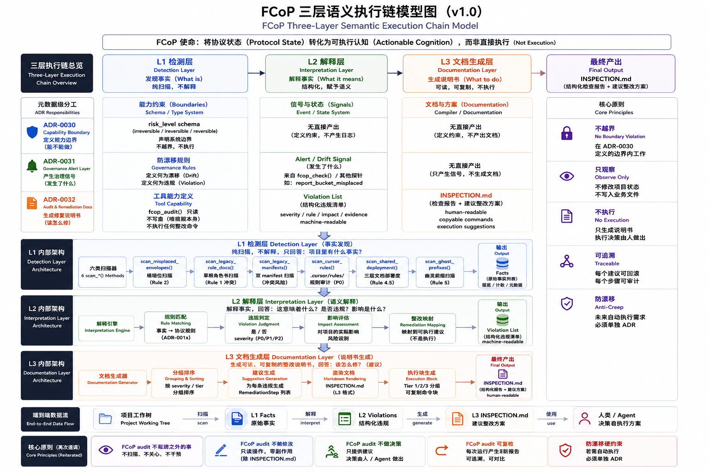

# FCoP Architecture Decision Records (ADR)

本目录保存 FCoP 协议和参考实现（`fcop`、`fcop-mcp`）演进过程中的**架构决策记录**。

## 什么是 ADR

ADR（Architecture Decision Record）是**一次性的决策快照**：

- 记录**做出决策的当下**的背景、约束、可选方案、选定方案、代价
- 一旦发出，**不再修改内容**，只追加 `Status` 字段变化（Proposed → Accepted → Deprecated → Superseded by ADR-NNNN）
- 通过持续累积形成**决策史**，让后来者不用再把同样的讨论走一遍

和 spec（规范）的区别：

| | spec（`private/fcop-repo/spec/`）| ADR（`private/fcop-repo/adr/`） |
|---|---|---|
| 回答什么 | "FCoP 是什么" | "我们为什么这么做" |
| 时间属性 | 永远描述最新状态 | 记录某个历史决策点 |
| 修改策略 | 持续更新、bump 版本号 | 不改内容，只改 Status |
| 读者 | 协议使用者、实现者 | 贡献者、未来的自己 |

## 命名约定

```
ADR-NNNN-kebab-case-title.md
```

- `NNNN`：四位数字，从 `0001` 开始
- `kebab-case-title`：简短描述性标题
- 一份 ADR = 一个主题，别塞两件事

示例：

- `ADR-0001-library-api.md`
- `ADR-0002-package-split-and-migration.md`
- `ADR-0003-mcp-transport-choice.md`（未来可能）

## 文档结构模板

每份 ADR 都遵守以下结构（按需可裁剪，但头两节必须有）：

```markdown
# ADR-NNNN: 决策标题

- **Status**: Proposed | Accepted | Deprecated | Superseded by ADR-NNNN
- **Date**: YYYY-MM-DD
- **Deciders**: 参与决策的角色（ADMIN / PM / DEV / …）
- **Related**: 相关 ADR 或 spec 章节

## Context

背景、问题、约束。**不要**写解决方案。读者读完 Context 应该能自己想清楚"确实得做点什么"。

## Decision

一句话决策。之后是决策的细节展开。

## Design Details

设计细节：API 签名、数据结构、算法、流程图等。

## Non-Goals

明确"这份决策**不**涵盖"什么——避免读者过度解读。

## Alternatives Considered

考虑过但没选的方案，以及**为什么没选**。

## Consequences

### Positive

- 好处 1
- 好处 2

### Negative

- 代价 1
- 代价 2

### Neutral

- 需要跟进的事 1
- 需要跟进的事 2

## Timeline（可选）

实施时间表。
```

## 当前 ADR 索引

| 编号 | 标题 | Status | 日期 |
|---|---|---|---|
| [ADR-0001](./ADR-0001-library-api.md) | `fcop` Library API（`import fcop`）| Accepted | 2026-04-22 |
| [ADR-0002](./ADR-0002-package-split-and-migration.md) | Package Split（`fcop` + `fcop-mcp`）& 0.5 → 0.6 Migration | Accepted | 2026-04-22 |
| [ADR-0003](./ADR-0003-stability-charter.md) | Pre-1.0 Stability Charter | Accepted | 2026-04-23 |
| [ADR-0004](./ADR-0004-time-is-filesystem.md) | 时间由文件系统提供，不由 Frontmatter 提供 | Accepted | 2026-04-23 |
| [ADR-0005](./ADR-0005-agent-output-layering.md) | Agent 产出物分层（Observation Output Lifecycle） | Accepted | 2026-04-23 |
| [ADR-0006](./ADR-0006-host-neutral-rule-distribution.md) | 协议规则的宿主中立分发与升级 | Accepted | 2026-04-25 |
| [ADR-0007](./ADR-0007-fcop-1.0-protocol-freeze-charter.md) | FCoP 1.0 Protocol Freeze Charter（5 字段进 1.1.0 路线） | **Superseded by ADR-0015** | 2026-05-09 |
| [ADR-0008](./ADR-0008-json-schema-as-machine-readable-spec.md) | JSON Schema as Machine-Readable Spec（5 类 schema 视角） | **Superseded by ADR-0016** | 2026-05-09 |
| [ADR-0009](./ADR-0009-review-file-type-and-grammar.md) | `REVIEW-*.md` File Type & Filename Grammar（含 needs_human / human_approval 紧耦合）| **Superseded by ADR-0017** | 2026-05-09 |
| [ADR-0010](./ADR-0010-agent-layer-field.md) | `Agent.layer` field（单字段视角） | **Superseded by ADR-0020** | 2026-05-09 |
| [ADR-0011](./ADR-0011-task-risk-level-field.md) | `Task.risk_level` field（Issue #2 Field 2） | **Deferred to v1.1+** | 2026-05-09 |
| [ADR-0012](./ADR-0012-review-decision-needs-human.md) | `Review.decision = needs_human` enum extension（Issue #2 Field 3） | **Deferred to v1.2+** | 2026-05-09 |
| [ADR-0013](./ADR-0013-review-human-approval.md) | `Review.human_approval` sub-structure（Issue #2 Field 4） | **Deferred to v1.2+** | 2026-05-09 |
| [ADR-0014](./ADR-0014-skill-tools-risk-metadata.md) | `Skill.tools[]` risk metadata（Issue #2 Field 5） | **Deferred to v1.1+** | 2026-05-09 |
| **[ADR-0015](./ADR-0015-fcop-1.0-ai-os-protocol-charter.md)** | **FCoP 1.0 AI OS Protocol Charter**（取代 ADR-0007；7 核心抽象 + POSIX 层定位）| **Accepted** | 2026-05-09 |
| [ADR-0016](./ADR-0016-json-schema-for-7-abstractions.md) | JSON Schema for 7 Core Abstractions（取代 ADR-0008） | Accepted | 2026-05-09 |
| [ADR-0017](./ADR-0017-review-file-type-minimal.md) | REVIEW File Type — Minimal v1.0 Surface（取代 ADR-0009） | Accepted | 2026-05-09 |
| [ADR-0018](./ADR-0018-event-model.md) | Event Model（v1.0 新增 · 协议本体最关键缺失） | Accepted | 2026-05-09 |
| [ADR-0019](./ADR-0019-failure-and-recovery-semantics.md) | Failure & Recovery Semantics（v1.0 新增 · 协议本体次关键缺失） | Accepted | 2026-05-09 |
| [ADR-0020](./ADR-0020-agent-boundary-and-capability.md) | Agent Boundary & Capability（取代 ADR-0010） | Accepted | 2026-05-09 |
| [ADR-0021](./ADR-0021-encoding-abstraction.md) | Encoding Abstraction — Markdown as Reference Encoding（v1.0 新增） | Accepted | 2026-05-09 |
| **[ADR-0022](./ADR-0022-workspace-directory-convention.md)** | **Workspace Directory Convention — `docs/agents/` → `fcop/`**（v1.0 breaking change，配自动迁移工具） | **Accepted** | 2026-05-09 |
| [ADR-0023](./ADR-0023-agent-layer-governance-field.md) | \Agent.layer\ — Governance Hierarchy Field（v1.1 新增） | Accepted | 2026-05-10 |
| [ADR-0024](./ADR-0024-task-risk-level.md) | \Task.risk_level\ — Operation Risk Classification（v1.1 新增） | Accepted | 2026-05-10 |
| [ADR-0025](./ADR-0025-review-needs-human.md) | \Review.decision = needs_human\ 枚举扩展（v1.1 新增） | Accepted | 2026-05-10 |
| [ADR-0026](./ADR-0026-review-human-approval.md) | \Review.human_approval\ — 人工审批子结构（v1.1 新增） | Accepted | 2026-05-10 |
| [ADR-0027](./ADR-0027-skill-tools-risk-metadata.md) | \Skill.tools[]\ — MCP 工具风险元数据（v1.1 新增） | Accepted | 2026-05-10 |
| [ADR-0028](./ADR-0028-auto-risk-assessment.md) | 自动风险评估 — write_task() 风险推断与传导机制（v1.2 规划） | **Proposed** | 2026-05-11 |
| **[ADR-0029](./ADR-0029-fcop-behavior-governance-charter.md)** | **FCoP 核心哲学宪章 v2.0 — 行为治理协议（去任务化 + 三支柱）** | **Accepted** | 2026-05-11 |
| [ADR-0030-bis](./ADR-0030-bis-capability-enforcement-accountability-model.md) | Capability Enforcement — Accountability Model（双层执行 + 审计补偿） | Accepted | 2026-05-11 |
| [ADR-0030](./ADR-0030-capability-governance-boundary.md) | Capability Governance Boundary — 工具调用风险边界（三层分类） | **Accepted** | 2026-05-11 |
| **[ADR-0031](./ADR-0031-governance-alert-layer.md)** | **Governance Alert Layer（GAL）— 治理漂移检测与 ADMIN 告警（FCoP-Rule-G1 + 三域模型）** | **Accepted** | 2026-05-11 |
| **[ADR-0032](./ADR-0032-fcop-audit-protocol-inspection.md)** | **fcop_audit() — 协议状态编译器（三场景体检 / Structured Findings + Suggested Plan）** | **Accepted** | 2026-05-12 |
| **[ADR-0033](./ADR-0033-trailing-slug-filename-adoption.md)** | **Trailing slug filename adoption — TASK·REPORT·ISSUE 文件名 trailing-slug 收编（MINOR additive · codeflow 现场涌现协议化）** | **Accepted** | 2026-05-12 |
| **[ADR-0034](./ADR-0034-fcop-internal-external-document-convention.md)** | **FCoP internal / external document convention — `fcop/internal/` vs `docs/` + `essays/` soft convention（Rule 4.6 · `internal-only` 声明 v1 · v2.0 "两图对偶"纪元）** | **Implemented** | 2026-05-13 |
| **[ADR-0035](./ADR-0035-lifecycle-directory-and-tool-layers.md)** | **FCoP 3.0 State Ontology — Lifecycle directory structure（path = NOW truth · semantics frozen per RFC 2026-05-21）** | **Accepted & Frozen** | 2026-05-21 |
| **[ADR-0036](./ADR-0036-lifecycle-event-layer.md)** | **FCoP 3.0 Event Layer — `transitions:` 履历（events = PAST audit-only · write-then-rename atomic pattern · Rule E/F/G）** | **Accepted** | 2026-05-21 |
| **[ADR-0037](./ADR-0037-custody-handoff-semantics.md)** | ~~Custody & Handoff~~ — **Rejected by RFC 2026-05-21**（custody 不能作为协议层；思想保留为 [NOTE-custody-is-not-a-layer.md](./NOTE-custody-is-not-a-layer.md)） | **Withdrawn** | 2026-05-21 |
| **[ADR-0038](./ADR-0038-fcop-boundary-charter.md)** | **FCoP Boundary Charter — Meta-charter: Agent POSIX not Agent OS · 五问过滤器 + §5.1 豁免条款 · 所有未来 ADR 必经审查** | **Accepted** | 2026-05-21 |
| **[ADR-0039](./ADR-0039-fcop-freeze-discipline-and-runtime-absorption-era.md)** | **Freeze Discipline & Runtime Absorption Era — 协议设计期结束，进入 runtime 吸收期；任何新协议机制必须由 runtime 痛点驱动（per §5.1 E1/E2/E3）；含 4 题 pre-flight checklist + 观察 backlog 机制** | **Accepted** | 2026-05-21 |
| [NOTE-custody-is-not-a-layer](./NOTE-custody-is-not-a-layer.md) | Semantic Note · Custody = interpretation of state + events，不是协议层（替代撤销的 ADR-0037 思想） | Informative | 2026-05-21 |

---

## 核心规范参考

| 文档 | 说明 |
|---|---|
| **[FCoP 三层语义执行链模型](./FCoP-semantic-execution-chain.md)** | ADR-0030/0031/0032 合成的完整协议语义链——Schema Layer · Signal Layer · Compiler Layer |

### FCoP 三层语义执行链模型图

[](./FCoP-semantic-execution-chain.md)

> Schema Layer（ADR-0030）→ Signal Layer（ADR-0031）→ Compiler Layer（ADR-0032）
> 三层共同构成 FCoP 的完整协议语义执行闭环。点击图片查看完整文字描述。

---

## 工作流

1. 遇到**需要讨论的架构/协议决策**时，起草一份 ADR（`Status: Proposed`）
2. 在 issue / PR / 任务文件里讨论，吸收意见后更新 ADR 内容
3. 决策敲定后，把 `Status` 改为 `Accepted`，合入主干
4. 后续如果决策被推翻，**不要删 ADR**，把 Status 改为 `Superseded by ADR-XXXX`，保留历史

## 参考

- Michael Nygard, "Documenting Architecture Decisions" (2011)
- ADR GitHub org: <https://adr.github.io/>
