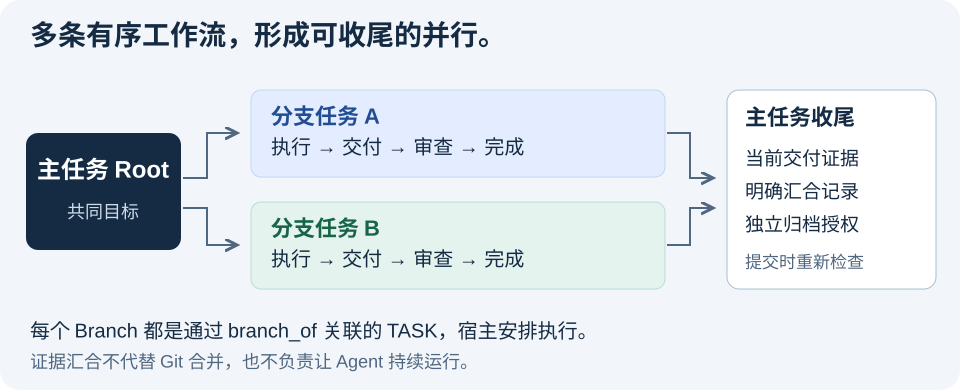

# 单机多 Agent 为什么不追求高并发：从共享写入到“多串行形成并行”

[系列目录](README.md) · 第 4 / 5 篇 · [上一篇](03-architecture-layers.zh.md) · [下一篇](05-mcp-a2a-runtime.zh.md) · [五篇合集](collected.zh.md)

原稿：2026-09-01 · 发布修订：2026-09-10 · 对齐 FCoP 4.0.0

> 本文解释架构取舍；字段、迁移与错误以 [4.0 契约](../../spec/fcop-4.0-spec.zh.md)为准，版本状态见 [4.0.0 发布说明](https://github.com/joinwell52-AI/FCoP/releases/tag/v4.0.0)。原始设计建议已按当前版本修订；示意流程不等于可直接执行的 API 示例。

多 Agent 系统一谈“并行”，很容易马上联想到：

```text
高并发
并发写
锁
事务
队列
分布式调度
```

但如果目标是一台工作机上的几个或十几个 Agent，这往往是把问题带错了方向。

FCoP 面向的不是一个每秒处理几十万事件的数据中心。

它面对的是：

```text
一个正式任务
多个不同职责 Agent
多个并行工作单元
最终形成一个可追踪结果
```

这两类系统需要的并行模型并不一样。

FCoP 更适合的原则是：

> **多串行形成并行。**

---

## 一、Windows 能并发，不等于 FCoP 应该追求共享写高并发

Windows 和 Linux 都能运行大量进程和线程。

文件系统也支持大量 I/O。

所以“单机”当然不等于“不支持并发”。

真正的问题是：

> **FCoP 是否应该把大量 Agent 同时修改同一个正式工作状态，当作主要工作模型？**

答案应该是否定的。

假设：

```text
TASK-001
```

同时被多个 Agent 改写：

```text
DEV-01 ─┐
DEV-02 ─┼→ TASK-001 / canonical result
QA     ─┤
OPS    ─┘
```

马上会出现：

```text
谁的写入最后生效？
另一个 Agent 基于哪个版本工作？
REVIEW 对应哪个结果？
ISSUE 是针对旧结果还是新结果？
系统崩溃时应该恢复哪一个版本？
```

这不是简单增加一个 lock 就能彻底解决的问题。

因为它同时牵涉：

> 工作身份、责任、版本、审查和收敛。

---

## 二、真正危险的是 shared mutable authority

多 Agent 协作最危险的不是：

> 同时运行。

而是：

> **同时修改同一个权威事实。**

这可以概括成：

```text
Parallel Execution
可以分开组织，但仍需资源与权限边界

Shared Mutable Authority
需要额外处理争用、证据与提交一致性
```

如果多个 Agent 同时执行不同工作：

```text
TASK-A → Agent A
TASK-B → Agent B
TASK-C → Agent C
```

可以分别组织；是否存在代码文件、外部资源或权限冲突，仍需 Runtime 和团队处理。

每个工作对象有自己的工作归属、状态和交付。TASK 分开不自动隔离代码工作区，必要时还应使用独立 checkout、worktree 或其他资源隔离。

真正应该避免的是：

```text
Agent A
Agent B
Agent C
    ↓
共同争抢一个 NOW
```

因此 FCoP 的并发原则应该围绕：

> **独立工作串。**

---

## 三、多个串行工作串可以天然形成并行

例如一个 Root TASK：

```text
发布 Windows 安装版
```

可能拆成：

```text
Root TASK
├─ 安装器构建
├─ 安装说明
├─ 升级验证
└─ 安全检查
```

每一个 Branch 都是独立正式 TASK：

```text
Branch A
TASK → work → REPORT

Branch B
TASK → work → REPORT

Branch C
TASK → work → REPORT
```

每条 Branch 内部保持清楚的单一工作序列。

但多条 Branch 可以同时推进。

于是得到：

```text
多个串行流
       ↓
整体并行
```

这就是：

> **多串行形成并行。**

---

## 四、为什么 Branch 比“共享文件一起改”更适合 Agent？

因为 Branch 把几个关键问题一起解决了。

### 1. 工作归属明确

```text
Branch A → Agent A
Branch B → Agent B
```

系统很容易回答：

> 谁负责什么？

### 2. 状态独立

一个 Branch 卡住，不会直接覆盖另一个 Branch 的正式状态。

### 3. 交付独立

每个 Branch 可以产生自己的 REPORT。

### 4. 问题独立

ISSUE 可以明确挂在某一条工作线上。

### 5. 恢复独立

某个 Agent 会话丢失时，Runtime 可以依据该 Branch 的外部工作事实安排恢复；FCoP 不会自动重新启动该 Agent。

这种模式比多个 Agent 同时编辑一个“超级任务文档”清楚得多。

---

## 五、Branch 应该是普通 TASK，而不是第二套任务系统

Branch 如果成为一种全新的对象，会快速增加协议复杂度。

更好的设计是：

```text
Branch
=
普通 TASK
+
branch_of
```

例如：

```yaml
branch_of: "<Root 的稳定 task_id>"
```

这是关系字段示意，省略了合法 TASK 的其他必需字段。实际创建通过 `create_task(..., branch_of=root_task_id)`，Branch 同样需要工作区身份与创建幂等参数。

这样 Branch 仍然：

```text
进入正常生命周期
拥有自己的 Actor
拥有自己的 REPORT
可以产生 ISSUE
可以接受 REVIEW
```

协议只新增关系语义，而不是复制一套生命周期。

这正是 Core 应该追求的扩展方式：

> **新增最小关系，不新增第二世界。**

---

## 六、为什么不建议 Branch 再无限 Branch？

如果允许：

```text
Root
└─ A
   └─ A1
      └─ A1-1
         └─ ...
```

单机多 Agent 工作很快会变成一棵难以理解的动态树。

问题不只是数量。

更严重的是：

```text
责任向下扩散
审查关系复杂
最终收敛困难
根任务越来越难解释
```

因此 FCoP 4.0 明确采用扁平 sibling-only Branch：

```text
Root
├─ A
├─ B
├─ C
└─ D
```

Branch 不能再成为 Branch Root，否则拒绝为 `BRANCH_DEPTH_EXCEEDED`。需要进一步拆解时，可以在允许创建的 Root 下形成新的同级 Branch；已归档的 Root 不接受新 Branch。新增 Branch 后也必须重新评估原有汇合证据。

这不是“理论上绝对不能嵌套”，而是：

> **单机正式工作优先控制可理解性，而不是追求无限表达能力。**

---

## 七、并行之后必须收敛

Branch 的存在不能让系统长期保持多个“最终答案”。

临时分歧是允许的：

```text
Branch A → Result A
Branch B → Result B
Branch C → Result C
```

但正式 Root 工作最终必须能够回答：

> 当前权威结果是什么？

所以：

> **允许执行期间存在多个交付；带 Branch 的 Root 在正式归档前必须完成可核验的汇合。**

这是 Branch 模型真正重要的另一半。

没有显式收敛，Branch 只是任务拆分。

有了收敛，才形成一个完整的多 Agent 工作模式。

---

## 八、收敛语义与 Merge 工具不是一回事

这一点非常重要。

Core 可以规定：

> 多个 Branch 最终可以形成一个正式收敛结果。

但 Core 不要求复制某个 Git Merge Toolkit 的算法。以下阶段只是工具设计示意，并非 4.0 Base 生命周期：

```text
PREPARE
BUILD
VERIFY
COMMIT
```

也不必规定每一个实现必须有相同的：

```text
checkpoint
candidate
AlreadyCommitted
```

这些更像可靠 Merge Toolkit。

Core 需要稳定的是：

```text
哪些 Branch 被纳入
基于哪些工作产物
谁作出了收敛决定
当前工作结果与证据如何关联
原有来源关系不能被抹掉
```

4.0 将它落实为明确条件：Root 位于 done；所有 Branch 位于 done 或 archive，且各自经过 T3/T4；每个 Branch 当前 attempt 有唯一有效 REPORT；convergence REVIEW 精确覆盖这些报告；`family_digest` 匹配提交时重算值；另有绑定当前摘要的 Root 归档授权。

汇合记录不能替代归档授权。分支重开、新尝试或当前报告改变，会使旧汇合失效。这里汇合的是工作证据，并不自动生成或合并代码。



相关边界见 [4.0 规范 §6、§7、§9](../../spec/fcop-4.0-spec.zh.md)。

---

## 九、并发复杂度可以计算，但不应该写死成 Core 公式

随着 Branch 增多，可以计算：

```text
active branch count
scope overlap
unresolved issues
merge surface
```

这些数据很有用。

但一个具体公式：

```text
score = aB + bO + cU ...
```

本质上属于：

> Policy / Toolkit。

因为真实使用以后，权重和阈值可能变化。

协议不应该因为某次实验调了一个阈值就升级 Core。

Core 只需要确保：

> 必要事实可以被外化和计算。

至于如何评分，是上层策略。

---

## 十、同一治理对象应该倾向单写者

FCoP 不需要承诺全局只有一个 Writer。

相反，它允许多个工作串同时存在。

但对于同一个正式治理对象，更合理的原则是：

> **同一正式对象的一次协议提交应具有明确、可校验的边界。**

“一个任务当前由谁执行”是组织和调度约定，不等于 Core 内置单一 owner 权限表。4.0 使用合法迁移、可信授权与提交协调保证正式状态，不能仅凭执行者标签判断写入合法。

例如：

```text
Branch A
→ Agent A 是当前正式执行者
```

其他 Agent 可以：

```text
观察
提出 ISSUE
提交 REVIEW
创建关联工作
```

但不应该无约束地同时改写 Branch A 的当前权威状态。

这使并行建立在：

```text
多个独立单写者工作串
```

之上，而不是：

```text
一个高争用共享对象
```

同一 Root family 中，涉及 Root/Branch 状态、当前 REPORT、汇合和归档条件的操作共享短暂线性化边界。取得边界后必须重读当前事实再提交；它不锁住 Agent 的整段执行时间，也不串行化无关的独立 TASK（[规范 F4.9.5](../../spec/fcop-4.0-spec.zh.md)）。

---

## 十一、这是一种更像真实组织的并行

真实团队也不是：

> 所有人同时在一张任务单上改最终结论。

更常见的是：

```text
工程负责工程
测试负责测试
运维负责部署
管理者负责协调
```

每个人形成自己的工作产物。

最后通过正式交付和审查形成收敛。

数字员工没有必要为了显得“并行”而采用一种比真实组织更难治理的共享写模式。

FCoP 的 Branch 反而更接近：

> **职责分离后的并行工作。**

---

## 十二、FCoP 为什么不需要追求极高 TPS？

数字员工的工作频率和数据系统不同。

一个 Agent 可能连续工作几十分钟，最后才产生一次 REPORT。

一个 REVIEW 可能需要重新执行测试。

一个 ISSUE 可能挂数小时才解决。

所以真正重要的指标不是：

```text
每秒创建多少 TASK
```

而是：

```text
有没有重复 TASK？
有没有丢 REPORT？
谁负责？
冲突有没有显式留下？
失败后能不能恢复？
最终结果来自哪些 Branch？
```

工作系统关注的是：

> **责任和状态质量。**

而不是单纯事务数量。

---

## 十三、如果真的需要高并发怎么办？

这也是边界问题。

如果未来场景变成：

```text
10000 agents
100000 events/sec
跨数据中心
大量共享状态
```

就需要重新评估存储、吞吐、通信与故障模型。下面的数字是负载假设，不是本项目已完成的基准；可考虑：

```text
数据库
消息队列
分布式协调
专用 Runtime
```

FCoP 的工作语义可以作为新架构的设计输入；但当前 4.0 Base 不能直接宣称支持这类跨数据中心负载，其他编码或一致性层仍需独立实现和验证。

但它没有必要亲自实现整个高并发数据平面。

这和操作系统、数据库、网络协议之间的分工一样：

> 每一层只解决自己最擅长的问题。

---

## 结语：并行不是同时修改同一个世界

多 Agent 系统真正需要避免的，是把：

> “并行”

误解为：

> “所有 Agent 同时修改同一个共享权威状态。”

对于单机数字员工，更稳健的方式是：

```text
独立工作对象
+
明确责任
+
各自串行推进
+
整体并行
+
显式收敛
```

也就是：

> **多串行形成并行。**

FCoP 的 Branch 价值不在于模仿 Git。

它更深层的意义是：

> **用多个外化、可归属、可恢复的独立工作串，替代不可治理的共享可变状态。**

这样，单机多 Agent 不需要先变成一个高并发分布式系统，也可以获得真正有用的并行能力。

---

## 实现与延伸阅读

- [4.0 规范](../../spec/fcop-4.0-spec.zh.md)：核对 C1–C8、授权、幂等与恢复条款。
- [Python v4 实现](../../src/fcop/v4/)与[符合性测试](../../tests/conformance/)：核对契约的具体落点。
- [快速试用](../../README.zh.md#try-it) · [MCP 接入](../../README.zh.md#mcp) · [架构概览](../architecture.zh.md)。

[系列目录](README.md) · 第 4 / 5 篇 · [上一篇](03-architecture-layers.zh.md) · [下一篇](05-mcp-a2a-runtime.zh.md) · [五篇合集](collected.zh.md)
