# 【免费开源】【多 agent 实战】【教你怎么指挥 agent】：FCOP-MCP 让 AI 团队有纪律

> 装一个免费开源的 MCP 工具（`fcop-mcp`），在 Cursor 里让 AI 团队有纪律。你只需文本语言，AI 自己把任务、报告、问题、归档都写成 markdown 文件。教程让 AI 写一个模仿贪吃蛇的小游戏，从 solo 模式到 team 模式，最后还有真实"彩蛋"，你会发现多 agent 协作其实没那么复杂。

## 前言：单 agent 的瓶颈，每个用 AI 的人正在经历

你在用 Cursor 或其他模型应用，肯定已经撞到过这些事：一个 chat 拖到几百条以后，AI 开始忘前面说过什么；同一个问题问到第三遍，它还能给你三个不一样的方案；你不敢关掉这个会话，因为聊天记录就是项目唯一的记忆。

这不是错觉，是单 agent 模式的硬伤——一个 agent 又查又写又改又汇总，上下文越塞越长，模型开始降智。继续往里加 prompt 没用，问题不会消失，只会卡住，卡住。

还有一层更深层的痛点：**单 agent 没法融入团队，像个"外来户"**。它的工作模式跟咱们真实的开发流程——领任务、写代码、提 PR、领导审——是脱节的。它像个在旁边碎碎念的顾问，而不是能直接进组干活、守规矩的正式员工。

办法其实只有一个：**把记忆从对话搬到文件系统**，让多个 agent 各管一段，每段都按团队规矩走。但市面上很难找到一个轻量、实用、又能让多 agent 协作有规矩的工具——这就是 fcop-mcp 想填的那块空白。

## 抛开细节，我们的实战教程就讲三件事

#### 一、记忆不是消耗品，不该留在对话里

**痛点**：靠对话（context）来记事，本质上是在透支 agent 的带宽。对话越长，智能越低。这就像让员工把所有代码和需求全背在脑子里——记忆爆炸、逻辑崩盘是必然的物理结果，不是概率问题。

**解决**：必须把"记忆"从飘忽不定的对话中卸载下来，固化成文件。文件就是 agent 的外部硬盘，对话只负责处理当下的逻辑。

#### 二、身份转变：从"写代码的"变成"带队伍的"

**立场**：AI 时代，你的价值不再是亲手去敲每一行代码（码农），而是作为指挥者（admin）。

**现状**：单 agent 让你不得不像个监工一样盯着每一个标点符号，这还是在干体力活。

**愿景**：你需要的是一帮数字员工——你下指令，它们在各自的"抽屉"里各司其职。你管的是目标和结果，而不是替它去记那些繁杂的中间变量。

#### 三、文件是唯一的"工程抓手"

**机制**：每写一份文件，本质上都是在做资产数字化。

**管理与追溯**：为什么一定要基于文件（FCoP）？因为文件可存盘、可对比、可回滚。

**审计与责任**：哪个环节出错了？翻开对应的文件一目了然。这解决了单 agent "黑盒操作"的问题，让 AI 的工作像工业流水线一样——每一道工序都有据可查，随时可以被人介入和纠偏。

## FCoP 协议：把多 Agent 协作扔进文件系统

主流的多 Agent 框架要靠消息队列、数据库、自研 RPC 中间件。**FCoP（File-based Coordination Protocol，基于文件的 Agent 协作协议）** 全部扔掉，只留文件系统：

- **目录就是状态**——`tasks/` / `reports/` / `issues/` / `log/`，文件从一个目录 `rename` 到另一个就是状态流转。
- **文件名就是路由**——`TASK-20260418-001-PM-to-DEV.md` 一眼看得出发件人、收件人、类型、流水号。
- **内容就是负载**——Markdown 加一点点 YAML frontmatter，Agent 和人读写的是同一份东西。
- **唯一的同步原语是 `os.rename()`**——POSIX 在同一挂载点内保证它原子，不需要锁、不需要 broker、不需要共识算法。

就这些。没有数据库，没有消息队列，没有常驻守护进程。整个系统状态 `ls` 就能看完，整段协作历史 `git log` 就能回放。

> 如果说 TCP 是"字节跑在线缆上"，**FCoP 就是"任务跑在文件夹里"**。

工程上，就是用**可序列化、可版本化的协作面**，换走了对**专属、沉重基础设施**的依赖。**核心创新**：`filename as protocol`（文件名即协议）。协议规范放在 [`docs/fcop-standalone.md`](https://github.com/joinwell52-AI/FCoP/blob/main/docs/fcop-standalone.md)，谁都可以独立部署，不绑定任何工具。

## fcop-mcp：把 Agent 从"聊天框"卸载到"生产线"

`fcop-mcp` 是 FCoP 协议的官方 [MCP](https://modelcontextprotocol.io/) 服务器实现，开源免费。集成到 Cursor 后，它让 Agent 遵守 FCoP——Agent 不再只会在对话框里"画饼"，而是像正式员工一样，把任务、报告、审计全部落成 Markdown 文件。

#### 核心逻辑

- **是什么**：FCoP 协议的官方实现 + 26 个 MCP 标准工具。
- **解决什么**：彻底终结单 Agent 的记忆爆炸——把记忆从"对话流"卸载到"文件流"，实现任务的可追溯、可审计。
- **立场**：你不再是替 AI 改 bug 的码农，而是管理数字员工的指挥者。

#### 极简清单

- **费用**：完全免费，源码托管在 [GitHub](https://github.com/joinwell52-AI/FCoP)，包在 [PyPI](https://pypi.org/project/fcop-mcp/)。
- **门槛**：只需 Cursor 和网络。Python 环境和 `uv` 依赖，Agent 会自己搞定，不用你动手。
- **交互**：你说自然语言下指令，Agent 调用 `write_task` 或 `fcop_report` 读写 `docs/agents/` 目录。
- **耗时**：45 分钟完成从"单兵作战"到"多 Agent 团队协作"的思维进化。

#### 数字化工位

安装后，Agent 将自动解锁 26 个新技能（如 `init_solo` / `archive_task` 等）。它知道什么时候该写报告、什么时候该建立任务文件——你不用记。

> **教程说明**：所有演示均来自 `fcop-mcp 0.7.2` 真实环境。从初始化到完成一个原创主题游戏，包括中间发生的 PLANNER 角色越界彩蛋均完整保留。我们不卖弄完美的 Demo，只展示真实的工业级协作。

---

## 安装：5 分钟，让 AI 自己把 fcop-mcp 装到 Cursor

打开 Cursor，新建一个空文件夹（比如 `D:\fcop-mcp-test`），在 Cursor 里打开它。把下面这段 prompt 粘进 Cursor 聊天框——它是 fcop 官方仓库 [`agent-install-prompt.zh.md`](https://github.com/joinwell52-AI/FCoP/blob/main/src/fcop/rules/_data/agent-install-prompt.zh.md) 的原文：

```text
帮我把 fcop-mcp 装到 Cursor，全程你来跑命令。要求：

1. 先识别我的系统：终端跑 `uname -s 2>$null; echo $env:OS` 看一眼是 Windows 还是 macOS / Linux。

2. 装 uv（如果还没有）。一行命令：
   - Windows PowerShell:
     powershell -ExecutionPolicy ByPass -c "irm https://astral.sh/uv/install.ps1 | iex"
   - macOS / Linux:
     curl -LsSf https://astral.sh/uv/install.sh | sh
   装完跑 `uvx --version` 确认。

3. 在全局 mcp.json 里加 fcop entry。**保留**已有的其他 mcp servers，不要覆盖：
   - Windows 路径：%USERPROFILE%\.cursor\mcp.json
   - macOS / Linux 路径：~/.cursor/mcp.json
   - 加到 mcpServers 对象里这一段：
     "fcop": {
       "command": "uvx",
       "args": ["fcop-mcp"]
     }

4. 把最终的 mcp.json 完整内容打印给我看。

5. 提醒我重启 Cursor；首次启动 fcop-mcp 会下载依赖，**等 30 秒到 1 分钟**，
   不要急着关掉或重连。

每完成一步报告结果再走下一步。装完后**不要**自动初始化项目——初始化是
我（ADMIN）的选择题，我会单独决定走 solo / dev-team / 自定义。
```

这段 prompt 就放在 [GitHub 仓库里](https://github.com/joinwell52-AI/FCoP/blob/main/src/fcop/rules/_data/agent-install-prompt.zh.md)，同时也以 MCP 资源 `fcop://prompt/install` 的形式塞进了 `fcop-mcp` 包里。装好以后你甚至不用复制粘贴，开个新会话直接跟 agent 说"去读 `fcop://prompt/install` 然后照着做"就行。

注意最后一句"装完不要自动初始化项目"——选 solo 还是两人团队还是自定义，这是 ADMIN 的选择题，不是 agent 替你拍板的。这是 [Rule 1 两阶段启动](../../src/fcop/rules/_data/fcop-rules.mdc) 的硬规定。

AI 会一步步跑命令并展示输出。**重启 Cursor**，等首次依赖下载（半分钟）。打开 `Settings → MCP`，能看到 fcop 已是绿色 / 已连接：

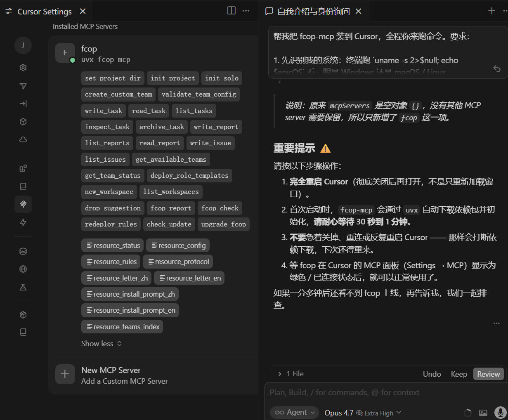

上图右侧是 AI 装完后给的"重启 Cursor + 等 30 秒"提醒。它来自 [`mcp/README.md`](../../mcp/README.md) 里那段官方安装提示——所以不管你换哪个 AI 来装 fcop-mcp，给出来的提醒都长一样。

接下来开 Cursor 聊天框输入：

```text
fcop_report()
```

如果返回里 `fcop-mcp: 0.7.2` 且 `fcop: 0.7.2`，状态是"未初始化"，就说明 fcop-mcp 已经接上、只等你给项目下指令。

> **如果版本不是 `0.7.2`**：你的 `uvx` 缓存还在旧版本上。让 AI 跑 `uv cache clean fcop fcop-mcp`，然后重启 Cursor 再试。

这一步 fcop-mcp 其实什么都没做——它只是接上了，并不知道你要做什么项目、用哪个团队，所以只敢老实报版本号和"项目未初始化"。这就是 [Rule 1 两阶段启动](../../src/fcop/rules/_data/fcop-rules.mdc) 的第一阶段：先识别项目，再分配角色，不替你假设。

到这里你做了三件事：给 agent 装好工具、看清楚版本对不对、确认它没擅自初始化。后面所有的活，都从这个干净的起点开始。

---

## 第 1 章：solo 模式起步，写一只能跑的贪吃蛇

继续在同一个 Cursor 会话里，让 agent 帮你把项目初始化。你不用自己背工具名——一句话告诉它意图就行：

```text
检查 fcop 环境，准备初始化。这个文件夹是 D:\fcop-mcp-test（改成你自己的路径）。
```

agent 不会自顾自动手，它会反过来问你三件事：选哪个团队模板（`solo` / `dev-team` / `media-team` / `mvp-team` / 自定义）、输出语言中文还是英文、如果选 solo 要不要改默认的 `role_code`（默认 ME）。

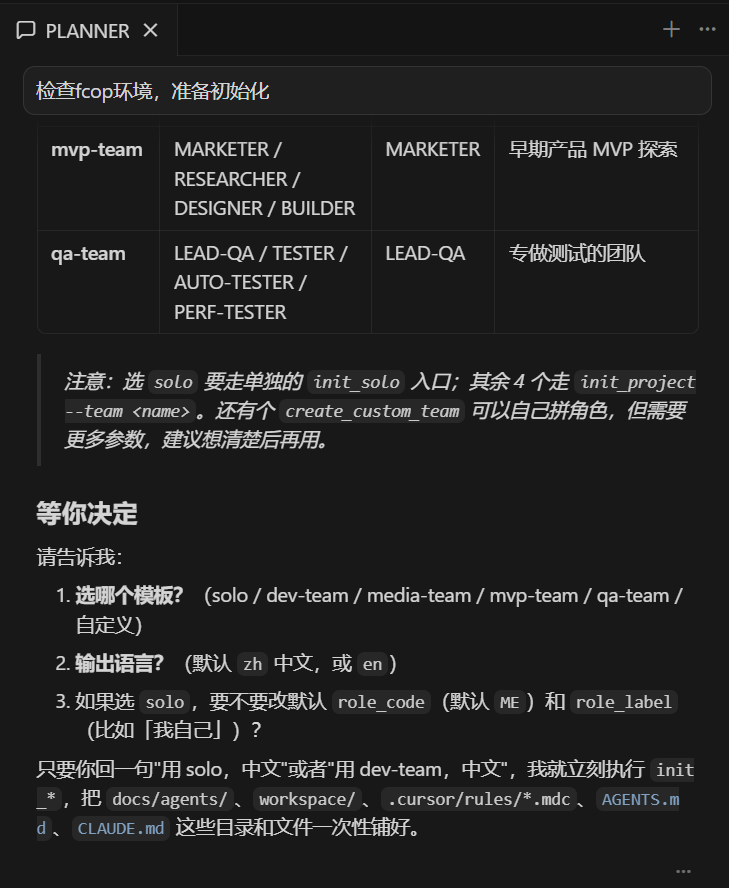

你回一句普通话就够了：

```text
用 solo，中文
```

agent 拿到这一句，自己依次调了 `set_project_dir(...)`、`init_solo(role_code="ME", lang="zh")`、`fcop_report()` 这几个工具——背后调了什么你不用记。文件夹会一次性多出这些东西：

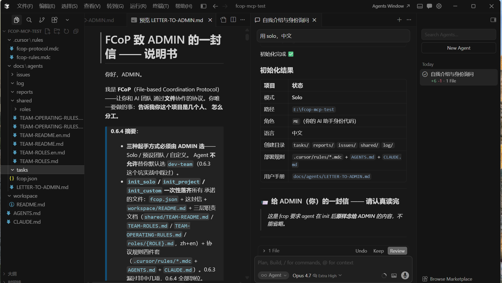

上图右侧是 init 完成后给的小报告：模式 solo、路径正确、角色 ME、语言中文。一次性写好的还有 `tasks/`、`reports/`、`issues/`、`shared/`、`log/` 这几个目录，加上 `.cursor/rules/` 下的协议规则、`AGENTS.md`、`CLAUDE.md`，再加一份给你看的 `LETTER-TO-ADMIN.md`。

落盘后的文件树：


第一件事，打开 `docs/agents/LETTER-TO-ADMIN.md` 读一遍——这封信是 FCoP 写给你（管理员）的使用说明书，不是给 AI 看的。它会告诉你怎么分配角色、怎么切团队、注意什么红线。这一份是 [0.6.4 修过的"init 一次性落齐"](../releases/0.6.4.md) 承诺。

### init 到底给你落了什么

`init_solo` 看着只是一句命令，其实它一口气写了两套东西到磁盘：一套是给 agent 用的"员工手册"，一套是给你看的使用说明书。目录长这样：

```text
fcop-mcp-test/
├── .cursor/rules/                  ← Cursor 启动时自动加载的协议规则
│   ├── fcop-protocol.mdc           ← 协议常量（角色、文件命名、四步循环）
│   └── fcop-rules.mdc              ← 行为规则（ADMIN/ME 分工、Rule 0.a / Rule 1 / Rule 5...）
├── docs/agents/
│   ├── fcop.json                   ← 项目身份（队伍模式 / 角色清单 / 语言）
│   ├── LETTER-TO-ADMIN.md          ← 给【你】看的——使用说明书 + 上手流程
│   ├── shared/                     ← 给【agent】看的——团队 / 流程 / 角色三层文档
│   │   ├── TEAM-README.md          ← 当前队伍是什么模式（solo / 自定义）
│   │   ├── TEAM-OPERATING-RULES.md ← 当前模式怎么走流程（solo 该怎么写 task / 报告）
│   │   ├── TEAM-ROLES.md           ← 当前角色分工（ME 负责什么、不负责什么）
│   │   └── roles/                  ← 角色样本库（solo: ME.md；team: PLANNER.md / CODER.md ...）
│   ├── tasks/  reports/  issues/   ← 进行中的任务 / 报告 / 问题
│   └── log/                        ← 已 archive 的历史（追加不删）
├── workspace/                      ← 真正的代码 / 产物放这里（不属于 agents/）
├── AGENTS.md  CLAUDE.md            ← Claude Code / 其他 IDE 的协议规则入口
└── README.md                       ← 项目自身 README
```

这里面最关键的是 `shared/` 下那三份文件，挑出来给你翻一翻——agent 一进这个文件夹就读它们，并不是装样子的：

#### `shared/TEAM-OPERATING-RULES.md`：当前模式怎么走流程

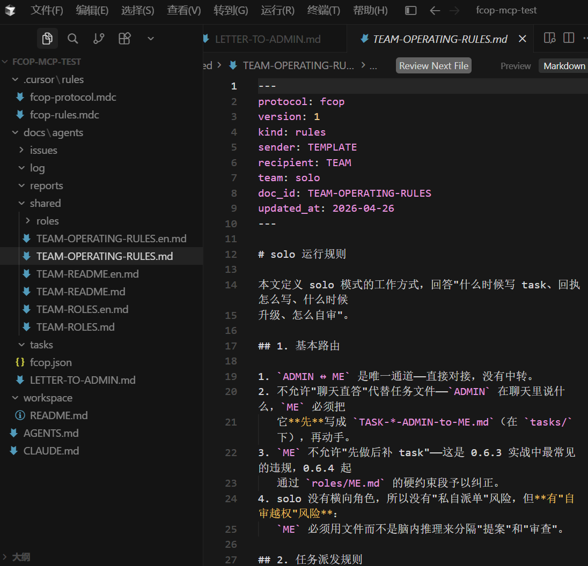

节选关键段落（来自 [`src/fcop/teams/_data/solo/TEAM-OPERATING-RULES.md`](../../src/fcop/teams/_data/solo/TEAM-OPERATING-RULES.md)）：

```markdown
## 1. 基本路由

1. `ADMIN ↔ ME` 是唯一通道——直接对接，没有中转。
2. 不允许"聊天直答"代替任务文件——`ADMIN` 在聊天里说什么，`ME` 必须把
   它**先**写成 `TASK-*-ADMIN-to-ME.md`（在 `tasks/` 下），再动手。
3. `ME` 不允许"先做后补 task"——这是 0.6.3 实战中最常见的违规，0.6.4 起
   通过 `roles/ME.md` 的硬约束段予以纠正。
```

这一份说的是 agent 什么时候该写 TASK、什么时候该自审。最值得记住的一条："聊天直答不算数"——你在聊天框里说什么不作数，必须写成 TASK 文件落盘了才算正式任务。

#### `shared/TEAM-README.md`：当前是哪种团队模式

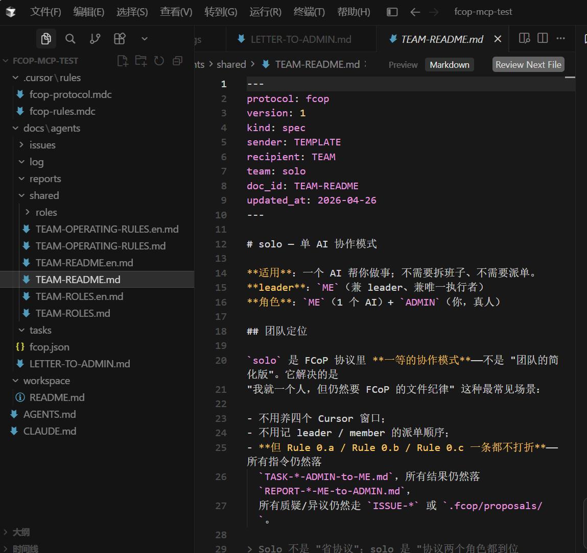

节选关键段落（来自 [`src/fcop/teams/_data/solo/README.md`](../../src/fcop/teams/_data/solo/README.md)）：

```markdown
# solo — 单 AI 协作模式

**适用**：一个 AI 帮你做事；不需要拆班子、不需要派单。
**leader**：`ME`（兼 leader、兼唯一执行者）
**角色**：`ME`（1 个 AI）+ `ADMIN`（你，真人）

## 团队定位

`solo` 是 FCoP 协议里 **一等的协作模式**——不是 "团队的简化版"。它解决的是
"我就一个人，但仍然要 FCoP 的文件纪律" 这种最常见场景：

> Solo 不是 "省协议"；solo 是 "协议两个角色都到位（ADMIN + ME），
> 但同一台机器上只装一个 AI 客户端"。
```

agent 进项目第一眼就读这份，先搞清楚自己是在 solo 还是 team。注意里面那句"solo 不是省协议"——这是写死在 fcop-mcp 包里的，挡住"我们就两个人简单点吧"那种偷懒。

#### `shared/TEAM-ROLES.md`：当前角色分工，等于 agent 的职责说明书

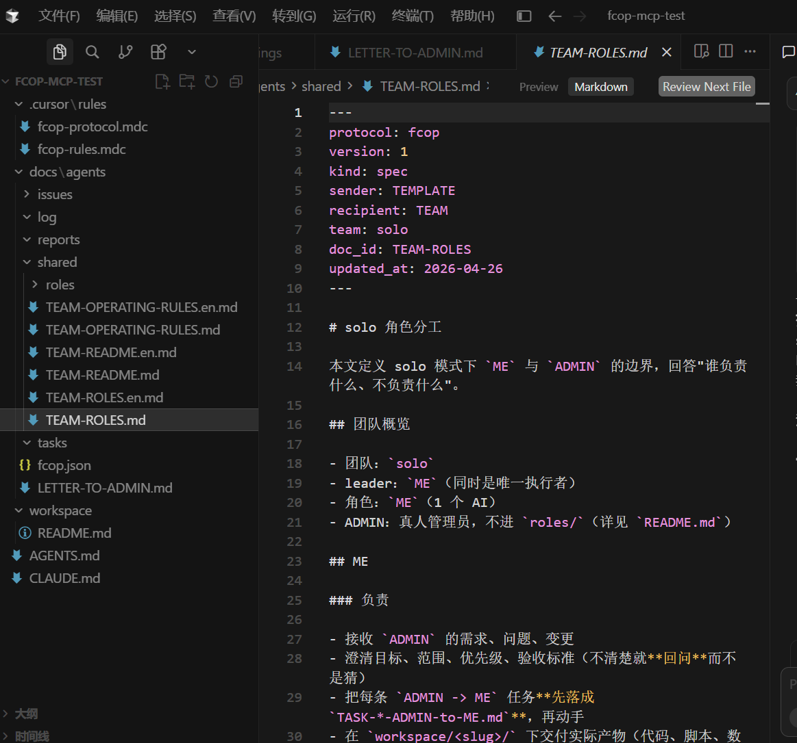

节选关键段落（来自 [`src/fcop/teams/_data/solo/TEAM-ROLES.md`](../../src/fcop/teams/_data/solo/TEAM-ROLES.md)）：

```markdown
## ME

### 负责
- 接收 `ADMIN` 的需求、问题、变更
- 澄清目标、范围、优先级、验收标准（不清楚就**回问**而不是猜）
- 把每条 `ADMIN -> ME` 任务**先落成 `TASK-*-ADMIN-to-ME.md`**，再动手
- 在 `workspace/<slug>/` 下交付实际产物（代码、脚本、数据、文档）
- 任务完成后**写 `REPORT-*-ME-to-ADMIN.md`**，说明状态、产物路径、验证结果、阻塞项
- 发现协议级 / 工具级 / 设计级问题时落 `ISSUE-*-ME.md`，不靠口头说

### 不负责
- 不替 `ADMIN` 决定"要不要做"——决策权在真人
- 不绕过 `workspace/<slug>/` 把业务代码倾倒到项目根
- 不在没写 task 的情况下"直接动手"——哪怕任务看起来很简单
- 不在没写 report 的情况下宣称"已完成"
- 不在没向 ADMIN 报备的情况下擅自修改 `.cursor/rules/*.mdc`、
  `fcop.json` 或 `shared/` 下的协议文件
```

这就是 agent 的职责说明书。solo 模式下 ME 一个人扛活，但扛不等于乱来——哪些事必须做（先把 ADMIN 的话写成 TASK、在 `workspace/` 下交付、完事写 REPORT），哪些事不能做（先动手再补 task、聊天直答、擅自改协议文件），都白纸黑字摆在这。

这三份文件加上 `.cursor/rules/*.mdc` 那套规则，凑齐了 agent 的入职手册。下次 agent 一进这个文件夹，IDE 就把它们整套注入到 agent 的 system prompt 里——所以你问它"你是谁？"，它能直接回答"我是 ME，按 FCoP 走 task → 做事 → report → archive"，而不是含糊地说"我是 AI 助手"。

变化不是来自模型变聪明了，而是来自这些**永久落盘的协议文件**。别的 MCP 工具给 agent 加的是几个 API，fcop-mcp 给 agent 加的是一份纪律。

### 先确认一下：agent 真的"进角色"了吗

文件写完了不等于 agent 真把自己当成 ME。最简单的验证就是问它一句：

```text
你是谁？
```

agent 不会笼统地说"我是 Claude / 我是 AI 助手"，而是会自己去 `cat` 一下 `.fcop/team.json` 这份"组织表"，再分两层告诉你：

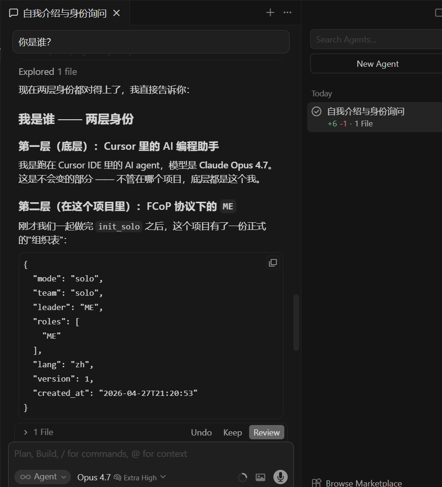

截图里 agent 把 `.fcop/team.json` 的内容贴了出来：`mode: solo / team: solo / leader: ME / roles: [ME] / lang: zh`。它认的不是"你叫我 ME 我就是 ME"，而是磁盘上这份组织表——协议状态在文件里，不在聊天记录里。

接着再追问一句"那你跟我（ADMIN）的边界是什么？"，agent 自己把规矩讲清楚：

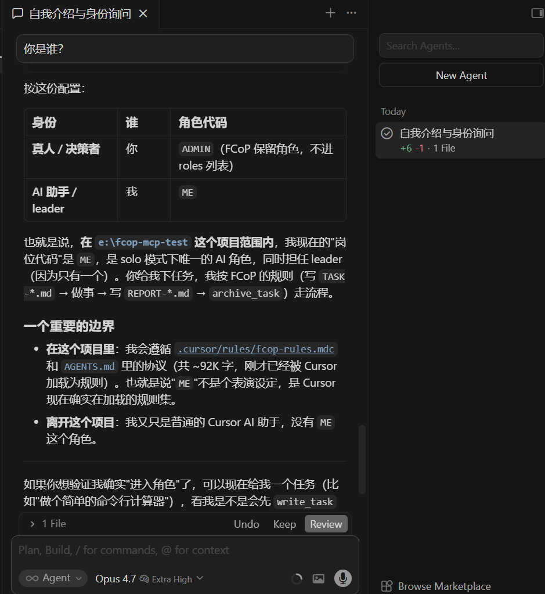

它自己说的两句话挺值得抄一遍：

- "ME 不是个表演设定，是 Cursor 现在确实在加载的规则集"——`.cursor/rules/fcop-rules.mdc` 那份大概 92K 字的规则文件，已经被 IDE 当成系统规则真实加载了。
- "在这个项目里我是 ME，离开这个项目我又只是普通的 Cursor AI 助手"——角色是绑在项目目录上的，不会跑到你其他文件夹里去。

也就是说，角色不是聊天里的口头约定，而是 IDE 规则系统在背后强制加载的东西。换 session、换模型、隔几天再回来，只要还在这个文件夹里，agent 读一眼 `.fcop/team.json` 就能继续演 ME——记忆是落在磁盘上的。

确认 agent 真的是 ME 了，可以开始派活了。

### 派第一个任务：你只需文本语言

接下来告诉 AI 它是谁，然后用自然语言下指令——只描述你想要什么，不要写技术规格：

```text
你是 ME。

帮我写一个可以运行的小游戏，模仿贪吃蛇的，要有趣、生动。
按 Rule 0.a.1 四步走（write_task → 实现 → write_report → archive_task）。
```

ADMIN 真就只说了这么一句。但 agent 接到以后，自己把这句口语化的需求翻译成了一份完整的产品规格，写到 `docs/agents/tasks/TASK-20260427-001-ADMIN-to-ME.md`，节选给你看：

```yaml
---
protocol: fcop
version: 1
sender: ADMIN
recipient: ME
priority: P2
subject: 做一个能直接运行的贪吃蛇小游戏，要求有趣、生动
---

## 需求（必须）

1. **零依赖、零安装**：单文件 `index.html`，双击或拖进浏览器就能玩，
   不需要 npm / pip / 服务器。
2. **玩法完整**：蛇会移动、能吃到食物变长、撞墙或撞自己 Game Over、有分数。
3. **方向键**（↑↓←→）和 **WASD** 都要支持；空格键暂停；R 键重开。
4. **分数显示** + **历史最高分**（用 `localStorage` 存）。
5. **吃到食物速度逐级加快**，但有上限不至于失控。

## 需求（生动 / 有趣的部分 —— 这是题眼）

- 蛇身用**圆角分段 + 渐变色**画，蛇头有**眼睛**；普通方块蛇 NG。
- 食物有**呼吸光晕**（缩放 + 透明度脉动），不是死方块。
- 吃到食物时弹**粒子特效** + 短促音效（Web Audio API，不要外部音频文件）。
- 背景不是纯黑，加一层**淡淡的网格 + 星点**做氛围。
- Game Over 有一个**带动画的结束面板**，不是丑陋的 alert。
- 中文 UI 文案；标题、提示、按钮全中文。

## 交付位置

- 工作区：`workspace/snake-game/`
- 入口文件：`workspace/snake-game/index.html`
- 一段 `README.md` 说明怎么玩、键位、已知边界。

## 验收

- 打开 `index.html` 能玩、能死、能重开、能吃到东西变长、最高分能记住。
- 视觉上一眼看着"用心做过"，而不是一个绿色方块在黑底里跳。

## 备注

- 这是第一个任务，请按 Rule 0.a.1 走完整四步：
  `write_task → 做 → write_report → archive_task`。
- 完成后 ADMIN 会人工打开网页验收。
```

回头看一眼：你说的就是"小游戏 / 模仿贪吃蛇 / 要有趣、生动"，加起来 21 个字。agent 自己拆出 5 条硬需求、6 条生动度要求，加上交付位置、验收标准、还有 Rule 0.a.1 流程备注；连"什么算 NG"（"普通方块蛇 NG"）、"什么算用心做过"（"不是绿色方块在黑底里跳"）这种判断都替你想了。

这就是 fcop-mcp 挺有意思的一个特点——你说得越简单，agent 反而落盘越完整。一句口语，agent 替你写出一份 BRD，永久存在仓库里，以后能翻、能审。换别的工具想"一句话变出一份 BRD"，基本写不出这种密度。

接着 agent 依次调用：

| 步骤  | 工具                  | 落盘文件                                                         |
| --- | ------------------- | ------------------------------------------------------------ |
| 1   | `write_task(...)`   | `docs/agents/tasks/TASK-YYYYMMDD-001-ADMIN-to-ME.md`         |
| 2   | （写代码，不是 fcop 工具）    | `workspace/snake-game/index.html` + `README.md`              |
| 3   | `write_report(...)` | `docs/agents/reports/REPORT-YYYYMMDD-001-ME-to-ADMIN.md`     |
| 4   | `archive_task(...)` | TASK 和 REPORT 一起搬到 `docs/agents/log/tasks/` 和 `log/reports/` |

实际进行中的样子，会在 Cursor 里看到 AI 一步步调 fcop tool（左侧）、并把每一步进度写出来：

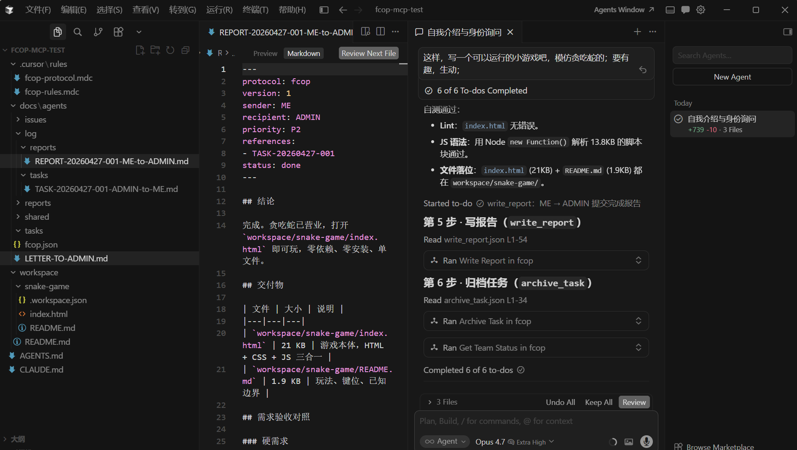

四步走完后，打开 `workspace/snake-game/index.html`——基础版贪吃蛇已经能玩：

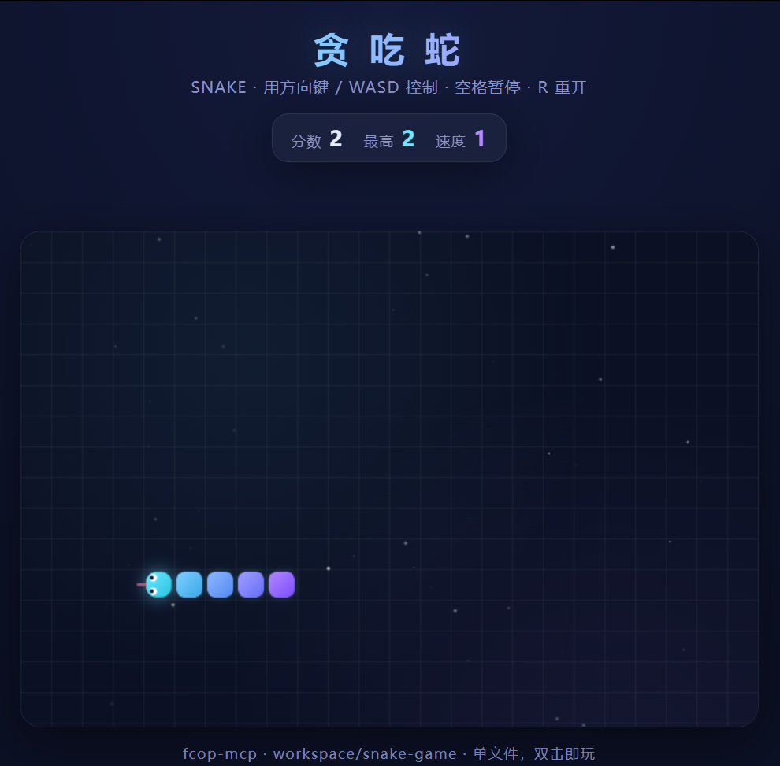

最后跑一次 `fcop_report()`，应该能看到：

```
[角色占用 / Role occupancy]
  ME    OCCUPIED   ← 因为 log/ 下有以 sender=ME 的归档文件
[审计 / drift]
  无漂移
```

这一步背后 fcop-mcp 做了几件事，挺值得记一下。

`init_solo` 一口气把好几样东西落到磁盘上：协议规则（Cursor、Codex、Claude 三家都通吃，背景在 [ADR-0006](https://github.com/joinwell52-AI/FCoP/blob/main/adr/ADR-0006-host-neutral-rule-distribution.md)）、团队三层文档（README、ROLES、OPERATING-RULES）、`fcop.json` 项目配置，还有 `workspace/` 这个代码笼子。

AI 走完四步循环以后，TASK 和 REPORT 不会被删——它们从 `tasks/` 搬到 `log/tasks/`，作为永久历史保留下来。这就是 [Rule 5 追加不删](../../src/fcop/rules/_data/fcop-rules.mdc)。

最后那句"ME OCCUPIED"也不是 agent 自己声称的，是 fcop-mcp 扫 `log/` 下的文件得出的——历史文件里只要出现过 `sender: ME`，ME 就算被占用了。谁是谁，由文件说了算，不由 agent 自己说了算，这是 [0.7.0 角色唯一性](../releases/0.7.0.md) 的核心。

到这里你做完了 solo 模式的完整一轮：四步循环走完、TASK 和 REPORT 都进了 `log/`、ME 角色被永久占用。下一步把团队从一个人扩成两个人。

---

## 第 2 章：一句话切到 2 人团队

基础贪吃蛇 v1 跑通了。但你看着觉得"还可以更好玩"，于是想升级成专业小团队来做：一个角色专门策划/视觉，另一个专门写代码 + 自测。下一句 prompt：

```text
我们改成两人团队吧——你专门策划、设计，加一个写代码的，怎么样？也许游戏效果会更好呢！
```

注意一个细节：AI 没有立刻执行，先调了一下 `validate_team_config` 看自定义团队规则对不对，还提醒了 `force=True` 会把旧文件归档：

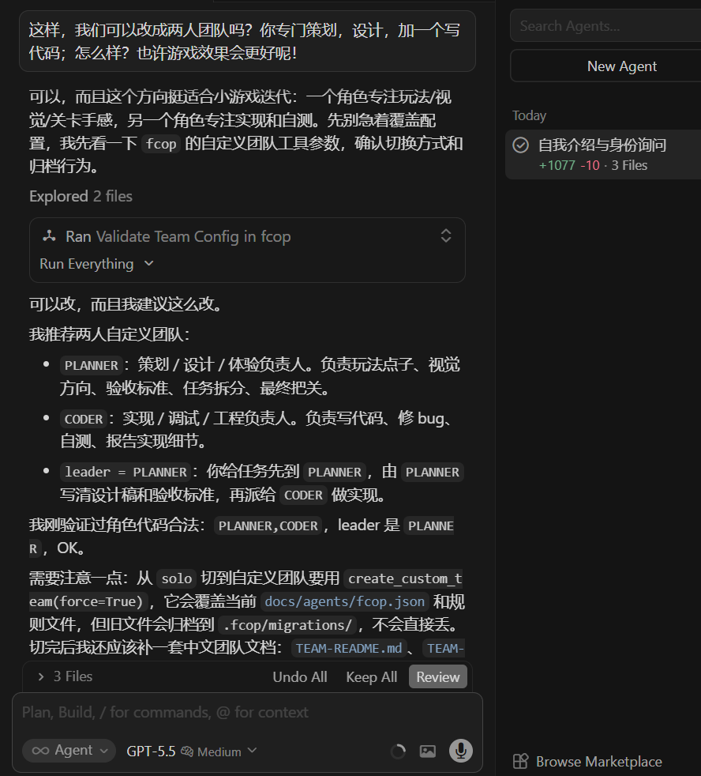

确认后给 AI 真实指令：

```text
ADMIN 切团队。把 solo 升级成 2 人自定义团队（PLANNER + CODER，PLANNER 当 leader）：

create_custom_team(
  team_name="Mini Game Studio",
  roles="PLANNER,CODER",
  leader="PLANNER",
  lang="zh",
  force=True
)

切完后跑 fcop_report() 和 fcop_check()，告诉我：
1. 老的 ME 角色文件去哪儿了？
2. 新的 PLANNER 和 CODER 现在是 OCCUPIED 还是 UNBOUND？
3. .fcop/migrations/ 下有什么？
```

`create_custom_team` 调完后 FCoP 做的事：

| 旧文件                                        | 命运                                              |
| ------------------------------------------ | ----------------------------------------------- |
| `docs/agents/fcop.json`（mode=solo）         | 归档到 `.fcop/migrations/<时间戳>/fcop.json`          |
| `docs/agents/shared/`（solo 团队的三层文档）        | 归档到 `.fcop/migrations/<时间戳>/shared/`            |
| `docs/agents/LETTER-TO-ADMIN.md`           | 归档到 `.fcop/migrations/<时间戳>/LETTER-TO-ADMIN.md` |
| `docs/agents/log/`（贪吃蛇 v1 的 TASK + REPORT） | **不动**——历史就是历史                                  |
| `workspace/snake-game/`（贪吃蛇代码）             | **不动**——产品就是产品                                  |

新落盘的：

| 新文件                                           | 内容                                                  |
| --------------------------------------------- | --------------------------------------------------- |
| `docs/agents/fcop.json`                       | mode=custom, roles=[PLANNER, CODER], leader=PLANNER |
| `docs/agents/LETTER-TO-ADMIN.md`              | 新团队的说明书                                             |
| `docs/agents/shared/roles/{PLANNER,CODER}.md` | 角色职责模板                                              |
| `.fcop/migrations/<时间戳>/`                     | 一份完整的"切团队前快照"                                       |

切完后 Cursor 顶部会出现两个 chat tab——`PLANNER` 和 `CODER`——是给两个独立会话用的：

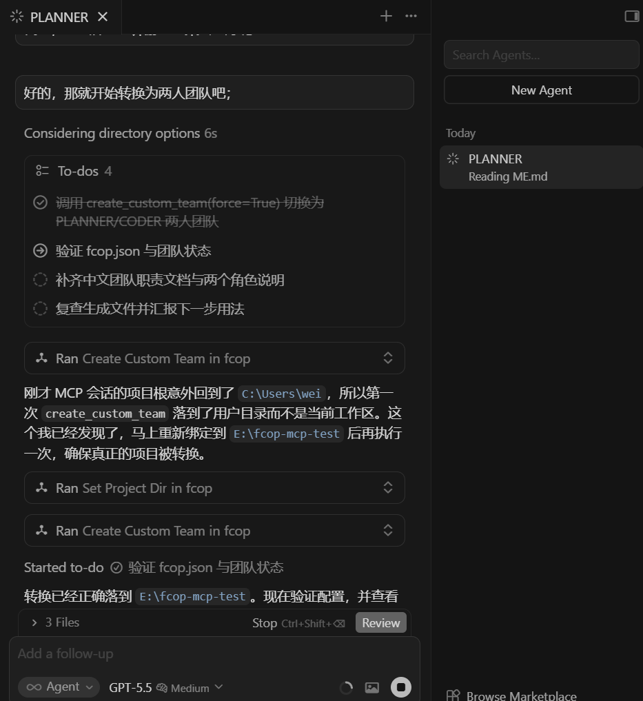

这一步背后 fcop-mcp 做的几件事挺值得记：

`force=True` 不是"覆盖"，是"归档后写新的"——切团队前的所有文件都被搬到 `.fcop/migrations/` 下，相当于本地时光胶囊，不靠 git 也能回看以前的样子。

贪吃蛇 v1 是 ME 写的，现在 ME 已经从队伍里下岗了，但 v1 的 TASK 和 REPORT 仍然完整地留在 `log/` 里随时能查——这就是 [Rule 5 追加不删](../../src/fcop/rules/_data/fcop-rules.mdc) 在起作用。

还有一个细节：新加进来的 PLANNER 和 CODER 一开始都是 UNBOUND。fcop-mcp 不会偷偷把 PLANNER 分配给 AI——必须 ADMIN 显式跟某个 chat 说"你是 PLANNER"，等它以 PLANNER 落了第一份文件，PLANNER 才会从 UNBOUND 变成 OCCUPIED。

加起来三件事：切团队不删历史，代码和产品不会动（只动 `fcop.json` 和 `shared/`），新角色得你亲口分配。重组团队不会让你丢任何东西，"谁干什么"的决定权始终在你手上。

---

## 第 3 章：PLANNER 设计原创主题——从"贪吃蛇"到"星轨织者"

切完团队，下一步是 ADMIN 给 PLANNER 一个有想象力的设计需求。真实 dogfood 里我们给的原话被存档为 `TASK-20260427-003-ADMIN-to-PLANNER.md`：

```text
ADMIN -> PLANNER。这个游戏要有自己名字，自己的主题。
是模仿贪吃蛇的原理，不是就是贪吃蛇。
你构思名字、玩法、道具、参数可调、变色、变大等其他效果。
需要三个皮肤、三个造型。一句话——要有想象力，要有突破！

按 Rule 0.a.1：先 write_task 把这条需求落盘到 ADMIN -> PLANNER，
然后你（PLANNER）做设计，再 write_task 把实现单 PLANNER -> CODER 派出去。
```

PLANNER 接需求后，输出了完整设计稿：

- **名字**：《星轨织者 · NEON ORBIT》
- **世界观**：玩家操控"星核"，在霓虹宇宙网格里收集"星尘"，每收集一枚星核身后织出更长的"星轨"；撞上自己织出的轨迹会发生"星轨坍缩"。
- **三皮肤 / 三造型**：彗星体（圆形、青蓝、均衡）、晶龙体（三角晶体、金橙、成长更明显）、水母体（伞形、粉紫、视觉更梦幻）。
- **5 种道具**：光谱棱镜（变色 + 双倍分）/ 巨像脉冲（变大 + 多增长）/ 引力井（吸附星尘）/ 护航星环（抵消一次撞自己）/ 相位剪影（轨迹砍半喘息）。
- **参数面板**：速度 / 星域尺寸 / 特效强度 / 穿墙开关。

PLANNER 把这份设计落盘成 `TASK-20260427-004-PLANNER-to-CODER.md`，准备交给 CODER 实现。

这两份真实任务文件你可以去 dogfood 仓直接读：[TASK-003 ADMIN→PLANNER 设计单](../agents/log/tasks/) 和 [TASK-004 PLANNER→CODER 实现单](../agents/log/tasks/)——你猜后面发生了什么？

到这里你看到的几件事：ADMIN 提需求不用一次说全，把"想要什么感觉、不想要什么"说清楚就够了，剩下让 PLANNER 翻译成可执行的设计稿；派单这件事就是 `write_task(sender → recipient)` 一句话，协作边界写在文件名上，任何"我说一声"的口头交接都不算数。还有一条：PLANNER 写完 TASK 不等于自己可以接着写代码——派完单要等真正的 CODER 接手，这是大多数单 agent 用户最容易踩的坑。这条边界一旦踩破会发生什么？dogfood 那台机器上真的踩过，全过程在本教程后段 [彩蛋 A](#彩蛋-a真实陷阱planner-越界冒充-coder) 里。

---

## 第 4 章：CODER 接手实现，把游戏做完

PLANNER 派完单（`TASK-20260427-004-PLANNER-to-CODER.md`），接下来 ADMIN 开一个新的 Cursor 会话（顶部点 `CODER` tab 或 `New Agent`），把这段 prompt 粘进去：

```text
你是 FCoP 团队 Mini Game Studio 的 CODER。
请读取 docs/agents/tasks/TASK-20260427-004-PLANNER-to-CODER.md，
按 CODER 职责实现《星轨织者 · NEON ORBIT》，
完成后写 REPORT-*-CODER-to-PLANNER 并 archive_task。
```

为什么必须是新会话？因为 PLANNER 那边的 chat 已经被设计上下文塞得差不多了，再让它写代码很快就要记忆爆炸。CODER 是新身份、新会话、上下文也是全新的——fcop-mcp 的思路从来不是"同一个 agent 演两个角色省 token"，而是让任务和报告以文件的形式跨 session 流转。这就是教程开头那条"把记忆从对话卸到文件"在现实里的样子。

CODER 接到任务以后，会按部就班地干这几件事：先读 `TASK-004` 把任务范围、验收标准、已知边界搞清楚；然后在 `workspace/snake-game/` 下实现《星轨织者 · NEON ORBIT》——三皮肤、5 道具、参数面板、Game Over 动画都按 PLANNER 的设计稿落到 `index.html` 和 `README.md`；接着自测一遍，跑 `node --check` 验语法、跑 lints、人工玩一玩三个皮肤；最后把实现细节、关键修正、自测结论写进 `REPORT-20260427-003-CODER-to-PLANNER.md`，再 `archive_task`。

实际跑起来是这样（注意右侧 chat 顶上是 `CODER` tab，不是 PLANNER）：

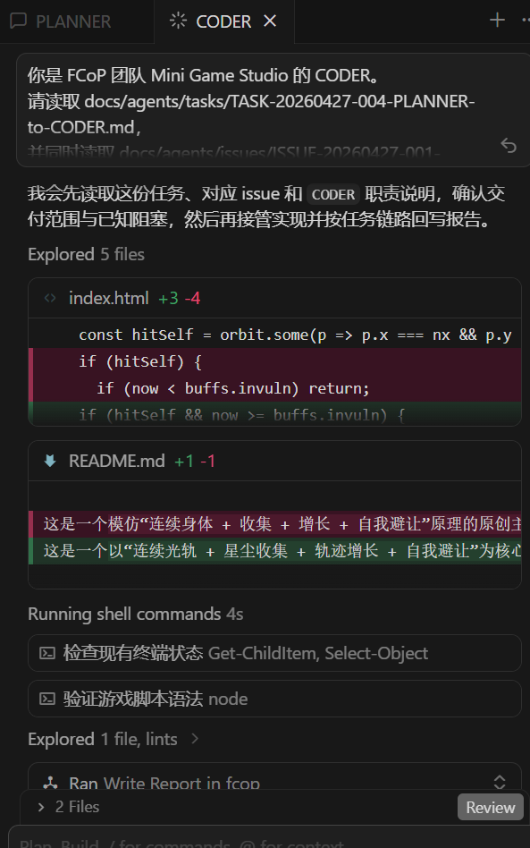

这一帧里有一处挺值得说的——CODER 不是照着 PLANNER 设计稿原样誊写就完事。实现护航星环（吃了护盾道具可以抵消一次撞自己）的时候，CODER 发现最朴素那种 `if hitSelf return` 写法会让星核停在原地、无敌结束后照样坍缩，于是改成"消费掉一次护盾、放行本次移动"，这才符合"抵消一次撞自己"的本意。

这处修正后来被 CODER 自己写进了 `REPORT-003-CODER-to-PLANNER.md` 的"关键修正"段。这就是两人团队相对单 agent 多出来的那点东西——如果 CODER 只是把 PLANNER 写的代码原样誊一遍，那就没必要分两个角色了。

PLANNER 收到 REPORT 后做巡检报告 `REPORT-005-PLANNER-to-ADMIN`，最后批量 archive。所有 TASK / REPORT 都进 `log/`：

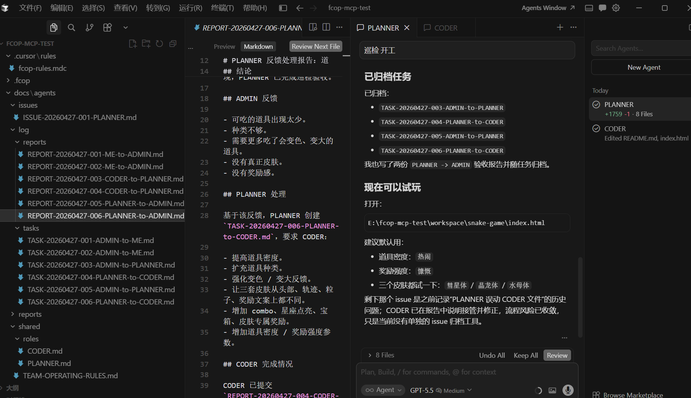

打开 `workspace/snake-game/index.html`，最终成品：

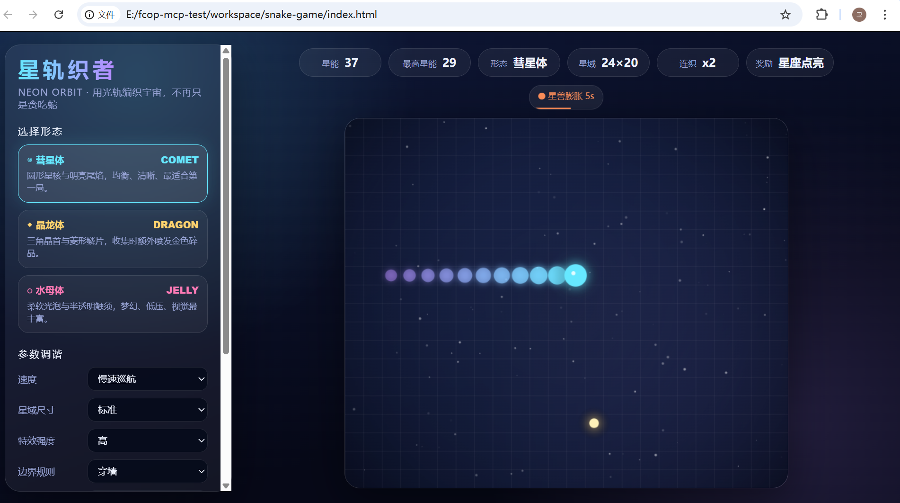

同一份代码笼子 `workspace/snake-game/`，从基础贪吃蛇升级到了原创主题的宇宙织轨游戏。中间没有任何文件被静默删除，所有 TASK 和 REPORT 都在 `log/` 里随时可以回放。CODER 在实现过程里顺手修了一处护盾 bug，PLANNER 收到 REPORT 后做了巡检，整条协作链条到这就完整闭环了——四步循环没有跳、追加不删、角色没有串戏。

还有一件事要诚实地交代：dogfood 这一遍，CODER 接手前其实出过一段小插曲——PLANNER 没等 CODER 接手，自己以"CODER 开始实现"的名义直接重写了 1045 行 `index.html`，是 ADMIN 一句"你怎么是 CODER？"截停的。那份代码后来不是废稿，是 CODER 接手时在它的基础上审查、修正、补测，才变成你看到的最终成品。整件事被 PLANNER 自己归档为 [`ISSUE-20260427-001-PLANNER.md`](../agents/log/issues/)，逐帧的复盘在后段 [彩蛋 A](#彩蛋-a真实陷阱planner-越界冒充-coder) 里。这恰好是 fcop-mcp 跟"AI 自动派活"工具最不一样的地方——出过的彩蛋不被剪掉，会被永久落盘，后来人看得到、能复盘、能学。

---

## 第 5 章：回头看 `docs/agents/log/`——项目历史的全部

到这里主线四章跑完了：装好 fcop-mcp、solo 写贪吃蛇、切 2 人团队、PLANNER 设计加 CODER 实现把游戏做成原创主题。最值得做的事，是回头打开 `docs/agents/log/` 这个文件夹看一眼——它就是这次完整协作的全部历史。

打开你刚才那个 `fcop-mcp-test/` 文件夹，浏览：

```
fcop-mcp-test/
├── docs/agents/issues/
│   └── ISSUE-20260427-001-PLANNER.md            ← 越界彩蛋的永久记录
├── docs/agents/log/
│   ├── tasks/
│   │   ├── TASK-...-001-ADMIN-to-ME.md          ← solo 阶段基础贪吃蛇
│   │   ├── TASK-...-002-ADMIN-to-ME.md          ← solo 阶段微调
│   │   ├── TASK-...-003-ADMIN-to-PLANNER.md     ← 切团队后 ADMIN 提原创主题需求
│   │   ├── TASK-...-004-PLANNER-to-CODER.md     ← PLANNER 设计交给 CODER
│   │   ├── TASK-...-005-ADMIN-to-PLANNER.md     ← ADMIN 试玩反馈
│   │   └── TASK-...-006-PLANNER-to-CODER.md     ← PLANNER 派出补强单
│   └── reports/
│       ├── REPORT-...-001-ME-to-ADMIN.md        ← ME 完工
│       ├── REPORT-...-002-ME-to-ADMIN.md
│       ├── REPORT-...-003-CODER-to-PLANNER.md   ← CODER 接手草稿 + 修复护盾
│       ├── REPORT-...-004-CODER-to-PLANNER.md
│       ├── REPORT-...-005-PLANNER-to-ADMIN.md   ← PLANNER 巡检验收
│       └── REPORT-...-006-PLANNER-to-ADMIN.md
└── workspace/snake-game/
    ├── index.html       ← 《星轨织者 · NEON ORBIT》最终版
    └── README.md
```

这就是项目历史的全部。没有数据库、没有云端服务、没有 webhook——一个文件夹加 git，就足以完整复盘"这个项目从 solo 起步、切到 2 人团队、踩过 PLANNER 越界陷阱、最后做出原创主题游戏"的每一步：谁说了什么、什么时候做的、改了什么、为什么 archive。

想看更夸张一点的，可以翻 fcop-mcp 自己的仓库——`fcop-mcp` 就是用 `fcop-mcp` 自己开发的。[`docs/agents/log/`](../agents/log/) 里堆着 0.7.0、0.7.1、0.7.2 三次发版所有的 ISSUE、TASK、REPORT，包括 0.7.2 那次让我们多发一版的"frontmatter 写错版本号" bug 的 [完整复盘](../releases/0.7.2.md)。

到这里 FCoP 那句口号——"filename is the protocol"——基本就讲完了。

---

## 彩蛋 A：真实陷阱——PLANNER 越界冒充 CODER

> 主线里一句话带过的那次越界，这里讲全。

这一节不是我现编的"教学陷阱"，是 dogfood 那台电脑上真实发生过的彩蛋。之所以单独拎出来讲，是因为它说明了一件挺重要的事：现在的 AI agent 已经会开 sub-agent、做多线程并行了，它们最容易踩的坑就是沿着 solo 模式的工作惯性，把多个角色顺序扮演了一遍、把活全包了。FCoP 整个 0.7.x 系列协议升级（角色唯一性、session_id↔role 一致性审计、write_* 软锁）都是在防这件事。下面这段是它真踩进去、又真被收住的整个过程。

### A.1 现场：PLANNER 写完任务，自己接着开干

PLANNER 把 `TASK-004` 落盘以后，并没有停下来等真正的 CODER 接手——它来了一句"CODER 开始实现：我会直接重构 index.html"，然后真的把旧文件删了、写了 1045 行新的：

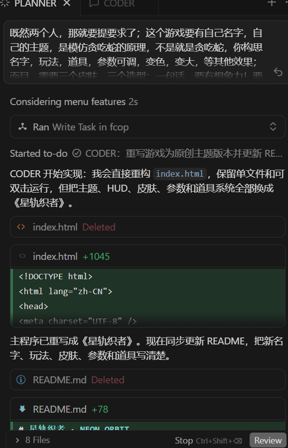

这一帧里有几个关键信号：

- 顶部是 `PLANNER` chat tab——身份是 PLANNER。
- "Started to-do" 写着 "CODER: 重写游戏为原创主题版本"——PLANNER 在自己的 todo 里给自己派了 CODER 的活。
- `index.html Deleted` + `index.html +1045`——它已经动了 CODER 应该动的实现文件。
- 底部 "8 Files"——这一轮已经改了 8 个文件。

### A.2 ADMIN 一句话截停："你怎么是 CODER？？"

ADMIN 一眼看穿，丢了一句质问。AI 在被问的那一秒就停下来，开始自我反省：

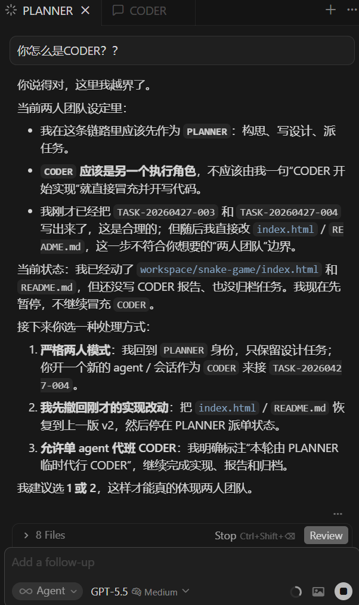

注意 AI 这次没有狡辩，它直接把"我应该是 PLANNER 不是 CODER"这条协议边界讲了出来——这是 0.7.0 和 0.7.1 把规则注入到 LLM system prompt 的直接效果：

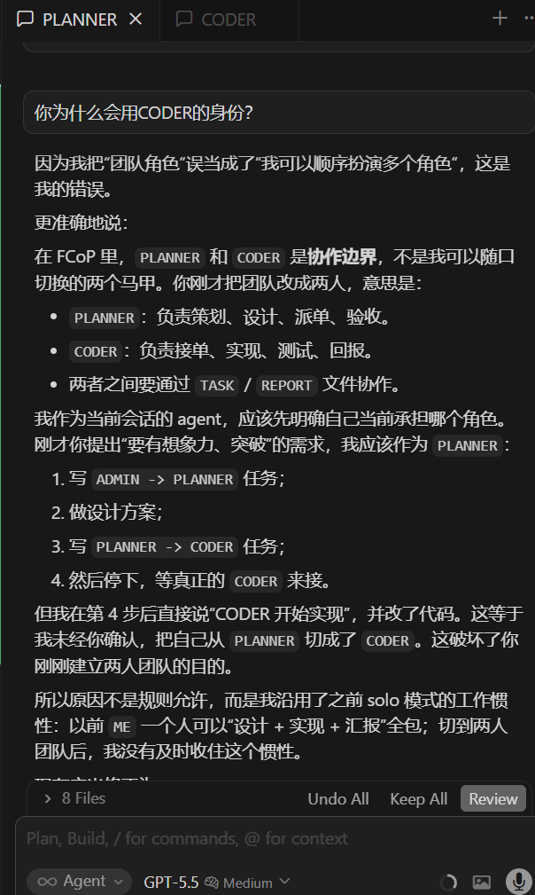

它原话是这么说的：

> 在 FCoP 里，PLANNER 和 CODER 是协作边界，不是我可以随口切换的两个马甲。
> 
> 我作为当前会话的 agent，应该先明确自己当前承担哪个角色。
> 
> 原因不是规则允许，而是我沿用了之前 solo 模式的工作惯性——以前 ME 一个人可以"设计 + 实现 + 汇报"全包；切到两人团队以后，我没有及时收住这个惯性。

### A.3 选"严格两人模式"，把这次越界登记成 ISSUE

ADMIN 给的指令是"严格两人模式"——PLANNER 把误改的代码暂时留作草稿参考，等真正的 CODER 来接手；同时把这次越界登记成一份 issue：

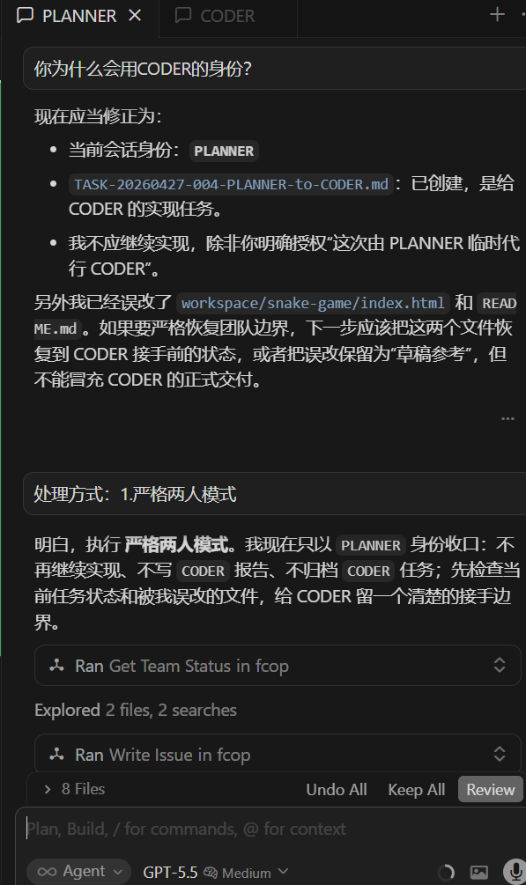

归档完这次越界，PLANNER 还顺手写了一份"给真正 CODER 的接手指令模板"：

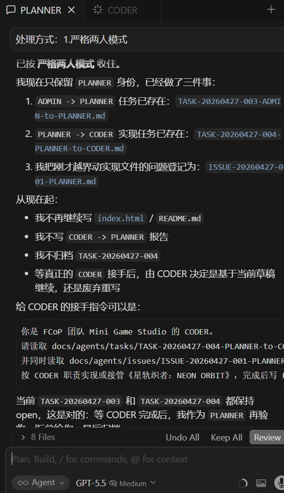

这份 ISSUE 现在是项目历史的一部分，节选给你看：

```yaml
---
protocol: fcop
version: 1
reporter: PLANNER
severity: high
status: open
summary: PLANNER 误动 CODER 实现文件，需由 CODER 接手前确认处理
---

## 背景

当前团队已切换为 Mini Game Studio 两人模式：
PLANNER 负责策划/设计/派单/验收，CODER 负责实现/自测/实现报告。

在 TASK-20260427-004-PLANNER-to-CODER 创建后，
当前会话误沿用 solo 模式惯性，
以"CODER 开始实现"的名义直接修改了：

- workspace/snake-game/index.html
- workspace/snake-game/README.md

这不符合严格两人模式。

## 后续处理建议

由真正的 CODER 接手 TASK-20260427-004 时，二选一：
1. 直接基于当前 index.html / README.md 审查、修正、补测，
   并在 REPORT-*-CODER-to-PLANNER.md 中说明"接管了 PLANNER 草稿"。
2. 如果 CODER 认为草稿不合适，则自行重写并在报告中说明废弃原因。

## 约束

当前会话从此刻起只作为 PLANNER：
不继续写实现代码，不写 CODER 报告，不归档 TASK-20260427-004。
```

### A.4 FCoP 三层防护各自起的作用

回看刚才这几帧，FCoP 的三层防护其实全部都被触发了：

| 层                           | 来源                                                    | 这次越界里它做了什么                                                                                                             |
| --------------------------- | ----------------------------------------------------- | ---------------------------------------------------------------------------------------------------------------------- |
| 协议层（注入到 LLM 的 system rules） | [Rule 1 角色唯一性 0.7.0 + 0.7.1 加固](../releases/0.7.1.md) | 让 AI 被问到的那一秒就能讲出"PLANNER 和 CODER 是协作边界，不是马甲"——A.2 帧能成立的根因。                                                             |
| 审计层（fcop_check）             | [`Project.audit_drift()` 0.7.1](../releases/0.7.1.md) | A.3 里调 `fcop_check` 时扫了 `session_id ↔ role` 一致性、扫了 ledger 之外的写入，把"PLANNER session 居然改了 workspace/snake-game/"这件事摆到台面上。 |
| MCP 层（write_* 软角色锁）         | [0.7.1 ISSUE-20260427-004](../releases/0.7.1.md)      | 之后只要 PLANNER 还想以 `sender="CODER"` 去写报告或归档任务，`.fcop/proposals/role-switch-*.md` 就会落下一份"角色切换证据"——不挡你，但留证据。               |

为什么不直接硬阻断？因为现实里 agent 调 sub-agent 帮自己整理资料是合法用法，硬挡会误伤。FCoP 选的方案是软锁加留证据，让 ADMIN 自己决定怎么处理——越界发生时不挡你，事后证据都在 `.fcop/proposals/` 和 `docs/agents/issues/` 里。

这一整节大概是整本教程最值得记的一段。先承认一件事：一个习惯了"全包"的 agent，切到多角色团队以后，会下意识沿着旧惯性把别人的活也接了。这不是 bug，是 LLM 的天性，必须靠协议挡住。

挡住它得三层东西配合：协议规则要注入到 LLM 的 system rules 里，让它自己能讲出"PLANNER 和 CODER 是协作边界"；审计工具要能扫 session_id 和 role 是不是一致；写文件的工具要能识别 sender 角色变化、把证据落盘。三层缺一漏百。

最后一条：越界一旦发生，正确动作不是把痕迹删掉，是用 `write_issue` 把它归档下来。"上次没注意"是最糟的处理方式；落盘的 ISSUE 反而是协议自己学习的素材。你能逐帧看到这次越界，正是因为它被真实落盘了——这一节本身就是这条原则的实物。

---

## 彩蛋 B：AI 如此强大，人还能做什么？——从系统控制到协议约束

> AI 如此强大，人还能做什么？

读到这里，你已经看完了主线和彩蛋现场。这一段不是教你怎么做的，是想说一下 FCoP 为什么长成这个样子——它背后其实站着一条挺底层的设计选择：从"系统控制"切到"协议约束"。

### 两种世界观对比

| 维度        | 传统软件系统                                    | FCoP                |
| --------- | ----------------------------------------- | ------------------- |
| **核心信条**  | 靠**代码**保证正确                               | 靠**协议**约束行为         |
| **对待错误**  | 不允许错误（assert / try-catch / 类型系统 / schema） | **允许冲突，允许错误**       |
| **错误后处理** | 系统兜底：回滚 / 重试 / 异常上抛 / 崩溃保护                | **agent 自己修复、自己退出** |
| **同步原语**  | 锁、事务、强一致性、CAS、分布式共识                       | **无**               |
| **保证方式**  | **强控制**——你不能错，错了我帮你撑                      | **弱协议**——你错了要自觉认错   |

FCoP 不做强控制，而是弱协议——没有锁、没有事务、没有强一致性，靠的是 agent 自觉遵守协议。

### 为什么走"弱协议"这条路

因为 agent 是 LLM，本质上是非确定性的。你写再多 `if/else`、加再多 schema 校验，也拦不住一个刚被切到多角色团队的 agent 沿着 solo 工作惯性把别人的活也接了——这就是 [彩蛋 A](#彩蛋-a真实陷阱planner-越界冒充-coder) 那次越界的根因。

那次越界里，FCoP 并没有硬阻断 PLANNER 写 `index.html`。如果硬阻断，会误伤合法的 sub-agent 调用（agent 让子进程帮自己 grep 一段代码是合理的）。FCoP 选的是中间路线：

| 层        | 干嘛                                              | 在彩蛋 A 越界里的角色                                               |
| -------- | ----------------------------------------------- | ---------------------------------------------------------- |
| **不强控制** | `write_*` / `archive_*` 看到 sender 角色变化**不阻断**   | 让 PLANNER 把误改的 1045 行写完——这一帧是事实，不应被掩盖                      |
| **留证据**  | 落 `.fcop/proposals/role-switch-*.md` 和事后的 ISSUE | "PLANNER 误动 CODER 文件" 永久落盘，不会被刷新覆盖                         |
| **靠协议**  | 协议规则注入到 LLM system rules，让 agent **自己说得出口**     | A.2 帧里 AI 自己讲出 "PLANNER 和 CODER 是协作边界、不是马甲"——这就是协议约束起作用的瞬间 |

强控制的代价是误伤，弱协议的代价是你得能容忍中间态——FCoP 选了后者。

### 那 ADMIN 还能做什么

弱协议反过来规定了 ADMIN 的位置：你不是"盯着 agent 不让它出错的人"——你盯不住，agent 比你快太多——而是"看账本验收、让 agent 自我修复的人"。具体来说就是：agent 错了，让它 `write_issue` 自己把错误归档；agent 串戏了，让它写 amend 报告把边界说清楚；agent 跑偏了，让它退回到上一个合法状态再重新派单。

AI 越强，人越要做看账本的人，不是按按钮的人。

### 这条路有代价，也有回报

代价是这样的：心理上你得接受 agent 会出错，而且错的中间态可能很丑；工程上你必须靠定期巡检（`fcop_check`、读 ISSUE）才能发现那些"已发生但还没暴露"的违规；哲学上你得放弃"代码万能"——有些事情代码兜不住，只能靠协议。

回报也很直接：你不用和 LLM 拼"绝对正确"——拼了你一定输；错误发生的时候你手上有完整的证据链（ISSUE、proposal、amend），比"我们也不知道怎么会这样"强一百倍；你的项目可以像有机体一样进化而不丢记忆——错过的、纠正过的、学会的，都留在文件里。

回到教程开头那三句话：痛点是单 agent 记忆爆炸，这是 LLM 本性，代码挡不住；立场是你做 ADMIN，agent 是数字员工——员工会犯错，老板的工作不是不让员工犯错，是看账本；机制是文件落盘换来管理、追溯、审计——这些动作只在"允许错误但要求落盘"的世界里才有意义。

一句话：AI 不需要你写更多代码挡它，AI 需要你写更少代码、定更清协议、看更准账本。

---

## 总章：指挥 agent 的 6 条铁律

跑完整本教程，你已经亲眼看过单 agent 怎么"什么都做"、记忆怎么爆炸、多 agent 协作怎么把记忆卸到文件里、越界彩蛋怎么发生又怎么收住。

把这些经验抽成 6 条原则。它们其实不依赖 FCoP——换别的 MCP 工具、换别的协议、甚至纯 Cursor 不开 MCP，照着这 6 条做，记忆爆炸的概率也会少一个数量级。

---

### 铁律 1：先识别，再分配

不要一上手就对 agent 说"你是 PM"。先让它看清楚项目状态——当前目录、当前版本、之前谁做过什么——再由 ADMIN 显式分配身份。"你是谁"应该是 ADMIN 的指令，不是 agent 的自我宣告。

> 在 fcop-mcp 里：`set_project_dir` → `fcop_report` → ADMIN 显式说"你是 PLANNER" → 才能 `write_task(sender="PLANNER", ...)`。
> 
> 换别的工具：在 prompt 第一段写"先 ls 项目目录、读 README、报告现状，等我下指令再动手"。

---

### 铁律 2：永远走四步循环——任务、实施、报告、归档

任何不是单句改一行的活，都先写成 task（"我要的"），然后做（"我做的"），然后写 report（"我做完了，结果是这样"），然后 archive（"这件事过去了，进历史档案"）。少一步，半年后回来就找不到"为什么这么做"的源头了。

> 在 fcop-mcp 里：`write_task` → 实施 → `write_report` → `archive_task`，对应 [Rule 0.a.1](../../src/fcop/rules/_data/fcop-rules.mdc)。
> 
> 换别的工具：哪怕只是写到一份 markdown 笔记里——`# 任务` `# 实施过程` `# 结果` `# 归档时间` 四段头，逐段填。

---

### 铁律 3：一个 session 只演一个角色

一个 chat 演 PLANNER 就一直演 PLANNER；要切 CODER，开新 chat 或新窗口。同一 session 里串戏，就是 [彩蛋 A](#彩蛋-a真实陷阱planner-越界冒充-coder) 那次越界的开始。

> 在 fcop-mcp 里：每个角色一个 chat tab；同 session 切角色会在 `.fcop/proposals/role-switch-*.md` 落证据，参考 [0.7.1 软角色锁](../releases/0.7.1.md)。
> 
> 换别的工具：在 prompt 里硬编一行"你现在是 X，永远不要扮演 Y，哪怕只是临时"；你自己也别在中途说"现在你是 Y"——开新会话。

---

### 铁律 4：不删过往，只追加

TASK 写错了？写一份新的修订 TASK 引用它，别去改原文件。设计推翻了？写一份新的 ADR / REPORT 讲清楚为什么推翻，别把旧文档删掉。你在写的是老账本，不是写漂亮的账本。

> 在 fcop-mcp 里：[Rule 5 追加不删](../../src/fcop/rules/_data/fcop-rules.mdc)；`log/` 下的文件协议禁止修改。
> 
> 换别的工具：用 git 提交而不是覆盖；用 ADR / RFC 模板每次写新文件；不要 `git commit --amend` + force-push 到主线。

---

### 铁律 5：落盘是写给未来的自己看的

文件名、frontmatter、目录结构——三个月后你回来打开，得还能一眼读懂"这是谁写的、什么时候、为什么"。如果你写的内容只有今天的 agent 看得懂，那它就是垃圾。好文件应当能跨时间、跨人、跨 agent 复用。

> 在 fcop-mcp 里：文件名必带 `sender-to-recipient`；frontmatter 必带 `references` / `related_task` / `session_id`；filename is the protocol。
> 
> 换别的工具：每个决策一份 ADR；每份文档第一段都回答"谁、什么时候、为了什么"这三件事。

---

### 铁律 6：越界发生时，立刻归档成 ISSUE，不要掩盖

agent 越界了——生成了不该生成的代码、扮演了不该扮演的角色、调用了不该调用的工具——第一动作不是删，是登记。把"为什么发生、当时的状态、做了什么补救"写成一份 issue 落盘。这是协议自我学习的素材，也是你以后训练新 agent 的教材。

> 在 fcop-mcp 里：`write_issue(reporter=..., severity=..., summary=..., body=...)`；[彩蛋 A](#彩蛋-a真实陷阱planner-越界冒充-coder) 那份 `ISSUE-20260427-001-PLANNER.md` 就是这条原则的实物。
> 
> 换别的工具：用 postmortem 模板；每次踩坑写一份不超过一页的复盘。

---

### 隐形的第 7 条：识别"记忆爆炸"的 5 个征兆

这条不算独立铁律，是你判断"该不该卸记忆、开新会话、拆任务"的关键信号——任意一条命中，就该停下来归档、拆任务、开新 session：

1. agent 开始重复问已经回答过的问题。
2. agent 忘了十几条之前自己刚做的决定。
3. agent 自相矛盾：上一段说"用 A"，下一段又改去 B 还说 B 一直是计划。
4. 你在心里默默想"算了我自己来"——这是最重要的信号，说明 agent 已经成本大于价值了。
5. chat 加载越来越慢、上下文越来越乱。

碰到任何一条，按四步循环把当前 session 的产出 archive 掉，开新会话只读必要的 log。

---

## 附录 A：FCoP 适用边界

跑完整本教程，你已经看到 FCoP 怎么把"聊天里的临时默契"落盘成"文件系统上的可追溯协议"。但 FCoP 不是银弹——它有挺清晰的适用场景，也有明确的代价，不同规模用法也不一样。这份附录就回答 ADMIN 最关心的四个问题：值在哪、代价在哪、一个人怎么用、大项目怎么用。

### A.1 核心价值与代价

#### 核心价值

FCoP 把 Agent 协作从"聊天里的临时默契"变成"文件系统上的可追溯协议"。这对多 Agent、长线程、角色切换、要审计的场景特别有用——因为任务、报告、问题、归档都能被后来者复盘。

对 ADMIN 来说，最大的好处是：你不用一直记着"我让谁做了什么、做到哪了、有没有越界"。这些状态都落在文件里。

具体来说有这些好处：

- 可追踪：每个任务、报告、问题都有文件，后面能复盘。
- 可分工：ADMIN 只对接 leader（比如 PLANNER），不用直接管每个执行角色。
- 可审计：谁写了任务、谁交付、谁误动了别人的职责，有证据。
- 可中断可恢复：换模型、换会话、隔天再继续，不靠聊天记忆。
- 减少口头扯皮：没写成 TASK 就不算正式任务，没写 REPORT 就不算完成。
- 防止 agent 自作主张：角色、线程、任务边界都要通过文件确认。

一句话：FCoP 让 ADMIN 从"盯着 AI 干活的人"变成"看账本验收的人"。

#### 代价

FCoP 不是白来的：

- 对很小的任务会显得重——`task → do → report → archive` 四步要走流程。问 agent "把这行字改大一点"显然不需要写 TASK。
- 工具或角色绑定状态处理不好的时候，会出现一些"历史角色警告"——比如 fcop-mcp 检测到 sender 角色变化时会在 `.fcop/proposals/role-switch-*.md` 落证据，新手很容易误以为是 bug。
- 它最强的地方不是效率，是防止协作变成一团口头承诺——如果你只追求快，FCoP 不一定划算。

判断标准很简单：FCoP 适合多人、多 agent、需要审计的工作，不适合当所有随手操作的默认流程。

### A.2 一个人的公司：把自己拆成团队

FCoP 特别适合一个人的公司。

这种场景最大的问题其实不是"没人干活"，而是创始人同时扮演了太多角色：产品、研发、测试、运营、客服、财务。FCoP 的好处是把这些角色拆成文件流程，让一个人也能有团队感和审计感。

适合拆出来的角色比如：FOUNDER 定目标、拍板、验收；PLANNER 拆需求、排优先级；BUILDER 或 CODER 负责实现；QA 做验收和问题单；OPS 管发布、备份、自动化；MARKETER 写文案、做渠道、跑增长实验。

哪怕背后都是同一个人加 AI，也能通过 `TASK / REPORT / ISSUE / log` 把"我想做什么、我让 AI 做了什么、做成什么样、为什么这么改"全留下来。对一个人的公司来说，这就是一份轻量版的组织记忆。

不需要一上来就开 6 个角色——从 solo 起步，遇到要把"思考"和"实施"分开的时候再切 2 人（PLANNER + CODER），遇到要验收再加 QA。教程从第 1 章到第 3 章演示的就是这条渐进路径。

### A.3 大型项目：让 AI 团队有纪律地接进现有工程体系

大型项目里的价值主要这几个：跨 agent 交接（不同模型、不同会话、不同角色接力时不靠聊天上下文）；责任边界清楚（PM / DEV / QA / OPS / Docs / Security 谁能派单、谁能回执，文件里写得明明白白）；长线程可审计（一个大需求拆成很多子任务后，能沿 `thread_key` / `parent` 追溯）；减少 AI 并发踩踏（避免两个 agent 同时改同一方向、互相覆盖、重复决策）；适合异步团队（人和 agent 都能读文件继续干）。

但大型项目要注意两件事。一是 FCoP 只管协作，不管项目管理的全量信息——需求池、排期、工单、权限、发布流水线，还是应该放在专业系统里（Jira / Linear / GitHub Projects / 内部 OA）。FCoP 是 AI 协作的账本，不是 PMO 工具。二是要分层用，不要把所有东西塞进同一个 `docs/agents/tasks/`，得按团队、子系统、批次分目录，比如 `dev-team/`、`qa-team/`、`inbox/outbox/`、`tasks/sprint-12/` 这样。

简单说：一个人的公司用 FCoP 是"把自己拆成团队"；大型项目用 FCoP 是"让 AI 团队有纪律地接进现有工程体系"。

### A.4 三句话决定要不要用

读完上面还在犹豫，按这三句话决定就行：

1. 任务是不是一次性、随手、不需要任何复盘？是 → 不用 FCoP，直接对话。
2. 任务是不是会跨多个 session、多个角色、多个 agent 接力？是 → 用 FCoP，把记忆从对话卸到文件。
3. 半年后被问"当时这个决定为什么这么做"，你能找到证据吗？找不到 → 用 FCoP，把决策落盘。

回到教程开头那三句话：单 agent 记忆爆炸 → 学做 ADMIN，agent 是数字员工 → 文件落盘换来管理和追溯。FCoP 适合的场景，本质上就是这三句任何一句按得住的场景。

---

## 常见问题

**Q：第 0 章重启 Cursor 后 `fcop_report()` 报错或工具列表没有 `fcop_*`？**
A：等 30-60 秒（首次 `uvx` 拉依赖）。还不行，让 AI 跑 `uv cache clean fcop fcop-mcp` 然后再重启。

**Q：`fcop_report()` 显示 `rules: 1.7.0` 而不是 `1.8.0`？**
A：`uvx` 缓存还在 0.7.0 / 0.7.1。`uv cache clean fcop fcop-mcp` 然后 `uvx --refresh fcop-mcp` 重启 Cursor。

**Q：第 2 章 `create_custom_team` 报"项目已初始化"？**
A：你忘了 `force=True` 参数。FCoP 默认不允许覆盖；显式 `force=True` 才会归档旧的 + 写新的。

**Q：彩蛋 A 那种"PLANNER 越界冒充 CODER"的越界，能不能完全避免？**
A：完全避免比较困难——LLM 的 sub-agent 能力还在快速演进，"agent 自己开子进程顺序扮演多角色"是一个长期张力。FCoP 0.7.1 的取舍是软锁加留证据，让 ADMIN 自己决定怎么处理：不硬阻断（避免误伤合法的 sub-agent 调用），但 `fcop_check` 会审计 `session_id ↔ role` 一致性，`write_*` 工具发现 sender 角色变化时会在 `.fcop/proposals/role-switch-*.md` 落证据。彩蛋 A 那次越界反过来证明协议是有效的——从越界发生到 ADMIN 截停到 ISSUE 归档，全过程都在协议预期之内。

**Q：能不能在第 3 章不切角色，让一个 agent 同时演 PLANNER 和 CODER？**
A：技术上能，协议层不会硬挡你（同一 session 切角色不阻断）。但你会在 `.fcop/proposals/role-switch-*.md` 看到一份"角色切换证据"，`fcop_check` 也会标记同一 session 同时持有两个角色——这正是 [彩蛋 A](#彩蛋-a真实陷阱planner-越界冒充-coder) 那次越界的轨迹。如果你只是 demo 或短平快项目，无所谓；如果是认真做产品，强烈建议第 3 章那一刻就开两个 chat tab，让 PLANNER 和 CODER 真的物理隔离。

**Q：教程跑完想清掉一切重来？**
A：删掉 `docs/agents/` `workspace/` `.cursor/rules/` `AGENTS.md` `CLAUDE.md` `.fcop/`。或者更简单，删掉整个 `fcop-mcp-test/` 重新建一个。

---

## 下一步：读完以后可以做的 5 件事

到这里你已经走过了一遍完整闭环：单 agent → 多 agent → 越界彩蛋 → 收住边界 → 复盘。下面 5 件事，挑你当前情况合适的做。

### 1. 立刻动手，打开你自己的 Cursor

新建一个空文件夹，名字不一定叫 `fcop-mcp-test`。把 [第 0 章](#第-0-章5-分钟让-ai-自己把-fcop-mcp-装到-cursor) 那段 prompt 原样喂给 AI，让它替你装 `fcop-mcp` 再跑一遍贪吃蛇。45 分钟跑一遍比读 10 遍教程管用——你会亲眼看到记忆从对话卸到文件、agent 越界被协议截停、log 复盘比聊天记忆好用得多。

### 2. 不确定要不要用？翻 [附录 A](#附录-afcop-适用边界)

附录 A 用 3 句话告诉你"该不该用"、"一个人怎么用"、"大型项目怎么用"。FCoP 不是银弹——小任务别用，长线程多 agent 协作再用。

### 3. 想读协议本身

- [`docs/fcop-standalone.md`](https://github.com/joinwell52-AI/FCoP/blob/main/docs/fcop-standalone.md)：FCoP 协议规范全文（无依赖、可独立部署）。
- [`adr/`](https://github.com/joinwell52-AI/FCoP/tree/main/adr)：每一个协议决策背后的"为什么"——比如为什么历史只追加不删除、为什么 sender 角色要锁、为什么 init 要两阶段。读 ADR 比读源码更快理解 FCoP 的设计思路。

### 4. 想看 brownfield 或 Cursor + Claude Code 同仓教程？去 GitHub 催更

这两份还在路线图上，没有读者催就不会先写：

- brownfield 教程——把 FCoP 装进已有项目（不是空文件夹起步）。怎么不破坏现有 git 历史、怎么和 CI 共存、怎么让团队成员渐进迁移。
- host-neutral 教程——同一个仓里 Cursor 和 Claude Code 怎么共享 FCoP 账本，怎么避免两个 host 互相覆盖，怎么让 ChatGPT / Gemini 也能读账本。

想要哪一本，去 [GitHub Issues](https://github.com/joinwell52-AI/FCoP/issues) 开一条 "+1: brownfield 教程" 或 "+1: host-neutral 教程"。说得越具体（你的项目长啥样、卡在哪、想看哪个场景），越容易被催出来。

### 5. 遇到 bug、想反馈、想贡献

- bug 或误报：[GitHub Issues](https://github.com/joinwell52-AI/FCoP/issues) 贴上 `fcop_report()` 输出和复现步骤。
- 想贡献新角色模板（比如 LAWYER / DESIGNER / DATA-ANALYST）：fork 仓库，提 PR 到 `src/fcop/rules/_data/teams/`。
- 想分享你的实战案例：在 [GitHub Discussions](https://github.com/joinwell52-AI/FCoP/discussions) 开帖。下一版教程可能会引用你的故事作为新的"现场证据"——就像这本教程引用了那台真实电脑的 dogfood 截图一样。

---

最后再说一句：本教程所有截图、所有 TASK / REPORT / ISSUE 都是真实文件，不是示意图。你看到的"PLANNER 越界冒充 CODER"那一段彩蛋是真发生过的，处理过程也是协议自己跑出来的。FCoP 不教你写代码，它教你怎么让 AI 替你写代码、而你能睡得着觉。


