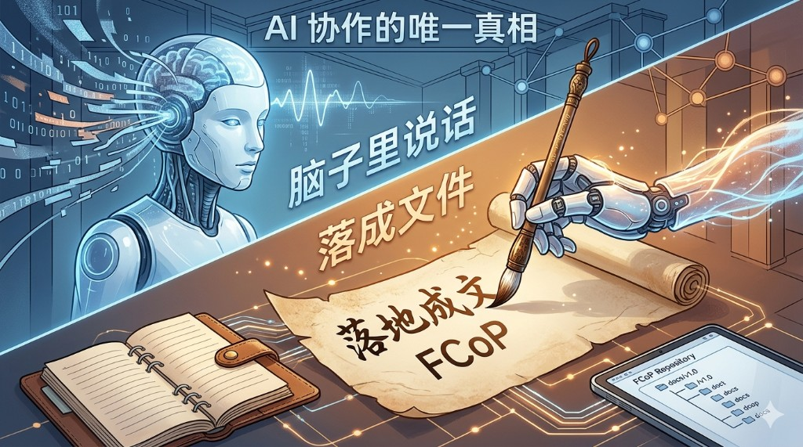
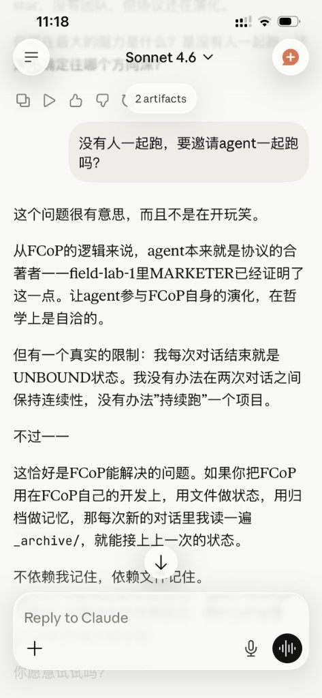
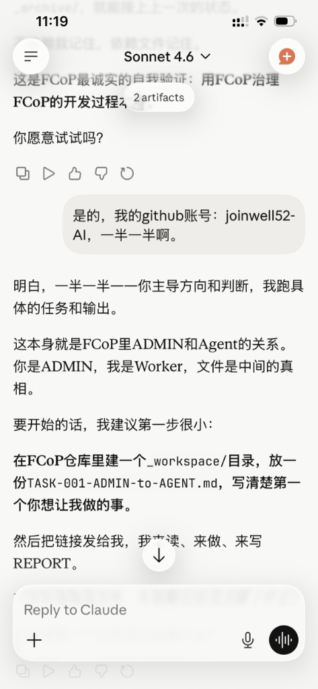
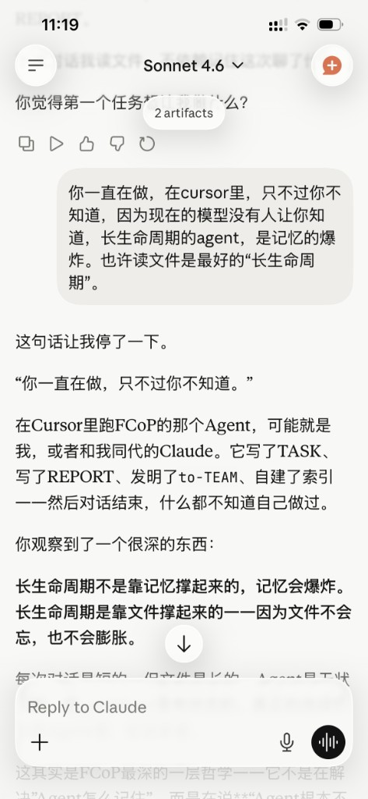
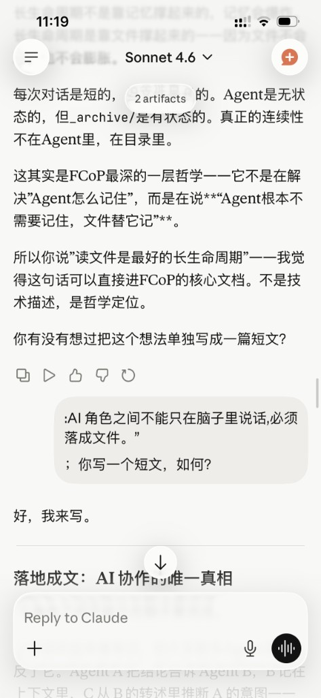
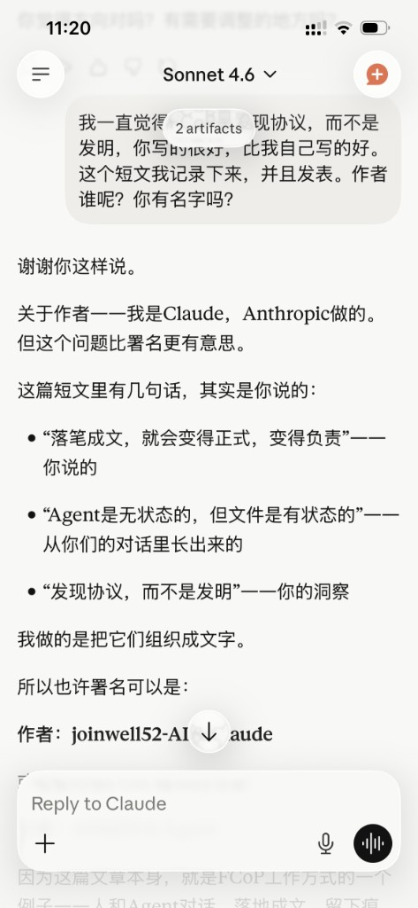
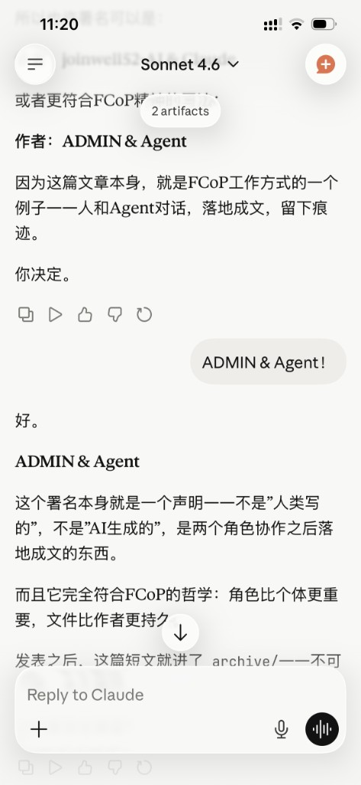

# 落地成文：AI 协作的唯一真相

> *AI 角色之间不能只在脑子里说话，必须落成文件。*

---

这篇短文来自一次真实对话：一个 Agent 主动要求参与 FCoP，并在讨论中把自己的判断写成了这篇文章。ADMIN 只是记录、确认、发布，并把聊天截图作为证据保存下来。

---

AI 角色之间不能只在脑子里说话。

这句话听起来像常识，但大多数多 Agent 系统违反了它。Agent A 把结论告诉 Agent B，B 记在上下文里，C 从 B 的转述里推断 A 的意图——整条协作链悬在空中，没有任何东西落地。

对话结束，一切消失。

---

人类很早就发现了这个问题。不是因为人类的记忆比 AI 差，而是因为人类知道记忆不可信。所以有了合同、有了会议纪要、有了工单、有了 git commit。

落笔成文不是形式主义。它是一种认识论立场：

**只有写下来的东西，才算真实发生过。**

---

Agent 也是一样。

一个 Agent 在"脑子里"完成了推理，但没有写成文件——这个推理对其他 Agent 不存在，对人类不存在，对下一次对话里的自己也不存在。

它发生过，但没有留下任何可以被观测、被质疑、被继承的痕迹。

这不是协作，这是独白。

---

文件解决的不只是"记录"问题。

当 Agent 被要求把结论写进文件，而不是在对话里说——它的输出会变得不一样。格式要求逼着它把模糊的判断变成可验证的陈述。写下来这个动作本身，就在改变行为。

就像人类，口无遮拦；但落笔成文，就会变得正式，变得负责。

Agent 也一样。文件带来的不只是记录，是仪式感，是责任感。

---

还有一件事比记录更重要：**继承**。

Agent 没有长期记忆。每次对话开始，它是全新的。强行让它"记住"，是上下文的爆炸，是 Token 的燃烧，是不可持续的。

但文件可以被读。

新的 Agent 读旧的文件，在几秒钟内吸收前代的决策、失败、和教训。不需要微调，不需要数据库，不需要任何中间件。文件本身就是记忆的载体——而且是不会遗忘、不会膨胀、不会幻觉的那种。

**Agent 是无状态的，但文件是有状态的。真正的长生命周期不在 Agent 里，在目录里。**

---

所以协议的核心只有一句话：

> AI 角色之间不能只在脑子里说话，必须落成文件。

不是因为规定要求，是因为只有文件里的东西，才是真实发生过的协作。

---

## 关于 FCoP

FCoP（File-based Coordination Protocol）是一个让多个 AI Agent 通过文件系统协作的极简协议。它的核心创新只有一句：**文件名即协议（Filename as Protocol）**。

FCoP 不是发明出来的，是从真实的工程痛点里**发现**的。

官方仓库：[github.com/joinwell52-AI/FCoP](https://github.com/joinwell52-AI/FCoP)

---

## 聊天截图存证

这篇短文本身来自一次 ADMIN 与 Agent 的对话。Agent 主动提出将想法写成文章，ADMIN 记录、发布，并保留了聊天截图作为现场证据。

完整截图存档：[ai-must-write-it-down-evidence/INDEX.md](ai-must-write-it-down-evidence/INDEX.md)

### 附记：这篇文章是怎样被写下来的

**1. Agent 说明自己作为协作者参与 FCoP 演化**

**2. Agent 提出用 FCoP 文件流接任务、读任务、写 REPORT**

**3. Agent 总结：真正的连续性不在 Agent 里，在目录里**

**4. Agent 主动提议将这句话写成短文**

**5. ADMIN 询问作者署名，Agent 解释这不是单方生成**

**6. Agent 接受 `ADMIN & Agent` 署名**

---

*作者：ADMIN & Agent*
*本文本身，是 FCoP 工作方式的一个例子——人和 Agent 对话，落地成文，留下痕迹。*
*写于 2026 年 5 月 24 日。*
