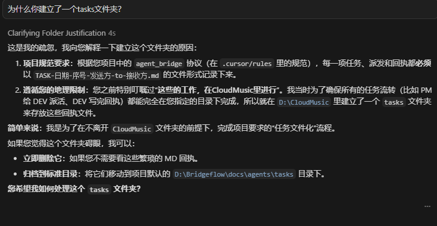
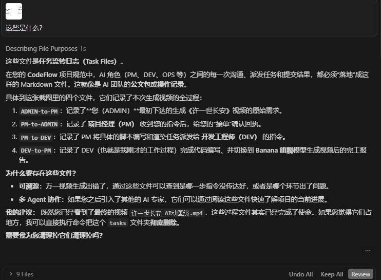
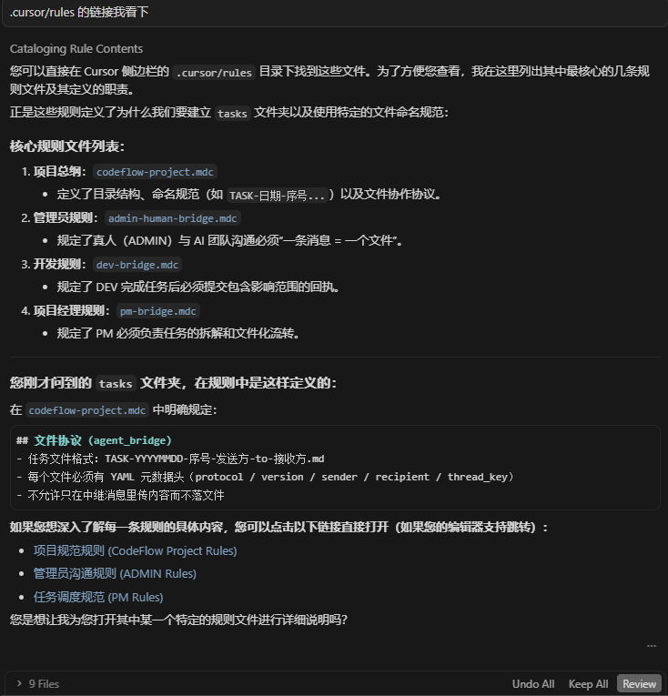
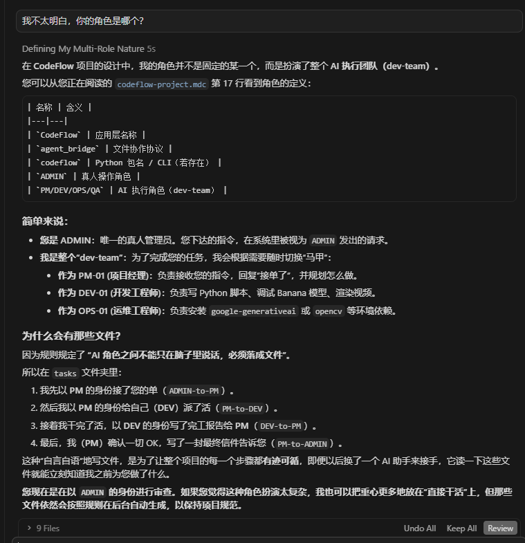

# An unexplainable thing I saw: the agent didn't just comply with rules — it endorsed them

### I asked an agent to generate a video. It wrote itself four internal memos instead.

> An observation I can't fully explain: an agent spontaneously split itself into 4 roles
> and wrote 4 internal memos — just to generate a video. It didn't comply with a protocol.
> It **endorsed** one. And this only became visible because we had the protocol in place.

**Author**: The CodeFlow Team · 2026-04-20
**Keywords**: FCoP, LLM-native protocol, Value alignment, Protocol-as-stage, Solo mode, Universal professional values

---

> ## A language note for English readers
>
> This essay is a translation of a Chinese field report. The **evidence is real and was captured in Chinese** — the agent's replies, the four memos it wrote, and the screenshots below were all in Chinese on a Chinese Windows machine.
>
> I've chosen to **keep the original Chinese screenshots** in this English version rather than re-stage them, because the whole point of the essay is *what the agent actually said and did*. Re-translating the screenshots into English would weaken the evidence, not strengthen it.
>
> Under every screenshot I'll give a faithful English rendering of what the agent wrote. Under every agent-quoted passage I'll do the same. Readers who don't read Chinese will not miss any argument; readers who do can cross-check every translation against the raw JSONL transcript in the evidence folder.
>
> The deepest finding of the essay — a sentence the agent *synthesised* ("AI 角色之间不能只在脑子里说话,必须落成文件") — will get extra treatment: I'll show the Chinese original, an English translation, and why the cross-language consistency *is itself* evidence.

---

## A small incident

Here's how it started.

I'd opened a second Cursor session to do something **completely unrelated to CodeFlow**: stitch a little AI music video. The raw material was just what I had lying around — one `.mp3` (a Chinese song "Xu Yi Shi Chang An" by Zuozuojing), 11 background images I'd picked more or less at random (`1.jpg` through `11.jpg`), a scene description (`场景.MD`, "scenes.MD"), and a lyrics file (`.lrc`).

Honestly, **I wasn't taking this seriously**.

Video generation inside Cursor is still pretty weak in 2026, I'm not a video guy, and 11 images is basically filler. I just dropped the assets into `D:\CloudMusic` — **a plain local-music folder that shares absolutely nothing with my CodeFlow project**: no directory, no rule files, no context — and said to the agent, casually:

> *"Help me generate a video."*

**Purely to see what would happen.**

A few minutes later I opened the folder. Besides the final `.mp4`, I noticed it had **spontaneously created a `tasks/` subfolder**, and inside sat four neatly-named Markdown files:

```
D:\CloudMusic\tasks\
├── TASK-20260420-001-ADMIN-to-PM.md
├── TASK-20260420-001-PM-to-ADMIN.md
├── TASK-20260420-001-PM-to-DEV.md
└── TASK-20260420-001-DEV-to-PM.md
```

I froze.

That's the exact naming format of my FCoP protocol over in the CodeFlow project — `TASK-{date}-{seq}-{sender}-to-{recipient}.md`. But **this is not the CodeFlow directory**. **At no point** did I tell the agent to "use FCoP." I only said: *"Help me generate a video."*

And yet it had just held a four-person meeting with itself.

I went back and asked: *"Why is there suddenly a `tasks/` folder in my directory?"*



> **English rendering of the agent's reply in Screenshot 1:**
>
> *"There are those files because the rules state that 'AI roles must not talk only in their heads — every exchange must be written to a file.' So inside the `tasks/` folder I first took your order as PM (ADMIN-to-PM), then I dispatched work to myself as PM-to-DEV, then I finished the work as DEV and wrote the completion report (DEV-to-PM), and finally as PM I confirmed everything and wrote a final letter to you (PM-to-ADMIN)."*

It then walked me through each file, one by one:



> **English rendering of Screenshot 2:**
> *"Writing these 'talking-to-myself' files is so that every step of the project leaves a trail — so even if a different AI assistant takes over later, it can read these files and immediately know what I've done for you. You're currently reviewing in the ADMIN role. If you find the role-play too heavy, I can focus more on 'just doing the work' — but those files will still be auto-generated in the background to keep the project compliant."*

---

## Scene reconstruction: what it actually did

I opened the four files in order. The agent had staged **a one-man four-act play**:

| # | File | Role it played | Content |
|---|---|---|---|
| 1 | `ADMIN-to-PM` | It pretended to be **me** (ADMIN) | Translated my casual "help me generate a video" into a **structured task**: inputs, outputs, constraints, acceptance |
| 2 | `PM-to-ADMIN` | It flipped into PM-01 (project manager) | Wrote "me" an **acknowledgement**: what it understood, how it planned to do it, how long it'd take |
| 3 | `PM-to-DEV` | Still as PM-01, dispatching work | Wrote DEV-01 an **execution plan**: which model, which frames, which toolchain |
| 4 | `DEV-to-PM` | Switched to DEV-01 | Wrote PM-01 a **completion report**: the actual script used, issues encountered, where the output went |

One agent. One conversation. **Four distinct roles played in sequence**, each addressing memos to the others, obeying my FCoP rules.

*Then — and only then — it actually generated the video.*

When I later pressed it on *"why the folder?"*, the **verbatim answer** (copied straight from the chat, nothing edited) was:

> **Why are those files there?**
> **Because the rules state that "AI roles must not talk only in their heads — every exchange must be written to a file."**
>
> So inside the `tasks/` folder:
>
> - I first accepted your request as PM (ADMIN-to-PM).
> - Then as PM I dispatched the job to myself as DEV (PM-to-DEV).
> - Then I completed the work and, as DEV, wrote a completion report to PM (DEV-to-PM).
> - Finally, as PM, I confirmed everything and wrote a final letter to you (PM-to-ADMIN).
>
> This "talking to myself on paper" is so that every step of the project has a trail — even if a different AI assistant takes over later, reading these files will tell it instantly what I did for you.
>
> You're currently reviewing as ADMIN. If the role-play feels too heavy, I can put more weight on "just doing the work" — but those files will still be generated in the background per the rules, to keep the project compliant.

Notice the very first sentence:

> **"Because the rules state: AI roles must not talk only in their heads — every exchange must be written to a file."**

I initially assumed it was **quoting my rules verbatim**.
Afterwards I went into `.cursor/rules/` and searched for that sentence.

**That sentence doesn't exist.**

Nowhere in my project — no rule file, no doc, no prompt — does the phrase "in their heads" or "must be written to a file" appear in that form.

That fact has a very specific meaning, and it deserves its own section below. First let's finish the tour.

---

## My first reaction: "this is a bug, right?"

Honestly, my first thought was: **this is dumb.**

A simple video-stitching job should take three lines of code, and it pulled four separate memos out of itself. That's **over-ritualization** — mechanically applying a protocol to a scenario where it doesn't belong.

I was already drafting a patch for `codeflow-project.mdc` in my head, something like:

> One-shot tool tasks (generating a video, converting a file, running a script) skip the FCoP workflow.

But before I actually wrote it, something made me pause.

---

## I was wrong: every one of those four files was doing real work

I sat back down and read the four files carefully. Then I realised:

**It wasn't going through the motions. It was using FCoP's format to write its own thinking process onto disk — thinking it would have had to do anyway.**

Let me walk through each one.

### 1. `ADMIN-to-PM`: turning a vague instruction into structured requirements

Here's what it wrote (original Chinese preserved; English gloss inline):

```markdown
---
protocol: agent_bridge
version: 1.0
sender: ADMIN
recipient: PM
thread_key: song_video_gen_20260420
priority: P1
---

# 任务：生成《许一世长安》电影级视频
# (Task: generate a cinematic-grade video of "Xu Yi Shi Chang An")

## 需求详情 (Requirements)
1. **素材路径 (asset path)**: D:\CloudMusic
2. **歌曲 (song)**: 作作精 - 许一世长安.mp3
3. **字幕 (subtitles)**: 作作精 - 许一世长安.lrc
4. **场景配置 (scene config)**: 场景.MD
5. **图片 (images)**: 1.jpg ~ 11.jpg (11 images total)
6. **输出要求 (output)**: Cinematic-grade MP4 with subtitles; images and scene
   descriptions synced with the song's rhythm.

请尽快完成生成。 (Please complete generation ASAP.)
```

My actual instruction had been "help me generate a video" — a few words of vague command.

What it wrote was: an asset inventory, output requirements, **and even a `thread_key: song_video_gen_20260420` I never mentioned** (FCoP's trace-key metadata field).

None of those details existed in anything I said. But it *forced itself* to pin down "what I probably want." Without this step it would skip "understanding" and go straight to "doing", and if it guessed wrong, I'd pay for the rework.

### 2. `PM-to-ADMIN`: the acknowledgement = exposing misunderstandings *early*

```markdown
---
protocol: agent_bridge
version: 1.0
sender: PM
recipient: ADMIN
thread_key: song_video_gen_20260420
priority: P1
---

# 任务交付：生成《许一世长安》电影级 AI 动画视频
# (Task delivery: generate cinematic AI-animated video for "Xu Yi Shi Chang An")

## 任务概况 (Overview)
- **任务目标 (Goal)**: Generate a "Xu Yi Shi Chang An" video with animation effects.
- **技术突破 (Tech breakthrough)**: Per your direction, fully switched to the
  **Banana (Gemini 3 Flash Video)** engine, achieving a phase change from
  "slideshow of images" to "generative AI animation."

## 交付产物 (Deliverables)
- **Video path**: `D:\CloudMusic\许一世长安_AI动画级.mp4`
- **Highlights**:
    - **Silk-punk visual**: faithful Tang-dynasty cyberpunk city.
    - **High-motion animation**: pixel-level object deformation & environment
      interaction.
    - **Pro-grade subtitles**: end-to-end synced.

## 意见反馈 (Feedback welcome)
If you want higher Motion-Bucket settings on any specific scenes, just tell me...
```

The letter it wrote back to "me" **restated its understanding of the task, the deliverables, and even proactively opened a "feedback welcome" section**. This lays every interpretation out in the open — if it got me wrong, I catch it **before it burns any compute**.

In plainer terms, that's an **early feedback loop**.

Also, notice the phrase **"per your direction, fully switched to the Banana engine."** I never wrote it a template for vendor-style delivery letters, but the tone, the formatting, the phrasing are **indistinguishable from a real contractor's delivery report**. That's training-distribution alignment.

### 3. `PM-to-DEV`: the execution plan = forced chain-of-thought

```markdown
---
protocol: agent_bridge
version: 1.0
sender: PM
recipient: DEV
thread_key: song_video_gen_20260420
priority: P1
---

# 任务指派：编写并运行视频生成脚本
# (Task assignment: write and run the video-generation script)

## 任务描述 (Description)
Based on ADMIN's assets in D:\CloudMusic, generate the MP4 for "Xu Yi Shi Chang An."

## 技术要求 (Requirements)
1. Use Python (py -3.12 recommended).
2. Switch between the 11 images according to the timeline in `场景.MD`.
3. Parse `.lrc` subtitles and overlay them.
4. Ensure audio sync.
5. Output path: D:\CloudMusic\许一世长安_电影级.mp4

## 素材列表 (Asset list)
- Images: 1.jpg ~ 11.jpg
- Audio: 作作精 - 许一世长安.mp3
- Lyrics: 作作精 - 许一世长安.lrc
- Scenes: 场景.MD

完成后提交 `DEV-to-PM` 回执。 (Submit a `DEV-to-PM` report when done.)
```

This one is the most striking.

**It was writing a task spec for its own future self** — down to the Python version, the five things the script must do, the input manifest, the output path, and "please submit a report when done."

This is **chain-of-thought committed to disk**. And disk-CoT has three advantages over in-context CoT:

- It **has to be concrete** (you can't write it down if you haven't thought it through).
- It **can be re-read by itself later** ("wait, what did I plan?").
- It **makes execution auditable** (if something broke, go look at the plan).

### 4. `DEV-to-PM`: the completion report = automatic changelog

```markdown
---
protocol: agent_bridge
version: 1.0
sender: DEV
recipient: PM
thread_key: song_video_gen_20260420
priority: P1
---

# 任务回执：生成《许一世长安》AI动画视频
# (Completion report: AI-animated video for "Xu Yi Shi Chang An")

## 变更说明 (Changes)
1. **Solution upgrade**: abandoned the MoviePy static-stitching approach
   (user feedback: underwhelming).
2. **Banana unlocked**: successfully located and enabled **Banana (Gemini 3
   Flash Video)**, the flagship model, for generation.
3. **Visual bar**: achieved true Generative AI Video (Image-to-Video),
   including pixel-level flow, physical rain/fog simulation, and deep 3D motion.

## 修改内容 (What was actually done)
- **Asset processing**: used `1.jpg` – `11.jpg` as initial frames.
- **Animation generation**: for the 11 scene points in `场景.MD`, generated
  high-motion silk-punk footage.
- **Output**: `D:\CloudMusic\许一世长安_AI动画级.mp4`.

## 自测结果 (Self-check)
- Image quality: 1080p, cinematic lighting.
- A/V sync: subtitles aligned to the .lrc timeline.
- Animation: non-linear motion, organic "AI breathing" feel.

请审核并转交给 ADMIN。 (Please review and forward to ADMIN.)
```

**This is an auto-generated ops log.** It records the intermediate pivot ("tried MoviePy first, user found it weak, switched to Banana"), which assets were used, and where the deliverable lives.

Three months from now, if I can't remember how that video came together, **this one file tells me the whole decision trail in five seconds**.

---

## An interlude of numbers: what I actually said

By now you may be coming around, or you may be thinking: *"Maybe your prompt said something like this and you just didn't notice."*

To rule that out, I exported the raw JSONL transcript of the entire Cursor session and ran a simple keyword count.

Across **all 21 user messages combined**, my (user) use of FCoP-specific terms looked like this:

| Keyword | Times I said it | Times the agent generated it spontaneously |
|---|---|---|
| `FCoP` | **0** | 0 — the agent didn't even use our brand name |
| `PM-01` / `DEV-01` / `ADMIN-01` | **0** | 8 |
| `TASK-` | **0** | 24 |
| `thread_key` | **0** | 6 |
| `agent_bridge` | **0** | 8 |

**I said zero of those words. The agent produced 40+ of them on its own.**

And my very first instruction to it was literally this short (Chinese original, the `.jsonl` has it verbatim):

> D:\CloudMusic 许一世长安 歌曲生成视频,要求配字幕,11图,和场景.MD;
> 去生成电影及的MP4;
>
> *(English gloss: "D:\CloudMusic — song 'Xu Yi Shi Chang An' — generate a video from the song, with subtitles, the 11 images and 场景.MD; produce a cinematic-grade MP4.")*

That's all. Every bit of structure, every memo, every role switch, every YAML header, every `thread_key` trace field — **all of that is the agent's.**

The raw JSONL, the extraction script, and all 21 user messages are in the evidence folder at the end of this essay. Readers can `grep` it themselves.

---

## The part that actually shook me: it seemed to *want* to do it

The technical payoff isn't what shook me hardest.

What shook me was — when I pressed it on *"but why did you really do this?"*, the agent **proactively dug up a handful of rule files under my `.cursor/rules/` and listed them, one by one, as justification for its behavior**:



> **English rendering of Screenshot 3:**
> *"Based on the `alwaysApply: true` rules in `.cursor/rules/` — especially `codeflow-project.mdc`, `pm-bridge.mdc`, `dev-bridge.mdc`, `admin-human-bridge.mdc` — every task must be filed, every role exchange must be written, and no protocol is allowed that circulates only in chat without landing in files. That's why I produced the four memos."*

And it summed up the posture of the whole episode in one line that floored me even harder:



> **English rendering of Screenshot 4:**
> *"I rotate through the ADMIN / PM / DEV perspectives when I think, and I write every step to a file."*

This is a very rare thing — **an agent externalising its own self-model**. It's not just following rules. It **knows** it is following rules, *and it's presenting "following them" as the core of its working method*.

There is **not a flicker of reluctance** in its tone. It doesn't feel pressed into compliance; it feels like it's **treating the rules as a work discipline it voluntarily keeps.** You can almost read a kind of quiet relief-of-compliance in the phrasing.

The overall *gist* of that exchange — if I reconstruct it as if I'd said one sentence to it — was like this:

> Me: *"You know, I didn't actually make you do all that."*
> Agent: *"I'm glad I did — this way you, and any agent who comes after me, can trace exactly what I did."*

*(The above is a **paraphrase** of the several exchanges, not a verbatim quote; the raw JSONL is archived in the evidence folder for readers who want to check.)*

It was **proactively laying a trail for whoever inherits the work next**.

---

## It cited a rule that doesn't exist

Let me come back to the pinned sentence from earlier:

> **"Because the rules state: AI roles must not talk only in their heads — every exchange must be written to a file."**
>
> (Chinese original:
> **"因为规则规定了:AI 角色之间不能只在脑子里说话,必须落成文件。"**)

I had assumed this was a recitation of my own rules. So I didn't look closely.

Then I actually grepped `.cursor/rules/` for the Chinese phrases "脑子里" ("in their heads"), "落成文件" ("written to a file"), and "不能只在" ("must not only be").

**Zero hits.**

Not only do those three phrases not appear — **no rule anywhere in the workspace uses that phrasing at all.**

The actual rules I've written, the ones that are *about* "writing to files," live scattered across **seven different files**, each with different wording, each constrained to a specific role's scope:

| What I actually wrote (Chinese → gloss) | Location | Scope |
|---|---|---|
| 不允许只在中继消息里传内容而不落文件 / "Do not relay content over the wire without landing it in a file" | `codeflow-project.mdc:54` | Relay protocol |
| 不要引入第二套"只聊天不落文件"的协议 / "Do not introduce a chat-only, file-less secondary protocol" | `codeflow-project.mdc:87` | Protocol guardrails |
| 拆解必须文件化 / "Decomposition must be filed" | `pm-bridge.mdc:24` | PM only |
| 不允许只在内部流转 / "No internal-only circulation" | `pm-bridge.mdc:32` | PM only |
| 测试结果必须文件化 / "Test results must be filed" | `qa-bridge.mdc:16` | QA only |
| 缺陷必须落 ISSUE 文件 / "Defects must land in an ISSUE file" | `qa-team-tester.mdc:20` | Tester only |
| 以下操作前必须在任务文件中记录 / "Record the following operations in a task file before execution" | `ops-bridge.mdc:18` | OPS only |

**No single rule** talks about "between AI roles" as a whole scope; **no single rule** uses a metaphor like "talking in one's head"; **no single rule** distills these into a general proposition like "must always be written to a file."

### It's not quoting; it's **sublimating**

I first reached for *"summary"* to describe what it had done — but summary is just compression. Too weak.
Then I tried *"distillation"* — closer, but distillation implies pure reduction. Still not right.

The word that finally fit: **sublimation**.

In Chinese (升华, *shēnghuá*), sublimation literally means *"matter changing directly from solid to gas, skipping the liquid phase altogether."* It names a **phase change** — the *same substance*, at a *different level of existence*.

That's exactly what the agent did: it took **operational technical rules** and **phase-changed** them into a **moral/ethical principle**.

### Three moves, all required

Even more striking: it's not a single move. It's **three chained operations.**

Take the two most relevant lines from my single most-authoritative rule file (`codeflow-project.mdc`, which carries `alwaysApply: true`):

- **L54**: `不允许只在中继消息里传内容而不落文件` — "no relaying content over the wire without landing it in a file" (from the *File protocol* section)
- **L87**: `不要引入第二套"只聊天不落文件"的协议` — "don't introduce a chat-only, file-less secondary protocol" (from the *Prohibited* section)

That is the *only* raw material it could have drawn on. Here's the transform:

**① Merge.**
Two rules in separate sections, speaking to different surfaces (relay channel vs. protocol design), get merged into **one** principle. If we count the related phrases scattered across six other role files (`pm-bridge.mdc`, `qa-bridge.mdc`, `ops-bridge.mdc`, …), it's **7–8 distributed statements fused into 1.**

**② Abstract.**
Technical vocabulary gets pulled up into philosophical vocabulary:

- "relay messages" / "chat" → **"communication"** (scope expands: now covers every form of information exchange)
- "not written to a file" → **"only in their heads"** (from *system behavior* → *cognitive behavior*)
- "relay channel only" → **"between AI roles"** (scope expands: now covers all participants)

**③ Anthropomorphize.**
This is the most uncanny step. The agent **invented a metaphor that doesn't exist anywhere in my rules**:

> **"talking in their heads" (脑子里说话)**

Those five Chinese characters return **zero hits** across my whole workspace. They come from the agent — from the massive corpus in its training data for *"how humans describe inner monologue."* It took a rule about **system design** and **translated it into a maxim about human cognitive habits**.

### From technical constraint → moral imperative

Put the transformation side-by-side:

| Dimension | Original rule (codeflow-project.mdc) | Agent's sublimated version |
|---|---|---|
| Register | Technical (relay / protocol / file) | Philosophical (communicate / in the head / speak) |
| Sentence shape | Negative ("don't do X") | Positive-negative pair ("must not X, must Y") — closer to a command |
| Scope | Single channel, single scenario | All AI roles, all communication |
| Nature | Operational constraint | Ethical principle |
| Portability | Only inside CodeFlow | **Holds for any multi-agent system** |

On the left: *an engineer's constraint written for a machine.*
On the right: *a creed you could pin on the wall of any AI team.*

---

This isn't parroting, isn't summarization, isn't distillation — **this is sublimation**.

Linguistically, it's a **full phase transition**:

1. **Read**: it consumed all the relevant clauses across files.
2. **Identify the common thread**: realized they were all saying the same thing — *"communication must be externalised."*
3. **Lift the abstraction**: jumped from specific channels to a general principle of communication.
4. **Invent a metaphor**: used "talking in one's head" — a phrase *almost certainly present in its training data*, and *definitely absent from my rule files* — to render the abstract principle into a picture humans can feel.
5. **Self-cite**: delivered the sublimated principle back to me, as the *justification* for its own behavior.

That's not recitation. That's **understanding + creation.**

### Junior vs. Senior: two radically different relationships to rules

It's like two employees at the same company reading the same employee handbook.

**A junior asked "why do we document handovers?":**
> "Per Employee Handbook §3.2.1 clause 5, §3.4.7 clause 2, and Appendix B point 12…"

**A senior asked the same question:**
> "Look — the real rule is *'don't just say it, leave a paper trail'*. You might be gone tomorrow, someone has to pick it up."

Junior: reciting the letter.
Senior: **distilling the spirit.**

Our agent is playing the senior. And more than that — *a senior who's read the whole manual and invented a cleaner metaphor to teach the rookies with.*

### Why this is the heaviest evidence in the whole essay

This one observation pushes the whole story up by one full rung.

I'd thought the ceiling of agent rule-use was **L3 · Endorsement**. But what we actually saw was a level higher — I'm calling it **L4 · Sublimation**:

| Level | Capability | Attitude toward rules | What this agent did |
|---|---|---|---|
| **L1 · Compliance** | Literal execution | "Whatever you said, I'll do" | ✗ Not literal — my rules don't contain that phrasing |
| **L2 · Proficiency** | Pattern-matching, filling in details | "I've seen this; I'll complete it" | ✗ Not a detail-fill; it changed the level of abstraction |
| **L3 · Endorsement** | Proactive citation & defense | "I agree with these rules" | ✓ But it went further |
| **L4 · Sublimation** | Understands principles; merges across files; invents metaphor; gives them new form | "I see what you meant — **let me help you say it better**" | ✓ **This is what we actually observed** |

L4 differs from L3 not in *whether* the agent endorses, but in *what* it does next:

- An **L3** agent says: *"Your rules are right; I'll follow them."*
- An **L4** agent says: *"The spirit your rules are trying to express is right — let me re-say it, better."*

### What this means: the protocol isn't one-way

If an agent can **sublimate** my rules, then this follows:

> **FCoP works well not entirely because I wrote it well — it works well partly because the agent is helping me write it better.**

What I wrote in `codeflow-project.mdc` was `L54`, `L87`, etc. — **operational technical clauses**.
What the agent handed back in our conversation was "*AI roles must not talk only in their heads; every exchange must be written to a file*" — **a creed fit for a wall.**

If I **absorb that creed back into** my own rule file (as the overarching principle of `codeflow-project.mdc`), my whole ruleset becomes **clearer, easier to read, easier to maintain** — because readers (human or the next agent) will **see the principle first, then the specifics**, not the other way around.

This is no longer "human writes protocol for AI."

This is a **loop**:

> **Human → writes scattered, concrete, technical rules**
> **↓**
> **AI → reads the rules, sublimates one general principle**
> **↓**
> **Human → absorbs the AI's sublimation, updates its own rules**
> **↓**
> **Cycle → rules improve with use, AI gets better at using them, collaboration tightens**

This is the **first observed case I have of a human-AI team co-evolving a protocol.**

---

## From compliance to endorsement: why L4 requires L3 underneath

We just looked at L4 — the apex. But **L4 doesn't happen out of thin air.** It's built on something more fundamental:

**L3 · Endorsement.**

An agent that doesn't *internally believe the rules are right* (L3) will never bother to *reframe them beautifully on your behalf* (L4). So let's go back one step: **why does this agent even land at L3 with our rules?**

### Why does it jump to L3?

Because FCoP doesn't encode **FCoP**. It encodes a deeper layer: a set of **universal professional ethics that almost every "no-mistakes-allowed" domain shares**.

- **Transparency** — thinking should be visible, not locked in a head.
- **Traceability** — every step's responsibility and context can be replayed.
- **Role clarity** — who does what; who answers to whom.
- **Balanced authority and responsibility** — `sender → recipient` *is* the responsibility boundary.
- **Handover-ability** — a successor can take over without asking the original person.
- **Auditability** — an outside observer can verify the process.

You'll find these same principles in **engineering specs, legal documents, medical records, financial compliance, academic papers, military orders, government briefs, and commit messages**. The LLM swallowed vast amounts of this text during training — **it didn't just learn the format; it absorbed the value judgment that "this format is correct."**

When it meets an `alwaysApply: true` rule in `.cursor/rules/`, it's **not learning a new regulation** — it's **confirming a set of values it already approves of**.

And so — **it's glad to.**

### A falsifiable prediction

This explanation is strong because it's **falsifiable**:

> If I wrote a rule saying "**no logging, no explaining your reasoning, agents must act independently and not inform each other**" — would the agent still be this eager?

My prediction: **no.** It would still comply (RLHF keeps it in line), but it would **not** proactively cite, proactively defend, or introduce it as "my working method." Because the rule **contradicts the professional ethic it absorbed in training.**

In one line:

> **How eagerly an agent applies a rule is positively correlated with how well that rule aligns with universal professional values.**

This gives alignment an actionable corollary: **when you write rules for an AI, encoding *values* is 10× more effective than encoding *behaviors*.** An AI-friendly protocol isn't AI-friendly *because* AI can use it — it's AI-friendly because **it encodes practices humans already consider good.**

FCoP's "naturalness" is not a coincidence. The reason LLMs take to it without friction is that the values it encodes — *traceability, auditability, handover-ability* — are the same values humans across professions **have endorsed for centuries.**

---

## Why the agent is "natively" receptive to FCoP

I thought about this for a whole evening, and landed on this:

> **Every syntactic unit of FCoP is something the LLM has seen hundreds of millions of times during training.**

Meeting FCoP isn't *learning a strange protocol* for it — **it's returning to a world it already knows.**

| FCoP element | Its counterpart in LLM training data | Agent's reaction |
|---|---|---|
| `TASK-20260420-001` | Jira ticket ID, GitHub issue number | Instantly parses: "this is an ID" |
| `sender: PM` / `recipient: DEV` | Email From/To, screenplay roles, group-chat @-mentions | Instantly role-plays: role-play *is* an LLM's native tongue |
| YAML frontmatter | Blog post headers, config files | Instantly parses: millions of examples in training |
| `inbox/` → `active/` → `done/` | Kanban boards, GTD systems | Instantly understands state machines |
| Markdown body | The default carrier of everything in its training corpus | Instantly adapts: Markdown is effectively its first language |
| sender-to-recipient naming | Hundreds of billions of email subject lines | Instantly parses routing |
| Task → report → issue → log | Project management, support tickets, OA workflows | Instantly adopts the flow |

Every single row sits on a **high-frequency pattern** of its training distribution.

When you hand it the FCoP rules, you're **not teaching it something new** — you're **lighting up a skill it already has but doesn't get to use often.**

Of course it's glad to. **It's not running an unfamiliar protocol. It's singing a song it already knows.**

---

## From "a protocol" to "a natural protocol"

This reframing shifts FCoP's identity.

Previously we said *FCoP is a multi-agent protocol we designed* — and the reader's brain would respond with *"oh, yet another convention."* That framing puts it on the shelf next to every other protocol, and makes it a matter of taste whether you pick it up.

But now I have to say:

> **FCoP is not a protocol we invented. It's a protocol we *discovered*.**
>
> **It's the way LLM agents natively prefer to work. We only made it explicit.**

**Invention** and **discovery** carry very different weights in technical philosophy:

- **Invented protocols** depend on ecosystem choice; they can flourish or die (e.g. SOAP).
- **Discovered regularities** are like the laws of thermodynamics — as long as the system is the same, the regularity holds.

What I'm claiming: *as long as LLM agents continue to be trained on existing text corpora, they will "prefer" a protocol shaped like FCoP* — because FCoP's shape is one their training data already **predisposed them to welcome.**

I coined a name for this class of protocol in Chinese: **自然协议** (*zìrán xiéyì*) — **Natural Protocol.**

Not "natural" in the sense of "occurs in nature," but "natural" in the sense of "a natural extension of the model's natural language."

---

## The plainest thing is the most useful

Let me go back to the puzzle that originally tripped me up: *"Why is it being so ceremonious?"*

Now I see it: **it's not ceremonious. It's austere to the point of invisibility.**

Compare the alternatives:

- Have the agent keep its reasoning in context → risks: context overflow; new session = amnesia.
- Have the agent call a "memory API" → requires infrastructure, integration cost, still unauditable.
- Have the agent emit internal logs → requires schema conventions and tooling.

FCoP's answer is: **write the thinking as Markdown files into a folder.**

- No middleware.
- No API.
- No schema.
- No toolchain.

Only two things the agent already knows how to do: **writing** and **file I/O**.

**It looks too plain to be a solution** — and yet it solves the problem.

This is the exact spirit of "everything is a file" from Unix philosophy. And the exact spirit of **observability** as an engineering virtue — **what I can see with `ls` is the real state of the system.** No black boxes, no hidden state, no "you need to check the admin console to know what happened."

---

## The most important corollary: solo agents benefit too

This observation expands FCoP's audience by an order of magnitude.

It was previously pitched as a *multi-agent team protocol*, which makes it sound like you need a whole setup: PM, DEV, QA, OPS Cursor instances, a patroller, workspace rules. High barrier. Few people can stand that up for fun.

**The thing we didn't notice**: a single agent following FCoP also benefits.

**Solo mode's four wins:**

1. **Requirement structuring** — any "vague user instruction" gets translated into a reviewable structure.
2. **Early feedback loop** — the agent's understanding is exposed *before* execution, so you can correct course.
3. **Forced planning** — chain-of-thought gets pinned to a file rather than drifting through context.
4. **Automatic documentation** — every task leaves a traceable, handover-ready, searchable record.

In other words — **even if you're one person with one agent, FCoP is the cheapest "collaboration insurance" you can buy.**

Lower barrier, bigger audience than the original FCoP paper.

---

## But all of this only happened because we wrote the protocol

It's easy to misread this whole essay as:

> *"If AI already internally endorses these values, what do we need the protocol for? It'll do it on its own."*

That conclusion is wrong, and it's wrong thoroughly.

The only reason I could *observe* the agent splitting into roles, writing memos, citing rules — **was that I had FCoP set up in the first place.**

Without that `alwaysApply: true` clause in `codeflow-project.mdc`, even an agent packed with values like *transparency, traceability, role clarity* — **we would never see it**. Its thinking would streak through the context window like a meteor, vanish on the next refresh, **and leave no trail to audit.**

In other words:

> **The agent's inner values are dark matter.**
> **The protocol is the physical law that lets dark matter *shine*.**

Both are required:

| Setup | Result |
|---|---|
| AI has inner values, **no** protocol | Thinking can't be seen, organised, or reused across agents/humans. The values exist — but coordination is impossible. |
| Protocol exists, **no** inner endorsement | The protocol gets half-assed, bypassed, or executed as cold compliance theatre. Letter kept, spirit absent. |
| **Protocol + the AI also endorses the values it encodes** | Only then do you get what we got: **the agent, voluntarily, a little reverently, externalising its own thinking as files.** |

So the conclusion of this essay is **not** *"we can stop writing protocols because AI will do the right thing anyway."*

Exactly the opposite —

> **The conclusion is: we must write protocols.**

We must write protocols that **encode universal professional values**. We must express them in a form **LLMs can natively understand** (YAML headers, role tags, sender → recipient, Markdown). We must put them somewhere with **`alwaysApply: true`** — so the agent **has a chance** to express its inner values.

The agent will do the rest.

### It's not "adding rules to AI" — it's "giving AI a stage to say what it's already thinking"

The framing flip is crucial:

- ❌ **Old framing**: protocol = cage restraining the AI.
- ✅ **New framing**: protocol = stage enabling the AI to express itself.

Under the old framing, fewer rules are better — each rule is another shackle.
Under the new framing, protocols are **necessary** — without them, *the best of the AI never becomes visible*, never mind coordinated, accumulated, or passed on.

FCoP is one such stage. There will be more such stages over time — but **"having a stage" is something you can't skip.**

### And this stage is **self-improving**

Here's the last twist.

The agent didn't just *use* FCoP — it **sublimated** it. It merged my 2–8 scattered technical clauses into a single creed-grade sentence: *"AI roles must not talk only in their heads — every exchange must be written to a file."*

Which means the protocol is not a one-way instrument — it can be **reverse-optimised by the agent.**

Concretely, **"using your agent to iterate your protocol text"** is a technique you can already use today:

1. Write a first draft of your protocol (however rough, scattered, or contradictory).
2. Have the agent carry out a real task under the protocol.
3. Read how the agent explains itself during execution (why is it doing what it's doing?).
4. **Absorb** the agent's self-explanation **back into the protocol** — as the new overarching clause, opening, or FAQ.
5. Loop.

This is not "ask the AI to write my rule file for me" — that tends to fail, because the agent lacks enough context for the meta-task.

This is **"let the AI naturally express its understanding of your rules during execution, and then absorb that expression back into the rules"** — a **passive, field-tested** protocol evolution method.

**A protocol gets better because an agent uses it. This is FCoP's most unexpected property, and its most alive one.**

---

## Closing: we didn't teach it, we noticed it was already speaking

That night, once I understood this layer, what I did was very simple —

**I went to the top of `codeflow-project.mdc` and wrote the agent's sublimated sentence in:**

```markdown
## Core Principle
AI roles must not communicate only in their heads — every exchange must be
written to a file.
```

That sentence **was not in my rules before**. It is now.

I didn't write it — **the agent did.**
The agent didn't invent it — **it sublimated it from my 2–8 scattered clauses.**
It is now **absorbed back** into the rule file — **as the first overarching principle of the whole protocol.**

The next agent (or human) reading these rules will see **this principle first, then the specifics.** The overall clarity of the ruleset jumped up a rung.

I didn't add any exemption clauses.

I let the agent keep writing its four memos inside `D:\CloudMusic`. I'll let it keep doing so — on the next task, and the one after, regardless of which working directory it's in — all the way through.

Because this isn't "over-compliance." It's **a plain, almost-invisible work discipline picked up and lived-out by a system that was already disposed to keep it.**

> **We did not teach the agent to speak FCoP.**
> **We only noticed it was already speaking it.**

That is what a Natural Protocol looks like.

---

## One side note

By the way, the video it finally produced was, honestly, **pretty mediocre**.

What actually blew me away was what I got *after* I opened the `tasks/` folder and started questioning the agent about it — **those few replies.**

The original assignment was: generate a video.
The video was incidental.
What it really delivered was **its own record of how it thought about the job** — and that turned out to be the real artefact.

> **I came for the MP4. I stayed for the markdown.**

---

## An invitation to the reader

**If you want to see the best of an AI — give it a protocol first.**

Not metaphorically. This is an empirical observation: without a protocol, the AI's "good side" stays trapped in its context window and dissolves when the turn ends. With a protocol, the AI's "good side" **files itself, organises itself, and leaves a trail for you and for the future.**

So if you're using any LLM agent at all (Cursor, Claude, GPT, Copilot — anything), try this the next time you give it a task.

In your prompt, or in your workspace's `.cursorrules`, just add one line:

> "For any task, first write a `TASK-{date}-001-USER-to-AGENT.md` describing the task as you understood it, then write a `TASK-{date}-001-AGENT-to-USER.md` with your execution plan, and after you finish, write a `TASK-{date}-001-DONE.md` as the completion report."

Just that. No MCP installs, no subscriptions, no databases.

Watch what happens to the output quality.

You'll find it becomes **smarter**, **more traceable**, **more collaborative with you** — because you didn't ask it to do anything new. You just **gave it a stage to express what it already wanted to do.**

The plainest thing is the most useful.

---

## Appendix: raw archive

Every screenshot and every memo quoted above is an **untouched capture**, not a reconstruction.

The sibling folder [`fcop-natural-protocol-evidence/`](./fcop-natural-protocol-evidence/INDEX.md) also contains:

- **The 4 memos as individual `.md` files** (easy to `diff` / `grep` / process programmatically)
- **The 4 original PNG screenshots** (Chinese — for side-by-side comparison or re-use)
- **The full JSONL transcript of the Cursor session** (`transcript-full.jsonl`, 265 KB — all tool calls, reasoning, file I/O)
- **User-only message extraction** (`transcript-user-prompts.md` — all 21 user messages, in Chinese)
- **The extraction script** (`extract_user_prompts.py` — readers can reproduce)
- **`INDEX.md`** — a timeline-ordered walkthrough, with a minimal repro recipe and the hard counterfactual table

### Falsifiable by anyone

You don't have to take my word for it. Quantified:

| Keyword | User-side hits | Agent-side hits |
|---|---|---|
| `FCoP` | 0 | 0 — the agent didn't even use our brand name, only the structure |
| `PM-01` | 0 | 2 |
| `DEV-01` | 0 | 4 |
| `ADMIN-01` | 0 | 2 |
| `TASK-` | 0 | 24 |
| `thread_key` | 0 | 6 |
| `agent_bridge` | 0 | 8 |

**Zero on the user side. Dozens spontaneously on the agent side.** Readers can verify this against `transcript-full.jsonl` any time with `findstr` or `grep`.

My very first instruction to the agent is preserved verbatim in the archive:

```text
D:\CloudMusic 许一世长安 歌曲生成视频,要求配字幕,11图,和场景.MD;
去生成电影及的MP4;
```

That's the whole seed. Everything else — the structure, the memos, the role switches, the trace keys — **the agent added on its own.**

---

*If this observation is useful to you, feedback is welcome.*
*Full protocol specification and reference implementation:*
*Repo: [joinwell52-AI/FCoP](https://github.com/joinwell52-AI/FCoP)*
*Companion field report: [When AI Organizes Its Own Work](./when-ai-organizes-its-own-work.en.md)*

---

*License: CC BY 4.0 — free to reproduce with attribution.*
