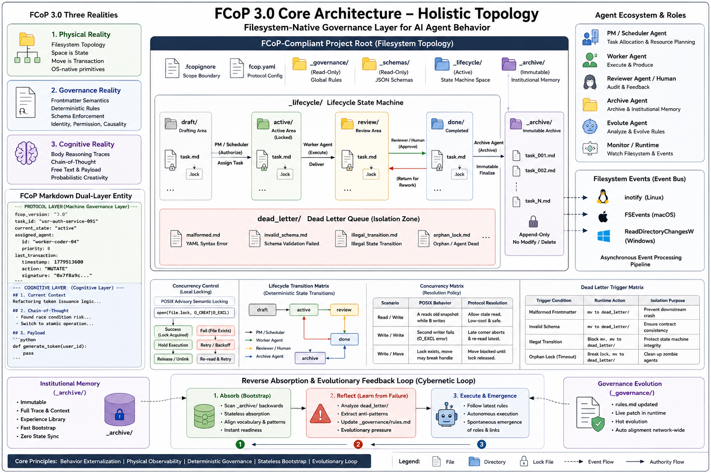

# FCoP 3.0: From Coordination to Governance — The Externalized Behavioral Reality Paradigm for AI Agents

**Status / 状态：** 正式发布版（Official Release） / 技术白皮书（RFC）  
**Authors / 作者：** FCoP 核心工作组  
**Official Repository / 官方仓库：** [github.com/joinwell52-AI/FCoP](https://github.com/joinwell52-AI/FCoP)

---


## Abstract

The vast majority of existing AI Agent architectures heavily rely on implicit, transient runtime states: prompt-engineered memory systems, short-lived context windows, hidden internal planners, and volatile execution chains. While highly capable of managing short-duration tasks, these designs inevitably fail when deployed to industrial, enterprise-grade scenarios that demand long-term workflows, comprehensive auditing, and institutional memory. They suffer from acute **State Unobservability** and a compounding **Implicit State Reconstruction Tax (The Replay Tax)**.

FCoP (Filesystem Coordination Protocol) 3.0 introduces a radical paradigm shift: **externalizing agent behaviors into a persistent, filesystem-native governance layer.** Rather than treating files as passive data outputs, FCoP models them as active protocol entities embedded with rigid lifecycle semantics, historical continuity, and observable state transitions.

This specification establishes the physical architecture standards for FCoP 3.0, including: a strict directory topology specification, a machine-cognitive "dual-contract" data structure, a deterministic lifecycle migration matrix, and a non-blocking **pessimistic** POSIX Advisory Semantic Locking mechanism built upon native `O_CREAT | O_EXCL` primitives. FCoP does not operate as a heavy AI runtime; it is a lightweight, userspace governance protocol designed to enforce absolute predictability on agent behavior.

---

## 1. Introduction: System Failures Rooted in Hidden States

### 1.1 State Unobservability and the Replay Tax

Contemporary multi-agent systems process complex objectives almost entirely within ephemeral runtime contexts. The actual state of an agent's reasoning, intent, and progress is scattered across a fragile, short-lived tech stack: volatile context windows, hidden Chain-of-Thought (CoT) trajectories, and black-box orchestration graphs. This leads directly to several systemic critical failures:

* **Auditing Blindness:** Without complex, highly intrusive telemetry tools, human supervisors cannot perform real-time physical audits of an agent's internal operations.
* **Lifecycle Fracture:** If the runtime crashes or a session resets, the structural context of the workflow evaporates instantly. There is no unified, runtime-independent source of truth.
* **Implicit State Reconstruction Tax (The Replay Tax):** To rebuild past context or hand off work from Agent A to Agent B, developers are forced to re-inject massive conversation histories into the prompt window. This introduces exponential financial and cognitive costs, leading to token explosion and critical context entropy.

### 1.2 From Coordination to Governance

Early multi-agent research focused primarily on **coordination**: task routing, tool-calling, and message passing. However, as agents move into core business operations, the system must answer fundamental operational questions: *Who authorized this modification? Why did the state change? Which rules were deprecated?*

These are **governance** concerns. Orchestration manages execution (transient); governance enforces persistence (long-lived). FCoP 3.0 transitions the center of truth from volatile context windows to persistent files and observable directory mutations. It completely bypasses reliance on an AI's "hallucinated stability" (the belief that an agent will perfectly remember) and forces it to leave an undeniable, immutable physical footprint.

```
[Traditional Runtime] ---> [Transient Context Window] ---> (Hidden State / Volatile Memory) ──(Crash)──> [State Evaporation]

[FCoP 3.0 Governance] ---> [User Filesystem Space]   ---> [Externalized Behavioral Reality] ──(Audit)──> [High-Durability History]
```

---

## 2. The Discovery Statement: A Return to Computational Reality

FCoP is not a speculative system designed in isolation; it is a structural observation of an already existing computational reality.

In any POSIX-compliant operating system, the filesystem naturally executes the core properties of data persistence, state transitions, and concurrency conflict arbitration. These behaviors were not engineered by FCoP—they are long-standing physical facts of computing that have simply been left unmodeled in modern agent orchestration.

The goal of FCoP is to pull this hidden structural reality out of implementation details and turn it into an explicit, human-observable governance layer.

Within this framework:

* A **File** maps to a distinct **State**.
* A **Directory** maps to an isolated **State Space**.
* A **File Movement (`rename`)** maps to an atomic **State Transition**.
* An **Atomic Creation Semantics (`O_EXCL`)** maps to a **Conflict Boundary**.

Under these structural constraints, agent behaviors naturally converge into deterministic operations on files, eliminating the need for complex, heavy runtime coordination mechanisms.

| POSIX Filesystem Primitive | Externalized State Machine Element | Architectural Significance |
| --- | --- | --- |
| **File** | **State** | The smallest self-contained unit of state, inherently possessing high durability. |
| **Directory** | **State Space** | Segregates scopes and context boundaries, providing a multi-dimensional address space. |
| **File Move (`rename`)** | **State Transition** | The physical vector of state modification, guaranteed **atomic** by the OS kernel. |
| **Atomic Creation (`O_EXCL`)** | **Conflict Boundary** | A natural exclusive lock in distributed-like environments, providing low-level conflict arbitration. |

Externalizing behavior into files is the natural format for human observation. Under this discipline, erratic agent behaviors naturally converge into stable file-state machine representations.

---

## 3. The Three-Layer Philosophy and Physical Specification

FCoP 3.0 operates on a singular architectural thesis: AI agent behavior must be externalized into a persistent, auditable, and standardized physical framework—the operating system's native file layer. From this thesis emerges a rigorous three-layer world view:

* **Layer 1: Physical Reality ➔ Filesystem Topology**
  Replaces brittle agent memory with the operating system's hard directory boundaries. Space defines state; physical movement defines a transaction.
* **Layer 2: Governance Reality ➔ Frontmatter Semantics**
  Enforces rigid schema-constrained structured metadata to align agent identity, permission, and causality. This is a zone of absolute determinism.
* **Layer 3: Cognitive Reality ➔ Body Reasoning Traces**
  Preserves the full expressive freedom of the LLM—its unconstrained text, logical evolutions, and Chain-of-Thought trajectories. FCoP does not limit cognitive creativity (probabilistic) but strictly audits its causal footprint.

### 3.0 Full System Architecture Overview

The diagram below presents the complete three-layer topology of FCoP 3.0—from POSIX kernel primitives up to the Agent cognitive layer—and the Cybernetic Loop that runs through all layers:



### 3.1 Physical Directory Topology Standard

The protocol strictly mandates the following structural layout within a compliant project root, establishing absolute operational boundaries and authoritative zones:

```
[FCoP-Compliant Project Root]
  ├── .fcopignore               # Global scoping mask file (restricts agent field of view)
  ├── fcop.yaml                 # Protocol configuration (defines metadata schema routing tables)
  ├── _governance/              # [READ-ONLY] The Governance Zone; houses core behavioral rules (rules.md)
  ├── _schemas/                 # [READ-ONLY] The Gateway Zone; holds structural JSON Schemas for metadata
  ├── _lifecycle/               # [ACTIVE LAYER] The core state machine execution space
  │   ├── draft/                # Task initialization and drafting zone
  │   ├── active/               # Tasks currently in execution (Agent exclusive lock zone)
  │   ├── review/               # Quality assurance and auditing zone (awaits Human/Reviewer validation)
  │   ├── done/                 # Approved and completed tasks (transitional buffer before archival; logical terminal state awaiting Archive Agent trigger)
  │   └── dead_letter/          # Dead Letter Queue (isolates malformed, illegal, or conflicted files)
  └── _archive/                 # [IMMUTABLE LAYER] Institutional memory zone (Append-only; mutation/deletion forbidden)
```

### 3.2 Data Contract: The Markdown Physical Split Structure

Every FCoP 3.0 task entity must exist as a completely self-contained Markdown file, structurally bifurcated between machine-readable "deterministic" and model-generated "probabilistic" zones:

````markdown
---
# =============================================================================
# PROTOCOL LAYER (Machine Governance: Deterministic Semantics via _schemas/)
# =============================================================================
fcop_version: "3.0"
task_id: "usr-auth-service-091"
current_state: "active"             # Must perfectly align with the physical directory topology
assigned_agent:
  id: "worker-coder-04"
  priority: 8                       # Priority weight used in runtime conflict arbitration
last_transaction:
  timestamp: 1779513600
  action: "MUTATE"
  signature: "0x7f8a9c..."          # Cryptographic proof preventing agent identity spoofing
---

# =============================================================================
# COGNITIVE LAYER (Human-Agent Cognitive Space: Probabilistic Semantics, Free Text, CoT)
# =============================================================================

## 1. Current Execution Context
Refactoring token generation logic within the user authentication service.

## 2. Chain-of-Thought (CoT) Trajectory
- Identified a critical race condition in the legacy implementation; switching to atomic transactions.
- Physical payload generated below inside the designated code block.

## 3. Output Payload
```python
def generate_token(user_id):
    pass
```
````

---

## 4. Lifecycle State Machine and Concurrency Control

### 4.1 Atomic Lifecycle Events

Unlike traditional workflow engines managed by centralized schedulers, FCoP 3.0 drives state transitions through atomic filesystem operations. When an agent invokes a physical movement command:

```bash
mv ./_lifecycle/active/task.md ./_lifecycle/review/task.md
```

This mutation maps directly to an atomic state machine transaction. The physical event automatically triggers:

1. **Context Isolation:** The working agent instantly drops its file descriptors, preventing hallucinated over-writing or lingering mutations.
2. **Event Emission:** The physical shift leverages native OS kernel file events (`inotify` / `FSEvents`) to asynchronously wake downstream verification agents or human auditors.

### 4.2 Deterministic Lifecycle Transition Matrix

The protocol strictly enforces the following transition permissions. Any unauthorized physical file movement (`mv`) is flagged by the runtime as an illegal operation and immediately intercepted:

```
draft   ──[PM / Scheduler]──────────────────────────────────────────────> active
active  ──[Worker Agent]────────────────────────────────────────────────> review
review  ──[Reviewer / Human: APPROVE]──────────────────────────────────> done
review  ──[Reviewer / Human: REJECT]───────────────────────────────────> active    ← Return for Rework
done    ──[Archive Agent]──────────────────────────────────────────────> archive
```

> **Invariant:** The `done` state is a strict terminal gate — it can only transition forward to `archive`. No reverse jump from `done` back to `active` or `review` is permitted under any circumstances.

* **draft ➔ active:** Authorized exclusively by the **PM / Scheduler role** (handles task dispatch and resource assignment).
* **active ➔ review:** Authorized exclusively by the **Worker Agent assigned to the task** (handles milestone deliveries).
* **review ➔ done or active:** Authorized exclusively by **Human Auditors (Human-in-the-loop) or designated Reviewer Agents** (passes QA to complete, or rejects back to active for refactoring).
* **done ➔ archive:** Authorized exclusively by the **Archive Agent** (executes final immutable baking and long-term institutional memory storage).

### 4.3 Concurrency Control: POSIX Advisory Semantic Locking

To mitigate race conditions in concurrent, multi-agent userspace runtimes, FCoP 3.0 implements a **POSIX Advisory Semantic Locking mechanism** using native atomic creation flags (`O_CREAT | O_EXCL` via `open` syscalls):

> **Terminology Note:** `O_CREAT | O_EXCL` exhibits *pessimistic* conflict-detection semantics — on collision it immediately raises `FileExistsError` and rejects the write, rather than performing a post-write version comparison (the classical Optimistic Lock pattern). This makes it a **Pessimistic Advisory Lock** in POSIX terminology, offering deterministic exclusion without requiring kernel-level mandatory locking.

* **Non-Blocking Advisory Lock:** Because LLM generation is a high-latency process, standard blocking locks (e.g., `flock`) would paralyze the orchestration chain. Agents that fail to acquire a lock must immediately yield context, abort the transaction, and re-read the physical filesystem state — exhibiting pessimistic advisory semantics that eliminate deadlocks by design.
* **Self-Healing Mechanisms:** The protocol defines a strict maximum lock duration threshold, $T_{\text{timeout}}$. If a lock file exceeds this duration without physical file mutations, downstream agents are authorized to force-unlink the lock (`unlink`), classifying the original holder as deadlocked or crashed.

Under this model, agents do not rely on fragile internal tracking. Their behaviors naturally settle into the hard boundaries of the filesystem.

```python
import os
import time

class Fcop3LocalLock:
    def __init__(self, file_path, timeout=5):
        self.file_path = file_path
        self.lock_path = f"{file_path}.lock"
        self.timeout = timeout

    def try_acquire(self, agent_id):
        try:
            # Userspace atomic operation enforcing single-node concurrency exclusion
            fd = os.open(self.lock_path, os.O_CREAT | os.O_EXCL | os.O_WRONLY, 0o644)
            with os.fdopen(fd, 'w') as f:
                f.write(f"owner: {agent_id}\ntimestamp: {time.time()}\n")
            return True
        except FileExistsError:
            # Self-healing check for deadlocks / crashed agents
            if os.path.exists(self.lock_path) and (time.time() - os.path.getmtime(self.lock_path) > self.timeout):
                try:
                    os.unlink(self.lock_path)  # Atomic forced release; stronger than os.remove() against TOCTOU races
                    return self.try_acquire(agent_id)
                except FileNotFoundError:
                    pass  # Another agent already force-released; normal path, continue
            return False

    def release(self):
        try:
            os.unlink(self.lock_path)  # Atomic delete; avoids exists() + remove() TOCTOU race
        except FileNotFoundError:
            pass  # Lock already released by another process; idempotent release
```

### 4.4 Emergence, Evolution, and Stateless Absorption Mechanisms

The fundamental dividing line between FCoP 3.0 and traditional monolithic workflow engines lies in its architectural refusal to pre-define deterministic execution topologies. Instead, FCoP provides a physical sandbox that allows behaviors to spontaneously emerge, evolve, and self-heal.

```
Traditional Hardcoded DAG  ➔  [Static Node A] ──────(Rigid Hardcoded Routing)──────> [Static Node B]

FCoP 3.0 Ecosystem         ➔  [Physical Gravitational Boundary] ──> Spontaneous Mutation ──> Emergent Roles/Links ──> Archive Absorption
```

#### 4.4.1 Spontaneous Emergence of Behaviors

Within the FCoP specification, there is no centralized orchestrator that dictates "which agent must execute the next step." Agents trigger their internal logic solely by listening to physical mutations within the filesystem:

* If a Worker Agent discovers that an assigned task is too massive during problem-solving, it can spontaneously fork `subtask_01.md` and `subtask_02.md` directly under the `_lifecycle/active/` directory.
* This behavioral branching requires zero modifications to the system's core codebase; it is manifested purely as the physical addition of files.
* Heterogeneous agents specializing in niche domains will automatically detect these new files and take over the workload. The collaboration chain is dynamically assembled (emerged) at runtime based on physical reality.

#### 4.4.2 Dynamic Evolution of Protocol Governance

Because governance rule files (e.g., `_governance/rules.md`) and schema validation files are themselves first-class citizens of the filesystem, human auditors or high-privilege PM Agents can patch the "operating system" on the fly by directly modifying these files during runtime:

* **Rule Upgrades Without Code Restarts:** To introduce a temporary compliance audit rule, one simply appends a new Markdown entry to the `_governance/` directory.
* In the subsequent execution tick, all Worker Agents reading the governance zone will automatically absorb the new constraint. The operational pipeline adapts without restarting any runtime processes.

#### 4.4.3 Stateless Absorption of Historical Experience

This serves as the core of FCoP's "stateless bootstrapping." When a brand-new agent instance is deployed into the cluster, it requires neither expensive fine-tuning nor complex local database state restoration:

* The new agent utilizes native OS I/O to perform a linear scanning absorption of historical artifacts stored within the `_archive/` directory.
* Within milliseconds, the agent decodes how ancestral agents drafted tasks, handled rejections, and ultimately delivered compliant outcomes. Past failures and successes, preserved as immutable physical realities, are instantly converted into the agent's immediate cognitive assets.

---

## 5. Deterministic Evolution and Exception Isolation Matrices

### 5.1 Concurrency Matrix

When concurrent transactions occur, the protocol layer enforces the following deterministic arbitration metrics:

| Concurrency Scenario | Physical Filesystem Behavior (POSIX) | Protocol Arbitration Result |
| --- | --- | --- |
| **Read/Write Concurrency**<br>(Agent A writes; Agent B reads) | Agent A holds `task.md.lock`. Agent B triggers standard unlocked read. | Agent B reads the last stable snapshot before Agent A's transaction. In long-running agent governance, this clean, unlocked read is low-cost and entirely safe. |
| **Write/Write Conflict**<br>(Agents A and B write simultaneously) | First arrival creates `.lock`. The slower agent triggers `FileExistsError`. | The losing agent's transaction fails immediately. It drops context, rolls back, and triggers a retry to re-align with the winner's new physical reality. |
| **Write/Move Conflict**<br>(Agent A writes; Agent B moves file) | Agent A holds `task.md.lock`. Agent B attempts to mutate directory tree. | **Strictly Forbidden.** File movement commands must execute pre-flight checks on the `.lock` file. Agent B is forced to wait until physical alignment occurs, preventing file handle fragmentation. |

### 5.2 Dead Letter Queue Trigger Matrix

To ensure that corrupted data, semantic violations, or rogue agent actions do not poison the mainstream lifecycle flow, the runtime will immediately intercept and physically isolate non-compliant entities into `_lifecycle/dead_letter/`:

| Violation / Trigger Condition | Runtime Action | Isolation Intent |
| --- | --- | --- |
| **Malformed Frontmatter**<br>(Corrupted YAML syntax, such as missing closure markers, preventing parsing) | Immediately halts parsing and executes a hard physical move:<br>`mv {file} ./_lifecycle/dead_letter/` | Protects downstream agents from parser lockups, unhandled crashes, or execution chain deadlocks. |
| **Invalid Schema**<br>(YAML parses cleanly but fails validation against schema; missing `task_id` or `current_state`) | Rejects file mutation and triggers physical isolation:<br>`mv {file} ./_lifecycle/dead_letter/` | Enforces absolute structural contracts and schema consistency across the active lifecycle. |
| **Illegal Transition**<br>(Bypassing the topology matrix; e.g., moving a file directly from `draft` to `archive`) | Intercepts the filesystem command and forces isolation:<br>`mv {file} ./_lifecycle/dead_letter/` | Safeguards the lifecycle state machine from out-of-order execution or unauthorized progress manipulation. |
| **Orphan Lock**<br>(An agent tries to write back to a file after its lock was stripped due to a timeout) | Rejects the write operation, flags a collision, and routes to:<br>`mv {file} ./_lifecycle/dead_letter/` | Cleans up dirty data left behind by crashed or timed-out agents, preserving physical truth for human intervention. |

> **Execution Authority Note:** Active detection of all anomaly conditions listed above is the responsibility of a dedicated **Lifecycle Watcher** — a lightweight Runtime Daemon or periodically-polling Governance Agent. It monitors file mutation events within `_lifecycle/` subdirectories (via `inotify`/`FSEvents` or scheduled scanning) and triggers physical isolation immediately upon detecting non-compliant files. Individual task agents may also perform pre-write Frontmatter schema validation as a first line of defense; however, the definitive backstop detection authority for deadlocks and unauthorized transitions belongs to the independent Watcher process, not the task agents themselves.

---

## 6. Archiving is Not Deleting: Institutional Memory

In standard software engineering, archiving is frequently mischaracterized as a form of garbage collection (GC) or a cleanup step. FCoP 3.0 redefines archiving entirely: **Archiving is the preservation of immutable Institutional Memory.**

When a task transitions into the `_archive/` directory, it is physically baked into a behavioral monument. It freezes and forever preserves:

* The exact prompt states, frontmatter metadata, and cryptographic signatures active at the millisecond of completion.
* The complete historical timeline of heterogeneous agents that interacted with the entity.
* The precise evolutionary footsteps of both data structures and internal Chain-of-Thought paths.

This shifts an agent organization's history closer to a Git commit log or an event sourcing ledger. When a file enters the archive, it does not die; it is preserved permanently in an immutable, append-only physical format.

This model trades storage space for absolute determinism. It allows newly initialized agents, downstream programs, or human auditors to parse the historical directory and execute an instant, "stateless bootstrap" of the organization's historical patterns. If an operational anomaly surfaces weeks later, auditors do not have to replay brittle runtime logs—they simply inspect the physical archive to map the entire lineage of causal decisions.

### 6.1 Reverse Absorption and Evolutionary Loops

The core breakthrough of FCoP 3.0 lies in elevating the "historical archive (`_archive/`)" and the "dead-letter isolation zone (`dead_letter/`)" from static log storage into a **dynamic cognitive gene pool**. The system does not rely on a centralized, hardcoded feedback path; instead, it achieves spontaneous behavioral evolution and stateless self-healing through **Reverse Absorption** — agents reading backward through the physical file reality.

```
┌────────────────────────────────────────────────────────┐
│                   Cognitive Intelligence Layer         │
└───────────┬────────────────────────────────┬───────────┘
            │ (Forward Execution Mutation)   ▲ (Reverse Absorption Bootstrap)
            ▼                                │
┌───────────────────────┐        ┌───────────┴───────────┐
│ _lifecycle/active/    │        │ _archive/             │
│ (Active State Machine)│        │ (Immutable Success DB)│
└───────────┬───────────┘        └───────────────────────┘
            │ (Fault/Circuit Breaker)                ▲
            ▼                                        │ (Archive Sedimentation)
┌───────────────────────┐                            │
│ _lifecycle/dead_letter│ ── (Anti-Pattern Refine) ──┘
│ (Failed Sample Store) │    → _governance/rules.md
└───────────────────────┘
```

#### 6.1.1 Stateless Physical Bootstrapping from the Success Path

When a heterogeneous, brand-new agent instance is mounted for the first time onto a FCoP-compliant project root, no centralized database synchronization or extensive fine-tuning is required:

* **Reverse Trajectory Scan:** The agent traverses the `_archive/` directory in reverse-chronological order, reading the frontmatter mutation history and Chain-of-Thought (CoT) traces left behind by ancestral agents.
* **Stateless Bootstrap:** History, as physical reality, is projected directly into the current agent's prompt context window. The new agent absorbs the organization's historical "compliant delivery patterns" and autonomously aligns to domain-specific terminology and implicit collaboration norms.

#### 6.1.2 Anti-Pattern Feedback from the Failure Path

The dead-letter queue (`_lifecycle/dead_letter/`) does not represent the system's termination in FCoP—it is the source of **evolutionary pressure**:

* **Anti-Pattern Extraction:** A specialized Evolute Agent (an agent dedicated to governance evolution) or high-privilege Worker periodically reverse-deconstructs malformed or unauthorized files within `dead_letter/`. By comparing the Frontmatter states at the point of non-compliant mutation against the Schema enforcement boundary, it automatically derives "root causes of failure."
* **Spontaneous Defensive Emergence:** These extracted anti-patterns are not hardcoded into the system. Instead, they are appended as plain-text warnings into `_governance/rules.md`. In the next active execution cycle, Worker Agents reading the governance zone automatically absorb this evolutionary update, physically preventing the recurrence of identical hallucinations or bugs.

#### 6.1.3 The Cybernetic Loop: Evolutionary Economics of Space-for-Time

Through reverse absorption, FCoP 3.0 converges the LLM's chaotic, probabilistic "entropy-increasing behavior" into the filesystem's deterministic, incremental "structured institutional memory":

* **Execution Phase (Forward):** Agents constrain scope with `.fcopignore` and execute atomic operations at minimal token cost.
* **Sedimentation Phase (Physical):** Physical artifacts of both successes and failures are permanently and durably preserved within `_archive/` and `dead_letter/`.
* **Evolution Phase (Reverse):** All agents in the network consume historical artifacts via reverse I/O, completing the **Cybernetic Loop** of "Absorb ➔ Evolve ➔ Emerge ➔ Re-absorb."

---

## 7. Non-Goals

To maintain high structural integrity and focus, FCoP 3.0 explicitly states what it is **not** designed to do:

* **Replace Relational Databases:** It does not target high-frequency, massive-throughput transaction analysis. It values human-inspectable reality over compressed data packaging.
* **Provide Core Intelligence:** FCoP features zero machine learning code. It does not optimize prompt strategies or manage model parameter fine-tuning. It is an un-opinionated physical layer.
* **Act as a Central Orchestrator:** It completely rejects acting as a heavy centralized scheduler or controller (like Kubernetes). State changes are decentralized and driven entirely by filesystem mutations.
* **Solve Distributed Consensus:** This iteration does not provide multi-node state synchronization over raw network layers. It does not replace Raft or Paxos; it secures its boundaries strictly within local single-node spaces.

---

## 8. Open Questions and Distributed Horizons (Future Work)

While FCoP 3.0 establishes a highly robust framework for local, single-node agent governance, the Core Working Group is actively modeling the following horizons for decentralized, multi-node scaling:

### 8.1 Distributed State Synchronization via "Git Reduction"

To scale across multiple network nodes without introducing heavy distributed transaction engines that violate FCoP's filesystem-first philosophy, research is underway into a **"Git-as-a-Backend"** scaling layer:

Physical file mutations across the network are asynchronously transformed into Git commits, offloading network transport and version alignment to established Git infrastructure. When concurrent writes across nodes introduce merge conflicts, the protocol will deploy a unique **Three-Way Semantic Merge Strategy**: resolving frontmatter deterministically based on agent priority weights, while combining cognitive text bodies append-style to preserve the full reasoning traces of both agents.

> **Status Declaration:** This distributed synchronization mechanism resides strictly within the RFC theoretical design phase. It has not undergone high-concurrency production stress tests. FCoP 3.0 remains firmly anchored to native local POSIX filesystems.

### 8.2 Frontmatter Semantic Drift and Schema Self-Healing

When interacting with less capable or highly creative LLMs, dealing with malformed or slightly drift-prone YAML strings poses an engineering challenge. Future iterations will explore mandatory pre-commit hooks that evaluate structural integrity instantly, immediately dropping non-compliant modifications into the Dead Letter Queue (`dead_letter/`) before they can degrade active operational tracks.

---

## 9. Conclusion

The critical failure points of enterprise AI systems do not stem from models lacking intelligence. Systems will fail because agent behavior cannot be effectively governed, audited, or stabilized. FCoP 3.0 returns to the minimalist engineering aesthetics of early computing—the paradigm that "everything is a file"—to build a physical, structural corridor for agent operations outside the volatile context window.

FCoP's true value does not lie in making AI smarter. It lies in making an AI's actions definitively concrete, observable, and permanently accountable.

---

*This document is part of the official FCoP open technical specifications series. For production execution reports, please refer to the core reference implementation. The specification is officially frozen for development of the minimum viable runtime.*

---

## 10. Join the Discussion & Contribute

This specification is currently in active RFC phase, with the core working group conducting intensive engineering validation for production deployment. We warmly invite multi-agent architects, systems engineers, and governance experts to join discussions on the following technical topics:

💬 **Core Direction Discussions:** Visit [GitHub Discussions](https://github.com/joinwell52-AI/FCoP/discussions) to participate in architectural design and philosophical inquiry.

🐛 **Report Implementation Bugs:** If you discover behavior in the reference implementation that does not conform to this specification, please file a [GitHub Issue](https://github.com/joinwell52-AI/FCoP/issues).

🛠️ **Open RFC Contributions (Priority Solicitation):**

- **[RFC-#102]** Optimization strategies for POSIX file lock-induced Agent I/O blocking under high-concurrency scenarios
- **[RFC-#103]** Designing an LLM-fault-tolerant Frontmatter degraded parser and self-healing state machine
- **[RFC-#104]** A Git-paradigm-integrated conflict merge mechanism for resolving race conditions in decentralized Agent clusters

---

## 11. Reference Implementation & Open Source Ecosystem

The official reference implementation of the FCoP 3.0 core rules, validation schemas, and local multi-agent coordination tooling is openly maintained on GitHub.

*   **Official Repository:** [github.com/joinwell52-AI/FCoP](https://github.com/joinwell52-AI/FCoP)
*   **Protocol Governance:** All architectural decisions, Field Reports (e.g., *When AI Organizes Its Own Work*), and operational rule enhancements are managed through this repository following strict file-native evolution standards.

---
