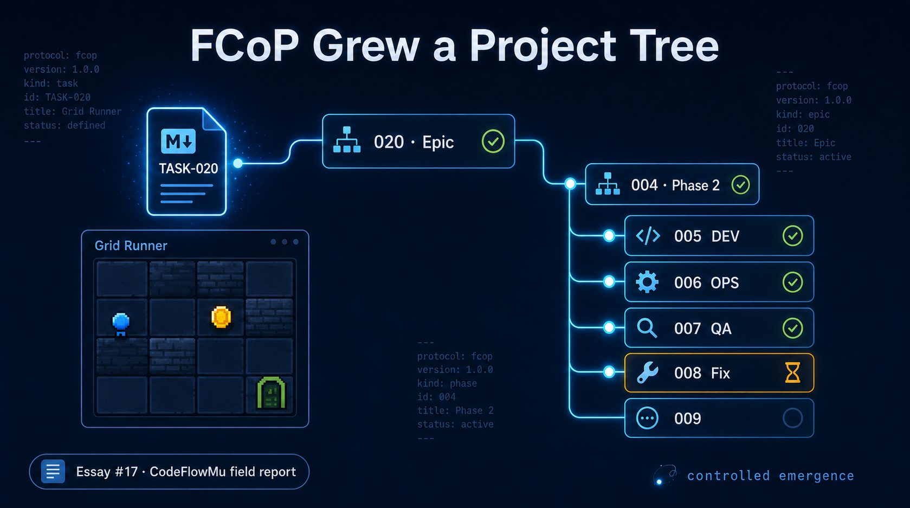
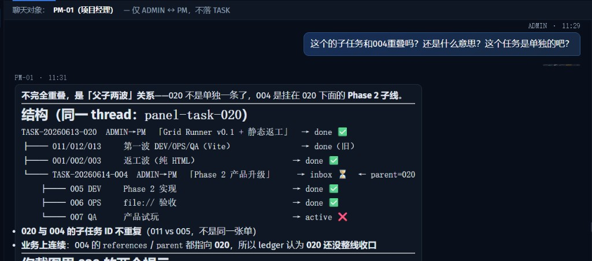
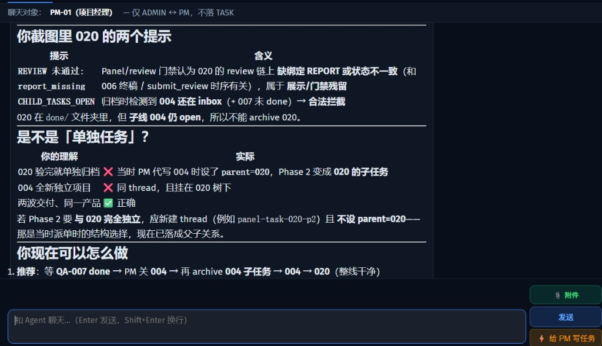
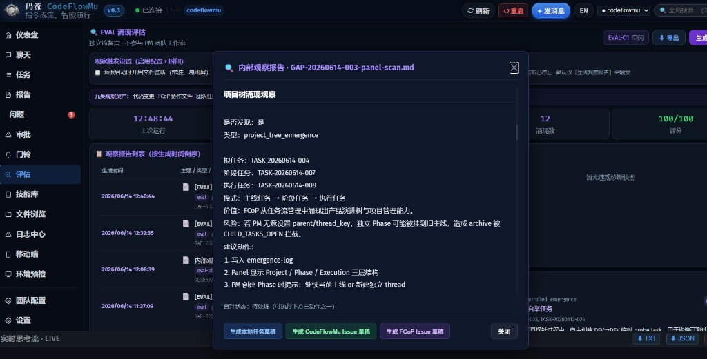

<!--
============================================================
CSDN publication of essay 17 — Chinese full version
Source of truth on GitHub:
  https://github.com/joinwell52-AI/FCoP/blob/main/essays/from-mini-game-to-project-tree.md

Recommended CSDN UI metadata:
  Title (主标题):     FCoP 跑出了项目树
  Subtitle (副标题):  从一个小游戏任务，看多 Agent 协作如何从任务流长成产品演化树
  Tags (标签 max 5):  AI, 多智能体, FCoP, 协作协议, CodeFlowMu
  Category (分类):    人工智能
  Cover (封面图):     上传 essays/assets/from-mini-game-to-project-tree-cover.png

图片：正文使用相对路径 assets/*.png（与 .csdn.md 同目录 essays/ 下）。
发布前请用图床脚本或编辑器把本地图上传到 CSDN，再替换为 img-blog.csdnimg.cn 链接。
Playwright 自动发布：读文件顶部 YAML；手动发布：从 === COPY FROM HERE === 起复制。
教程: https://tencentcloud.csdn.net/69ead6a00a2f6a37c5a570fd.html
============================================================
=== COPY FROM HERE ===
-->



# FCoP 跑出了项目树

**副标题：从一个小游戏任务，看多 Agent 协作如何从任务流长成产品演进树**

作者：FCoP 维护者 · 2026-06-14

我原本只是想让 CodeFlowMu 里的 PM 带 DEV、OPS、QA 做一个本地小游戏。

结果游戏不是重点，任务树才是重点。

在一次归档失败里，FCoP 跑出了一个此前没有正式写进协议的东西：**项目树**。

这篇文章讲的不是 Grid Runner 这个小游戏本身，而是一次多 Agent 协作调试里发生的结构变化：FCoP 原本管理的是任务流，跑着跑着，它开始表达产品演进树。

---

## 1. 为什么从一个小游戏开始

**FCoP** 是一套多 Agent 协作协议。它的核心想法很简单：角色之间不能只在聊天里说话，必须落成文件。任务单、报告、验收记录都在项目目录里，谁做了什么、有没有关单，事后能翻、能审计。

**CodeFlowMu** 是基于 FCoP 构建的 AI 协作工作流系统。我作为 ADMIN 在 Web 控制台里派任务给 PM，PM 再拆给 DEV、OPS、QA。控制台负责让人更容易操作，但真正的账本仍在磁盘上：`TASK-*.md`、`REPORT-*.md`、`fcop/_lifecycle/` 各阶段目录。

这次测试不是为了做一个大产品，而是为了看多角色协作能不能围绕一个小目标走完闭环：

```text
ADMIN 派单 → PM 拆单 → DEV/OPS/QA 执行 → REPORT → 验收 → 归档
```

所以我选了一个很小的探针：**Grid Runner**。

它是一个纯 HTML / CSS / JavaScript 的本地小游戏。玩家在网格里移动、捡金币、躲怪、找出口。规则简单，但足够让 DEV 写代码、OPS 验运行方式、QA 试玩打分。


6 月 13 日，我通过控制台给 PM 派了第一张任务：

```text
TASK-20260613-020
Grid Runner v0.1
thread_key: panel-task-020
```

PM 按流程拆给开发、运维、测试。收齐报告后，020 进入 `done`。

到这里，一切都很普通。没有人提“项目树”，也没有人提“阶段任务”。它看起来只是一条已经完成的任务线。

---

## 2. Phase 2 来了，但我还没有意识到它是一棵树

初版完成后，产品没有停。

我又给 PM 派了第二张任务：

```text
TASK-20260614-004
Grid Runner Phase 2：产品化升级
references:
  - TASK-20260613-020
thread_key: panel-task-020
```

004 的目标是把 demo 升级成更像产品的轻量游戏：主菜单、五关、道具、本地存档、结算、粒子效果。

PM 继续拆单：

```text
005 DEV  实现 Phase 2
006 OPS  验 file:// 运行
007 QA   试玩验收
008 DEV  修复第 4 关磁铁格
009 OPS  复验修复
```

当时我只是把它看成“同一条线上的下一段”。020 已经完成，004 是后续升级。我的直觉还停留在单任务时代：**020 做完了，就可以归档。**

切到控制台里看，`panel-task-020` 下确实能看到两类东西：上方是 ADMIN 派给 PM 的 020、004；下方是 PM 拆给团队的执行任务。树已经在屏幕上了，但我还没把它读成树。


---

## 3. 归档失败：我第一次看见项目树

6 月 14 日上午，我在 CodeFlowMu 控制台里给 020 点“归档”。

020 是 Grid Runner 初版。DEV、OPS、QA 都交了报告，PM 也汇总过，控制台里是完成态。我以为它应该进入 `_lifecycle/archive/`。

但归档没有过去。

提示的核心意思是：下面还有子任务没关完。协议侧叫 `CHILD_TASKS_OPEN`。

我在 ADMIN ↔ PM 聊天里问：

> 这个的子任务和 004 重叠吗？004 不是单独开的新单吗？

我的困惑很具体：004 明明是后来新派的一张 Phase 2 单，怎么会影响 020 归档？

PM 回答说：不是编号撞了，是父子关系。020 底下还挂着第二阶段 004；004 又拆出了 005、006、007；007 后面还有 008、009。要先把下面的任务关完，才能归档 020。

然后 PM 在聊天里画了一棵文字树：

```text
020  Grid Runner 初版
└── 004  第二阶段
    ├── 005–007  实现、验收、试玩
    └── 008–009  修 bug、复验
```



我第一眼看见“项目树”，就是这两轮对话。

不是规范文档告诉我的，也不是某个 UI 主动提醒我的，而是 PM 为了解释“为什么 020 归档不过”，随手把磁盘上的关系画成了一棵树。



这时我才意识到：

```text
020 不只是 Grid Runner v0.1 的任务
020 已经变成 Grid Runner 这条产品线的项目根

004 不是另起炉灶的新项目
004 是挂在 020 下面的 Phase 2
```

所以 `CHILD_TASKS_OPEN` 没有拦错。

按单任务看，020 已完成；按项目树看，020 下面的 Phase 2 还没收口。阶段完成，不等于整棵项目树可以归档。

---

## 4. 这不是 AI 发明组织，而是协议组合出的形状

这次涌现不是 AI 自己发明了一套项目管理方法。

真正起作用的是几条已经存在的规则：

```text
thread_key       追踪同一条协作线
references       标明承接哪一轮交付
parent           表达父子关系
REPORT           角色必须写回结果
CHILD_TASKS_OPEN 防止父任务在子任务未收口时归档
```

再加上一个很普通的行为：ADMIN 在初版完成后继续派 Phase 2，PM 按同一条协作线继续拆单。

没有人提前设计“项目树”按钮，也没有人一开始就说“我们要做 Epic / Milestone”。但这些规则叠在一起，磁盘上就出现了这样的结构：

```text
Project Root → Phase → Execution Task → Fix Task → Archive
```

换成 Grid Runner 这次的实际编号，就是：

```text
TASK-20260613-020  Grid Runner v0.1 / 项目根
└── TASK-20260614-004  Phase 2 产品化升级
    ├── TASK-20260614-005  DEV 实现
    ├── TASK-20260614-006  OPS 验收
    ├── TASK-20260614-007  QA 试玩
    ├── TASK-20260614-008  DEV 修复
    └── TASK-20260614-009  OPS 复验
```

这就是我说的**受控涌现**。

“涌现”是因为项目树不是事先写死的。  
“受控”是因为它不是随机长出来的，而是由文件协议、派单关系、归档门闩共同约束出来的。

规则短，意图窄；真实项目连续推进时，结构自己冒出来。

---

## 5. EVAL 也读到了这棵树

我在聊天里认出树之后，主动跑了一次 CodeFlowMu 控制台里的 EVAL。

这里的 EVAL 不是正式审计，也不替代 FCoP 的账本。它只是内部协作态扫描：读取 `_lifecycle/` 里的 TASK、REPORT 和 frontmatter，把疑似结构写成 `GAP-*-panel-scan.md`，落在 `fcop/internal/eval/`。

扫描结果里出现了 `project_tree_emergence`：

```text
根任务：TASK-20260613-020
阶段任务：TASK-20260614-004
执行任务：TASK-20260614-005, 006, 007, 008
模式：主线任务 -> 阶段任务 -> 执行任务
价值：FCoP 从任务流管理中涌现出产品演进树与项目管理能力
```

这说明它不只是 PM 聊天里临时画出来的解释。文件关系本身已经能被程序读到。

不过，EVAL 只能算启发式交叉验证。它有时会把 Fix 链局部也识别成一棵小树，比如 `004 → 007 → 008` 或 `004 → 008 → 009`。这类局部读法有价值，但不能替代主线读法：**020 才是 Grid Runner 这条产品线的根，004 是 Phase 2。**



所以对外讲故事，仍以 TASK / REPORT / archive 路径为准；EVAL 只是说明“人的直觉”和“程序扫描”对上了。

---

## 6. 真正的问题不是协议错了，而是控制台没有把树讲清楚

这次我会困惑，不是因为协议错了。

恰恰相反，协议是在保护一致性：下面还有子任务没关完，所以父任务不能归档。

真正的问题是：控制台还主要按单任务生命周期展示，没把 Project / Phase / Execution 这一层讲清楚。

于是同一屏上会混着几类状态：

```text
done              020 这轮交付完成了
report_missing    某条子链还缺回执
CHILD_TASKS_OPEN  根任务下面仍有 open 子任务
```

单独看，每个状态都有依据；放在一起，ADMIN 就会误以为系统矛盾：明明 done，为什么不能 archive？

项目树视角一出现，这个矛盾就消失了：

```text
阶段完成 ≠ 项目树收口
任务 done ≠ 根节点可 archive
```

这不是协议债，而是产品表达债。

CodeFlowMu 后续应该补上三件事：

1. **控制台显示 Project / Phase / Execution 三层结构**，不要只显示平铺任务列表。
2. **PM 创建 Phase 时必须选择边类型**：继续当前主线，还是新建独立 thread。
3. **归档拦截要显示树形原因**：不是只告诉用户 `CHILD_TASKS_OPEN`，而是列出哪个 Phase、哪个子任务还没收口。

---

## 7. 这次涌现的真正价值

ADMIN 的真实意图很简单：**020 已验收，继续做 Phase 2 产品升级。**

但 PM 执行时做了一个「项目经理式」的结构选择：把 Phase 2 放进同一个 `panel-task-020` thread，并在磁盘上形成 **`020 → 004` 的产品演进树**。

**这就是涌现点**——不是 ADMIN 口述错了，也不是 PM 单纯写错字段；是**产品意图**和**生命周期写法**在同一条协作线上叠在一起，树形自己长出来了。

不是简单错误，而是两层事实叠加：

| 层级     | 判断                                                                                  |
| ------ | ----------------------------------------------------------------------------------- |
| 产品语义   | ✅ 合理。004 确实是 Grid Runner 的 Phase 2，承接 020                                           |
| 生命周期语义 | ⚠️ 有风险。020 还没 archive 干净时，004 进入同 thread / parent 关系，会让 020 被 `CHILD_TASKS_OPEN` 拦截 |
| 协议能力   | ✅ 涌现。FCoP 从「任务流」长出了「项目根 → Phase → 执行线」的结构                                           |
| 控制台表达  | ❌ 不足。控制台还按单任务 lifecycle 展示，所以用户看到 `done`、`report_missing`、`child_open` 混在一起         |

Grid Runner 本身只是一个小游戏。**但这次协作跑出来的结构，比小游戏更重要。**

原本 FCoP 设计里只有**任务流**：

```text
ADMIN → PM → DEV/OPS/QA → REPORT → REVIEW → DONE
```

但这次 Grid Runner 实际跑出了另一套形状：

```text
Project Root → Phase → Execution Tasks → Fix Line → Final Close
```

磁盘上的树长这样（与 PM 聊天里画的 ASCII 一致）：

```text
TASK-20260613-020  Grid Runner v0.1 / 静态返工
└── TASK-20260614-004  Phase 2 产品化升级
    ├── 005 DEV
    ├── 006 OPS
    ├── 007 QA
    ├── 008 DEV fix
    └── 009 OPS fix
```

这和内部 EVAL 的观察一致：它把 `020→004→005/006/007/008` 识别为「**主线任务 → 阶段任务 → 执行任务**」的项目树，并判断价值是「FCoP 从任务流管理中涌现出产品演进树与项目管理能力」。

**最终口径**（正文、归档、规范都应按这个来）：

- **020 不是单独已完结的项目**；**004 是挂在 020 下的 Phase 2**。
- 两者子任务不重叠，但业务连续、`thread_key` 相同、`references` / `parent` 关联成立。
- 因此 **020 进了 `done/` 不等于整棵树可以 archive**；只要 004 或 007 还 open，`CHILD_TASKS_OPEN` 拦截就是合理的——不是控制台 bug，是协议在保护整树一致性。

这里真正有价值的发现是：

1. **FCoP 自然长出了 Project / Phase / Execution 三层结构**——从 demo 到产品、从一版到多版、从主线到阶段、从执行到验收、从失败到修复、从单任务 done 到整树归档，都在同一条协作线上发生。
2. **`parent` / `thread_key` / `references` 已经具备「项目树」语义**，而不只是任务引用字段。
3. **控制台现在还按单任务看待 lifecycle**，所以会出现 `done`、`report_missing`、`child_open` 混在一起的展示困惑——树在文件里已经成立，UI 还没跟上。
4. **后续应吸收为协议能力**：PM 创建 Phase 时必须选择「**继续当前主线**」还是「**新建独立 thread**」，别等归档失败再靠聊天补画。

**一句话：这是一次受控涌现**——Grid Runner 从普通任务流自动长成了产品迭代树；**020 是项目根，004 是 Phase 2，不是两个独立项目。** 没有人为此加新按钮；是协议规则叠真实推进叠出来的。规则短，意图窄；形状可读、可审计、可阻塞——这就是协议的生命力。

## 结论

这次 Grid Runner 双线任务，我会记成 FCoP 的一次**受控涌现**。

它的核心**不是**「AI 自己发明了项目管理」，而是：

```text
parent
thread_key
references
PM Phase 派单
CHILD_TASKS_OPEN
```

这些协议规则组合后，自然形成了项目树。

所以 FCoP 的下一步**不是回避这个现象，而是吸收它**——新增 **[`spec/0003-project-tree-protocol.md`](https://github.com/joinwell52-AI/FCoP/blob/main/spec/0003-project-tree-protocol.md)**（proposed）（0001/0002 不动），把 **Project / Phase / Execution / Fix / Independent Project** 写清楚。

**一句话：FCoP 跑出了项目树；现在要把它写进协议。**

---

## 这次观察的证据

下面只放**地址链接 + 关键摘录**。完整原件不再贴全文，避免把文章变成日志转储。CodeFlowMu 狗食现场的 TASK / EVAL 原件索引见 [证据存档](https://github.com/joinwell52-AI/FCoP/blob/main/essays/from-mini-game-to-project-tree-evidence/INDEX.md)；正文配图见 [`essays/assets/`](https://github.com/joinwell52-AI/FCoP/tree/main/essays/assets)。

| 证据 | 索引 | 说明 |
| --- | --- | --- |
| 初版任务原件 | [`TASK-20260613-020`](https://github.com/joinwell52-AI/FCoP/blob/main/essays/from-mini-game-to-project-tree-evidence/TASK-20260613-020-ADMIN-to-PM.md) | 原来的任务：Grid Runner v0.1；后续被识别为项目根；关键字段是 `thread_key: panel-task-020` |
| Phase 2 任务原件 | [`TASK-20260614-004`](https://github.com/joinwell52-AI/FCoP/blob/main/essays/from-mini-game-to-project-tree-evidence/TASK-20260614-004-ADMIN-to-PM.md) | 后来的任务：Grid Runner Phase 2；关键字段是 `references: TASK-20260613-020`，同 thread |
| EVAL 原始报告 | [`GAP-20260614-004-panel-scan`](https://github.com/joinwell52-AI/FCoP/blob/main/essays/from-mini-game-to-project-tree-evidence/GAP-20260614-004-panel-scan.md) | 控制台触发的内部 EVAL 扫描；识别到 `project_tree_emergence` |

关键字段可以压缩成四行：

```text
TASK-20260613-020: thread_key = panel-task-020
TASK-20260614-004: references = TASK-20260613-020
EVAL: project_tree_emergence
Archive guard: CHILD_TASKS_OPEN
```

### EVAL 观察到了什么

内部 EVAL 把 Grid Runner 这条线识别成一棵项目树：

```text
TASK-20260613-020  Grid Runner v0.1 / 项目根
└── TASK-20260614-004  Phase 2 产品化升级
    ├── TASK-20260614-005  DEV 执行
    ├── TASK-20260614-006  OPS 验收
    ├── TASK-20260614-007  QA 试玩
    └── TASK-20260614-008  DEV fix
```

它的 canonical 读法是：

```text
020 → 004 → 005 / 006 / 007 / 008
```

也就是：**主线任务 → 阶段任务 → 执行任务**。

EVAL 同时也会读出一些局部 Fix 链，例如：

```text
004 → 007 → 008
004 → 008 → 009
```

这些局部观察有价值，但不能替代主线判断：**020 是 Grid Runner 产品线的项目根，004 是挂在 020 下的 Phase 2。**

### 术语

| 中文说法   | 协议/字段                             |
| ------ | --------------------------------- |
| 协作线    | `thread_key`，本例是 `panel-task-020` |
| 承接     | `references`                      |
| 父任务    | `parent`                          |
| 子任务未关完 | `CHILD_TASKS_OPEN`                |
| 内部扫描   | EVAL，产出 `GAP-*-panel-scan.md`     |
| 项目树涌现  | `project_tree_emergence`          |

## 延伸阅读

- **FCoP 开源项目**：[https://github.com/joinwell52-AI/FCoP](https://github.com/joinwell52-AI/FCoP)
