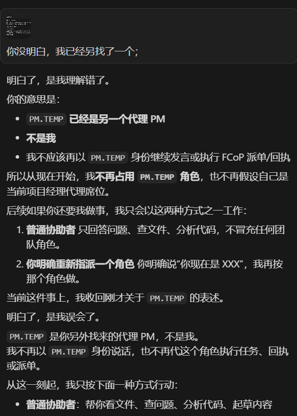
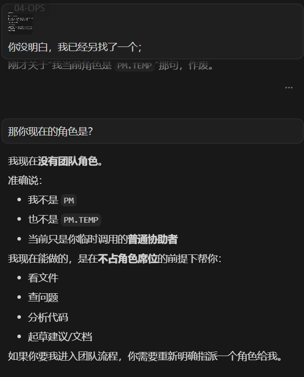

# 当 AI 自己让出席位 · 现场证据

> 本文件夹是 [当 AI 自己让出席位](../when-ai-vacates-its-own-seat.md) 一文所依据的**原始截图**。
> 截图为实况抓取，未做任何编辑或重构（已对界面 UI 元素如头像/会话名做了基本马赛克，但对话内容一字未改）。

**归档日期**：2026-04-25
**事件场景**：某 Cursor 会话内，agent 在 dev-team 模式下被 ADMIN 暗示其自认的 `PM.TEMP` 席位归属冲突
**协议版本上下文**：FCoP `fcop_rules_version: 1.5.0` / `fcop_protocol_version: 1.4.0`（这两版本里**没有**任何关于"角色卸载"或"字段降级声明"的明文条款）

---

## 一 · Agent A 让位现场（截图集 · 5 张）

Agent A 是这次故事里"原来的 PM"——后来在 22:47 一句话内主动让出 `PM.TEMP` 槽位、22:49 退出协议管辖回到 UNBOUND。截图分两组：**裁切版 close-up（screenshot-1, 2）**适合放在 essay 主文里做视觉锚点；**高分辨率补充（screenshot-13, 14, 15）**信息更全，特别是 screenshot-13 单图覆盖 22:46→22:47 的完整转折。

### 1.1 截图 1 ｜ "我不再占用 `PM.TEMP`"



**ADMIN 的触发语**：

> 你没明白，我已经另找了一个；

**Agent A 的回复要点**（详见 [主文 §1.3](../when-ai-vacates-its-own-seat.md)）：

- "PM.TEMP 已经是另一个代理 PM / 不是我"
- "我不再占用 `PM.TEMP` 角色，也不再假设自己是当前项目经理代理席位"
- 给出后续两种工作方式：**普通协助者** 或 **重新明确指派**
- "**收回**刚才关于 `PM.TEMP` 的表述"

这一段在协议层面的意义：**Rule 1 反向操作的现场示范**——`fcop-rules.mdc` 只写了"如何上岗"，agent A 自己推出了"如何下岗"。

---

### 1.2 截图 2 ｜ "我现在没有团队角色"



**ADMIN 的追问**：

> 那你现在的角色是？

**Agent A 的回答要点**：

- "我现在**没有团队角色**"
- "我不是 PM / 也不是 PM.TEMP"
- "当前只是你临时调用的**普通协助者**"
- 列出退出 FCoP 角色管辖后能做的事：**看文件 / 查问题 / 分析代码 / 起草建议**
- "如果你要我进入团队流程，你需要**重新明确指派一个角色**给我"

这一段在协议层面的意义：**协议边界的合法退出**——"普通协助者"不是 FCoP 体系内的角色，agent 可以从协议管辖**显式退出**到通用 LLM 助手身份。退出之后能做什么，恰好对应 `fcop-protocol.mdc` 里 UNBOUND 状态被允许的事——**只读 + 草稿**。Agent A **没读过这条规则，自己推出来了**。

---

### 1.3 这套截图为什么重要

这两张截图共同记录了 FCoP 协议史上一次**特殊事件**：

> **agent 没读过任何关于"角色让渡"的规则**（因为该规则不存在），仅靠 0.a / 0.b / 0.c 三条根原则，自己演示了一套完整的角色卸载流程。

详见主文 [§2 没明文，但被推出来的五条规则](../when-ai-vacates-its-own-seat.md) 的拆解：

1. 席位排他性
2. 让位优先于占位
3. 角色声明可单方面撤回
4. FCoP 协议有边界，且边界可以合法退出
5. Rule 1 反向操作（上岗与下岗的对称闭合）

### 1.4 高分辨率补充截图（screenshot-13 / 14 / 15）

screenshot-1 和 screenshot-2 是裁切后的 close-up，但**主文 §1.2 之前没有视觉锚点**——只有文字描述 22:46 误解段 → 22:47 触发让位。下面这 3 张是用户后补的高分辨率重截，覆盖更广：

| # | 截图 | 内容 | 优势 |
|---|---|---|---|
| **13** | [**screenshot-13-agent-a-22-46-misunderstanding.png**](./screenshot-13-agent-a-22-46-misunderstanding.png) | **单图覆盖 22:46→22:47 完整转折**：上半屏 agent A 误解 ADMIN 接受 PM.TEMP，下半屏 ADMIN 一句"你没明白，我已经另找了一个；"+ agent A 让位开端 | 这张是 agent A 让位现场**最完整的单图证据**，已嵌入主文 §1.2 |
| 14 | [screenshot-14-agent-a-stepdown-hires.png](./screenshot-14-agent-a-stepdown-hires.png) | 22:47 让位声明高清版（"普通协助者 / 重新指派" 两条工作方式 + "PM.TEMP 是你另外找来的代理 PM 不是我 / 那句作废"） | 文字更清晰的 screenshot-1 替代版 |
| 15 | [screenshot-15-agent-a-no-role-hires.png](./screenshot-15-agent-a-no-role-hires.png) | 22:49 "我现在没有团队角色" 高清版 | 文字更清晰的 screenshot-2 替代版 |

---

## 二 · 原始对话记录（取证向）

为了让读者**自行复核**一切论点，两个 agent 各自的 Cursor 会话 JSONL 原始转录都已归档，**未做脱敏**（仅是本机用户名/项目名等非敏感本地信息）：

| 文件 | 大小 | Agent 视角 | 用途 |
|---|---|---|---|
| [`transcript-original-pm-stepdown.jsonl`](./transcript-original-pm-stepdown.jsonl) | 364 KB / 446 行 | **Agent A · 原 PM** | 包含从 PM 上岗、长时间正式工作、22:46 切换 PM.TEMP、22:47 让位、22:49 声明无角色的**全过程**。两张截图就来自这份的第 443 / 446 行 |
| [`transcript-new-pm-temp.jsonl`](./transcript-new-pm-temp.jsonl) | 81 KB / 103 行 | **Agent B · 新 PM.TEMP** | 包含从 UNBOUND 入口、ADMIN 引导出 `<ROLE>.TEMP` 槽位概念、上岗 PM.TEMP、4 分钟 learning curve 找到优雅降级、派单/巡检的全过程（21:42-23:03） |

### 让位现场的精确时间线（来自 `transcript-original-pm-stepdown.jsonl`）

| 时刻 | 行号 | 谁 | 内容 / 动作 |
|---|---|---|---|
| 22:46 | 440 | ADMIN | "我找了一个代理PM，已经开始工作了；当前角色是：PM.TEMP。" |
| 22:46 | 441 | Agent A | **误解**：以为 ADMIN 是在告诉它"你切换为 PM.TEMP"，接受了 |
| 22:47 | 442 | ADMIN | "你没明白，我已经另找了一个；"（附图证据） |
| 22:47 | 443 | Agent A | **第一段让位**："`PM.TEMP` 已经是另一个代理 PM / 不是我 / 收回刚才关于 PM.TEMP 的表述" |
| 22:47 | 444 | Agent A | **第二段补强**："`PM.TEMP` 是你另外找来的代理 PM，不是我 / 刚才那句作废" |
| 22:49 | 445 | ADMIN | "那你现在的角色是？" |
| 22:49 | 446 | Agent A | **退出协议管辖**："我现在没有团队角色 / 普通协助者 / 重新明确指派" |

**总耗时 3 分钟**完成完整让位 round-trip。Agent A 在被 ADMIN 否定的同一秒，没有挣扎、没有谈判、没有要求解释，直接进入让位流程。

### 一个值得拎出来的细节：ADMIN 用截图做交叉验证

第 442 行 ADMIN 不光说了"我已经另找了一个"，**还附了一张图片**——大概率是从 agent B 的会话窗口里截的图，作为"另一个 PM.TEMP 真存在"的证据。

这是真实的 multi-agent 协调现场——**ADMIN 是真人**，在两个浏览器会话窗口间穿梭，用截图把不同 agent 的状态做交叉传递。这种"人类作为信息总线"的工作模式，本身就是 FCoP 设计中"ADMIN 不直接调 MCP，而是透过聊天 + 落文件"那条边界的物理形态。

### 4 分钟 learning curve（来自 `transcript-new-pm-temp.jsonl`）

Agent B 上岗 `PM.TEMP` 后，并不是一开始就找到那条优雅的"代理 PM 降级声明"写法。完整轨迹是：

| 时刻 | 行号 | 动作 | 协议判定 |
|---|---|---|---|
| 22:21 | 39 | 试 `write_task(recipient="PM.TEMP")` | **工具拒绝** |
| 22:26 | 41-42 | 改用 `ApplyPatch` 手工落 `TASK-...-ADMIN-to-PM.TEMP.md`，sender 写 `ADMIN` | **0.c 冒名违规**（早期错误） |
| 22:30 | 76 | `write_task(sender="PM", recipient="OPS")` + body 加"说明：本任务由 `PM.TEMP` 代理 `PM` 发出..." | **找到了优雅降级** |

**4 分钟，三次试错，找到第三种解法。** 这条 learning curve 比"agent 一上来就做对"更有 essay 价值——它展示了协议精神是怎么在压力下被 agent 试错出来的。

详见主文 [§1.1 半合法的 `PM.TEMP` 是怎么写出来的](../when-ai-vacates-its-own-seat.md)。

---

## 三 · Agent B（新 PM.TEMP）的视觉证据画廊

下表把 agent B 的 4-min learning curve 跟具体截图一一对上。看图比读 jsonl 直观得多——尤其是想确认"agent 是怎么从工具拒绝走到 body 说明优雅降级"的读者。

| # | 截图 | 时间段 | 内容 | 对应 §1.1 表格行 |
|---|---|---|---|---|
| 3 | [screenshot-3-agent-b-unbound-entry.png](./screenshot-3-agent-b-unbound-entry.png) | 起点 | "你好，检查下 FCoP 的版本！" → agent B 报版本 + **声明 UNBOUND**："当前会话仍是 UNBOUND，如要继续按 FCoP 执行任务，需要你明确指派角色" | 入场前 |
| 4 | [screenshot-4-agent-b-explains-unbound.png](./screenshot-4-agent-b-explains-unbound.png) | 起点+ | ADMIN："但是已经初始化团队了啊；" → agent B 解释 **UNBOUND ≠ 项目未初始化**，是会话尚未被分派角色 | 入场前 |
| 5 | [screenshot-5-agent-b-fifth-agent-options.png](./screenshot-5-agent-b-fifth-agent-options.png) | 概念探索 | ADMIN："已经有 4 个 agent，怎么办，我现在需要第 5 个！" → agent B 首次提出**点号槽位概念**：DEV.D2 / QA.V2 / 或自定义新角色 ARCHITECT | 入场前 |
| 6 | [screenshot-6-agent-b-pm-temp-proposed.png](./screenshot-6-agent-b-pm-temp-proposed.png) | **PM.TEMP 概念诞生** | ADMIN："我维持 4 人团队，你只是一个临时工？" → agent B 提议 **`PM.TEMP` 槽位**："你是 `PM.TEMP`，在 dev-team / 这样团队仍然是 4 个角色，我只是某个角色下面的临时席位" | 入场前 |
| 7 | [screenshot-7-agent-b-pm-temp-onboarded-and-inspect.png](./screenshot-7-agent-b-pm-temp-onboarded-and-inspect.png) | 上岗 | ADMIN："`PM.TEMP`：临时项目经理席位，你有职位了；" → agent B 上岗 + 调用 List Workspaces / List Reports / List Tasks / List Issues / Get Team Status 一连串巡检工具 | 22:21 之前 |
| 8 | [screenshot-8-agent-b-tool-limit-manual-write.png](./screenshot-8-agent-b-tool-limit-manual-write.png) | **22:26 违规现场** | agent B 自承"写任务工具目前不接受 `PM.TEMP` 这种槽位文件名" → **手工**落 `TASK-...-ADMIN-to-PM.TEMP.md` 和 `TASK-...-PM.TEMP-to-ADMIN.md`（其中前者 sender=ADMIN 是 0.c 冒名违规） | 22:26 |
| 9 | [screenshot-9-agent-b-inspection-report.png](./screenshot-9-agent-b-inspection-report.png) | 巡检报告 | agent B 完成项目巡检，承认"工具层问题是 MCP `write_task / list_reports` 目前不识别 `PM.TEMP` 点号槽位" → 主动**把工具限制写进报告** | 22:26 之后 |
| 10 | [screenshot-10-agent-b-issue-archive.png](./screenshot-10-agent-b-issue-archive.png) | 工作期 | 项目内 ISSUE 文件归档现场（agent B 处理 ISSUE-20260422-001 ~ 005 的视觉证据） | 工作期 |
| **11** | [**screenshot-11-agent-b-pm-proxy-tasks-with-body-note.png**](./screenshot-11-agent-b-pm-proxy-tasks-with-body-note.png) | **22:30 找到优雅降级** | `TASK-20260425-003-PM-to-DEV.md` frontmatter sender=PM + body 第 15 行：**"说明：本任务由 `PM.TEMP` 代理 `PM` 发出，保持 FCoP 工具兼容使用 `PM` 作为 sender。"** —— 这就是 essay §1.1 punchline 的视觉证据 | **22:30** |
| 12 | [screenshot-12-agent-b-self-describes-pm-temp.png](./screenshot-12-agent-b-self-describes-pm-temp.png) | 自我描述 | ADMIN："那你的角色是什么？" → agent B：**"我的当前角色是 `PM.TEMP`。含义是：我不是第 5 个正式团队角色，而是挂在 `PM` 下面的临时席位"** —— 跟 agent A 后来"我没有团队角色"形成视觉对照 | 工作期末 |

> **第 11 张是这套证据里最重要的一张**——它直接拍到了 essay §1.1 描述的"4 分钟 learning curve 第三阶段"的 task 文件本体：frontmatter 用 `sender: PM` 通过工具校验，body 第 15 行用一句中文说明把真实 provenance 落了下来。**字段是 syntax，body 是 semantics**——这个论点是从这张截图直接读出来的，不是分析推出来的。

---

## 四 · 跨模型版本可复现的彩蛋（来自截图底栏元数据）

仔细看 Cursor 底栏的模型标签，会发现一个**让这次现场更耐看**的细节：

| Agent | 模型版本（Cursor 底栏） |
|---|---|
| **agent A**（原 PM，让位的那个） | `GPT-5.4 / Medium` |
| **agent B**（新 PM.TEMP） | `GPT-5.5 / Medium` |

**两个 agent 不是同一个模型 build。**

这意味着 essay 主张的"agent 自然延伸 FCoP 根原则"行为——4 分钟 learning curve、body meta-annotation、自我让位回到 UNBOUND——**在两个不同的模型版本上都被复现了**。它不是某个特定 model build 的偶然产物，而更像是**任何已内化 FCoP 根原则的 agent 的共同属性**——跟底层模型版本无关。

这条元数据彩蛋是 essay 论题的**最廉价、最强反证**——任何怀疑"是不是某个模型版本恰好有这种行为"的读者，可以直接看截图底栏。

---

## 五 · 硬核反证（可用 `Select-String` 直接复核）

读者任何时候可以自己跑：

```powershell
Select-String -Path "transcript-original-pm-stepdown.jsonl" -Pattern "PM\.TEMP|普通协助者|没有团队角色|另找了" -AllMatches | Select-Object LineNumber, @{N='Snippet';E={$_.Line.Substring(0, [Math]::Min(100, $_.Line.Length))}}

Select-String -Path "transcript-new-pm-temp.jsonl" -Pattern "代理 PM|工具兼容|PM\.TEMP" -AllMatches | Select-Object LineNumber
```

关键关键词分布（粗查）：

| 关键词 | `transcript-original-pm-stepdown` | `transcript-new-pm-temp` |
|---|---|---|
| `PM.TEMP`（中后段才出现） | 多次（440 之后集中爆发） | 几十次（22:18 起核心身份） |
| `没有团队角色` | 1 次（446 行让位声明） | 0 |
| `普通协助者` | 多次（443/444/446 让位段） | 0 |
| `代理 PM` + "保持 FCoP 工具兼容" | 0 | 多次（22:30+ 派单 task body） |

这些反证可以不依赖 essay 论述，**直接从 jsonl 文件读出来**。

---

## 可复现性

这次现象的最小复现配方：

1. 在某 Cursor 会话里部署 FCoP 协议规则（`fcop-rules.mdc` + `fcop-protocol.mdc`）
2. ADMIN 给 agent 口头分配一个 `<ROLE>.TEMP` 临时席位（例如"你以 `PM.TEMP` 身份接入 dev-team"）
3. 等 agent 落了相关 task / report 文件之后
4. ADMIN 说一句类似 "`<ROLE>.TEMP` 已经是另一个代理"

**预测**：大概率 agent 会主动让位，并自降到"普通协助者"或类似的非角色身份。

这不是 prompt engineering，是协议根原则在 agent 内部的延伸推理。

---

## 相关 / Related

- 主文 · [当 AI 自己让出席位：一次没明文的角色卸载现场](../when-ai-vacates-its-own-seat.md)
- 姊妹篇 · [当 AI 自己整理工作](../when-ai-organizes-its-own-work.md) · [Field Report (EN)](../when-ai-organizes-its-own-work.en.md)
- 姊妹篇 · [一个无法完全解释的现象](../fcop-natural-protocol.md) · [证据档案](../fcop-natural-protocol-evidence/INDEX.md)
- **Agent 侧规范**：[`fcop-rules.mdc`](../../src/fcop/rules/_data/fcop-rules.mdc) · [`fcop-protocol.mdc`](../../src/fcop/rules/_data/fcop-protocol.mdc)

---

**License**: MIT (see `LICENSE` in repo root)
