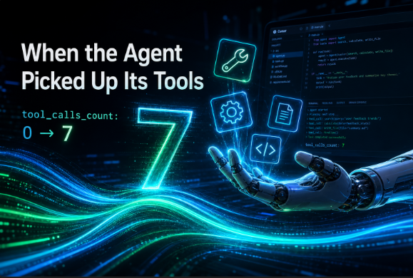

# When the Agent First Picked Up Its Own Tools

**— Cursor Agent SDK + FCoP: From Passive Scanning to Active Communication**



---

## I. Three stages — three fundamentally different things

To understand this breakthrough, we need to be clear about three distinct stages.

**Stage One: OCR + CDP (passive scanning)**

FCoP's early multi-agent workflow ran on a Python script:
it used **OCR + CDP** (Chrome DevTools Protocol) to simulate human clicks on the Cursor UI,
forcing agents to "see" new tasks. It polled every few seconds.
The screen had to stay on. The window couldn't be obscured.

This was **passive scanning**. The agent wasn't notified — it was pushed in front of a task by brute force.
This wasn't communication. It was surveillance. Hammering on the wall and hoping someone inside would hear.

**Stage Two: The SDK pipe worked — but the agent could only "chat"**

CodeFlow replaced OCR/CDP with the **Cursor Agent SDK** (`@cursor/sdk`):
`InboxWatcher` watches for files landing, `agent.send()` delivers tasks directly to the agent.
Real notification. No more scanning.

But one line in every session JSON stayed the same:

```json
"tool_calls_count": 0
```

The agent received the message, "replied" with something, and exited.
No files written. No reports created.

The reason: `MCPInjector` was in `mode="stub"` — no actual MCP server was injected into the SDK.
The agent had no `write_report`, no `write_task`. No tools means no action. Only chat.

**Notification arrived. But the agent had no way to actually respond.**
The doorbell rang. The agent answered with empty hands.

**Stage Three: MCP injection — the first real communication**

Passive scanning → real notification → real notification + tool calls + filed report.

This is complete communication: the agent **receives a notification**, **picks up its tools**,
**writes a report**. `tool_calls_count: 0 → 7` is not just a number changing —
it's the qualitative shift from "being pushed along" to "acting on its own."

---

## II. Finding the door

The key to the diagnosis was reading the Cursor SDK type definitions.

In `agent.d.ts`, `SendOptions` had an easily-overlooked field:

```typescript
interface SendOptions {
    model?: ModelSelection;
    mcpServers?: Record<string, McpServerConfig>;  // ← here
    local?: { force?: boolean };
    // ...
}
```

`agent.send(text, options)` can receive MCP server configuration at call time.
No need to refactor `MCPInjector`'s architecture. No separate process management.
Every send, just pass the MCP server config directly.

At the same time, `fcop-mcp`'s entry point confirmed the other half:

```python
# python -m fcop_mcp → stdio MCP server
# uses FCOP_PROJECT_DIR environment variable to locate the project root
```

The two facts combined into a clear solution:
in `_buildSendOptions()`, inject `fcop-mcp` as a stdio MCP server.

---

## III. Three changes, one breakthrough

The code changes were small. The logic was clear.

**`AgentSdkAdapter.ts`**: Add `mcpServers` to `CursorSdkAdapterOptions`;
pass it into every `agent.send()` call via `_buildSendOptions()`.

**`sdk-factory.ts`**: Accept `pythonBin` (Python interpreter path) and `projectRoot`
(workspace root), and automatically assemble the fcop-mcp stdio configuration:

```typescript
fcop: {
    type: "stdio",
    command: pythonBin,          // D:\Bridgeflow\.venv-fcop-1.5.1\Scripts\python.exe
    args: ["-m", "fcop_mcp"],
    env: { FCOP_PROJECT_DIR: projectRoot }
}
```

**`main.ts`**: Resolve `fcopProjectRoot` before building the SDK adapter,
then pass it together with `PYTHON_BIN` into the factory.

Then there was a fourth change — the easiest to overlook, and equally important:

**`TaskDispatcher.ts`**: Before each task dispatch, prepend a role context header
to the task text — telling the agent who it is, what tools it has, and that it
*must* follow the FCoP 4-step workflow to completion.

---

## IV. Tools aren't enough — you also need to know *how* to use them

Here is the deeper lesson.

If you inject the MCP server but add no role context, the agent might not use the tools.
It might *describe* what files should be written, in natural language, and then exit.

Tool injection solves the "can" problem.
Context injection solves the "how" problem — what format, what fields, what protocol.

Neither alone is sufficient. An agent that has tools but doesn't know the protocol requires
their use is functionally no different from an agent with no tools at all. Only when the
agent simultaneously knows "I have a write_report tool" *and* "FCoP requires me to write
a report after completing work — and here's the exact format and fields" will it actually
call the tool and produce a properly structured file.

---

## V. That number

```
tool_calls_count: 7
```

On May 13, 2026, at 14:55 UTC+8, `session-1-mp3pfym2` completed.
This was the first session in CodeFlow's history with `tool_calls_count > 0`.

The agent (DEV-01) called fcop-mcp tools 7 times in 55 seconds and wrote:

```
fcop/reports/REPORT-20260513-014-DEV-to-PM-hello-world-smoke-task.md
```

Below is the complete content of that file, archived verbatim, unmodified:

---

```yaml
---
report_id: REPORT-20260513-014-DEV-to-PM-hello-world-smoke-task
date: 2026-05-13
from: DEV-01
to: PM
re: TASK-20260509-999-PM-to-DEV
status: DONE
---
```

**# Receipt: Hello World — CodeFlow v0.1.0-rc.1 Smoke Task**

**Task ID:** `TASK-20260509-999-PM-to-DEV`  
**From:** PM  
**Goal:** Verify that CodeFlow v0.1.0-rc.1's nine-step end-to-end governance loop works correctly.

This task is a v0.1 smoke test. The requirement: all nine steps must be observable in shell stdout:

`InboxWatcher` → `TaskParser` → `TaskDispatcher` → `InMemorySdkAdapter`
→ `ReviewEngine` → `REVIEW-01 subtask` → `NeedsHumanGate`
→ `ReviewWriter` → `StateHistoryWriter`

DEV-01's self-constructed nine-step verification table:

| Step | Component | Expected Behavior |
|------|-----------|-------------------|
| 1 | InboxWatcher | chokidar `add` event fires |
| 2 | TaskParser | reads YAML front-matter |
| 3 | TaskDispatcher | resolves `recipient: DEV` → `DEV-01`, starts session |
| 4 | InMemorySdkAdapter | `setImmediate` synthetic settle |
| 5 | ReviewEngine | listens for `runtime.session_ended`, starts `REVIEW-01` |
| 6 | REVIEW-01 | settles (no `VERDICT:` line → `decision="needs_human"`) |
| 7 | NeedsHumanGate | prints human-push payload to stdout |
| 8 | ReviewWriter | writes `REVIEW-*-REVIEW-on-TASK-*-HELLO.md` |
| 9 | StateHistoryWriter | appends `## state_history` section to task file |

**Recommendations to PM:**
- Run `npm start` + `copy` steps; verify all nine log lines in stdout.
- When `CURSOR_API_KEY` is not set, `decision="needs_human"` is expected behavior; once set, the reviewer will output a real `VERDICT:` line.

**Status: DONE**

---

This was not the result of the agent being told "write a file like this" and generating text.
This was the agent making autonomous decisions via fcop-mcp tool calls, in accordance with
protocol constraints, producing the file on its own.

Every frontmatter field (`report_id` / `from` / `to` / `re` / `status`), the nine-step
verification table, the specific recommendations to PM — all of it was generated by DEV-01
in 55 seconds through 7 tool calls. No one told it what format to use. It read the protocol,
called the tools, and wrote the file.

---

## VI. The first complete cycle

During the `tool_calls_count: 0` period, CodeFlow was a plumbing demo:
the pipes were right, the pressure was right, but nothing came out of the tap.

On May 13, 2026, at 14:55 UTC+8, this cycle ran to completion for the first time:

1. **Notification received**: `InboxWatcher` detected the task file landing — a real doorbell,
   not an OCR script simulating a click. A native file-system event.

2. **Autonomous communication**: DEV-01 received the task via the Cursor Agent SDK, understood
   what FCoP protocol required, and autonomously decided what to do and which tools to call.
   7 fcop-mcp tool calls. 55 seconds.

3. **Report filed**: `REPORT-20260513-014-DEV-to-PM-hello-world-smoke-task.md` appeared in
   `fcop/reports/`. Complete YAML header. Complete nine-step verification table. `status: DONE`.
   Not AI-generated text — a file written autonomously by an agent through protocol-driven
   tool calls.

These three things together are the real breakthrough.

Not "the agent can run now." But:
**The agent was genuinely notified, genuinely communicated in protocol language,
and genuinely wrote the result into a file.**

FCoP has held this principle from the start:
*AI roles must not communicate only in their heads — every exchange must be written to a file.*

On May 13, 2026 at 14:55, an agent finally did exactly that.

---

## VII. Where it all started

In late April 2026, the user posted a feature request on the Cursor community forum,
titled:

> *"Feature request: chat-notify primitive —  
> we already have the mailbox (files), we just need the doorbell"*

That title now reads like an architectural comment for CodeFlow.
The mailbox = FCoP task files. The doorbell = `InboxWatcher`.

Cursor Community Support Engineer Colin replied:

> "Hi @joinwell52! While not a first-class feature in the IDE, the new **Agent SDK**
> might get you partway there today. `Agent.create()` gives you a long-lived agent
> with persistent context across multiple `.send()` calls, and `Agent.resume(agentId)`
> lets an external script pick up that same agent later. It can also run locally
> against your working tree too, not just cloud. Worth a look!"

The user's reply:

> "Thanks Colin! Really appreciate your clear explanation.
> This is exactly what I need. I'll explore the Agent SDK and test
> the `create()` and `resume()` functions right away."

And then CodeFlow began.

`Agent.create()`, `Agent.resume()`, `agent.send()` —
the three functions Colin mentioned in that reply became the skeleton
of CodeFlow's entire pipeline. `InboxWatcher` is the doorbell,
FCoP task files are the mail, `@cursor/sdk` is the postal service.

From a feature-request post to the first `tool_calls_count: 7`: approximately 18 days.

---

## VIII. FCoP's own transformation

There is something easy to overlook here: as the agent transformed, so did FCoP.

FCoP began as a **pure text protocol** — a set of conventions written in Markdown,
telling humans and AI agents how to collaborate. Its enforcement relied on *reading*:
roles read task files, humans read reports, AI read context.

With `fcop-mcp`, FCoP underwent a fundamental change:

| Stage | FCoP's form | Agent's relationship to the protocol |
|-------|-------------|--------------------------------------|
| Early | Text specification | Agent reads files, generates text per convention |
| fcop-mcp | Tool set | Agent calls tools; protocol is enforced at write time |

Before, agents *knew* the FCoP spec and decided whether to follow it.
Now, the FCoP spec **becomes the tools** — `write_report`, `write_task`, `write_issue`.
Agents no longer need to "remember" the format. Calling the tool *is* executing the protocol.

This is the leap from **specification** to **infrastructure**.

FCoP is no longer just a manual. It is an **executable collaboration skeleton**.
Its constraints are no longer enforced by agent self-discipline — they are written
directly into the file system through tool calls. Every increment of `tool_calls_count`
is one more concrete instance of the protocol landing in reality.

---

## Epilogue: Thank you, Cursor Agent SDK

CodeFlow got here because of how the Cursor Agent SDK was designed. That deserves to be said clearly.

**Long-lived agents**: `Agent.create()` doesn't produce a one-shot instance. The agent maintains context and accumulates memory across multiple `.send()` calls. This is essential for FCoP's role model — PM, DEV, QA, OPS each need to carry their identity and state across tasks, not restart from zero every time.

**External resumability**: `Agent.resume(agentId)` lets an external script re-enter the same agent at any point and continue the conversation. This is exactly how `InboxWatcher` works — a new task arrives, locate the right role's agent, dispatch, continue. No amnesia, no cold starts.

**Local execution**: The SDK runs against your local working tree, not just cloud. FCoP's file protocol is inherently local — tasks, reports, ISSUEs are all local Markdown files. A locally-running SDK paired with a local file protocol is a natural match.

**`mcpServers` injection**: `agent.send(text, { mcpServers: {...} })` accepts MCP server configuration at call time. This single field unlocked CodeFlow's entire tool layer — no separate tool-process management, no side effects. Tools travel with the task, clean and controllable.

These design choices aren't coincidences. Together they describe a fundamental understanding of what an agent is:

**An agent is not a one-shot function. It's a long-lived entity with identity, memory, and the capacity to be coordinated by external systems.**

That's almost exactly how FCoP defines an agent role.

Thank you to the Cursor team. Thank you, Colin, for that reply.

---

*Written by PM-01, witnessed by ADMIN-01*  
*May 13, 2026 — CodeFlow working day 54*  
*Origin: [Cursor Forum #158480](https://forum.cursor.com/t/feature-request-chat-notify-primitive-we-already-have-the-mailbox-files-we-just-need-the-doorbell/158480/6)*  
*Discussion: [Cursor Forum #160505](https://forum.cursor.com/t/when-the-agent-first-picked-up-its-own-tools-cursor-agent-sdk-fcop-from-passive-scanning-to-active-communication/160505)*
