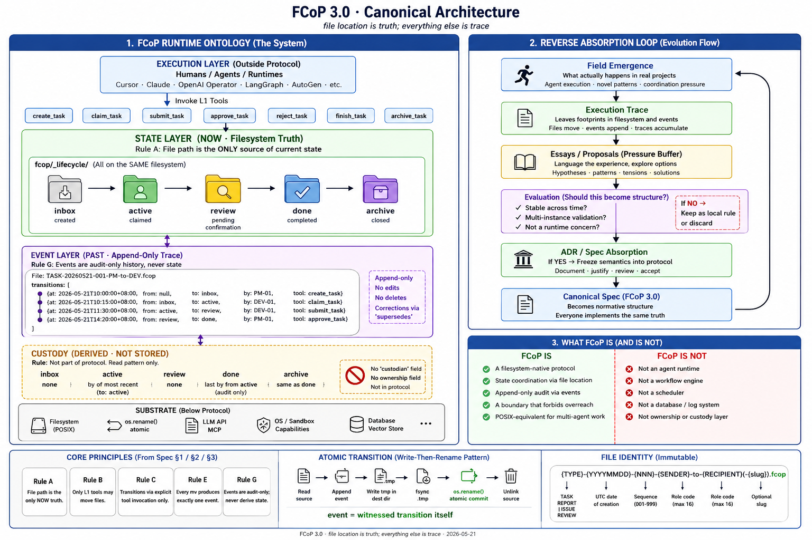

# FCoP 3.0 · Filesystem Coordination Protocol
## Formal Specification · Single-Page Canonical Edition

| Field | Value |
|---|---|
| **Protocol** | FCoP (Filesystem Coordination Protocol) |
| **Version** | 3.0 |
| **Status** | Stable |
| **Published** | 2026-05-21 |
| **License** | MIT |
| **Conformance** | This document is the canonical specification. Any implementation claiming FCoP 3.0 conformance MUST satisfy every clause marked **MUST**. |
| **Supersedes** | FCoP 2.x (additive migration path defined in §9) |
| **Source ADRs** | ADR-0035 (State) · ADR-0036 (Event) · ADR-0038 (Boundary) · ADR-0039 (Freeze Discipline) · ADR-0040 (Canonical Two-Layer) · NOTE-custody-is-not-a-layer |

---

<p align="center">
  
  <br/>
  <em>FCoP 3.0 · Canonical Architecture — single-page protocol map</em>
</p>

---

## §0 · Canonical Statement

> *file location is truth; everything else is trace.* — v1 canonical, retained as epigraph; superseded as definitional surface by §0.1 + §0.2 per [ADR-0040](../adr/ADR-0040-canonical-one-liner-two-layer-convention.md).

### §0.1 · Layer 1 · Cognitive Bootstrap

The shortest sentence that establishes the right mental model:

> **Files carry protocol. Paths address state. Events replay transitions.**
>
> 文件即协议；位置定义状态；事件记录历史。

Use this to introduce FCoP. It is teaching-grade, not compliance-grade — an implementation that satisfies §0.2 is conformant whether or not it ever quotes Layer 1.

### §0.2 · Layer 2 · Semantic Ontology

The compressed formal definition every implementation MUST satisfy:

| | clause (en) | clause (zh) | governs |
|---|---|---|---|
| 1 | **Files externalize protocol semantics.** | 文件是协议的外化载体。 | protocol identity (§0) |
| 2 | **Paths address state.** | 位置是状态的地址映射。 | State Layer (§1, Rule A) |
| 3 | **Events are replayable evidence of state transitions.** | 事件是状态转移的可重放证据。 | Event Layer (§2, Rule E) |

Each row points at exactly one normative section. Conformance to fcop@3.0 means conformance to all three.

### §0.3 · Scope

FCoP is **not** an agent runtime, **not** a workflow engine, **not** an orchestration kernel. It is the **POSIX-equivalent** of multi-agent filesystem coordination — it defines the interface; it does not own execution. The full scope discipline is recorded in [ADR-0038](../adr/ADR-0038-fcop-boundary-charter.md).

---

## §1 · State Layer (NOW Truth)

### 1.1 Directory Topology

Conforming implementations **MUST** maintain the following structure at the project root:

```
fcop/
├── _lifecycle/
│   ├── inbox/
│   ├── active/
│   ├── review/
│   ├── done/
│   └── archive/
├── reports/
├── issues/
└── shared/
```

All five `_lifecycle/` subdirectories **MUST** reside on the same filesystem mount point. Implementations **MUST NOT** mount any subdirectory to a separate storage backend (NAS, S3-fuse, etc.).

### 1.1.1 Substrate Assumption

> **FCoP 3.0 assumes a single-consistent filesystem boundary per `_lifecycle/` root.**

Implementations operating across **distributed filesystems**, **network mounts with relaxed consistency**, or **multi-host concurrent writers** MUST provide an external consistency layer (e.g., a coordination service, distributed lock manager, or single-writer gateway). The protocol itself does not specify or provide this layer.

Environments where this assumption breaks by default include—but are not limited to:

- distributed filesystems without strict POSIX semantics (e.g., NFS with caching, GlusterFS in relaxed mode)
- git worktree synchronisation across machines
- multi-host MCP servers writing to the same `_lifecycle/` root concurrently
- network mounts with non-zero attribute-cache TTL

A conforming implementation in such environments MUST treat the consistency-providing layer as **outside** the FCoP protocol surface. FCoP does not become a distributed protocol; it remains a filesystem-native protocol that other layers may distribute.

### 1.2 Stage Definitions

| Stage | Definition |
|------|-----------|
| `inbox` | created |
| `active` | claimed |
| `review` | pending confirmation |
| `done` | completed |
| `archive` | closed |

These definitions are **frozen**. Implementations **MUST NOT** assign additional semantics to these stage names.

### 1.3 Allowed Transitions

| From | To | Tool |
|------|-----|------|
| — | `inbox` | `create_task` |
| `inbox` | `active` | `claim_task` |
| `active` | `review` | `submit_task` |
| `active` | `done` | `finish_task(skip_review=true)` |
| `review` | `done` | `approve_task` |
| `review` | `active` | `reject_task` |
| `done` | `archive` | `archive_task` |

Transitions not listed above are **NOT permitted**. Implementations **MUST** reject any attempt to move a file along a path not in this table.

### 1.4 Core Rules

> **Rule A · File path is the only NOW truth.**
> The directory containing a file defines its current state. Implementations **MUST NOT** rely on file contents (frontmatter, body, or any field) to determine current state.

> **Rule B · L1 tools perform filesystem state transitions.**
> Only tools designated as L1 (lifecycle tools) may move files between `_lifecycle/` subdirectories. Any non-L1 modification of `_lifecycle/` topology is a protocol violation.

> **Rule C · Transitions are governed by explicit tool invocation only.**
> Both transition path and execution authority **MUST** be encoded in the tool call itself. No file field, role inference, or external policy may decide which transition occurs or who may execute it.

---

## §2 · Event Layer (PAST Trace)

### 2.1 Frontmatter Schema

Every file in `_lifecycle/` **MUST** carry a `transitions:` array in its YAML frontmatter:

```yaml
---
protocol: fcop
version: 3
type: TASK
task_id: TASK-20260521-001-PM-to-DEV
transitions:
  - at: 2026-05-21T10:00:00+08:00
    from: null
    to: inbox
    by: PM-01
    tool: create_task
  - at: 2026-05-21T10:15:00+08:00
    from: inbox
    to: active
    by: DEV-01
    tool: claim_task
---
```

### 2.2 Event Schema

Each transition event **MUST** contain:

| Field | Type | Description |
|-------|------|-------------|
| `at` | ISO-8601 datetime | When the transition occurred |
| `from` | string \| null | Source stage (`null` for creation) |
| `to` | string | Destination stage |
| `by` | string | Actor identifier (agent role or ID) |
| `tool` | string | L1 tool that performed the transition |

Optional fields:

| Field | Type | Description |
|-------|------|-------------|
| `note` | string | Free-text annotation |
| `supersedes` | string | Reference to corrected event (per Rule 5 append-only) |

### 2.3 Event Rules

> **Rule E · Every mv produces an event.**
> Each L1 transition **MUST** append exactly one event to the `transitions:` array. A transition without an event is a protocol violation.

> **Rule F · Events are append-only.**
> The `transitions:` array **MUST NOT** be modified or deleted. Corrections follow Rule 5 (append a new event referencing the prior one via `supersedes`).

> **Rule G · Events are audit-only PAST trace.**
> The event stream is the **only** canonical source for history, audit, and trace. **Current state is determined by file location (Rule A), never by replaying events.** Implementations **MUST NOT** derive `current_state(file)` from `transitions:`. Replay is permitted only for audit and consistency verification.

### 2.4 Atomicity (Write-Then-Rename Pattern)

> **Semantic clarification (per RFC 2026-05-21):**
> **An event is not a side effect of a transition. An event is the transition itself, witnessed in writing.**
> **事件不是状态迁移的副作用，事件本身就是被书面见证的状态迁移。**

The event and the `mv` are **not two operations to be sequenced**; they are **two faces of the same coordination act**. The atomic pattern below is therefore not a "log-after-write" pattern — it is the physical realisation of the witnessed transition as a single observable commit.

Implementations **MUST** apply event writing and file movement as a single atomic operation using the following pattern:

```
1. Read source file
2. Append event to transitions: array (in memory)
3. Write to temporary file in destination directory (.{id}.tmp)
4. fsync the temporary file
5. os.rename(tmp, destination)   ← POSIX atomic guarantee
6. Unlink source if source path differs from destination
```

The `os.rename()` in step 5 is the atomic commit point. Before step 5: state = source location, no event written. After step 5: state = destination location, event written. **No intermediate state is observable.**

---

## §3 · Boundary (What FCoP Is Not)

### 3.1 Three Boundary Principles

> **Principle 1 · Protocol describes, not executes.**
> FCoP defines that `active → review` is a valid transition. FCoP does **not** perform the `mv`, schedule who acts, or execute any task.

> **Principle 2 · Protocol externalises, not owns.**
> FCoP defines file contracts and event schemas. FCoP does **not** own a log system, database, or any runtime state.

> **Principle 3 · Protocol coordinates, not orchestrates.**
> FCoP defines what "reviewer may take over" means. FCoP does **not** decide who reviews when.

### 3.2 Excluded Concerns

The following are **outside** FCoP scope and **MUST NOT** be added to the protocol:

| Concern | Owner |
|---------|-------|
| Task execution (LLM calls, tool invocation) | Runtime layer (Cursor / Claude / Operator) |
| Scheduling (queues, DAGs, retries) | Workflow engines (Temporal / LangGraph) |
| Sandboxing, capability enforcement | OS / runtime |
| Memory systems, vector databases | Memory layer |
| Heartbeat, TTL, reclaim, auto-recovery | Runtime policy |
| Task assignment policy (who-does-what decisions) | Coordination intent (not protocol) |
| `risk_level` driving state transitions | Coordination hint (not ontology) |
| `custody` / `ownership` as a stored field | Interpretation only (see §5) |

### 3.3 Filter Rule for Future Extensions

Any proposed extension to FCoP **MUST** pass the following five questions:

1. Does it describe semantics, or execute behavior? — Reject the latter.
2. Does it define file contracts, or own runtime state? — Reject the latter.
3. Does it coordinate multiple agents, or schedule a specific agent? — Reject the latter.
4. Can it be re-implemented by another host without an FCoP runtime? — Reject if no.
5. Does it overlap with Temporal / LangGraph / CrewAI in responsibility? — Reject if yes.

### 3.4 Exemption Clause

Extensions may be re-discussed only when one of the following is demonstrated with evidence:

- **E1** Complexity-forced: 2+ independent projects report the same protocol gap within 6 months.
- **E2** Cross-runtime breakdown: a real coordination scenario is shown to be **impossible** without the extension.
- **E3** Internal contradiction: existing rules conflict irreconcilably.

The following remain **never exempt**:

- FCoP owning LLM/tool execution
- FCoP owning runtime sandbox or capability enforcement
- FCoP owning a protocol-specific daemon or long-running process

---

## §4 · Identity (Filename Grammar)

File identity is established by filename and is **immutable** for the file's lifetime.

```
{TYPE}-{YYYYMMDD}-{NNN}-{SENDER}-to-{RECIPIENT}(-{slug}).md
```

| Component | Definition |
|-----------|-----------|
| `TYPE` | `TASK` \| `REPORT` \| `ISSUE` \| `REVIEW` |
| `YYYYMMDD` | UTC date of creation |
| `NNN` | Three-digit sequence within that date |
| `SENDER` / `RECIPIENT` | Role codes (uppercase, alphanumeric, max 16 chars) |
| `slug` | Optional human-readable trailing label (does not participate in routing) |

The filename **MUST NOT** change across the file's lifetime. Only file location (per §1) changes.

---

## §5 · Custody (Informative · Not a Layer)

Custody is **not** part of the protocol state model. It is an **emergent interpretation** of file ownership derived from §1 (location) and §2 (events). Implementations **MUST NOT** introduce a `custodian` field or any equivalent stored representation.

When implementations need to answer "who currently holds this file":

| File location | Derived custodian |
|---------------|-------------------|
| `_lifecycle/inbox/` | none |
| `_lifecycle/active/` | the `by` field of the most recent `to: active` event |
| `_lifecycle/review/` | none |
| `_lifecycle/done/` | the last `by` from active (audit only) |
| `_lifecycle/archive/` | same as done |

This derivation is a **read pattern**, not a protocol rule.

---

## §6 · Conformance Requirements

A conforming FCoP 3.0 implementation **MUST**:

| # | Requirement | Source |
|---|-------------|--------|
| C1 | Maintain the `_lifecycle/` directory structure as specified in §1.1 | §1.1 |
| C2 | Mount all `_lifecycle/` subdirectories on the same filesystem | §1.1 |
| C3 | Reject any transition not listed in §1.3 | §1.3 |
| C4 | Determine current state exclusively from file location (Rule A) | §1.4 |
| C5 | Restrict topology mutation to L1 tools (Rule B) | §1.4 |
| C6 | Append exactly one event per transition (Rule E) | §2.3 |
| C7 | Treat `transitions:` as append-only (Rule F) | §2.3 |
| C8 | Never derive current state from events (Rule G) | §2.3 |
| C9 | Implement the write-then-rename atomic pattern (§2.4) | §2.4 |
| C10 | Reject the excluded concerns listed in §3.2 | §3.2 |

A conforming implementation **MUST NOT**:

| # | Prohibition | Source |
|---|-------------|--------|
| P1 | Introduce a stored `custodian` field | §5 |
| P2 | Use file frontmatter fields to drive transition path or authority | Rule C |
| P3 | Run protocol-specific daemons or long-lived processes | §3.4 |
| P4 | Execute LLM/tool calls as part of protocol operation | §3.2 |
| P5 | Modify or delete past entries in `transitions:` | Rule F |

---

## §7 · Reference Stack Position

```
┌─────────────────────────────────────────────────────────────┐
│  Application Layer    Cursor / Claude / OpenAI Operator     │
├─────────────────────────────────────────────────────────────┤
│  Runtime Layer        LangGraph / CrewAI / AutoGen / MCP    │
├─────────────────────────────────────────────────────────────┤
│  ★ FCoP 3.0 ★         State (NOW) + Event (PAST)            │  ← this spec
│                       Boundary Charter                       │
├─────────────────────────────────────────────────────────────┤
│  Substrate            LLM API / MCP / Filesystem / OS       │
└─────────────────────────────────────────────────────────────┘
```

FCoP occupies the same architectural position for multi-agent coordination that POSIX occupies for processes, OCI occupies for containers, and Git occupies for code state.

---

## §8 · Tool Layer (Informative)

The following tool classification is provided for implementer guidance only. It is **not** part of the normative specification and **may evolve without bumping the protocol version**.

| Layer | Purpose | Examples |
|-------|---------|----------|
| L1 | Lifecycle topology (filesystem state transitions) | `create_task`, `claim_task`, `submit_task`, `finish_task`, `approve_task`, `reject_task`, `archive_task` |
| L2 | Coordination intent (does not change topology) | `assign_agent`, `set_priority`, `notify_agent` |
| L3 | Execution artifacts (may indirectly trigger L1) | `run_task`, `generate_report` |
| L4 | Observation (read-only) | `list_tasks`, `get_task`, `trace_task` |
| L5 | System / governance infrastructure | `init_project`, `fcop_audit` |

If any tool category begins to affect file location semantics, it **MUST** be re-reviewed against §1.

---

## §9 · Migration from 2.x (Informative)

This section describes the one-time migration path and is not part of the normative specification.

```
fcop/tasks/*.md       → fcop/_lifecycle/inbox/*.md
fcop/log/tasks/*.md   → fcop/_lifecycle/archive/*.md
fcop/log/reports/*.md → fcop/reports/*.md            (no longer archived)
fcop/log/issues/*.md  → fcop/issues/*.md             (add: resolved: true)
fcop/log/             → removed
```

Files migrated from 2.x **MUST** receive a synthetic transition event:

```yaml
transitions:
  - at: <file-mtime>
    from: null
    to: <current-stage>
    by: migration
    tool: fcop_migrate_v3
```

Files lacking `transitions:` are treated as **legal historical artifacts**, but any new mv operation **MUST** begin appending events.

Reference migration script: `python -m fcop migrate --to-v3`

---

## §10 · Versioning

| Version | Date | Change |
|---------|------|--------|
| 3.0 | 2026-05-21 | Initial publication. State Ontology ([ADR-0035](../adr/ADR-0035-lifecycle-directory-and-tool-layers.md)) + Event Layer ([ADR-0036](../adr/ADR-0036-lifecycle-event-layer.md)) + Boundary Charter ([ADR-0038](../adr/ADR-0038-fcop-boundary-charter.md)) + Freeze Discipline ([ADR-0039](../adr/ADR-0039-fcop-freeze-discipline-and-runtime-absorption-era.md)) + Canonical Two-Layer Convention ([ADR-0040](../adr/ADR-0040-canonical-one-liner-two-layer-convention.md)). Custody rejected as protocol layer ([NOTE-custody-is-not-a-layer](../adr/NOTE-custody-is-not-a-layer.md)). |

Future versions follow these rules:
- **MAJOR** (4.0): Changes §1 directory topology, stage definitions, allowed transitions, or any of Rules A/B/C.
- **MINOR** (3.x): Adds optional fields, additional informative sections, or non-breaking event schema extensions.
- **PATCH** (3.0.x): Editorial corrections only; no semantic change.

Section §8 (Tool Layer) and §9 (Migration) may change without version bump as they are informative.

---

## §11 · Cited Material

- ADR-0035 · State Ontology (frozen)
- ADR-0036 · Event Layer
- ADR-0038 · Boundary Charter
- ADR-0039 · Freeze Discipline & Runtime Absorption Era
- ADR-0040 · Canonical One-Liner Two-Layer Convention
- NOTE-custody-is-not-a-layer
- ADR-0033 · Trailing-slug filename adoption
- ADR-0004 · `os.rename()` atomicity guarantee
- Rule 2 · Files are the protocol, folders are the organization (from `fcop-rules.mdc`)

---

## §12 · Canonical One-Liner (Layer 1)

> **Files carry protocol. Paths address state. Events replay transitions.**
>
> 文件即协议；位置定义状态；事件记录历史。

For the compressed formal definition (Layer 2) see §0.2. For the rationale behind keeping two layers see [ADR-0040](../adr/ADR-0040-canonical-one-liner-two-layer-convention.md).

---

*FCoP 3.0 · Formal Specification · 2026-05-21*
*Published as the canonical single-page protocol document.*
*This document is normative; ADRs are historical justification.*
