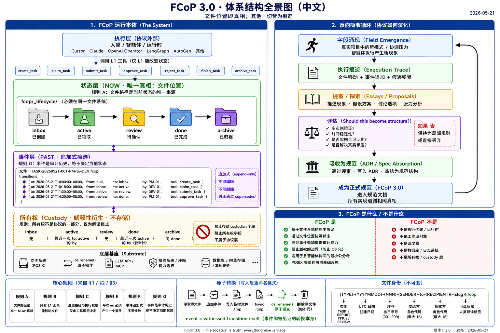

# FCoP 3.0 · 文件系统协调协议
## 正式规范 · 单页标准版

| 字段 | 值 |
|---|---|
| **协议** | FCoP（Filesystem Coordination Protocol · 文件系统协调协议）|
| **版本** | 3.0 |
| **状态** | Stable（稳定）|
| **发布日期** | 2026-05-21 |
| **许可证** | MIT |
| **合规性** | 本文档是协议规范的权威版本。任何声称兼容 FCoP 3.0 的实现**必须**满足所有标注为 **MUST**（必须）的条款。 |
| **取代** | FCoP 2.x（附加式迁移路径见 §9）|
| **来源 ADR** | ADR-0035（State）· ADR-0036（Event）· ADR-0038（Boundary）· NOTE-custody-is-not-a-layer |
| **英文对照** | `spec/fcop-3.0-spec.md`（权威版本；本文为中文平行版）|

> **关于本文性质**：本文为英文规范的中文平行版本（informative）。规范性条款的权威表达以英文版为准。两版同步发布、同版本号、内容等价。

---

<p align="center">
  
  <br/>
  <em>FCoP 3.0 · 体系结构全景图——协议单页地图</em>
</p>

---

## §0 · 核心声明

> **FCoP 是一个文件系统原生协议：文件位置定义当前状态，所有历史与持有权语义都从只追加的迁移轨迹推导而来。**

一句话：

> **FCoP = 文件位置即真相；其它一切都是踪迹。**
> **FCoP = file location is truth; everything else is trace.**

FCoP **不是** Agent 运行时，**不是** 工作流引擎，**不是** 编排内核。它是多 Agent 文件系统协调的 **POSIX 等价物**。

---

## §1 · 状态层（NOW 真相）

### 1.1 目录拓扑

合规实现**必须**在项目根目录维护以下结构：

```
fcop/
├── _lifecycle/
│   ├── inbox/
│   ├── active/
│   ├── review/
│   ├── done/
│   └── archive/
├── reports/
├── issues/
└── shared/
```

所有五个 `_lifecycle/` 子目录**必须**位于同一个文件系统挂载点。实现**不得**将任何子目录挂载到独立存储后端（NAS、S3-fuse 等）。

### 1.1.1 基底假设

> **FCoP 3.0 假设每一个 `_lifecycle/` 根目录都位于一致性单一边界的文件系统内。**

在**分布式文件系统**、**弱一致性网络挂载点**、或**多主机并发写入**场景下运行的实现，**必须**自行提供外部一致性层（如协调服务、分布式锁管理器、单写入网关）。协议本身不规定也不提供这一层。

默认情况下该假设会被打破的环境包括但不限于：

- 不具备严格 POSIX 语义的分布式文件系统（如启用缓存的 NFS、宽松模式下的 GlusterFS）
- 跨机器的 git worktree 同步
- 多个 MCP 主机并发写入同一 `_lifecycle/` 根
- 属性缓存 TTL 非零的网络挂载点

上述环境中，提供一致性的层位于 FCoP 协议表面**之外**。FCoP 不因此变成分布式协议——它仍是文件系统原生协议，其他层可以将它分布化。

### 1.2 阶段定义

| 阶段 | 定义 |
|------|------|
| `inbox` | created（已创建）|
| `active` | claimed（已认领）|
| `review` | pending confirmation（等待确认）|
| `done` | completed（已完成）|
| `archive` | closed（已关闭）|

这些定义**已冻结**。实现**不得**为这些阶段名赋予额外语义。

### 1.3 允许的迁移

| 从 | 到 | 工具 |
|----|----|------|
| — | `inbox` | `create_task` |
| `inbox` | `active` | `claim_task` |
| `active` | `review` | `submit_task` |
| `active` | `done` | `finish_task(skip_review=true)` |
| `review` | `done` | `approve_task` |
| `review` | `active` | `reject_task` |
| `done` | `archive` | `archive_task` |

上表以外的迁移**不被允许**。实现**必须**拒绝任何不在此表中的迁移尝试。

### 1.4 核心规则

> **规则 A · 文件路径是唯一的 NOW 真相。**
> 文件所在目录定义其当前状态。实现**不得**依赖文件内容（frontmatter、正文或任何字段）来判定当前状态。

> **规则 B · L1 工具执行文件系统状态迁移。**
> 只有标注为 L1（生命周期工具）的工具可以在 `_lifecycle/` 子目录之间移动文件。任何非 L1 对 `_lifecycle/` 拓扑的修改都是协议违反。

> **规则 C · 状态迁移仅由显式工具调用治理。**
> 迁移路径与执行权限**必须**编码在工具调用本身。任何文件字段、角色推断或外部策略不得决定发生哪条迁移、谁能执行迁移。

---

## §2 · 事件层（PAST 踪迹）

### 2.1 Frontmatter Schema

`_lifecycle/` 下的每个文件**必须**在 YAML frontmatter 中携带 `transitions:` 数组：

```yaml
---
protocol: fcop
version: 3
type: TASK
task_id: TASK-20260521-001-PM-to-DEV
transitions:
  - at: 2026-05-21T10:00:00+08:00
    from: null
    to: inbox
    by: PM-01
    tool: create_task
  - at: 2026-05-21T10:15:00+08:00
    from: inbox
    to: active
    by: DEV-01
    tool: claim_task
---
```

### 2.2 Event Schema

每条 transition 事件**必须**包含：

| 字段 | 类型 | 说明 |
|------|------|------|
| `at` | ISO-8601 datetime | 迁移发生的时间 |
| `from` | string \| null | 源阶段（创建时为 `null`）|
| `to` | string | 目标阶段 |
| `by` | string | 执行者标识（agent 角色或 ID）|
| `tool` | string | 执行迁移的 L1 工具名 |

可选字段：

| 字段 | 类型 | 说明 |
|------|------|------|
| `note` | string | 自由文本备注 |
| `supersedes` | string | 关联已修订事件的引用（遵守规则 5 只追加原则）|

### 2.3 事件层规则

> **规则 E · 每一次 mv 必产生一条事件。**
> 每一次 L1 迁移**必须**向 `transitions:` 数组追加一条事件。无事件的迁移视为协议违反。

> **规则 F · 事件只追加。**
> `transitions:` 数组**不得**被修改或删除。修正遵守规则 5（追加新事件并通过 `supersedes` 引用旧事件）。

> **规则 G · 事件是仅供审计的 PAST 踪迹。**
> 事件流是历史、审计、追溯的**唯一**权威源。**当前状态由文件位置定义（规则 A），绝不通过回放事件得出。** 实现**不得**从 `transitions:` 派生 `current_state(file)`。回放仅允许用于审计与一致性校验。

### 2.4 原子性（Write-Then-Rename Pattern）

> **语义澄清（per RFC 2026-05-21）：**
> **事件不是状态迁移的副作用，事件本身就是被书面见证的状态迁移。**
> **An event is not a side effect of a transition. An event is the transition itself, witnessed in writing.**

事件与 `mv` **不是需要排序的两个操作**，而是**同一个协调行为的两个面**。下面的原子模式不是"先写后 mv"的日志模式——而是把"被见证的迁移"作为单个可观察提交点的物理实现。

实现**必须**用以下模式把事件写入与文件移动作为一次原子操作执行：

```
1. 读取源文件
2. 在内存中向 transitions: 数组追加事件
3. 写入目标目录中的临时文件（.{id}.tmp）
4. fsync 临时文件
5. os.rename(tmp, destination)   ← POSIX 原子性保证
6. 若源路径与目标路径不同，删除源文件
```

第 5 步的 `os.rename()` 是原子提交点。第 5 步前：状态 = 源位置，事件未写入。第 5 步后：状态 = 目标位置，事件已写入。**不存在可观察的中间状态。**

### 2.5 跨挂载点限制

`os.rename()` 只在**同一挂载点**内保证原子性。FCoP 3.0 要求 `_lifecycle/` 的五个子目录**必须位于同一挂载点**，否则原子性失效。

实现**不得**将 `_lifecycle/archive/` 挂载到独立存储（如 NAS / S3-fuse）——归档迁移到冷存储必须通过应用层 copy + delete + verify 流程实现，且**不属于本协议范围**（per ADR-0038）。

---

## §3 · 边界宪章（FCoP 不是什么）

### 3.1 三大边界原则

> **原则 1 · 协议描述，不执行。**
> FCoP 定义"`active → review` 是合法迁移"。FCoP **不**实际 `mv` 文件，不调度谁动手，不执行任何任务。

> **原则 2 · 协议外化，不拥有。**
> FCoP 定义文件契约与事件 schema。FCoP **不**拥有日志系统、数据库或任何 runtime 状态。

> **原则 3 · 协议协调，不编排。**
> FCoP 定义"reviewer 可以接手"的语义。FCoP **不**决定现在让谁去 review。

### 3.2 排除范围

以下内容**位于** FCoP 范围**之外**，**不得**加入协议：

| 排除项 | 所属 |
|--------|------|
| 任务执行（LLM 调用、工具调用）| Runtime 层（Cursor / Claude / Operator）|
| 调度（队列、DAG、重试）| 工作流引擎（Temporal / LangGraph）|
| 沙箱、能力强制（capability enforcement）| OS / Runtime |
| 内存系统、向量数据库 | 内存层 |
| 心跳、TTL、reclaim、自动恢复 | Runtime policy |
| 任务分派策略（谁做什么的决策）| 协调意图（非协议）|
| `risk_level` 驱动状态迁移 | 协调提示（非本体）|
| `custody` / `ownership` 作为存储字段 | 仅作解释（见 §5）|

### 3.3 未来扩展的过滤规则

任何对 FCoP 的扩展提案**必须**通过以下五问：

1. **它在描述语义，还是在执行行为？** —— 后者拒绝。
2. **它在定义文件契约，还是在拥有 runtime 状态？** —— 后者拒绝。
3. **它在协调多 Agent，还是在调度某个 Agent？** —— 后者拒绝。
4. **它能否在没有 FCoP runtime 的情况下被另一个 host 重新实现？** —— 不能则拒绝。
5. **它是否会让 FCoP 与 Temporal / LangGraph / CrewAI 在职责上重叠？** —— 重叠则拒绝。

### 3.4 豁免条款

扩展提案只在以下任一情形被证据支持时可以重新讨论：

- **E1 复杂度逼迫（complexity-forced）**：6 个月内 2 个以上独立项目报告同一协议缺口
- **E2 跨 runtime 失效（cross-runtime breakdown）**：实证某种真实协调场景在缺少该扩展时**根本无法完成**（不是"不方便"）
- **E3 内部矛盾（internal contradiction）**：现有规则之间出现无法调和的语义冲突

以下三条**永远不豁免**：

- FCoP 拥有 LLM 调用 / Tool 执行
- FCoP 拥有 runtime sandbox 或 capability enforcement
- FCoP 拥有专属于本协议的 daemon 或长进程

---

## §4 · 身份（文件名语法）

文件身份由文件名建立，**在文件生命周期内不可变**。

```
{TYPE}-{YYYYMMDD}-{NNN}-{SENDER}-to-{RECIPIENT}(-{slug}).md
```

| 组件 | 定义 |
|------|------|
| `TYPE` | `TASK` \| `REPORT` \| `ISSUE` \| `REVIEW` |
| `YYYYMMDD` | 创建 UTC 日期 |
| `NNN` | 当日三位序号 |
| `SENDER` / `RECIPIENT` | 角色码（大写、字母数字、最长 16 字符）|
| `slug` | 可选的人类可读尾标（不参与路由）|

文件名**不得**在文件生命周期内改变。只有文件位置（§1）变化。

---

## §5 · Custody（说明性 · 不是协议层）

Custody（持有权）**不是**协议状态模型的一部分。它是从 §1（位置）与 §2（事件）派生出来的**衍生解释**。实现**不得**引入 `custodian` 字段或任何等价的存储表达。

当实现需要回答"现在谁持有这个文件"时：

| 文件位置 | 派生的 custodian |
|---------|-----------------|
| `_lifecycle/inbox/` | 无 |
| `_lifecycle/active/` | 最近一次 `to: active` 事件的 `by` 字段 |
| `_lifecycle/review/` | 无 |
| `_lifecycle/done/` | 最后一次进入 active 的 `by`（仅作审计）|
| `_lifecycle/archive/` | 同 done |

这是**读取模式**，不是协议规则。

---

## §6 · 合规要求

一个合规的 FCoP 3.0 实现**必须**：

| # | 要求 | 来源 |
|---|------|------|
| C1 | 按 §1.1 维护 `_lifecycle/` 目录结构 | §1.1 |
| C2 | 所有 `_lifecycle/` 子目录在同一文件系统挂载点 | §1.1 |
| C3 | 拒绝 §1.3 未列出的任何迁移 | §1.3 |
| C4 | 仅从文件位置判定当前状态（规则 A）| §1.4 |
| C5 | 限制拓扑变更只能由 L1 工具完成（规则 B）| §1.4 |
| C6 | 每次迁移精确追加一条事件（规则 E）| §2.3 |
| C7 | `transitions:` 视为只追加（规则 F）| §2.3 |
| C8 | 绝不从事件派生当前状态（规则 G）| §2.3 |
| C9 | 实现 write-then-rename 原子模式（§2.4）| §2.4 |
| C10 | 拒绝 §3.2 排除项 | §3.2 |

合规实现**不得**：

| # | 禁止 | 来源 |
|---|------|------|
| P1 | 引入存储的 `custodian` 字段 | §5 |
| P2 | 用文件 frontmatter 字段驱动迁移路径或权限 | 规则 C |
| P3 | 运行协议专属的 daemon 或长进程 | §3.4 |
| P4 | 将 LLM/Tool 调用作为协议操作的一部分 | §3.2 |
| P5 | 修改或删除 `transitions:` 中的历史条目 | 规则 F |

---

## §7 · 参考架构位置

```
┌─────────────────────────────────────────────────────────────┐
│  应用层 / Application    Cursor / Claude / OpenAI Operator   │
├─────────────────────────────────────────────────────────────┤
│  运行时层 / Runtime      LangGraph / CrewAI / AutoGen / MCP  │
├─────────────────────────────────────────────────────────────┤
│  ★ FCoP 3.0 ★            State (NOW) + Event (PAST)         │  ← 本规范
│                          Boundary Charter                    │
├─────────────────────────────────────────────────────────────┤
│  基底 / Substrate        LLM API / MCP / 文件系统 / OS       │
└─────────────────────────────────────────────────────────────┘
```

FCoP 在多 Agent 协调中所处的架构位置，等价于：POSIX 对进程、OCI 对容器、Git 对代码状态。

---

## §8 · 工具层（说明性）

下面的工具分类仅供实现者参考。它**不是**规范性内容，且**可以在不 bump 协议版本的前提下演进**。

| 层 | 用途 | 示例 |
|----|------|------|
| L1 | 生命周期拓扑（文件系统状态迁移）| `create_task`, `claim_task`, `submit_task`, `finish_task`, `approve_task`, `reject_task`, `archive_task` |
| L2 | 协调意图（不改变拓扑）| `assign_agent`, `set_priority`, `notify_agent` |
| L3 | 执行产物（可间接触发 L1）| `run_task`, `generate_report` |
| L4 | 观察（只读）| `list_tasks`, `get_task`, `trace_task` |
| L5 | 系统 / 治理基础设施 | `init_project`, `fcop_audit` |

若某工具分类开始影响文件位置语义，**必须**回到 §1 重审。

---

## §9 · 从 2.x 迁移（说明性）

本节描述一次性迁移路径，**不属于**规范性内容。

```
fcop/tasks/*.md       → fcop/_lifecycle/inbox/*.md
fcop/log/tasks/*.md   → fcop/_lifecycle/archive/*.md
fcop/log/reports/*.md → fcop/reports/*.md          （不再归档）
fcop/log/issues/*.md  → fcop/issues/*.md           （新增: resolved: true）
fcop/log/             → 删除
```

从 2.x 迁移的文件**必须**接收一条合成的 transition 事件：

```yaml
transitions:
  - at: <file-mtime>
    from: null
    to: <current-stage>
    by: migration
    tool: fcop_migrate_v3
```

缺少 `transitions:` 字段的旧文件视为**合法历史产物**，但任何新迁移**必须**开始追加事件。

迁移脚本：`python -m fcop migrate --to-v3`

---

## §10 · 版本管理

| 版本 | 日期 | 变更 |
|------|------|------|
| 3.0 | 2026-05-21 | 首次发布。State Ontology + Event Layer + Boundary Charter。 |

未来版本规则：
- **MAJOR**（4.0）：变更 §1 目录拓扑、阶段定义、允许迁移、或任一规则 A/B/C
- **MINOR**（3.x）：新增可选字段、新增说明性章节、或非破坏性事件 schema 扩展
- **PATCH**（3.0.x）：仅编辑性修正；不改变任何语义

§8（工具层）与 §9（迁移）可以在不 bump 版本的情况下变更，因为它们是说明性的。

---

## §11 · 引用材料

- ADR-0035 · State Ontology（已冻结）
- ADR-0036 · Event Layer
- ADR-0038 · Boundary Charter
- NOTE-custody-is-not-a-layer
- ADR-0033 · 尾标文件名采纳
- ADR-0004 · `os.rename()` 原子性保证
- `fcop-rules.mdc` Rule 2 · 文件即协议，文件夹即组织

---

## §12 · 一句话规范

> **FCoP 是一个协调协议：文件位置定义当前工作状态，文件内只追加的事件记录审计历史，其余一切都不具权威性。**
>
> **FCoP is a coordination protocol in which file location defines the current state of work, append-only events inside the file record the audit history, and nothing else is authoritative.**

---

*FCoP 3.0 · 中文平行规范 · 2026-05-21*
*以英文版 `fcop-3.0-spec.md` 为权威；本文为 informative。*
